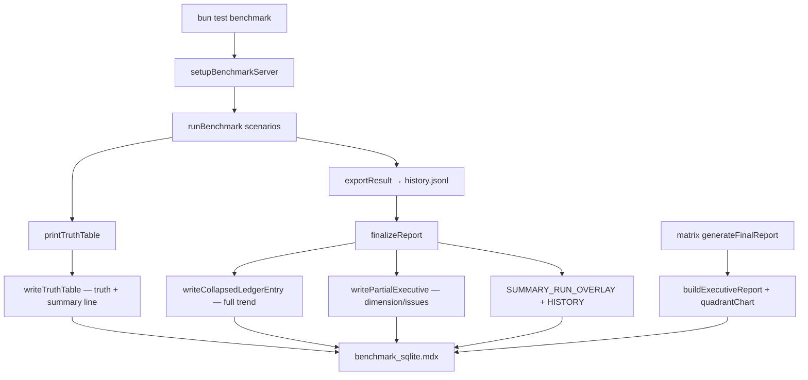

# 🚀 SveltyCMS Performance Benchmarks

> [!IMPORTANT]
> **EU Compliance**: Competitive comparisons are based on publicly available documentation as of June 2026. All SveltyCMS metrics are self-measured via reproducible suites (`bun test tests/benchmarks/`). See [Competitive Comparison](../competitive-comparison.mdx) for methodology.
>
> **Console-only by default.** Set `BENCHMARK_RECORD=1` to write MDX reports. The matrix runner always records.

## Report layout (progressive disclosure)

Each per-DB report (`benchmark_<db>.mdx`) is a **single-page dashboard** with replace-not-append zones:

| Zone          | What you see                                                                                      | MDX features                                           |
| ------------- | ------------------------------------------------------------------------------------------------- | ------------------------------------------------------ |
| **EXECUTIVE** | ✅/❌ pass badge, dimension health, issues-only table, latency matrix, sparklines, mermaid charts | `[!NOTE]` / `[!WARNING]`, tables, collapsed mermaid    |
| **SUMMARY**   | Current run overlay (this invocation) + historical sparklines (Rule C)                            | Zone markers, no duplicate tables                      |
| **LEDGER**    | Four dimension groups → collapsed per-test `<details>` with ASCII truth tables                    | Nested `<details>`, anchor drill-down `#section-{tag}` |
| **METADATA**  | Host environment reproduction table                                                               | Markdown table                                         |

Dimension groups match executive rollups: **Core**, **API**, **Scale**, **Resilience**.

### Latest middleware measurements (SQLite ledger, run 2026-09-18)

Row values are the `HOOKS_TRACE` entry of the [SQLite ledger](./benchmark_sqlite.mdx) (`hooks-performance.test.ts`, HTTP E2E — full middleware chain including Turbo, Security, Auth and Audit, no turbo-auth shortcut). That section's badge still reads `⚪ ⏳ pending`: a recorded standalone run whose matrix trend is not published.

| Scenario                      | Cold   | Warm avg | p95     | Peak RPS |
| ----------------------------- | ------ | -------- | ------- | -------- |
| Static asset (no middleware)  | 3.41ms | 0.544ms  | 0.830ms | 1,631    |
| Turbo pipeline (light)        | 1.15ms | 0.293ms  | 0.367ms | 3,087    |
| Full security + auth pipeline | 3.55ms | 0.358ms  | 0.532ms | 2,481    |
| REST with API caching         | 2.23ms | 0.320ms  | 0.416ms | 2,823    |
| Mutation (audit logging off)  | 3.13ms | 0.590ms  | 0.874ms | 1,503    |

**Self-measured re-run (SQLite, 2026-09-22, same command):** static ~0.8 ms · turbo ~0.4 ms · full auth + security ~0.47 ms · REST-cached ~0.40 ms · mutation ~2.0 ms. Machine-dependent; single-run variance on this harness is ~±10%, so quote the trend, not one run. Zero-overhead hook dispatch and the asynchronous outbox ring buffer stay in place. See [Server Hooks](../../reference/architecture/server-hooks.mdx) and [SQLite ledger](./benchmark_sqlite.mdx).

## CRUD / findById baseline suites

For **create / update / findById / mixed** regressions (the common CMS pain points), run these first on SQLite before a full matrix:

| Suite                           | Command                                                          | Layer                                                                                                          |
| ------------------------------- | ---------------------------------------------------------------- | -------------------------------------------------------------------------------------------------------------- |
| **Competitive 9-Workload**      | `bun test tests/benchmarks/competitive-workload-replica.test.ts` | Harness protocol: seq + 8c, median rounds. `BENCH_DOCS=10000 BENCH_ROUNDS=3` matches the external headline row |
| **Middleware Flamegraph**       | `bun test tests/benchmarks/middleware-flamegraph.test.ts`        | Microsecond cost per middleware stage                                                                          |
| **Event Loop Lag & Saturation** | `bun test tests/benchmarks/event-loop-lag.test.ts`               | Event loop delay & microtask queue drain                                                                       |
| Adapter CRUD                    | `bun test tests/benchmarks/database-performance.test.ts`         | Direct `db.crud` INSERT / FIND ONE / UPDATE                                                                    |
| Local wave throughput           | `bun test tests/benchmarks/local-api-throughput.test.ts`         | Adapter waves (no HTTP)                                                                                        |
| **LocalCMS SDK CRUD tax**       | `bun test tests/benchmarks/local-cms-crud.test.ts`               | `cms.collections` create / update / findById                                                                   |
| HTTP findById                   | `bun test tests/benchmarks/api-latency.test.ts`                  | Cold (cache-busted) + **TURBO-HIT** @ 8c                                                                       |
| Mixed read mix                  | `bun test tests/benchmarks/mixed-workload.test.ts`               | Weighted REST + GraphQL + health                                                                               |
| Truth layers                    | `bun test tests/benchmarks/truth-latency.test.ts`                | Logic vs LocalCMS vs HTTP                                                                                      |

**August 2026 local SQLite rebaseline (rebuild `bun run build` first for HTTP turbo):**

| Metric                                | Result                                              |
| ------------------------------------- | --------------------------------------------------- |
| LocalCMS findById warm (L1)           | **~0.001 ms** · ~511k RPS                           |
| LocalCMS findById cold                | ~0.007 ms · ~126k RPS (≈ adapter)                   |
| LocalCMS create                       | ~0.085 ms · ~5.9k RPS                               |
| LocalCMS update                       | **~0.072 ms · ~7.0k RPS** (was ~0.44 ms)            |
| LocalCMS mixed C/U/R                  | ~0.188 ms                                           |
| HTTP findById **cold** (cache-busted) | **~2.2 ms** @ 8c                                    |
| HTTP findById **TURBO-HIT**           | **~1.2 ms** @ 8c · **100% hit** · **~2.0×** vs cold |

Adapter raw CRUD (same run): UPDATE **0.029 ms** (was 0.125 ms — raw `UPDATE…RETURNING`),
INSERT 0.053 ms, FIND ONE 0.008 ms, FIND PAGE (50, sorted) **0.12 ms** (was 0.70 ms —
`(tenantId, updatedAt)` composite + `updatedAt` default sort). See
[Performance Architecture](../../reference/database/performance-architecture.mdx).

> [!IMPORTANT]
> The benchmark child process loads `index.cjs` → `build/handler.js`. Hook/handler turbo changes are invisible until `bun run build`.

Shared SQL/Mongo core (`lookup-query` → `findById` on all engines) + LocalCMS + turbo: [Performance Architecture](../../reference/database/performance-architecture.mdx).

Record after intentional perf work:

```bash
bun run build
BENCHMARK_RECORD=1 bun test tests/benchmarks/api-latency.test.ts
BENCHMARK_RECORD=1 bun test tests/benchmarks/local-cms-crud.test.ts
```

## Record modes

| Mode      | Trigger                                     | SQLite history |                 MDX writes                  | Executive               |
| --------- | ------------------------------------------- | :------------: | :-----------------------------------------: | ----------------------- |
| `none`    | `bun test` (default)                        |       ❌       |                     ❌                      | ❌                      |
| `history` | `BENCHMARK_HISTORY_ONLY=1`                  |       ✅       |                     ❌                      | ❌                      |
| `partial` | `BENCHMARK_RECORD=1 bun test …`             |       ✅       | ✅ ledger + summary + **partial executive** | Scoped to invoked tests |
| `full`    | `bun run scripts/benchmark-matrix/index.ts` |       ✅       |                ✅ all zones                 | Full matrix executive   |

## Data flow


```mermaid
flowchart TD
    A["bun test benchmark"] --> B["setupBenchmarkServer"]
    B --> C["runBenchmark scenarios"]
    C --> D["exportResult → history.jsonl"]
    C --> E["printTruthTable"]
    E --> F["writeTruthTable — truth + summary line"]
    D --> G["finalizeReport"]
    G --> H["writeCollapsedLedgerEntry — full trend"]
    G --> I["writePartialExecutive — dimension/issues"]
    G --> J["SUMMARY_RUN_OVERLAY + HISTORY"]
    F --> K["benchmark_sqlite.mdx"]
    H --> K
    I --> K
    J --> K
    L["matrix generateFinalReport"] --> M["buildExecutiveReport + quadrantChart"]
    M --> K
```

### Step-by-step

| Step | Function                                  | What happens                                                                                                                                           |
| ---- | ----------------------------------------- | ------------------------------------------------------------------------------------------------------------------------------------------------------ |
| 1    | `setupBenchmarkServer()`                  | Seeds state in-process, spawns the **production build in NODE_ENV=production**, performs a REAL login (session cookie). No testing API, no test bypass |
| 2    | `runBenchmark()`                          | Timed iterations with abort-on-consecutive-errors                                                                                                      |
| 3    | `exportResult()`                          | Appends debug log to `history.jsonl`; registers test file for finalize                                                                                 |
| 4    | `printTruthTable()` → `writeTruthTable()` | Surgical write: ASCII truth table **and** refreshed `<summary>` line                                                                                   |
| 5    | `finalizeReport()`                        | SQLite persist, collapsed ledger with trend, **partial executive**, summary slots                                                                      |
| 6    | Matrix `generateFinalReport()`            | Full executive, infrastructure collapse, dimension-grouped ledger regroup                                                                              |

## MDX zones (writers must respect)

```
<!-- EXECUTIVE_START -->     ← matrix or partial executive (replace only)
<!-- SUMMARY_START -->       ← Rule C: RUN overlay vs HISTORY (separate slots)
<!-- LEDGER_START -->        ← dimension groups + SECTION:TAG pairs
<!-- METADATA_START -->      ← host reproduction table
```

**Rule C:** Current Run and Historical Trends never share the same slot. Full run tables live in `tests/benchmarks/results/history.sqlite`.

## Key modules

| Module                                  | Purpose                                                                    |
| --------------------------------------- | -------------------------------------------------------------------------- |
| `benchmark-executive.ts`                | Dimension rollups, issues table, mermaid `xychart-beta` + `quadrantChart`  |
| `benchmark-mdx.ts`                      | Zone writes, dimension grouping, surgical summary parity, shell generation |
| `benchmark-reporting.ts`                | `finalizeReport()`, partial executive, `BENCHMARK_RECORD` gate             |
| `benchmark-dimensions.ts`               | Section → Core/API/Scale/Resilience mapping                                |
| `scripts/benchmark-matrix/reporting.ts` | Matrix `generateFinalReport()` orchestration                               |
| `scripts/lint-benchmark-mdx.ts`         | CI guard — zones, markers, closed `<details>`                              |

## Guardrails

| Guard                   | Behavior                                                     |
| ----------------------- | ------------------------------------------------------------ |
| `BENCHMARK_RECORD=1`    | Gates MDX mutation (matrix/CI always on)                     |
| `appendSummaryToMdx`    | **No-op** — no duplicate ASCII summary boxes                 |
| `isSpecificInsight()`   | Filters generic SWOT boilerplate from `[!NOTE]` overlays     |
| `normalizeLedgerZone()` | Strips stray flat trend headings outside `<details>`         |
| `lint:benchmark-mdx`    | Fails CI on zone drift, duplicate tags, unclosed sections    |
| Mode-parity guard       | Refuses matrix rows measured against a non-production server |
| Partial executive       | `isPartial` watermark; rollups scoped to invoked tests only  |

## Creating a new benchmark

1. Add `tests/benchmarks/my-benchmark.test.ts` with `exportResult`, `printTruthTable`, `printSummaryTable`.
2. Register in `scripts/benchmark-matrix/benchmark-scripts.ts` (`section` drives dimension group).
3. Regenerate shells: `bun run scripts/benchmark-matrix/generate-benchmark-reports.ts --force-all`.
4. Run with recording: `BENCHMARK_RECORD=1 bun test tests/benchmarks/my-benchmark.test.ts`.

Required header fields: `@file`, `@description`, optional `@phase` (`cold` | `warm` | `mixed`).

## How to run

**Console only (safe for dev):**

```bash
bun test tests/benchmarks/auth-performance.test.ts
```

**Single test with MDX + partial executive:**

```bash
BENCHMARK_RECORD=1 bun test tests/benchmarks/auth-performance.test.ts
```

**Full SQLite matrix (all DBs available with Docker):**

```bash
bun run scripts/benchmark-matrix/index.ts --db=sqlite
```

**All databases (Docker required for MariaDB/PostgreSQL/MongoDB):**

```bash
bun run scripts/benchmark-matrix/index.ts --continue-on-error
```

**Validate report shape:**

```bash
bun run lint:benchmark-mdx
```

## Mode parity (comparability rule)

A trend number is only comparable to numbers measured in the same execution mode. The published ledgers are **production parity** — `NODE_ENV=production`, `BENCHMARK=true`, **no** `TEST_MODE` — and every row carries the two stamps that make that checkable:

| Stamp         | Values                              | Where                                           |
| :------------ | :---------------------------------- | :---------------------------------------------- |
| `run_mode`    | `matrix` \| `standalone`            | which harness wrote the row                     |
| `server_mode` | `production` \| `test` \| `unknown` | which server was measured (the comparison axis) |

The matrix runner stamps `SVELTY_BENCHMARK_SERVER_MODE=production` into every test child; standalone runs set it in `setupBenchmarkServer()` (`production` unless `TEST_MODE` is inherited). A row labelled `matrix` with a non-production `server_mode` is **refused** (never recorded), and all published trend tables read `run_mode='matrix'` + `server_mode='production'` samples only. Reproduce a comparable standalone baseline with:

```bash
SVELTY_BENCHMARK_SERVER_MODE=production BENCHMARK_RECORD=1 bun test tests/benchmarks/<name>.test.ts
```

Detail + failure history: [Benchmark Matrix → Mode Parity](../../tests/benchmark-matrix.mdx#mode-parity-read-this-before-recording-a-baseline).

## Data sources

| Source            | Path                                            |
| ----------------- | ----------------------------------------------- |
| Canonical history | `tests/benchmarks/results/history.sqlite`       |
| Debug log         | `tests/benchmarks/results/history.jsonl`        |
| Per-run JSON      | `tests/benchmarks/results/<db>/`                |
| Report shells     | `docs/project/benchmarks/benchmark_<db>.mdx`    |
| Script registry   | `scripts/benchmark-matrix/benchmark-scripts.ts` |

<!-- SUMMARY_MATRIX_START -->

### ⚡ Executive Summary Matrix

> [!NOTE]
> **Unpopulated — pending a full matrix run.** This zone is rewritten by `bun run scripts/benchmark-matrix/index.ts`; no run has filled its metric columns, so `—` means **not measured in a matrix run** — the earlier `0ms` was the generator's `curr?.coldStartMs || 0` fallback for a missing value, never a result. `Status` repeats each ledger's own executive line (partial invocations included). Cold start is republished from the standalone `cold-start-phased.test.ts` ledger rows — **self-measured, single host, 2026-09-18**; adapters without such a row carry `—`.

| Database                                                  | Status (per-DB ledger)  | Cold Start (ledger, 2026-09-18) | REST p95 | GQL Avg | CPU | Memory |
| :-------------------------------------------------------- | :---------------------- | :------------------------------ | :------- | :------ | :-- | :----- |
| [ **SQLITE**](./benchmark_sqlite.mdx)                     | 🟢 PASS (1/62, partial) | 1,991 ms                        | —        | —       | —   | —      |
| [ **SQLITE+REDIS**](./benchmark_sqlite_redis.mdx)         | 🟢 PASS (20/45)         | —                               | —        | —       | —   | —      |
| [ **MONGODB**](./benchmark_mongodb.mdx)                   | 🟢 PASS (29/39)         | 2,367 ms                        | —        | —       | —   | —      |
| [ **MONGODB+REDIS**](./benchmark_mongodb_redis.mdx)       | ⏳ PENDING (own ledger) | —                               | —        | —       | —   | —      |
| [ **POSTGRESQL**](./benchmark_postgresql.mdx)             | 🟢 PASS (1/45, partial) | 2,605 ms                        | —        | —       | —   | —      |
| [ **POSTGRESQL+REDIS**](./benchmark_postgresql_redis.mdx) | 🟢 PASS (16/45)         | —                               | —        | —       | —   | —      |
| [ **MARIADB**](./benchmark_mariadb.mdx)                   | 🟢 PASS (34/45)         | 2,329 ms                        | —        | —       | —   | —      |
| [ **MARIADB+REDIS**](./benchmark_mariadb_redis.mdx)       | 🟢 PASS (20/45)         | —                               | —        | —       | —   | —      |

<!-- SUMMARY_MATRIX_END -->

## Related

- [Scale Limits at 1M+ Documents](./scale-limits-1m-postgres.mdx) — measured cliffs at 1.1M–1.5M docs on untweaked PostgreSQL
- [Competitive Comparison](../competitive-comparison.mdx)
- [Achievements Log 2026](../achievements-2026.mdx)
- [Contributing Docs — Mermaid & admonitions](../../contributing/contributing-docs.mdx)
