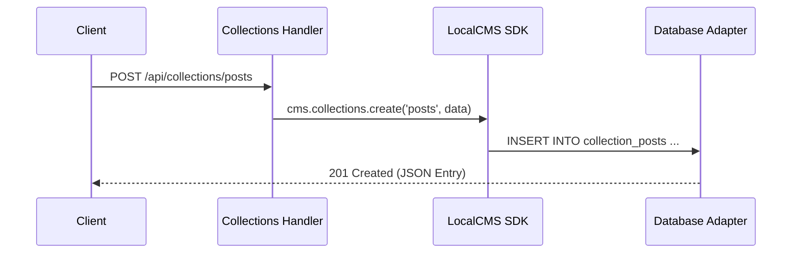

# Collections Reference (`collections.ts`)

The Collections API provides standard CRUD (Create, Read, Update, Delete) operations for managing content entries. It handles schema discovery, data validation, and multi-tenant isolation through a database-agnostic interface.

---

## ⚡ Quick Reference

| Feature          | HTTP Endpoint                      | Method   | Permission Required  |
| :--------------- | :--------------------------------- | :------- | :------------------- |
| **List Schemas** | `/api/collections`                 | `GET`    | `collections:read`   |
| **Find Entries** | `/api/collections/{id}`            | `GET`    | `collections:read`   |
| **Get Entry**    | `/api/collections/{colId}/{entId}` | `GET`    | `collections:read`   |
| **Create Entry** | `/api/collections/{id}`            | `POST`   | `collections:create` |
| **Update Entry** | `/api/collections/{colId}/{entId}` | `PATCH`  | `collections:update` |
| **Delete Entry** | `/api/collections/{colId}/{entId}` | `DELETE` | `collections:delete` |
| **Export**       | `/api/collections/{id}/export`     | `GET`    | `collections:read`   |

---

## 1. Schema Discovery

Use the root collections endpoint to discover the structure and metadata of your content models.

**Endpoint**: `GET /api/collections`  
**Query Parameters**:

- `includeFields`: If `true`, returns the full widget configuration for each collection.
- `includeStats`: If `true`, returns count and health metrics for each collection.

---

## 2. Entry Management

### Retrieval & Searching

To fetch entries from a specific collection, use the ID-based endpoint.

**Endpoint**: `GET /api/collections/{collectionId}`  
**Advanced Filtering**: See the [Content & Search Reference](./content.mdx) for deep query syntax.

**Single entry**: `GET /api/collections/{collectionId}/{entryId}`. The HTTP point-read payload is the document row **minus** the SDK-injected `_collection` meta and the platform-managed system columns (`tenantId`, `isDeleted`, `createdAt`, `updatedAt`), plus the physical mirror columns (`collection`, `locale`, `publishedAt`) only while they are null (a non-null mirror value is document content and survives). `_id`, `status`, `slug` and every content field are always present. This trim is the single shared contract in `src/utils/point-read-payload.ts` — the warm read lane's MISS rebuild, the dispatcher fallback and the predictive turbo stash all serialize through it, so the payload is byte-identical regardless of which transport served it; the LocalCMS/SDK result is never trimmed (server-side consumers keep every system column).

### Keyset pagination (deep pages without offset scans)

Offset pagination costs grow linearly with depth (the database must scan and skip every preceding row). For deep or continuously-appended lists, pass an opaque **keyset cursor** instead:

```
GET /api/collections/posts?sortField=publishedAt&sortDirection=desc&limit=50&keyset=true
GET /api/collections/posts?sortField=publishedAt&sortDirection=desc&limit=50&cursor=<meta.nextCursor>
```

- `keyset=true` opts the FIRST page into keyset mode; every continuation page passes `cursor` instead (carrying a cursor implies keyset). Without either, responses keep the offset shape byte-identical.
- `cursor` is an opaque, order-bound token (base64url, self-describing: sort field + value + `_id` tiebreaker + direction) — never build one client-side, always take it from the previous response's `meta.nextCursor`.
- The response includes `meta.hasMore` (boolean) and, while more rows exist, `meta.nextCursor`.
- The cursor's `_id` tiebreaker makes the walk stable over duplicate sort values (`(field < v) OR (field = v AND _id < id)`): every row is visited exactly once, no overlap, no skip.
- `offset` is ignored in keyset mode; keyset pages bypass the query cache by design (each page is a unique key whose `meta` must not be dropped).

### Conditional revalidation (ETag / 304)

Collection find and entry GET responses include a **weak collection-generation ETag**:

```
ETag: W/"cv1|{tenant}|{collection}|{epoch}|{reprHash}"
Cache-Control: private, must-revalidate
```

`epoch` is a per-collection generation counter bumped on every write (same tick as L1 cache eviction). `reprHash` is an FNV-1a digest of path + query string + user id, so filter/sort/pagination and per-user publication/FLAC views do not cross-validate.

Headless clients (Next.js ISR, Astro, SvelteKit, mobile) should send the value back as `If-None-Match`. When the generation and representation still match, the API returns **`304 Not Modified`** with an empty body **before** the collections handler runs — no database query and no JSON serialization. `?refresh=true`, `?nocache=true`, and `?bypassCache=true` skip the 304.

This is a **self-described** control in SveltyCMS core (September 2026). It is not a CDN product and not an independent benchmark against other CMS HTTP caches.

### Modifying Content

SveltyCMS enforces schema validation (via Valibot) on every write operation.

- **Create**: `POST /api/collections/{collectionId}`
- **Update**: `PATCH /api/collections/{collectionId}/{entryId}`

**Soft Deletion**: By default, the `DELETE` method moves entries to the Trash. Permanent deletion requires the `?permanent=true` query parameter.

#### Write acks (`Prefer: return=minimal`)

`PATCH` / `PUT` answer with the updated entry by default. A caller that only needs to know the write landed can ask for a status-only ack instead — RFC 7240:

```http
PATCH /api/collections/articles/0192…-abc
Prefer: return=minimal

{"views": 42}
```

```json
{ "success": true, "data": { "_id": "0192…-abc" } }
```

The preference is honoured on both write paths (the warm-session write lane and the API dispatcher) and, crucially, **it is not only a response-shape trick**: the flag reaches the adapter contract as `BaseQueryOptions.skipReturning`, which every engine implements — the SQL adapters skip `RETURNING` and reconstruct the acks from the payload, MongoDB skips `findOneAndUpdate` and echoes the `$set`. So the document read, its serialization and the wider response are all skipped, on all four engines (measured on the competitive update lane: ~1.8 KB of representation → 70 B ack). Absent or unknown `Prefer` values keep the full representation, so existing clients cannot be affected.

### Streamed export

**Endpoint**: `GET /api/collections/{collectionId}/export`

Streams entries from the database cursor (Mongo) or paged SQL reads (SQLite / MariaDB; PostgreSQL uses a driver cursor). The Node process does **not** buffer the full result set.

| Query               | Values                        | Default    |
| :------------------ | :---------------------------- | :--------- |
| `format`            | `json`, `ndjson`, `csv`       | `json`     |
| `limit`             | 1–1,000,000                   | 100,000    |
| `filter`            | same as collection find       |            |
| `publicationFilter` | `published` / `draft` / `all` | per caller |

- **NDJSON**: `application/x-ndjson` — one JSON object per line
- **CSV**: RFC 4180, header from system columns + schema `db_fieldName`
- **JSON**: chunked `{"success":true,"data":[…]}` array (same envelope as list streaming)

Responses include `Content-Disposition: attachment` and `Cache-Control: no-store`. Encrypted fields are decrypted for authorized callers (same as find). This is a **self-described** control (September 2026), not a same-harness measurement against other CMS export tools.

---

## 3. The Mechanics

### Architecture

The Collections handler acts as a thin dispatcher that invokes the `LocalCMS` SDK, which in turn coordinates between the Database Adapter and the Widget System.



---

## Source Reference

- [`src/routes/api/[...path]/handlers/collections.ts`](../../../src/routes/api/[...path]/handlers/collections.ts) — Collections REST API handler.
- [`src/services/sdk/index.ts`](../../../src/services/sdk/index.ts) — Local SDK (`locals.cms.collections`).
- [`src/databases/core/sql-adapter-core.ts`](../../../src/databases/core/sql-adapter-core.ts) — Core SQL CRUD engine.

---

## Related Documents

- [Content & Search (content.ts)](./content.mdx)
- [Media Management (media.ts)](./media.mdx)
- [System Utilities (utility.ts)](./utility.mdx)
