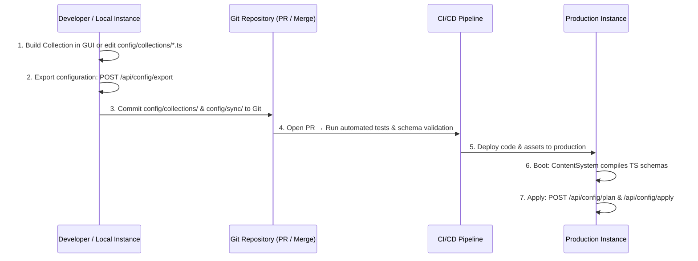

# Configuration Promotion Reference (`config.ts`)

The Configuration Promotion API provides a deterministic, plan-first workflow for moving configuration between environments. It replaces the legacy `/api/config_sync` endpoint with a suite of resource-aware, audit-logged promotion routes under the `/api/config/*` namespace.

> [!IMPORTANT]
> All configuration promotion endpoints are **admin-gated**. GET requests require `config:read`, POST requests require `config:write`. Unmapped namespaces fail-closed via the dispatcher's `ENDPOINT_PERMISSIONS` mapping.

---

## ⚡ Quick Reference

| Feature                      | HTTP Endpoint           | Method | Permission     |
| :--------------------------- | :---------------------- | :----- | :------------- |
| **List Resources**           | `/api/config/resources` | `GET`  | `config:read`  |
| **Drift Status**             | `/api/config/status`    | `GET`  | `config:read`  |
| **Export Config**            | `/api/config/export`    | `POST` | `config:write` |
| **Create Plan**              | `/api/config/plan`      | `POST` | `config:write` |
| **Apply Plan**               | `/api/config/apply`     | `POST` | `config:write` |
| **Operation History**        | `/api/config/history`   | `GET`  | `config:read`  |
| ~~Config Sync (deprecated)~~ | `/api/config_sync`      | `GET`  | `config:read`  |

---

## Deprecation Notice

> [!WARNING]
> **`GET /api/config_sync` is deprecated.** The legacy endpoint is routed to the `config` handler
> via dispatcher aliases (`config_sync`, `config-sync`) for backward compatibility, but it will
> be removed in a future major version.
>
> **Migration guide**:
>
> - Replace `GET /api/config_sync` → `GET /api/config/status`
> - For configuration export, use `POST /api/config/export`
> - For safe promotion, use the plan-first workflow: `export` → `plan` → `apply`

---

## 1. Resource Discovery

### List Syncable Resources

Returns all configuration resource types that can be promoted between environments, plus the categories explicitly excluded from sync.

**Endpoint**: `GET /api/config/resources`

**Response**:

```json
{
  "resources": [
    {
      "type": "collections",
      "supported": true,
      "description": "Collection schemas and field definitions"
    },
    { "type": "roles", "supported": true, "description": "Role definitions and permissions" },
    { "type": "settings", "supported": true, "description": "Non-secret system settings" },
    { "type": "widgets", "supported": true, "description": "Widget active state" },
    { "type": "themes", "supported": true, "description": "Active theme configuration" },
    { "type": "webhooks", "supported": true, "description": "Webhook definitions" },
    { "type": "automations", "supported": true, "description": "Automation workflow definitions" },
    { "type": "workflows", "supported": true, "description": "Content workflow definitions" }
  ],
  "excluded": [
    "users",
    "sessions",
    "api-tokens",
    "secrets",
    "content-entries",
    "media-binaries",
    "audit-logs",
    "job-queue-state"
  ]
}
```

### Included Resources (Default)

These resource types are included in configuration promotion by default:

| Resource      | Description                              |
| :------------ | :--------------------------------------- |
| `collections` | Collection schemas and field definitions |
| `roles`       | Role definitions and permission mappings |
| `settings`    | Non-secret system settings               |
| `widgets`     | Widget installation and activation state |
| `themes`      | Active theme configuration               |
| `webhooks`    | Webhook endpoint definitions             |
| `automations` | Automation workflow definitions          |
| `workflows`   | Content workflow definitions             |

### Excluded Resources (Always)

These categories are **never** included in configuration promotion to protect data integrity and security:

| Exclusion         | Reason                                               |
| :---------------- | :--------------------------------------------------- |
| `users`           | PII — must be managed per environment                |
| `sessions`        | Ephemeral — tied to environment state                |
| `api-tokens`      | Secrets — must be generated per environment          |
| `secrets`         | Security — stored in vault / env vars                |
| `content-entries` | Content — use [Content Packages](#related-documents) |
| `media-binaries`  | Binary blobs — use backup or storage replication     |
| `audit-logs`      | Immutable history — must not be overwritten          |
| `job-queue-state` | Runtime state — tied to environment                  |

---

## 2. Drift Detection

### Configuration Status

Returns a drift summary comparing the active database configuration against the filesystem source of truth. This is the replacement for the deprecated `GET /api/config_sync`.

**Endpoint**: `GET /api/config/status`

**Response**:

```json
{
  "timestamp": "2026-07-10T12:00:00.000Z",
  "tenantId": "tenant_abc123",
  "inSync": false,
  "changes": {
    "new": [
      { "type": "collections", "uuid": "f47ac10b-...", "name": "blog-posts" },
      { "type": "widgets", "uuid": "d5e62c1a-...", "name": "mapbox-widget" }
    ],
    "updated": [{ "type": "settings", "uuid": "a1b2c3d4-...", "name": "email-config" }],
    "deleted": []
  },
  "unmetRequirements": [
    { "key": "MAPBOX_API_KEY", "source": "mapbox-widget", "message": "API key not configured" }
  ],
  "summary": "2 new resources, 1 updated, 0 deleted. 1 unmet requirement."
}
```

| Field               | Description                                                |
| :------------------ | :--------------------------------------------------------- |
| `inSync`            | `true` if filesystem and database are fully aligned        |
| `changes.new`       | Resources present on filesystem but not in the database    |
| `changes.updated`   | Resources with different checksums between FS and DB       |
| `changes.deleted`   | Resources in database but not on filesystem                |
| `unmetRequirements` | Settings required by new resources that are missing values |

---

## 3. Export

### Export Database Configuration

Writes the active database configuration to deterministic files on the filesystem. Useful for capturing the current state before promotion or for pipeline-driven config-as-code workflows.

**Endpoint**: `POST /api/config/export`

**Payload**:

```json
{
  "uuids": ["f47ac10b-...", "a1b2c3d4-..."]
}
```

| Field   | Type       | Required | Description                                     |
| :------ | :--------- | :------- | :---------------------------------------------- |
| `uuids` | `string[]` | —        | Specific resource UUIDs to export (empty = all) |

**Response**:

```json
{
  "success": true,
  "dirPath": "/config/sync",
  "message": "Configuration exported successfully."
}
```

---

## 4. The Plan-First Workflow

Configuration promotion follows a safety-first, plan-then-apply workflow:

```
Filesystem (source)  ──►  export  ──►  review  ──►  plan  ──►  confirm  ──►  apply  ──►  Database (target)
```

### Create a Promotion Plan

Generates a dry-run plan showing exactly what operations will be performed, any destructive actions that need confirmation, and any blocking requirements.

**Endpoint**: `POST /api/config/plan`

**Payload**:

```json
{
  "uuids": ["f47ac10b-..."],
  "mode": "merge"
}
```

| Field   | Type       | Required | Description                                                            |
| :------ | :--------- | :------- | :--------------------------------------------------------------------- |
| `uuids` | `string[]` | —        | Specific resource UUIDs to include (empty = all detected changes)      |
| `mode`  | `string`   | —        | Safety mode: `add`, `merge`, `mirror`, or `replace` (default: `merge`) |

**Response**:

```json
{
  "planId": "c8d52e1f-...",
  "operationType": "config-promotion",
  "mode": "merge",
  "risk": "safe",
  "operations": [
    { "action": "create", "type": "collections", "name": "blog-posts", "uuid": "f47ac10b-..." },
    { "action": "update", "type": "settings", "name": "email-config", "uuid": "a1b2c3d4-..." }
  ],
  "warnings": [],
  "blockedReasons": [],
  "requiresConfirmation": false
}
```

**Response fields**:

| Field                  | Description                                                     |
| :--------------------- | :-------------------------------------------------------------- |
| `planId`               | Unique plan identifier — used in the `apply` step               |
| `mode`                 | Safety mode used for this plan                                  |
| `risk`                 | `safe` or `destructive` (destructive = includes delete actions) |
| `operations[].action`  | `create`, `update`, or `delete`                                 |
| `warnings`             | Advisory messages (non-blocking)                                |
| `blockedReasons`       | Blocker messages (must be resolved before apply)                |
| `requiresConfirmation` | `true` when destructive actions demand explicit user consent    |

### Apply a Confirmed Plan

Executes the operations defined in a previously generated plan. The `planId` must match a recently created plan.

**Endpoint**: `POST /api/config/apply`

**Payload**:

```json
{
  "planId": "c8d52e1f-..."
}
```

| Field    | Type     | Required | Description                                               |
| :------- | :------- | :------- | :-------------------------------------------------------- |
| `planId` | `string` | ✅       | Plan identifier from the `POST /api/config/plan` response |

**Response**:

```json
{
  "success": true,
  "message": "Configuration applied successfully.",
  "appliedAt": "2026-07-10T12:00:01.000Z"
}
```

---

## 5. Operation History

### List Previous Operations

Returns the history of past plans, exports, and applies. Currently a stub returning an empty array; full persistence via audit logs is planned.

**Endpoint**: `GET /api/config/history`

**Response**:

```json
{
  "history": [],
  "message": "Operation history is not yet persisted."
}
```

---

## 6. Safety Modes

Configuration promotion supports four safety modes that control how conflicts and deletions are handled:

| Mode          | Creates | Updates | Deletes | Use Case                                              |
| :------------ | :-----: | :-----: | :-----: | :---------------------------------------------------- |
| **`add`**     |   ✅    |    —    |    —    | Bootstrap: only add missing resources, never modify   |
| **`merge`**   |   ✅    |   ✅    |    —    | **Default.** Safe promotion: add new, update existing |
| **`mirror`**  |   ✅    |   ✅    |   ✅    | Full alignment: make target exactly match source      |
| **`replace`** |   ✅    |   ✅    |   ✅    | Fresh install: drop all existing, import from source  |

> [!CAUTION]
> `mirror` and `replace` modes are destructive — they can delete resources in the target
> database. Plans generated with these modes will have `requiresConfirmation: true` and
> `risk: "destructive"`. Review the plan carefully before applying.

---

## 7. The Mechanics

### Handler Architecture

The `config.ts` handler manages all configuration promotion routes under `/api/config/*`. It delegates heavy lifting to `ConfigService` (`@src/services/core/config-service`) for backend logic:

```mermaid
graph LR
    A[/api/config/*] --> B[config.ts Handler]
    B --> C[ConfigService]
    C --> D[(Database)]
    C --> E[Filesystem]
    B --> F[Audit Logger]
```

### UUID-Based Identity

All configuration entities are tracked by `uuidv4`. This allows the system to match resources across environments regardless of database-specific IDs, enabling safe promotion between dev, staging, and production.

### Deprecation Aliases

The legacy endpoints `config_sync` and `config-sync` are aliased to the `config` handler in the API dispatcher for backward compatibility. They will be removed in a future major release. All new integrations should use `/api/config/status` instead.

### Access Control

- **GET** routes (`resources`, `status`, `history`) require `config:read`
- **POST** routes (`export`, `plan`, `apply`) require `config:write`
- Non-admin users receive `403 Forbidden` via fail-closed `ENDPOINT_PERMISSIONS`

---

## 8. Schema as Code & Multi-Environment Workflows

SveltyCMS implements a **Hybrid Code + GUI Schema Architecture** that combines the developer experience of Code-First CMS platforms with the usability of GUI builders. This architecture directly addresses the multi-environment synchronization challenges solved by tools like **Drupal Configuration Management (`drush cim`/`drush cex`)** and **Directus 12.3 Environment Sync (`@directus/cli`)**.

### The Mental Model

| Concept                     | Drupal Configuration Management      | Directus 12.3 (`d6s`)         | SveltyCMS                                                                                             |
| :-------------------------- | :----------------------------------- | :---------------------------- | :---------------------------------------------------------------------------------------------------- |
| **Collection Schemas**      | YAML (`config/sync/node.type.*.yml`) | JSON snapshot (`schema.json`) | **Native TypeScript** (`config/collections/*.ts`)                                                     |
| **System Configuration**    | YAML (`config/sync/system.*.yml`)    | JSON export files             | **Deterministic JSON** (`config/sync/*.json`)                                                         |
| **Export (DB → Files)**     | `drush config:export` (`drush cex`)  | `d6s sync pull`               | `POST /api/config/export` (`ConfigService.performExport`)                                             |
| **Drift Inspection / Diff** | `drush config:import --preview`      | `d6s sync diff`               | `GET /api/config/status` + `POST /api/config/plan`                                                    |
| **Apply (Files → DB)**      | `drush config:import` (`drush cim`)  | `d6s sync push`               | `POST /api/config/apply` (`ConfigService.performImport`)                                              |
| **Content Separation**      | Content in DB; Config in Git         | Content in DB; Schema in Git  | **Strict separation**: Content via Content Packages (`/api/content-export`), Config via `/api/config` |

### The Git-Driven Promotion Lifecycle



### Best Practices for Multi-Environment Deployments

1. **Commit `config/collections/` and `config/sync/` to Version Control**: Keep all collection TypeScript files and exported configuration JSON files in your Git repository.
2. **Never Edit Schemas Directly on Production**: Make schema changes in local or development environments, export the configuration, and promote through version control.
3. **Use `merge` Mode for Safe Promotions**: The default `merge` mode creates new resources and updates existing definitions without deleting existing database records.
4. **Review Destructive Changes in Staging**: If using `mirror` or `replace` mode, review the dry-run plan generated by `POST /api/config/plan` in a staging environment before applying to production.

---

## Related Documents

- [Data Operations Architecture](../architecture/data-operations.mdx)
- [Collection Builder Architecture](../architecture/collection-builder-architecture.mdx)
- [Content Export & Import (Content Packages)](./content-transfer.mdx)
- [Content Sync (Cross-Environment)](./content-sync.mdx)
- [External Importers](./importers.mdx)
- [Data Migrations](./data-migrations.mdx)
- [Backup & Restore](./backups.mdx)
- [System Reference (system.ts)](./system.mdx)
- [Utilities Reference (utility.ts)](./utility.mdx)
- [API Coverage Report](./api-coverage-report.mdx)
