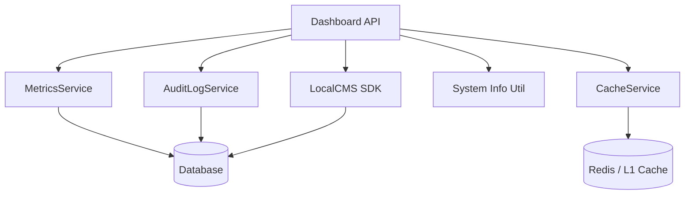

# Dashboard API & Widgets Reference

The Dashboard API provides real-time visibility into system performance, health, user activity, and cache efficiency. These endpoints power the 16 dashboard widgets in the admin Studio.

All dashboard routes require an authenticated session and the `dashboard:read` permission (admins bypass via the fast-path). Use kebab-case paths (`system-info`, `last5-content`, `system-messages`, `online-user`).

---

## Quick Reference

| Feature                | HTTP Endpoint                  | Method | Permission Required |
| :--------------------- | :----------------------------- | :----- | :------------------ |
| **Dashboard Stats**    | `/api/dashboard/stats`         | `GET`  | `dashboard:read`    |
| **Health Check**       | `/api/dashboard/health`        | `GET`  | `dashboard:read`    |
| **Metrics Report**     | `/api/dashboard/metrics`       | `GET`  | `dashboard:read`    |
| **System Information** | `/api/dashboard/system-info`   | `GET`  | `dashboard:read`    |
| **Audit Logs**         | `/api/dashboard/logs`          | `GET`  | `dashboard:read`    |
| **Audit Events**       | `/api/dashboard/audit`         | `GET`  | `dashboard:read`    |
| **Security Overview**  | `/api/dashboard/security`      | `GET`  | `dashboard:read`    |
| **SCIM Status**        | `/api/dashboard/scim`          | `GET`  | `dashboard:read`    |
| **Cache Metrics**      | `/api/dashboard/cache-metrics` | `GET`  | `dashboard:read`    |

| **Recent Content** | `/api/dashboard/last5-content` | `GET` | `dashboard:read` |
| **Recent Media** | `/api/dashboard/last5media` | `GET` | `dashboard:read` |
| **Online Users** | `/api/dashboard/online-user` | `GET` | `dashboard:read` |
| **System Messages** | `/api/dashboard/system-messages` | `GET` | `dashboard:read` |

---

## 1. Core Metrics

### Dashboard Stats

Returns a unified snapshot of content, user, and media counts plus system health.

**Endpoint**: `GET /api/dashboard/stats`

**Response**:

```json
{
  "contentCount": 42,
  "userCount": 15,
  "mediaCount": 128,
  "storageUsed": "0 MB",
  "healthStatus": "healthy",
  "uptime": 12345.678,
  "timestamp": "2026-06-15T10:00:00.000Z"
}
```

### Metrics Report

Returns the full `MetricsService` report with API hits, cache statistics, and error rates.

**Endpoint**: `GET /api/dashboard/metrics`

**Parameters**: `?detailed=true` — Includes additional system information (memory, uptime, Node version).

### Health Check

Returns the system health status from the core health service.

**Endpoint**: `GET /api/dashboard/health`

---

## 2. System Monitoring

### System Information

Returns OS, CPU, memory, and disk information. Filter by type for specific subsystems.

**Endpoint**: `GET /api/dashboard/system-info`

**Parameters**: `?type=cpu|memory|os|disk` — Filter to a specific subsystem.

```json
{
  "osInfo": { "platform": "linux", "arch": "x64" },
  "cpuInfo": { "model": "...", "cores": 8 },
  "memoryInfo": { "total": 16384, "free": 8192 },
  "diskInfo": { "root": { "totalGb": 256, "usedGb": 45 } }
}
```

### Cache Metrics

Returns cache performance statistics including hit rate, operations count, and per-category breakdown.

**Endpoint**: `GET /api/dashboard/cache-metrics`

**Response**:

```json
{
  "overall": {
    "hits": 15420,
    "misses": 342,
    "hitRate": 97.83,
    "sets": 450,
    "deletes": 120,
    "size": 89,
    "totalOperations": 15762
  },
  "byCategory": {},
  "byTenant": {},
  "timestamp": 1717298400000
}
```

---

## 3. Activity & Logging

### Audit Logs (paginated)

Returns paginated audit log entries with severity filtering and text search.

**Endpoint**: `GET /api/dashboard/logs`

**Parameters**:

- `limit` (max 100) — Number of entries per page
- `page` — Page number (1-based)
- `level` — Filter by severity (`low`, `medium`, `high`, `critical`)
- `search` — Full-text search across message and action fields

### Audit Events (widget feed)

Returns a flat array of recent audit events for dashboard widgets.

**Endpoint**: `GET /api/dashboard/audit`

**Parameters**: `?limit=50` (max 100)

### Security Overview

Returns security incident statistics and active threat data from `securityResponseService`.

**Endpoint**: `GET /api/dashboard/security`

### SCIM Status

Returns SCIM provisioning health derived from tenant user records.

**Endpoint**: `GET /api/dashboard/scim`

### System Messages

Returns recent system messages derived from audit logs, categorized by severity.

**Endpoint**: `GET /api/dashboard/system-messages`

**Parameters**: `?limit=10` — Number of messages (default: 10)

### Recent Content

Returns the most recently updated content entries across all collections (via `LocalCMS.collections.search`).

**Endpoint**: `GET /api/dashboard/last5-content`

**Parameters**: `?limit=5` — Number of entries (default: 5, max: 50)

### Recent Media

Returns the most recently uploaded media items.

**Endpoint**: `GET /api/dashboard/last5media`

### Online Users

Returns users with active sessions. Session duration is estimated from expiry minus the configured session TTL (no `Math.random()`).

**Endpoint**: `GET /api/dashboard/online-user`

---

## 4. Dashboard Widgets (UI)

The admin dashboard is composed of 16 modular Svelte 5 widgets, each backed by one or more API endpoints:

| Widget              | File                            | Data Source                              |
| :------------------ | :------------------------------ | :--------------------------------------- |
| **System Health**   | `system-health-widget.svelte`   | `/api/dashboard/health`                  |
| **Unified Metrics** | `unified-metrics-widget.svelte` | `/api/dashboard/metrics`                 |
| **CPU Monitor**     | `cpu-widget.svelte`             | `/api/dashboard/system-info?type=cpu`    |
| **Memory Monitor**  | `memory-widget.svelte`          | `/api/dashboard/system-info?type=memory` |
| **Disk Monitor**    | `disk-widget.svelte`            | `/api/dashboard/system-info?type=disk`   |

| Widget              | File                            | Data Source                            |
| :------------------ | :------------------------------ | :------------------------------------- |
| **Cache Monitor**   | `cache-monitor-widget.svelte`   | `/api/dashboard/cache-metrics`         |
| **Performance**     | `performance-widget.svelte`     | `/api/dashboard/metrics?detailed=true` |
| **Audit Log**       | `audit-log-widget.svelte`       | `/api/dashboard/audit`                 |
| **Activity Logs**   | `logs-widget.svelte`            | `/api/dashboard/logs`                  |
| **System Messages** | `system-messages-widget.svelte` | `/api/dashboard/system-messages`       |

| Widget                        | File                               | Data Source                      |
| :---------------------------- | :--------------------------------- | :------------------------------- |
| **Last 5 Content**            | `last5-content-widget.svelte`      | `/api/dashboard/last5-content`   |
| **Last 5 Media**              | `last5-media-widget.svelte`        | `/api/dashboard/last5media`      |
| **Online Users**              | `user-online-widget.svelte`        | `/api/dashboard/online-user`     |
| **Security**                  | `security-widget.svelte`           | `/api/dashboard/security`        |
| **Database Pool Diagnostics** | `database-pool-diagnostics.svelte` | `/api/database/pool-diagnostics` |
| **SCIM Status**               | `scim-status-widget.svelte`        | `/api/dashboard/scim`            |

### Widget Discovery (dual registration)

Widgets are registered in two places:

1. **Client runtime** — `+page.svelte` uses `import.meta.glob("./widgets/*.svelte")` to build the widget registry for rendering and lazy loading.
2. **Server metadata** — `+page.server.ts` scans `src/routes/(app)/dashboard/widgets/*.svelte` and imports each file's `widgetMeta` for the widget picker.

Each widget exports optional `widgetMeta` for display metadata:

```typescript
export const widgetMeta = {
  name: "System Health",
  icon: "mdi:heart-pulse",
  description: "Real-time system health status",
  defaultSize: { w: 2, h: 2 },
};
```

### Generative Dashboard

`generativedashboard.svelte` provides an AI-assisted layout builder on the dashboard page. It consumes JSON render specs and integrates with the same widget registry — layouts are persisted via `system-preferences`.

### 🔑 Licensing & Monetization for Dashboard Widgets

Certain advanced dashboard widgets are designated as premium features (e.g. SCIM Status, Unified Metrics, DB Pool Diagnostics, Security Overview).

- **14-day trials**: Like plugins and custom collection widgets, all premium dashboard widgets feature a built-in key-less 14-day trial period from initial installation.
- **Licensing check**: To gate premium widgets, they evaluate license status client-side or server-side:
  - **Client-side gating**: Verify key validity via `checkExtensionLicense("dashboard", widgetId)`. If the trial is expired and no valid `SLM-` or `SLM-DEMO-` key is configured, the widget renders an upgrade prompt instead of dashboard content.
  - **Server-side gating**: The backing API endpoint checks `checkExtensionLicense` and returns `403 Forbidden` for data requests when license check fails.

---

## 5. The Mechanics

### Data Aggregation

The Dashboard handler aggregates data from multiple internal services:



### Authorization

The `dashboard` namespace is mapped in `ENDPOINT_PERMISSIONS` to `dashboard:read`. Unmapped namespaces fail closed (403). Admins and users with the `dashboard:read` core permission (see `core-permissions.ts`) may access these endpoints.

### Performance Impact

Dashboard endpoints use lightweight queries and cached data where possible.

The metrics and cache-metrics endpoints aggregate pre-computed statistics rather than scanning large datasets.

Recent content uses cross-collection search with a configurable limit (default 5).

---

## Related Documents

- [Dashboard System Architecture](../architecture/dashboard-system.mdx)
- [System Reference (system.ts)](./system.mdx)
- [Content Reference (content.ts)](./content.mdx)
- [API Coverage Report](./api-coverage-report.mdx)
