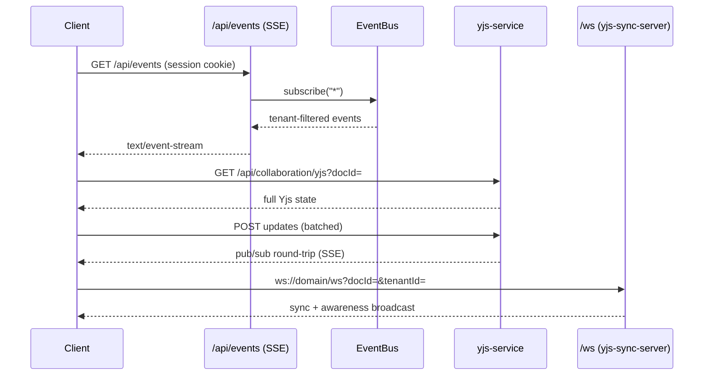

# Real-Time Updates Reference

> **Note:** SveltyCMS ships real-time on **adapter-node-compatible transports** — no uWebSockets dependency. Two mechanisms are production-wired:
>
> 1. **Server-Sent Events (SSE)** — `GET /api/content/events` (alias `GET /api/events`) streams EventBus events (content updates, cache invalidation, settings changes) to connected clients over plain HTTP.
> 2. **Yjs collaborative editing** — CRDT sync for concurrent field editing via `collaboration-service` (SSE transport) with an optional native WebSocket server on `/ws` (`yjs-sync-server`, wired in `index.cjs`).

GraphQL **queries and mutations** remain HTTP-based (`POST /api/graphql`). There is **no GraphQL-over-WebSocket subscriptions endpoint** in the current release — use the SSE event stream or Yjs collaboration for live updates.

---

## ⚡ Quick Reference

| Feature                       | Details                                                                    |
| :---------------------------- | :------------------------------------------------------------------------- |
| **SSE endpoint**              | `GET /api/content/events` (alias `GET /api/events`)                        |
| **Collaboration (SSE)**       | `collaboration-service` + `SseProvider` (client) + `yjs-service` (server)  |
| **Collaboration (WebSocket)** | `ws://[domain]/ws` via `yjs-sync-server` (production `index.cjs` entry)    |
| **Protocol**                  | `text/event-stream` + `y-protocols` over Yjs                               |
| **Auth Methods**              | Session cookie (SSE); session cookie / headers at the handshake layer (WS) |
| **GraphQL over WS**           | ❌ Not shipped — use SSE / Yjs                                             |

---

## 1. The Goal

Maintain a live, reactive UI (collaborative editor, real-time dashboard, settings sync) that updates instantly when content is modified by other users or background jobs — a superior, type-safe alternative to polling.

---

## 2. Server-Sent Events (SSE)

### Server side

`handleContentEventsStream` (`src/routes/api/[...path]/handlers/content.ts`) subscribes to the internal EventBus (`@utils/event-bus`) and pushes normalized, tenant-filtered payloads to the client:

- `content:update` → `content_update`
- `cache:invalidate` → `cache_invalidate`
- `config:change` → `config_change`
- `settings:update` → `settings_update` (consumed by `global-settings.svelte.ts`)
- Keep-alive pings every 30s; buffered micro-flushes every 32ms.

### Client side

```typescript
// Subscribe to the global event stream (browser)
const events = new EventSource("/api/content/events", { withCredentials: true });
events.onmessage = (e) => {
  const data = JSON.parse(e.data);
  if (data.type === "content_update") {
    // invalidate loaders / refetch structure
  }
};
```

Built-in consumers: `content-sse.svelte.ts`, `global-settings.svelte.ts`, `sse-provider.svelte.ts`.

---

## 3. Yjs Collaborative Editing

### Transport

- **Default (SSE)**: the client `SseProvider` (`src/services/collaboration/sse-provider.svelte.ts`) connects to `/api/events` for pushed updates and `GET/POST /api/collaboration/yjs` for full-state sync / batched updates. Server state lives in `yjs-service` (`src/services/collaboration/yjs-service.ts`), keyed by `docId` + tenant.
- **Optional WebSocket**: `yjs-sync-server` (`src/services/collaboration/yjs-sync-server.ts`) attaches a `ws`-based sync server to the HTTP server at `/ws` (y-protocols wire format, tenant-aware `tenantId:docId` keys). Wired in the production entry `index.cjs`.

### Wiring

`fields.svelte` integrates `collaborationService` (`src/services/collaboration/collaboration-service.svelte.ts`) when a collection has `collaboration.enabled: true` — field changes are pushed into the Yjs document and merged back on remote updates, with awareness (cursor presence) per editor.

---

## 4. Architecture (Server-Side)



### Performance & Security

- **Standard Node.js `ws` engine** for the `/ws` collaboration server — no native addons, deployable on any cloud/Docker platform.
- **Tenant isolation**: SSE filters by `locals.tenantId`; WS sync keys documents as `tenantId:docId`.
- **Zero runtime deps for SSE** — plain HTTP `ReadableStream` responses, no extra packages.

---

## Related Documents

- [GraphQL API Reference](./graphql.mdx)
- [Content, Search & Events Reference](./content.mdx)
- [Security Architecture](../security/index.mdx)
- [Multi-Tenancy — Real-Time Event Stream](../security/multi-tenancy.mdx)
