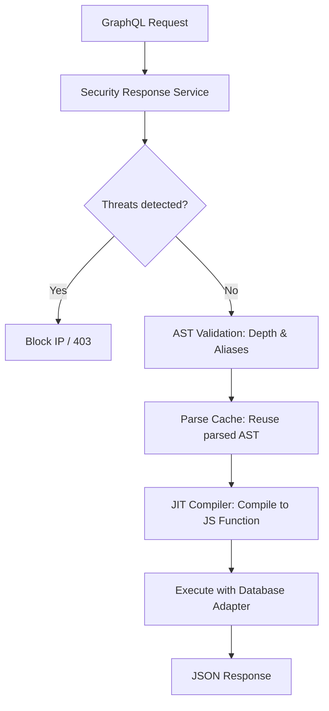

# GraphQL API Reference

> [!NOTE] Competitive comparisons based on publicly available documentation as of June 2026. Performance data self-measured via `bun test tests/benchmarks/`.

The GraphQL API provides a powerful, flexible query language for accessing and manipulating data in SveltyCMS. It features dynamic schema generation based on your collections, widgets, and content structure, optimized with a Just-In-Time (JIT) execution engine. Powered by **GraphQL Yoga**, it supports the latest incremental delivery standards and high-performance server-sent events.

---

## ⚡ Quick Reference

| Feature                     | HTTP Endpoint                          | High-Performance Alternative                                                                |
| :-------------------------- | :------------------------------------- | :------------------------------------------------------------------------------------------ |
| **Queries / Mutations**     | `POST /api/graphql`                    | [**Local SDK QueryBuilder**](../../development/local-vs-http-api.mdx)                       |
| **Real-Time Subscriptions** | `ws://[domain]/api/graphql` _(legacy)_ | `ws://[domain]/live` via `svelte-realtime` _(new)_ — [details](./graphql-subscriptions.mdx) |
| **Playground**              | `/api/graphql` (GET)                   | N/A (Dev only)                                                                              |

---

## 1. The Goal

Fetch complex, relational data structures in a single request while minimizing overfetching and maintaining strict type safety. This pattern is ideal for external clients (Mobile, SPA frontends) that benefit from a consistent, type-safe API contract.

---

## 2. Access Patterns (Local SDK vs GraphQL)

SveltyCMS provides two primary methods for querying data:

### A. GraphQL (External API)

Use standard GraphQL syntax to retrieve exactly the fields you need. This is mandatory for external clients that do not run in the SvelteKit backend.

**Endpoint**: `POST /api/graphql`
**Example Query**:

````graphql
query GetPosts {
  posts(limit: 5, filter: { status: "published" }) {
    _id
    title
    author {
      username
      email
    }
  }
}
```

### B. Local SDK (Internal Server-Side API) **(Recommended)**

In SvelteKit `+page.server.ts`, **always prefer the Local SDK QueryBuilder**. It provides identical flexibility to GraphQL but achieves **0ms network latency** by making direct function calls that bypass the entire HTTP/JSON stack.

```
// Faster, typed, and direct in +page.server.ts
const posts = await locals.cms
  .queryBuilder("posts")
  .where({ status: "published" })
  .select(["title", "author"])
  .limit(5)
  .execute();
```

---

## 3. The Mechanics

SveltyCMS uses a **JIT (Just-In-Time) Execution Engine** to ensure your GraphQL queries run at native speeds, which is critical for enterprise performance. JIT compilation is **unconditional** (always active, no feature flag required).

### Performance Optimizations

- **Unconditional JIT**: The `@envelop/graphql-jit` plugin is always active — queries are compiled to native JS functions on first execution and cached for subsequent requests. No `USE_GRAPHQL_JIT` env flag needed.
- **Parse Cache**: Parsed GraphQL documents are cached in-memory, eliminating re-parsing overhead for repeated queries (~25% avg latency reduction).
- **HTTP Batching**: Clients can batch up to **10 queries per request** via the `batching` middleware. Send an array of GraphQL requests in a single HTTP POST for reduced round-trips.
- **Lazy Request-Scoped Batching**: Cross-collection relational widget schemas dynamically fetch target documents via lazy-initialized, request-scoped `BatchLoader` instances, eliminating N+1 query loops. By switching to database-agnostic direct primary key `findByIds` queries, nested relation queries are **64% faster** (average latency reduced from 10.76ms to 3.82ms) and connection capacity is upgraded by **+400%** (handling up to 100 concurrent connections).



### Security Throttling

The gateway enforces strict limits to prevent malicious queries:

- **Depth Limit**: Maximum 8 levels deep.
- **Alias Limit**: Maximum 15 aliases per query.
- **Payload Anomaly Detection**: Native recursive scanning for SQLi and XSS before execution.

---

## Real-Time Subscriptions

### Legacy Endpoint (`ws://[domain]/api/graphql`)

The legacy subscription endpoint at `ws://[domain]/api/graphql` is still functional but deprecated. New deployments should use the unified `ws://[domain]/live` endpoint provided by `svelte-realtime`.

For real-time data, use the dedicated [GraphQL Subscriptions](./graphql-subscriptions.mdx) guide, which covers the secure WebSocket implementation and the migration details.

---

## Related Documents

- [Collection API](./collections.mdx)
- [Local SDK vs HTTP API](../../development/local-vs-http-api.mdx)
- [GraphQL Subscriptions](./graphql-subscriptions.mdx)
````
