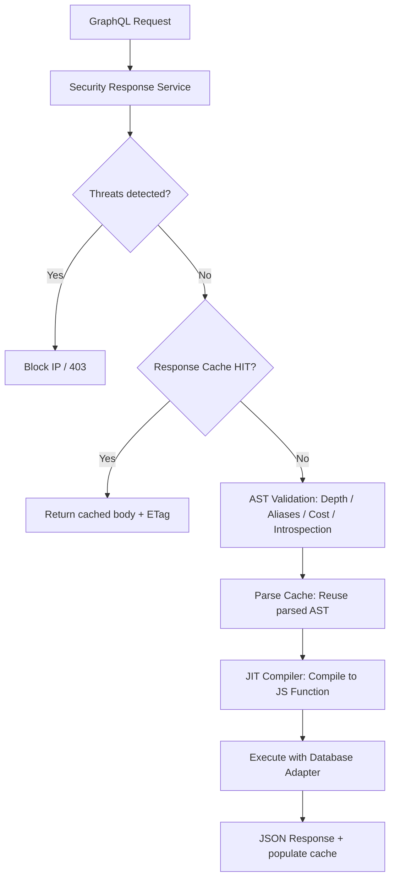

# GraphQL API Reference

> [!NOTE] Competitive comparisons based on publicly available documentation as of June 2026. Performance data self-measured via `bun test tests/benchmarks/`.

The GraphQL API provides a powerful, flexible query language for accessing and manipulating data in SveltyCMS. It features dynamic schema generation based on your collections, widgets, and content structure, optimized with a Just-In-Time (JIT) execution engine. Powered by **GraphQL Yoga**, it supports the latest incremental delivery standards and high-performance server-sent events.

---

## ⚡ Quick Reference

| Feature                 | HTTP Endpoint                   | High-Performance Alternative                                                                                        |
| :---------------------- | :------------------------------ | :------------------------------------------------------------------------------------------------------------------ |
| **Queries / Mutations** | `POST /api/graphql`             | [**Local SDK QueryBuilder**](../../development/local-vs-http-api.mdx)                                               |
| **Real-Time Updates**   | `GET /api/content/events` (SSE) | Yjs collaboration (`/api/collaboration/yjs` + optional `ws://[domain]/ws`) — [details](./graphql-subscriptions.mdx) |
| **Playground**          | `/api/graphql` (GET)            | N/A (Dev only)                                                                                                      |

---

## 1. The Goal

Fetch complex, relational data structures in a single request while minimizing overfetching and maintaining strict type safety. This pattern is ideal for external clients (Mobile, SPA frontends) that benefit from a consistent, type-safe API contract.

---

## 2. Access Patterns (Local SDK vs GraphQL)

SveltyCMS provides two primary methods for querying data:

### A. GraphQL (External API)

Use standard GraphQL syntax to retrieve exactly the fields you need. This is mandatory for external clients that do not run in the SvelteKit backend.

**Endpoint**: `POST /api/graphql`
**Example Query**:

````graphql
query GetPosts {
  posts(limit: 5, filter: { status: "published" }) {
    _id
    title
    author {
      username
      email
    }
  }
}
```

### B. Local SDK (Internal Server-Side API) **(Recommended)**

In SvelteKit `+page.server.ts`, **always prefer the Local SDK QueryBuilder**. It provides identical flexibility to GraphQL but achieves **0ms network latency** by making direct function calls that bypass the entire HTTP/JSON stack.

```
// Faster, typed, and direct in +page.server.ts
const posts = await locals.cms
  .queryBuilder("posts")
  .where({ status: "published" })
  .select(["title", "author"])
  .limit(5)
  .execute();
```

---

## 3. The Mechanics

SveltyCMS uses a **JIT (Just-In-Time) Execution Engine** to ensure your GraphQL queries run at native speeds, which is critical for enterprise performance. JIT compilation is **unconditional** (always active, no feature flag required).

### Performance Optimizations

- **Unconditional JIT**: The `@envelop/graphql-jit` plugin is always active — queries are compiled to native JS functions on first execution and cached for subsequent requests. No `USE_GRAPHQL_JIT` env flag needed.
- **Parse Cache**: Parsed GraphQL documents are cached in-memory, eliminating re-parsing overhead for repeated queries (~25% avg latency reduction).
- **HTTP Batching**: Clients can batch up to **10 queries per request** via the `batching` middleware. Send an array of GraphQL requests in a single HTTP POST for reduced round-trips.
- **Lazy Request-Scoped Batching**: Cross-collection relational widget schemas dynamically fetch target documents via lazy-initialized, request-scoped `BatchLoader` instances, eliminating N+1 query loops. By switching to database-agnostic direct primary key `findByIds` queries, nested relation queries are **64% faster** (average latency reduced from 10.76ms to 3.82ms) and connection capacity is upgraded by **+400%** (handling up to 100 concurrent connections).
- **Response Cache**: Successful read-only queries are cached with a content ETag (`60s` TTL, `stale-while-revalidate`), keyed by normalized query + variables + publication filter + user. Mutations, subscriptions, error-shaped responses, and empty collection results are never cached. Cached hits short-circuit the entire content/DB/Yoga pipeline.


```mermaid
graph TD
    A[GraphQL Request] --> B[Security Response Service]
    B --> C{Threats detected?}
    C -- Yes --> D[Block IP / 403]
    C -- No --> E{Response Cache HIT?}
    E -- Yes --> F[Return cached body + ETag]
    E -- No --> G[AST Validation: Depth / Aliases / Cost / Introspection]
    G --> H[Parse Cache: Reuse parsed AST]
    H --> I[JIT Compiler: Compile to JS Function]
    I --> J[Execute with Database Adapter]
    J --> K[JSON Response + populate cache]
```

### Schema Caching (per tenant)

The Yoga schema is built **once per tenant** and reused across requests:

- **Identity-stable cache keys** — per-request tenant wrappers and the self-healing root proxy are unwrapped (`unscoped()`) to the raw adapter instance, so proxy↔raw identity flips can never invalidate the cache (previously rebuilt the schema on every turbo-auth request).
- **Version-gated** — the cache is invalidated when `contentSystem.version` changes (schema/collection edits) or when `_refreshSchema` is explicitly invoked.
- **Bounded LRU (32 tenants)** — the oldest tenant entry is evicted beyond capacity.
- **Self-healing** — a failed schema build is purged from the cache so the next request retries instead of reusing a rejected promise.

### Security Throttling

The gateway enforces strict limits to prevent malicious queries:

- **Depth Limit**: Maximum 8 levels deep.
- **Alias Limit**: Maximum 15 aliases per query.
- **Query Cost Budget**: Static cost analysis runs at parse time; queries over the budget (1000) are rejected with a `QUERY_TOO_EXPENSIVE` GraphQL error before validation/execution.
- **Introspection Block**: `__schema`/`__type` introspection is blocked unconditionally in production (`NODE_ENV=production`) — also via `BLOCK_GRAPHQL_INTROSPECTION=true` in any environment. This is belt-and-suspenders on top of Yoga's default.
- **Payload Anomaly Detection**: Native recursive scanning for SQLi and XSS before execution (see the WAF layer in the security hooks).

---

## Real-Time Updates

GraphQL over WebSocket subscriptions are **not shipped** in the current release. Live updates use adapter-node-compatible transports instead:

- **SSE** — `GET /api/content/events` streams EventBus events (content updates, cache invalidation, settings changes) over plain HTTP.
- **Yjs collaboration** — CRDT sync for concurrent editing via `collaboration-service` (SSE transport) and the optional WebSocket server at `ws://[domain]/ws` (`yjs-sync-server`).

See the [Real-Time Updates](./graphql-subscriptions.mdx) guide for client integration and server architecture.

---

## Related Documents

- [Collection API](./collections.mdx)
- [Local SDK vs HTTP API](../../development/local-vs-http-api.mdx)
- [GraphQL Subscriptions](./graphql-subscriptions.mdx)
````
