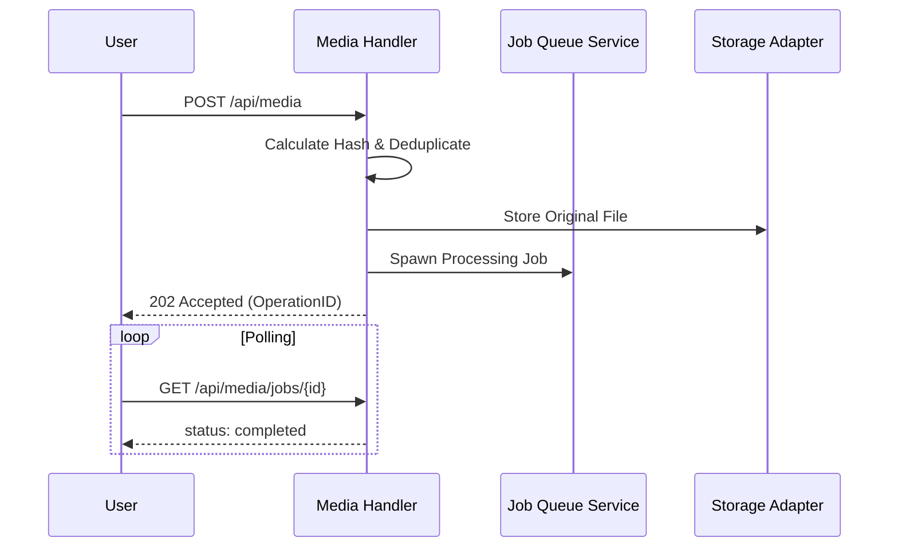

# Media Reference (`media.ts`)

The Media API provides a centralized interface for managing all assets within SveltyCMS. It handles multi-part uploads, intelligent deduplication, virtual folder organization (logical `folderId` moves), and DAM features (analytics, versioning, bulk download, secure sharing).

---

## ⚡ Quick Reference

| Feature             | HTTP Endpoint                       | Method     | Permission Required |
| :------------------ | :---------------------------------- | :--------- | :------------------ |
| **List Media**      | `/api/media`                        | `GET`      | `media:read`        |
| **Get Manifest**    | `/api/media/{id}`                   | `GET`      | `media:read`        |
| **Upload Media**    | `/api/media` or `/api/media/upload` | `POST`     | `media:write`       |
| **Stream Upload**   | `/api/media/stream`                 | `POST`     | `media:write`       |
| **Move Media**      | `/api/media/move`                   | `POST`     | `media:write`       |
| **Update Metadata** | `/api/media/{id}`                   | `PATCH`    | `media:write`       |
| **Delete Media**    | `/api/media/{id}`                   | `DELETE`   | `media:delete`      |
| **Bulk Download**   | `/api/media/bulk-download`          | `GET/POST` | `media:read`        |
| **Analytics**       | `/api/media/analytics`              | `GET`      | `media:read`        |
| **Version List**    | `/api/media/version/{id}/list`      | `GET`      | `media:read`        |
| **Version Compare** | `/api/media/version/{id}/compare`   | `GET`      | `media:read`        |
| **Version Upload**  | `/api/media/version/{id}/upload`    | `POST`     | `media:write`       |
| **Version Restore** | `/api/media/version/{id}/restore`   | `POST`     | `media:write`       |
| **Create Share**    | `/api/media/share/{id}`             | `POST`     | `media:write`       |
| **Access Share**    | `/api/media/share?id=&token=`       | `GET`      | Public (token)      |
| **Revoke Share**    | `/api/media/share/{id}/{token}`     | `DELETE`   | `media:write`       |
| **References Scan** | `/api/media/references/{id}`        | `GET`      | `media:read`        |
| **Job Status**      | `/api/media/jobs/{id}`              | `GET`      | `media:read`        |

---

## 1. Asset Management

### Uploading Assets

SveltyCMS supports single and bulk uploads via standard `multipart/form-data`.

**Standard endpoint**: `POST /api/media` (or `POST /api/media/upload`)  
**Payload**: `files` field (array or single stream), optional `folder` field (virtual folder ID or `"global"`).

**Streaming endpoint** (large payloads): `POST /api/media/stream`  
**Payload**: Same `multipart/form-data` shape; parsed via `streaming-upload.ts` with backpressure-safe chunk handling. The `folder` field is captured before file parts are processed.

#### Client-Side Routing (`upload-client.ts`)

The admin UI does not call these endpoints directly for every upload. `uploadMediaFiles()` in `src/utils/media/upload-client.ts` auto-routes:

| Condition                                       | Route                                                         |
| :---------------------------------------------- | :------------------------------------------------------------ |
| Any single file ≥ 10 MB, or total batch ≥ 10 MB | `POST /api/media/stream`                                      |
| Otherwise                                       | SvelteKit form action (`?/upload` or `/mediagallery?/upload`) |

Used by `mediagallery/+page.svelte` and `upload-media/local-upload.svelte`.

### Folders & Structure

Virtual folders organize the asset library **without** relocating physical files on disk or object storage. Each media row stores an optional `folderId` pointing at a system virtual folder (or `null` for media root).

| Concern            | Mechanism                                                            |
| :----------------- | :------------------------------------------------------------------- |
| **Folder CRUD**    | `GET/POST/PATCH/DELETE /api/system-virtual-folder`                   |
| **List by folder** | `GET /api/media?folderId={id}&recursive=true\|false`                 |
| **Upload into**    | Multipart field `folder` (virtual folder ID, or `"global"` for root) |
| **Move into**      | `POST /api/media/move` (updates `folderId` only — virtual move)      |

Folder context on upload is resolved server-side by `MediaService.saveMedia()`.

### Move Media (Virtual Folder)

**Endpoint**: `POST /api/media/move`  
**Permission**: `media:write`  
**Handler**: `handleMediaMove` in `handlers/media.ts`  
**SDK**: `LocalCMS` → `media.move(fileIds, targetFolderId, { tenantId })`  
**Adapter**: `dbAdapter.media.files.move(fileIds, targetFolderId?, tenantId?)`

Moves one or many assets into a virtual folder (or back to media root). **Does not** rewrite storage paths, invalidate share tokens, or reprocess thumbnails.

**Payload**:

```json
{
  "fileIds": ["uuid-1", "uuid-2"],
  "targetFolderId": "folder-uuid-or-null"
}
```

| Field            | Type                  | Description                                                                 |
| :--------------- | :-------------------- | :-------------------------------------------------------------------------- |
| `fileIds`        | `string[]` (required) | Non-empty list of media IDs to move                                         |
| `targetFolderId` | `string \| null`      | Destination virtual folder ID. `null`, `""`, `"root"`, or `"global"` → root |

**Success response**:

```json
{
  "success": true,
  "data": {
    "movedCount": 2,
    "fileIds": ["uuid-1", "uuid-2"],
    "targetFolderId": "folder-uuid"
  }
}
```

**Client helper**: `moveMediaToFolder()` in `src/utils/media/media-dnd.ts` posts this endpoint and dispatches a document-level `mediaMoved` event so the gallery can refresh optimistically.

#### Admin UI — drag & drop

The Media Gallery treats the **sidebar folder tree** and **breadcrumb ancestors** as equivalent drop targets for the same multi-id payload:

| Source                       | Drop target                      | Behavior                                       |
| :--------------------------- | :------------------------------- | :--------------------------------------------- |
| `media-grid.svelte`          | Sidebar (`media-folders.svelte`) | Full virtual tree + Media Root                 |
| `media-table.svelte`         | Breadcrumbs (`+page.svelte`)     | Ancestor path segments + Media Gallery root    |
| Multi-select (Windows-style) | Either target                    | Dragging any selected item moves the whole set |

- Custom MIME: `application/x-sveltycms-media-ids` (`{ ids: string[] }`)
- Shared helpers: `beginMediaDrag`, `resolveMediaDragIds`, `hasMediaDrag` in `media-dnd.ts`
- Mobile: limited sidebar space — prefer breadcrumb drop, or select items and **tap** a parent crumb to move

Folder tree CRUD remains on `/api/system-virtual-folder` (create/rename/reorder/delete folders).

---

## 2. Media Processing

### Auto-Deduplication

The media engine calculates high-entropy hashes (SHA-256) for every upload. If an identical file already exists in the system, SveltyCMS will automatically link the new metadata to the existing physical file, saving storage space.

### Asynchronous Operations

For long-running tasks (AI tagging, batch transforms, heavy ingestion), the API returns a `202 Accepted` status with an **`OperationID`**.

**Endpoint**: `GET /api/media/jobs/{id}`  
**Returns**:

- `pending`: Job is in queue.
- `processing`: Job is currently executing.
- `completed`: Job finished successfully.
- `failed`: Job encountered an error (includes error details).

### Image Manipulation API

SveltyCMS provides a dedicated endpoint for server-side image baking.

**Endpoint**: `POST /api/media/manipulate/{id}`  
**Payload**: JSON instructions for transformations.

```json
{
  "rotation": 90,
  "flipH": true,
  "crop": { "x": 10, "y": 10, "width": 500, "height": 500 },
  "filters": { "brightness": 10, "contrast": 5 },
  "focalPoint": { "x": 45, "y": 60 },
  "saveBehavior": "overwrite"
}
```

### Focal Point & Aspect Preview

SveltyCMS supports **focal point** metadata on images — a percentage coordinate (`{ x, y }` from 0–100) marking the most important visual area. This is used by frontend rendering (CSS `object-position`) or server-side cropping tools to ensure the subject remains visible regardless of container aspect ratio.

**Update focal point** (lightweight, metadata-only):

```
PATCH /api/media/{id}
Content-Type: application/json

{ "metadata": { "focalPoint": { "x": 35, "y": 60 } } }
```

**Aspect Ratio Preview** — A companion UI (available via the Focal Point plugin) shows how an image crops to 16:9, 1:1, 4:3, and other ratios with the focal point as the visual anchor. See the [Focal Point Plugin](/src/plugins/focal-point/focal-point.mdx) documentation.

**Data model**: `CmsMediaMetadata.focalPoint?: { x: number; y: number }` — stored in `media_files.metadata`, returned in all media GET responses.

---

## 3. The Mechanics

### Storage Adapters

The Media API is storage-agnostic. It can be configured to use local disk storage, AWS S3, or Cloudflare R2 through the **MediaAdapter** interface.



---

## 4. DAM — Digital Asset Management

### Bulk Download

Download multiple media files as a single TAR.GZ archive.

**Endpoint**: `GET /api/media/bulk-download?id={id1}&id={id2}&…`  
**Returns**: `application/gzip` binary stream with `Content-Disposition: attachment`.

**Admin UI**: When one or more assets are selected in the Media Gallery, the selection toolbar exposes a **Download Archive** button that builds the query string from `selectedFiles` and triggers a browser download.

### Storage Analytics

Retrieve storage breakdowns, insights, and growth trends.

**Endpoint**: `GET /api/media/analytics`  
**Returns**: JSON wrapped in `{ success: true, data: { … } }` with:

- `total` — file count, byte size, `formattedSize`
- `byType` — top 5 types by storage share
- `insights` — actionable cards (large files, old files, dominant types)
- `trends` — last 12 months of upload growth
- `quota` — used/available bytes, percentage, `healthy` | `warning` | `critical` status

**Admin UI**: Dashboard widget `media-storage-analytics-widget.svelte` polls this endpoint every 60 seconds. Add it from the dashboard widget picker.

### Version History

Track, compare, and restore file versions over time.

| Operation  | Endpoint                                          | Notes                                        |
| :--------- | :------------------------------------------------ | :------------------------------------------- |
| List       | `GET /api/media/version/{id}/list`                | Returns `versions` array and `stats`         |
| Compare    | `GET /api/media/version/{id}/compare?from=1&to=2` | Hash diff, size delta, field-level `changes` |
| Upload new | `POST /api/media/version/{id}/upload`             | `multipart/form-data` with `file` field      |
| Restore    | `POST /api/media/version/{id}/restore`            | JSON `{ versionNumber }`                     |
| Create     | `POST /api/media/version/{id}`                    | Creates version record from uploaded binary  |

**Admin UI**: The **Versions** tab in `media-details-modal.svelte` provides upload, restore, per-version download, and a **Compare Versions** panel (From/To selects + diff results) when ≥2 historical versions exist.

**Compare response shape**:

```json
{
  "success": true,
  "data": {
    "fromVersion": 1,
    "toVersion": 2,
    "contentChanged": true,
    "metadataChanged": false,
    "sizeDifference": 4096,
    "changes": [{ "field": "content", "type": "modify", "oldValue": "…", "newValue": "…" }]
  }
}
```

### Secure Share Links

Generate expiring, password-protected share links for media assets. See also [Media Sharing Endpoint](./media-sharing.mdx).

| Operation | Endpoint                                                        | Payload                             |
| :-------- | :-------------------------------------------------------------- | :---------------------------------- |
| Create    | `POST /api/media/share/{mediaId}`                               | `{ expiryHours, password? }`        |
| Access    | `GET /api/media/share?id={mediaId}&token={token}&password={pw}` | Query only; public with valid token |
| Revoke    | `DELETE /api/media/share/{mediaId}/{token}`                     | —                                   |
| Extend    | `PATCH /api/media/share/{mediaId}/{token}`                      | `{ expiryHours }`                   |

**Admin UI**: The **Share** tab in `media-details-modal.svelte` generates links with configurable expiry and optional password, lists active tokens, and supports one-click revocation.

---

## Related Documents

- [Media System Architecture](../architecture/media-system.mdx) — virtual folders, gallery DnD, integrity gate
- [Media Sharing Endpoint](./media-sharing.mdx) — share links (unaffected by virtual folder moves)
- [Collections Reference (collections.ts)](./collections.mdx)
- [System Reference (system.ts)](./system.mdx) — `system-virtual-folder` namespace
