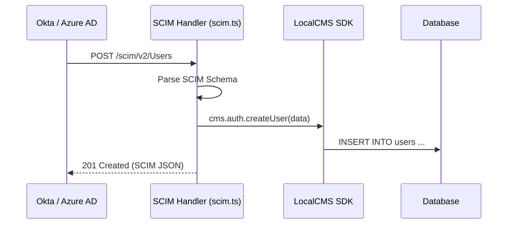

# SCIM 2.0 Reference (`scim.ts`)

SveltyCMS provides a native implementation of the **System for Cross-domain Identity Management (SCIM) 2.0** protocol (RFC 7644). This allows enterprise identity providers (IdPs) like Okta or Azure AD to automatically provision and manage users and groups within SveltyCMS.

---

## ⚡ Quick Reference

| Feature         | HTTP Endpoint             | Method   | Permission Required    |
| :-------------- | :------------------------ | :------- | :--------------------- |
| **List Users**  | `/api/scim/v2/Users`      | `GET`    | **Admin session only** |
| **Get User**    | `/api/scim/v2/Users/{id}` | `GET`    | **Admin session only** |
| **Create User** | `/api/scim/v2/Users`      | `POST`   | **Admin session only** |
| **Update User** | `/api/scim/v2/Users/{id}` | `PATCH`  | **Admin session only** |
| **Delete User** | `/api/scim/v2/Users/{id}` | `DELETE` | **Admin session only** |
| **Bulk Ops**    | `/api/scim/v2/Bulk`       | `POST`   | **Admin session only** |

> [!IMPORTANT]
> SCIM is **admin-session only — there is no grantable SCIM permission**. The `scim` namespace is absent from `ENDPOINT_PERMISSIONS`, and `_checkEndpointPermission` returns `false` for it immediately after the admin fast-path (`src/routes/api/[...path]/+server.ts`, `namespace === "scim"`), so a non-admin role receives `403 FORBIDDEN` even when it holds a broad `manage:user`-style grant. Provision with an `admin`/`super-admin` session or a website token of `type: "admin-api"` (which resolves to the admin role) — an `sck_*` API key resolves to `role: "guest"` and is rejected.

---

## 1. The Goal

Automate the user lifecycle (Joiners, Movers, Leavers) by allowing the enterprise IdP to be the source of truth, reducing manual administrative overhead and ensuring security compliance.

---

## 2. The Solution

### Endpoint Configuration

The SCIM API is located at `/api/scim/v2/`. Most IdPs will require a **SCIM Base URL** and an **API Token** (generated via [Tokens API](./tokens.mdx)).

### Supported Attributes

SveltyCMS filters and maps SCIM standard attributes to its internal user model:

- `userName` → `username`
- `emails[type=work]` → `email`
- `active` → `status`
- `displayName` → `metadata.fullName`

---

## 3. The Mechanics

### SCIM Compliance

The `scim.ts` handler implements complex filtering (e.g., `filter=userName eq "john"`) and pagination according to the RFC 7644 specification.

---

## Related Documents

- [Authentication & Identity (auth.ts)](./auth.mdx)
- [Token Management (tokens.ts)](./tokens.mdx)
- [Multi-Tenant Architecture Guide](../architecture/multi-tenancy.mdx)
