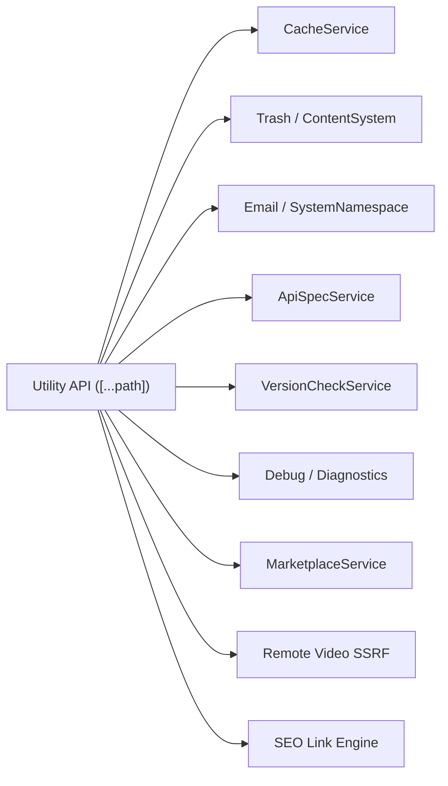

# Utilities Reference (`utility.ts`)

The Utilities API provides a set of essential maintenance and support services that keep the SveltyCMS environment healthy and performant. It manages cache invalidation, recoverable data via the Trash, transactional email, API documentation, version checking, and diagnostics.

> [!IMPORTANT]
> Utility endpoints are authorized **fail-closed** by the dispatcher against its `ENDPOINT_PERMISSIONS` mapping — see the Permission column below; unmapped namespaces fail closed and non-admin users without the listed permission receive `403 Forbidden`.

---

## ⚡ Quick Reference

| Feature                  | HTTP Endpoint               | Method | Permission (dispatcher) |
| :----------------------- | :-------------------------- | :----- | :---------------------- |
| **OpenAPI Spec**         | `/api/openapi.json`         | `GET`  | `system:read`           |
| **Swagger UI**           | `/api/docs`                 | `GET`  | **Unmapped → `403`**    |
| **Cache Clear**          | `/api/cache/clear`          | `POST` | `system:admin`          |
| **Cache Stats**          | `/api/cache/stats`          | `GET`  | `system:admin`          |
| **Trash List**           | `/api/trash`                | `GET`  | `collection:read`       |
| **Restore Entry**        | `/api/trash/restore`        | `POST` | `collection:write`      |
| **Send Email**           | `/api/send-mail`            | `POST` | `system:settings`       |
| **Version Check**        | `/api/version-check`        | `GET`  | `system:read`           |
| ~~**Config Sync**~~      | `/api/config_sync`          | `GET`  | `config:read`           |
| **Debug / Diagnostics**  | `/api/debug`                | `GET`  | `system:admin`          |
| **Marketplace catalog**  | `/api/marketplace`          | `GET`  | `system:read`           |
| **Marketplace install**  | `/api/marketplace/install`  | `POST` | `system:settings`       |
| **Remote Video Meta**    | `/api/remote-video`         | `POST` | `collection:read`       |
| **SEO Link Suggestions** | `/api/seo/link-suggestions` | `POST` | `collection:read`       |

---

## 1. OpenAPI & API Documentation

### OpenAPI 3.1.0 Specification

Generates the full OpenAPI 3.1.0 specification dynamically. **Admin-gated** to prevent AI reconnaissance blinding.

**Endpoint**: `GET /api/openapi.json`

### Swagger UI Documentation Browser

Serves an interactive Swagger UI that loads the spec from `/api/openapi.json`.

**Endpoint**: `GET /api/docs`

> [!WARNING]
> `GET /api/docs` is **not reachable**. The `docs` namespace is missing from both `NAMESPACE_CONFIG` and `ENDPOINT_PERMISSIONS` in `src/routes/api/[...path]/+server.ts`, so the dispatcher fail-closes with `403 Forbidden` (`NAMESPACE_FORBIDDEN`) before `handleUtilityRoutes` runs. The handler branch (`namespace === "docs"`) exists, but no grant can reach it — fetch the spec from `/api/openapi.json` instead.

---

## 2. Maintenance & Cache

### Clear System Cache

Invalidates the entire cache for the current tenant.

**Endpoint**: `POST /api/cache/clear`  
**Payload**: `{}` (optional — the `category` field is accepted but the implementation currently clears all categories regardless)

### Cache Statistics

Returns live cache metrics including hit rates, size, and eviction counts.

**Endpoint**: `GET /api/cache/stats`

---

## 3. Recovery (The Trash)

SveltyCMS implements a "Soft Delete" pattern. Deleted entries are moved to the Trash before being permanently purged.

- **List Trash**: `GET /api/trash` — Returns a paginated list of items currently in the trash for the current tenant. Accepts `?limit=` query param (default 50, max 200).
- **Restore**: `POST /api/trash/restore` — Returns an item to its original collection and restores its original status.
  - **Payload**: `{ "collectionId": "...", "entryId": "..." }`
- **Empty Trash**: Not currently implemented via the API.

---

## 4. Communication

### Transactional Email

Send emails directly via the API using the system mail service.

**Endpoint**: `POST /api/send-mail`  
**Payload**:

```json
{
  "to": "user@example.com",
  "subject": "System Alert",
  "templateName": "alert",
  "props": { "message": "High CPU usage" },
  "languageTag": "en"
}
```

| Field          | Type     | Required | Description                             |
| :------------- | :------- | :------- | :-------------------------------------- |
| `to`           | `string` | ✅       | Recipient email address                 |
| `subject`      | `string` | ✅       | Email subject line                      |
| `templateName` | `string` | —        | Template to render (default: `generic`) |
| `props`        | `object` | —        | Template variables                      |
| `languageTag`  | `string` | —        | Locale for rendering (default: `en`)    |

---

## 5. System Diagnostics

### Version Check

Checks for available updates. **Authenticated** (unlike the public `/api/system/version`).

**Endpoint**: `GET /api/version-check` — dispatcher alias of `GET /api/system/version/check`.

Returns the raw update-check payload (`currentVersion`, `latestVersion`, `updateAvailable`, `checkedAt`, and `error` when GitHub is unreachable). The canonical route wraps the same payload in the standard `{ success, data }` envelope.

### Configuration Sync

> [!WARNING]
> **Deprecated.** `GET /api/config_sync` is deprecated and routed to `GET /api/config/status`.
> Use the new [Configuration Promotion API](./configuration-promotion.mdx) instead.
> The old endpoint will continue to work via the dispatcher alias but will be removed
> in a future major version.
>
> **Migration**: Replace `GET /api/config_sync` with `GET /api/config/status`.

### Debug / Diagnostics

Returns system diagnostics including uptime, memory usage, and environment info. **Admin-only**.

**Endpoint**: `GET /api/debug`

### Marketplace

Offline-first in-app catalog for themes, plugins, and related packages (Phase 2). Backed by `MarketplaceService` — local themes/plugin stubs always, remote marketplace.sveltycms.com when reachable (via `marketplace-client`, 30 min cache).

**List catalog** — `GET /api/marketplace`

| Query    | Description                                           |
| :------- | :---------------------------------------------------- |
| `type`   | Optional: `theme` \| `widget` \| `plugin` \| `preset` |
| `search` | Optional free-text over name/description              |

**Response** (`data`):

| Field             | Type    | Description                                      |
| :---------------- | :------ | :----------------------------------------------- |
| `source`          | string  | `local` \| `remote` \| `mixed`                   |
| `remoteAvailable` | boolean | Whether remote catalog contributed items         |
| `items`           | array   | Catalog rows (`id`, `name`, `type`, `source`, …) |

**Install** — `POST /api/marketplace/install` (admin only)

```json
{ "itemId": "theme-or-package-id" }
```

Today installs themes via `adminThemeService`; remote one-click package install remains a Phase 2 follow-up. See [Marketplace architecture](../architecture/marketplace.mdx).

**UI**: Config → Extensions → Marketplace (`marketplace-view.svelte`).

---

## 6. Remote Media & SEO Tools

### Remote Video Metadata

Fetches metadata for third-party video providers (YouTube, Vimeo) with server-side SSRF validation and safe egress URL filtering.

**Endpoint**: `POST /api/remote-video`  
**Payload**:

```json
{
  "url": "https://www.youtube.com/watch?v=dQw4w9WgXcQ"
}
```

**Response** (`data`):

```json
{
  "provider": "youtube",
  "videoId": "dQw4w9WgXcQ",
  "title": "Video Title",
  "thumbnailUrl": "https://i.ytimg.com/vi/dQw4w9WgXcQ/hqdefault.jpg"
}
```

### SEO Link Suggestions

Provides fast internal linking recommendations for content editors by analyzing content text and keyword frequency across published entries within the active tenant.

**Endpoint**: `POST /api/seo/link-suggestions`  
**Payload**:

```json
{
  "content": "<p>Article text containing keywords...</p>",
  "collectionId": "posts",
  "currentId": "entry-123",
  "focusKeyword": "sveltycms"
}
```

**Response** (`data`):

```json
{
  "suggestions": [
    {
      "title": "Getting Started with SveltyCMS",
      "url": "/posts/getting-started",
      "score": 2.5,
      "collection": "Posts"
    }
  ]
}
```

---

## 7. The Mechanics

### Utility Dispatcher

The `utility.ts` handler manages a wide range of disparate system helper tasks. It acts as the primary interface for scheduled maintenance jobs, cross-system communication, and editor assistive tooling.



### Access Control

All utility namespaces are gated via the dispatcher's centralized `ENDPOINT_PERMISSIONS` mapping (see the Quick Reference table above):

- Only `cache`, `debug` and `security` map to `system:admin`.
- `trash` maps to `collection:read`/`collection:write`, `send-mail` to `system:settings`, `version-check`, `marketplace` and `openapi.json` to `system:read`/`system:settings`.
- Editor tools (`remote-video`, `seo`) require `collection:read` — not `media:read`.
- Unmapped namespaces (e.g. `docs`) fail closed with `403 Forbidden`.
- Individual handlers perform defense-in-depth authorization checks.

> [!NOTE]
> Permission ids here are the **namespaced API route** vocabulary, authorized fail-closed against `ENDPOINT_PERMISSIONS` in `src/routes/api/[...path]/+server.ts`. Admin UI tiles use the separate `manage:*` vocabulary (`CONFIG_TILE_PERMISSIONS` in `src/routes/(app)/config/+page.server.ts`) — the two are not interchangeable.

---

## Related Documents

- [Marketplace architecture](../architecture/marketplace.mdx)
- [System Reference (system.ts)](./system.mdx)
- [Content Reference (content.ts)](./content.mdx)
- [API Coverage Report](./api-coverage-report.mdx)
