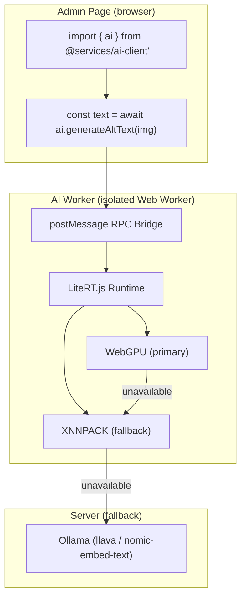

# AI Client — LiteRT.js In-Browser Inference

SveltyCMS integrates [LiteRT.js](https://developers.googleblog.com/litertjs-googles-high-performance-web-ai-inference/) (Google's high-performance Web AI runtime) for **client-side ML inference** — entirely in the browser, with zero server cost and zero data egress.

## Architecture



## Key Design Decisions

| Decision                          | Rationale                                                                                                         |
| --------------------------------- | ----------------------------------------------------------------------------------------------------------------- |
| **Isolated Web Worker**           | LiteRT.js WASM runtime runs in a dedicated Worker — no DOM/cookie access, separate CSP, cannot XSS the admin page |
| **Dedicated CSP on `/ai/worker`** | Only this endpoint has `'wasm-unsafe-eval'` — the admin page CSP is never modified                                |
| **SvelteKit Remote Function API** | `import { ai } from "@services/ai-client"` and call like any async function                                       |
| **Automatic Fallback**            | LiteRT.js → Ollama, transparent to the caller. Each result includes a `backend` field                             |
| **Lazy Loading**                  | WASM runtime (~15MB) downloads on first inference call, not at page boot                                          |
| **Progressive Enhancement**       | If WebGPU is unavailable, falls to CPU (XNNPACK). If Workers unsupported, uses server-side Ollama                 |

## Security Model

### What the Worker Can Access

| Capability                  | Worker              | Admin Page          |
| --------------------------- | ------------------- | ------------------- |
| DOM / `window` / `document` | ❌                  | ✅                  |
| Cookies / `localStorage`    | ❌                  | ✅                  |
| Session tokens              | ❌                  | ✅                  |
| WASM compilation            | ✅ (isolated CSP)   | ❌ (if future CSP)  |
| WebGPU                      | ✅                  | ✅                  |
| postMessage (admin page)    | ✅ (typed RPC only) | ✅ (typed RPC only) |

### CSP Headers

**Admin page** — unchanged. No `wasm-unsafe-eval` or `worker-src` added.

**`/ai/worker` endpoint** — isolated CSP:

```
default-src 'self'; script-src 'self' 'wasm-unsafe-eval'; worker-src 'self' blob:;
```

`'wasm-unsafe-eval'` is strictly more restrictive than `'unsafe-eval'` — it only enables WASM compilation, not JavaScript `eval()`. This is the CSP Level 3 best practice for applications that legitimately use WebAssembly.

### Future-Proofing

If a future CSP is added to admin pages, it would need:

- `worker-src 'self'` — allows creating Workers (security-neutral)
- `'wasm-unsafe-eval'` — allows WASM inside Workers (not `eval()`, WASM-only)

Both are CSP Level 3 best practices — they explicitly permit capabilities the app already uses, rather than relying on the absence of CSP.

## API Reference

### `ai.generateAltText(imageData, mimeType, contextHint?)`

Generate accessible alt-text for an image entirely in the browser.

```typescript
import { ai } from "@src/services/ai-client";

const file = event.target.files[0];
const buffer = await file.arrayBuffer();
const result = await ai.generateAltText(buffer, file.type);

console.log(result.altText); // "A person standing in front of a building"
console.log(result.confidence); // 0.92
console.log(result.backend); // "litert" | "ollama" | "failed"
console.log(result.latencyMs); // 180
```

### `ai.generateEmbeddings(text)`

Generate text embeddings for semantic search.

```typescript
const result = await ai.generateEmbeddings("SveltyCMS headless CMS");
console.log(result.vector); // Float32Array(384)
console.log(result.dimensions); // 384
console.log(result.backend); // "litert" | "ollama" | "tfidf"
```

### `ai.getCapabilities()`

Detect available hardware acceleration.

```typescript
const caps = await ai.getCapabilities();
// { webgpu: true, webnn: false, xnnpack: true, runtimeReady: true, label: "WebGPU" }
```

### `ai.isAvailable()`

Quick synchronous check — is the Worker alive?

### `ai.dispose()`

Gracefully shut down the AI Worker. Call when leaving the admin panel.

## Components

### `<AltTextSuggestion>`

Button component for the image editor that generates alt-text suggestions.

```svelte
<script lang="ts">
  import AltTextSuggestion from "@src/services/ai-client/components/alt-text-suggestion.svelte";
</script>

<AltTextSuggestion
  imageData={imageBuffer}
  mimeType="image/jpeg"
  currentAltText={altText}
  onsuggestion={(result) => { altText = result.altText; }}
/>
```

### `<AiStatusBadge>`

Status indicator for the admin shell footer showing AI backend availability.

## Adding New Models

1. Convert or download the model to `.tflite` format
2. Place it in `static/ai/models/{id}.tflite`
3. Add an entry to `src/services/ai-client/models/registry.ts`
4. Add a handler in `src/services/ai-client/ai.worker.ts`
5. Add a method to the `ai` object in `src/services/ai-client/index.ts`

## Migration Guide

### From Direct Ollama Calls

**Before:**

```typescript
const ollamaUrl = "http://127.0.0.1:11434";
const response = await fetch(`${ollamaUrl}/api/generate`, {
  method: "POST",
  body: JSON.stringify({ model: "llava", prompt: "...", images: [base64] }),
});
```

**After:**

```typescript
import { ai } from "@src/services/ai-client";
const result = await ai.generateAltText(imageBuffer, mimeType);
// Falls back to Ollama automatically if LiteRT.js is unavailable
```

### From Server-Only AI

Existing server-side AI paths (`ai-service.ts`, `content-insights.ts`, `embedding-service.ts`) remain unchanged. The AI Client is an additive layer — it runs client-side and never replaces existing server-side functionality. Both paths coexist; the client-side path is preferred when available (lower latency, zero server load), but falls back transparently.

## Performance Budget

| Asset                  | Size   | Loaded When                     |
| ---------------------- | ------ | ------------------------------- |
| LiteRT.js WASM runtime | ~15 MB | On first `ai.generate*()` call  |
| MobileNetV3 model      | 4.5 MB | On first `generateAltText()`    |
| EmbeddingGemma model   | 18 MB  | On first `generateEmbeddings()` |

Models are cached by the browser's HTTP cache after first download.

## Files

| File                                                           | Purpose                                    |
| -------------------------------------------------------------- | ------------------------------------------ |
| `src/services/ai-client/index.ts`                              | Public API — clean function interface      |
| `src/services/ai-client/types.ts`                              | RPC protocol, model metadata, result types |
| `src/services/ai-client/runtime.ts`                            | Worker manager + RPC bridge (singleton)    |
| `src/services/ai-client/ai.worker.ts`                          | LiteRT.js Web Worker (isolated CSP)        |
| `src/services/ai-client/fallback.ts`                           | Server-side Ollama fallback                |
| `src/services/ai-client/models/registry.ts`                    | Model metadata registry                    |
| `src/services/ai-client/components/alt-text-suggestion.svelte` | Alt-text UI for image editor               |
| `src/services/ai-client/components/ai-status-badge.svelte`     | Status indicator component                 |
| `src/routes/ai/worker/+server.ts`                              | Worker serving endpoint with isolated CSP  |
| `static/ai/wasm/`                                              | LiteRT.js WASM binaries                    |
| `static/ai/models/`                                            | `.tflite` model files                      |
| `tests/unit/services/ai-client/runtime.test.ts`                | Worker manager tests                       |
