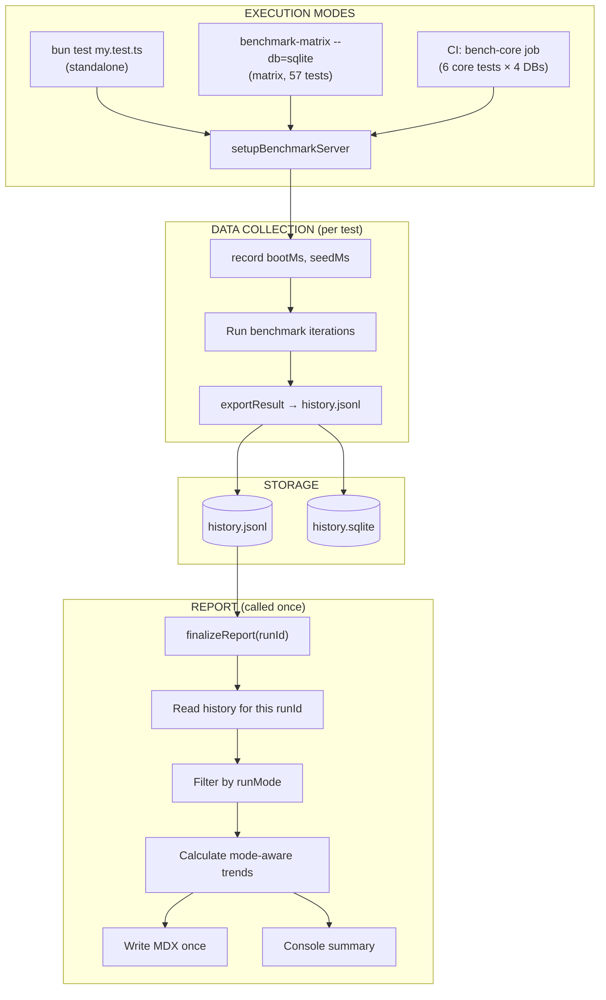

# Benchmark System — Developer Guide

## Overview

SveltyCMS has three benchmark execution modes that share a **single data pipeline**:

| Mode        | Command                                                 | Use Case      | Server                          | MDX Write                          |
| ----------- | ------------------------------------------------------- | ------------- | ------------------------------- | ---------------------------------- |
| **Single**  | `bun test tests/benchmarks/my-test.test.ts`             | Dev iteration | Starts own server               | `finalizeReport()` in `afterAll`   |
| **Matrix**  | `bun run scripts/benchmark-matrix/index.ts --db=sqlite` | Full audit    | Shared across 57 tests          | `finalizeReport()` after all tests |
| **CI Core** | `bun run benchmark-core` (ci.yml)                       | PR gating     | 6 core tests with shared server | `finalizeReport()` after group     |

**All three write to the same `history.jsonl`.** The `runMode` field keeps data isolated — matrix runs never mix with standalone runs in trend calculations.

## Architecture



## Creating a New Benchmark Test

### 1. File Location

Create a `.test.ts` file in `tests/benchmarks/`. The matrix auto-discovers all files matching `tests/benchmarks/*.test.ts`.

```typescript
/**
 * @file tests/benchmarks/my-new-test.test.ts
 * @description My New Benchmark
 * @summary Measures X under Y condition via HTTP.
 *
 * ### Features:
 * - Feature A
 * - Feature B
 */

import {
  test,
  runBenchmark,
  exportResult,
  setupBenchmarkServer,
  ensureStableTestData,
  stabilize,
  printTruthTable,
  printSummaryTable,
  getDbType,
  TEST_API_SECRET,
} from "./modules/benchmark-utils";
import "../unit/bun-preload.ts";

let stopServer: (() => Promise<void>) | null = null;

async function runMyBenchmark() {
  console.log("🚀 Starting My Benchmark...\n");

  try {
    const server = await setupBenchmarkServer();
    stopServer = server.stop;
    const baseUrl = server.baseUrl;

    await ensureStableTestData();
    await stabilize(1000);

    const requestHeaders = {
      "x-test-mode": "true",
      "x-test-secret": TEST_API_SECRET,
    };

    const results = [];

    // 1. Your benchmark iteration
    console.log("   → Measuring something...");
    const result1 = await runBenchmark({
      name: "My Metric",
      iterations: 500,
      warmupIterations: 50,
      runs: 2,
      concurrency: 4,
      trimOutliers: "iqr",
      silent: true,
      onIteration: async () => {
        const res = await fetch(`${baseUrl}/api/some/endpoint`, {
          method: "GET",
          headers: requestHeaders,
        });
        if (!res.ok) throw new Error(`Failed: ${res.status}`);
        await res.arrayBuffer();
      },
    });
    results.push({ ...result1, layer: "HTTP", shortLabel: "MyMetric" });

    // 2. Print truth table (written to MDX by finalizeReport)
    printTruthTable({
      title: "MY BENCHMARK AUDIT",
      subtitle: "Description · HTTP",
      results,
    });

    // 3. Print summary
    printSummaryTable([
      { key: "My Metric", val: result1.avgMs, unit: "ms" },
      { key: "Rating", val: result1.avgMs < 10 ? "PLATINUM" : "GOLD", unit: "" },
    ]);

    // 4. Export results (writes to history.jsonl with runMode)
    for (const r of results) exportResult(r);
  } catch (err: any) {
    console.error("❌ Benchmark failed:", err.message);
    throw err;
  } finally {
    if (stopServer) {
      await stopServer().catch(() => {});
      stopServer = null;
    }
  }
}

test("My Benchmark Suite", async () => {
  await runMyBenchmark();
}, 300000);
```

### 2. Required Patterns

| Element                               | Required?   | Why                                                              |
| ------------------------------------- | ----------- | ---------------------------------------------------------------- |
| `setupBenchmarkServer()`              | ✅ Yes      | Provides server (own or shared)                                  |
| `ensureStableTestData()`              | ✅ Yes      | Seeds `BenchmarkStable` collection with `bench-shared-001` entry |
| `exportResult(r)`                     | ✅ Yes      | Writes metric to `history.jsonl` with `runMode`                  |
| `printTruthTable()`                   | ✅ Yes      | Shows results in terminal + stores for MDX                       |
| `printSummaryTable()`                 | Recommended | Clean summary for terminal output                                |
| `requestHeaders` with `x-test-secret` | ✅ Yes      | Authenticates against server                                     |
| `res.arrayBuffer()`                   | ✅ Yes      | Drains response body for accurate timing                         |

### 3. Data Dependencies

| Collection                               | Created by               | Tests using it                                |
| ---------------------------------------- | ------------------------ | --------------------------------------------- |
| `BenchmarkStable` (+ `bench-shared-001`) | `ensureStableTestData()` | Most HTTP tests                               |
| `bench_index_pressure`                   | Custom in test           | `admin-ux-vitality`, `index-pressure`         |
| `bench_acid`                             | Custom in test           | `transaction-acid`                            |
| `benchmark_crud`                         | Custom in test           | `database-performance`                        |
| `bench_revisions`                        | Custom in test           | `revision-stress`                             |
| None (filesystem/mocked)                 | N/A                      | `etag-hash`, `content-scan`, `build-analysis` |

**Rule**: If your test needs custom data, create it inside the test function (before benchmark iterations). The matrix only pre-seeds `BenchmarkStable`. For all other collections, use the HTTP API:

```typescript
await fetch(`${baseUrl}/api/testing`, {
  method: "POST",
  headers: {
    "Content-Type": "application/json",
    "x-test-mode": "true",
    "x-test-secret": TEST_API_SECRET,
  },
  body: JSON.stringify({
    action: "create-collection",
    schema: { _id: "my_collection", name: "my_collection", fields: [...] },
  }),
});
```

### 4. Categorization for Matrix

When you add a new test, register it in `scripts/benchmark-matrix/index.ts`:

**Step A**: Add `TEST_WEIGHTS` (expected duration in seconds):

```typescript
const TEST_WEIGHTS: Record<string, number> = {
  // ... existing tests ...
  "my-new-test": 15, // estimated duration in seconds
};
```

**Step B**: Add to the appropriate group:

```typescript
const GROUPS = [
  // ...
  {
    name: "HTTP Write/Mutation",
    tests: [
      // ... existing tests ...
      "my-new-test", // add here
    ],
  },
];
```

**Step C**: If the test is incompatible with shared server mode, add to `SKIP_IN_MATRIX`:

```typescript
const SKIP_IN_MATRIX = new Set([
  "cold-start-phased", // measures server boot time
  "setup-proxy", // measures server boot
  // ...
]);
```

**Groups** (in execution order):

| Group               | Tests | Characteristics                  |
| ------------------- | ----- | -------------------------------- |
| Core HTTP Read      | 7     | HTTP API, read-only, fast        |
| GraphQL + Cache     | 5     | HTTP API, read-only, cache-aware |
| Feature HTTP Read   | 7     | HTTP API, read-only              |
| SDK/Local Read      | 6     | Direct SDK calls, no HTTP        |
| HTTP Write/Mutation | 8     | HTTP API, writes data            |
| SDK Write/Mutation  | 8     | Direct SDK, writes data          |
| Filesystem + Stress | 16    | Filesystem ops, heavy loads      |

**Skip in Matrix** (4 tests):

- `cold-start-phased`: Measures server boot, meaningless against shared server
- `setup-proxy`: Measures cold start, meaningless against shared server
- `longevity-soak`: Runs for hours
- `memory-stability`: Runs for minutes

## Data Flow

### Every test calls `exportResult()`:

```typescript
// Inside your test:
for (const r of results) exportResult(r);
```

This writes one line to `tests/benchmarks/results/history.jsonl`:

```jsonl
{
  "runMode": "matrix",
  "runId": "abc123",
  "testFile": "my-new-test",
  "metric": "My Metric",
  "layer": "HTTP",
  "avgMs": 1.234,
  "p95Ms": 2.345,
  "rps": 500,
  "cv": 0.12,
  "errorRate": 0,
  "wallClockMs": 15000,
  "serverBootMs": 0,
  "seedMs": 0,
  "db": "sqlite",
  "redis": false,
  "timestamp": "2026-06-28T18:00:00Z",
  "status": "SUCCESS"
}
```

### `finalizeReport()` runs at the end:

**Standalone mode**: Called by the `afterAll` hook in `benchmark-utils.ts` after your test's `afterAll`.

**Matrix mode**: Called by the matrix orchestrator AFTER all 57 tests complete, not per-test. This prevents duplicate MDX writes.

**CI mode**: Called after the 6 core tests complete.

### What `finalizeReport()` does:

1. Reads ALL lines from `history.jsonl` matching the current `runId`
2. Groups by `testFile:metric`
3. Filters previous history by same `runMode` (standalone or matrix)
4. Calculates % change vs previous same-mode average
5. Writes trend labels to the MDX report (one batched write)
6. Rebuilds the summary header
7. Prints a console summary

## `history.jsonl` Schema

| Field          | Type                         | Description                                  |
| -------------- | ---------------------------- | -------------------------------------------- |
| `runMode`      | `"standalone"` or `"matrix"` | How the test was executed                    |
| `runId`        | UUID                         | Unique ID for this entire run                |
| `testFile`     | string                       | e.g. `"my-new-test"`                         |
| `metric`       | string                       | e.g. `"My Metric"`                           |
| `layer`        | string                       | `"HTTP"`, `"SDK"`, `"Logic"`, `"Cache"`      |
| `avgMs`        | number                       | Average latency in milliseconds              |
| `p95Ms`        | number                       | P95 latency in milliseconds                  |
| `rps`          | number                       | Requests per second                          |
| `cv`           | number                       | Coefficient of variation                     |
| `errorRate`    | number                       | Fraction of failed iterations (0–1)          |
| `wallClockMs`  | number                       | Total real time the test took (ms)           |
| `serverBootMs` | number                       | Time spent starting the server (0 in matrix) |
| `seedMs`       | number                       | Time spent seeding data (0 in matrix)        |
| `db`           | string                       | Database type + variant                      |
| `redis`        | boolean                      | Whether Redis was enabled                    |
| `timestamp`    | ISO 8601                     | When the test ran                            |
| `status`       | `"SUCCESS"` or `"FAIL"`      | Test outcome                                 |

## MDX Reports

There are **8 MDX reports** — one per database variant:

| Report                           | DB         | Redis |
| -------------------------------- | ---------- | ----- |
| `benchmark_sqlite.mdx`           | SQLite     | No    |
| `benchmark_sqlite_redis.mdx`     | SQLite     | Yes   |
| `benchmark_postgresql.mdx`       | PostgreSQL | No    |
| `benchmark_postgresql_redis.mdx` | PostgreSQL | Yes   |
| `benchmark_mariadb.mdx`          | MariaDB    | No    |
| `benchmark_mariadb_redis.mdx`    | MariaDB    | Yes   |
| `benchmark_mongodb.mdx`          | MongoDB    | No    |
| `benchmark_mongodb_redis.mdx`    | MongoDB    | Yes   |

Each report shows **mode-aware** sections:

```mdx
## 📊 Latest Performance Audit (mode: MATRIX — 28/06/2026 18:00:00)

### ⚠️ Needs Attention

| Metric                | Status | Detail                           |
| --------------------- | ------ | -------------------------------- |
| SRE Truth Audit: HTTP | 🔴     | avg 1.1ms → +12% slower (3 runs) |

### ✅ Stable Tests

| Metric               | Status | Detail                      |
| -------------------- | ------ | --------------------------- |
| REST API Performance | 🟢     | avg 2.6ms · stable (4 runs) |

### ⚪ First Run (Baseline)

| Metric          | Status | Detail                       |
| --------------- | ------ | ---------------------------- |
| Cache Hit Ratio | ⚪     | avg 8.2ms · baseline (1 run) |
```

## CI Integration (ci.yml)

The `bench-core` job runs 6 core tests across 4 databases:

```
Core tests: truth-latency, database-performance, transaction-acid,
            cache-performance, hooks-performance, rest-api-performance
```

These are the same `CORE_BENCHMARKS` defined in `tests/benchmarks/core.ts`. The CI job:

1. Starts ONE server per DB (SQLite, MariaDB, PostgreSQL, MongoDB)
2. Seeds data once
3. Runs the 6 core tests against the shared server
4. Calls `finalizeReport()` after all 6 complete
5. Writes results to `$GITHUB_STEP_SUMMARY` as Markdown

CI runs take ~4 minutes total (vs ~10 hours old way).

## Developer Workflow

### Quick check during development:

```bash
# Run a single test (standalone mode)
bun test tests/benchmarks/my-new-test.test.ts --timeout 120000

# Check both MDX report and console output
cat docs/project/benchmarks/benchmark_sqlite.mdx | head -50
```

### Full audit before push:

```bash
# Run SQLite matrix (57 tests, shared server, ~3-5 min)
bun run scripts/benchmark-matrix/index.ts --db=sqlite

# Run all 4 databases (may take 20+ min)
bun run scripts/benchmark-matrix/index.ts
```

### CI simulation:

```bash
# Run just the core 6 tests (what CI does)
bun test tests/benchmarks/truth-latency.test.ts \
       tests/benchmarks/database-performance.test.ts \
       tests/benchmarks/transaction-acid.test.ts \
       tests/benchmarks/cache-performance.test.ts \
       tests/benchmarks/hooks-performance.test.ts \
       tests/benchmarks/rest-api-performance.test.ts \
       --timeout 120000
```

## Best Practices

1. **Always call `exportResult()`** — without it, the metric won't appear in history or MDX
2. **Use `ensureStableTestData()`** — guarantees `BenchmarkStable` collection exists
3. **Set realistic `--timeout`** — 120s for normal tests, 300s for stress tests
4. **Classify your test** — add to the right group in the matrix, provide weight estimate
5. **Don't modify server state in matrix-skippable ways** — tests that start/stop the server should be in `SKIP_IN_MATRIX`
6. **Use `concurrency: 1` for write tests** — prevents race conditions on shared data
7. **Use `concurrency: 4-8` for read tests** — realistic multi-user simulation
8. **Trim outliers with `trimOutliers: "iqr"`** — filters GC pauses and cold-starts

## Troubleshooting

| Symptom                      | Likely Cause                     | Fix                                    |
| ---------------------------- | -------------------------------- | -------------------------------------- |
| Test gets 401 in matrix mode | `SVELTY_BENCHMARK_SUITE` not set | Add to server env in matrix            |
| 413 Content Too Large        | Batch POST too large             | Reduce batch size (try 100)            |
| `finalizeReport` no-op       | `runId` mismatch                 | Check `BENCHMARK_RUN_ID` env var       |
| Duplicate MDX sections       | `finalizeReport` called twice    | Check `afterAll` guard for matrix mode |
| Test slow in matrix          | Shared server under load         | Check concurrency of other tests       |
| History.jsonl empty          | `RESULTS_DIR` not writable       | Check directory permissions            |
