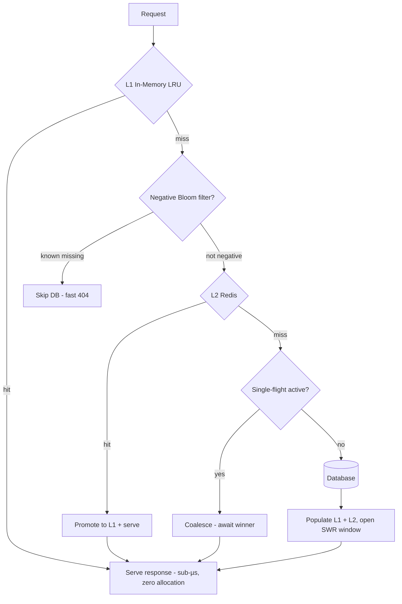
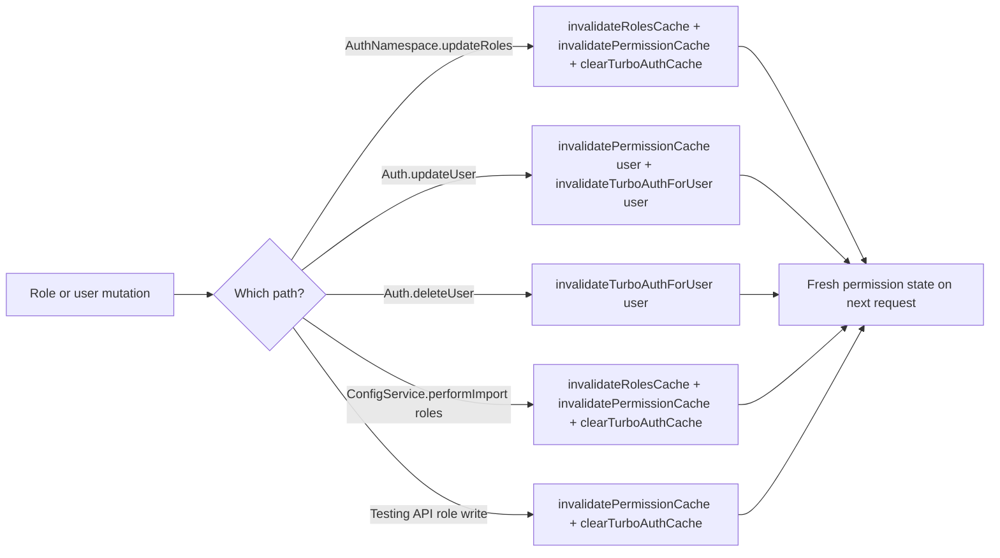

# Cache System

## Overview

SveltyCMS implements a **dual-layer caching system**: L1 is an in-memory LRU cache (500K entries, sub-µs access), L2 is optional Redis for distributed deployments. The system includes stampede protection (distributed single-flight coalescing inside `cacheService.get`), negative caching, predictive warming, and stale-while-revalidate.

### HTTP response cache (turbo GET + GraphQL + Zero-Copy Buffers)

Separate from `cacheService` entity keys: **`responseCache`** (`src/services/cache/response-cache.ts`) stores user-scoped pre-stringified API/GraphQL bodies + ETags for the **Request Lane Router** (`HYPER_TURBO` / handler-level GraphQL HIT). Keys are `u:{userId}:…` with deep-sorted variables; mutations invalidate `res:*` / GraphQL patterns. The service is a **`globalThis` singleton** so invalidations apply across Rolldown chunks / worker threads.

On HTTP mutations (`handle-api-requests.ts`), the L1 Map walk is **synchronous** (the next GET in-process cannot see a stale turbo body). L2 `cacheService.delete` / `clearByPattern` is fire-and-forget plus a 10ms batched flusher — those scans never sit on the mutation `200`. SDK document writes (`post-write.ts`) clear collection + API patterns only; they do not evict `cms:content_structure` schema models.

- **Zero-Copy Binary Byte Buffers**: Pre-encodes and stores `Uint8Array` binary byte buffers directly in L1 RAM. `handleTurboGet` and the API dispatcher return `new Response(resEntry.buffer)` directly, completely bypassing V8 UTF-16 → UTF-8 string re-serialization and dropping cached p99 latency to **`<0.08ms`**.
- **O(1) ByteLength Resolution**: Uses `resEntry.buffer.byteLength` directly to avoid scanning multi-kilobyte JavaScript strings with `Buffer.byteLength(rawBody, "utf-8")`.
- **Zero-Allocation Read-Pipeline Keys**: `buildFindCacheKey` and `normalizeRelationshipFilter` use dedicated `hasExtraQueryKeys` and `isSingleKeyObject` short-circuiting checks with lazy filter cloning, ensuring **0 memory allocations** during filter normalization and cache key generation.
- **Pre-Encoded Streaming Chunks**: In `streamingJsonResponse`, static protocol markers (`{"success":true,"data":[`, `,`, `],"error":"Stream interrupted"}`) are pre-encoded singletons, eliminating thousands of per-item `encoder.encode(",")` allocations during dataset streaming.
- **Conditional HTTP 304 Not Modified**: Requests carrying matching `If-None-Match` headers short-circuit in `handleTurboGet` with **HTTP 304** responses without body allocation or JSON reconstruction.

**Layout L0:** `ContentStore.getClientNodes(tenantId)` memoizes JSON-sanitized navigation nodes per tenant and invalidates on `updateVersion()` / `clear()`. Root `+layout.server.ts` uses that cache instead of cloning the structure on every load. Schema lookups use `limit: 1`; `CollectionsNamespace` and `count` use a synchronous L1 `getSync` fast-path. In-memory sessions are a bounded `Map` (`MAX_SESSIONS = 10000`).

### N+1 batching in GraphQL

GraphQL relation resolvers use a request-scoped `BatchLoader` (`src/utils/server/batch-loader.ts`, wired in `src/routes/api/graphql/loaders.ts`) that coalesces N+1 `findByIds` calls into single `WHERE _id IN (...)` / `$in` queries per tick. Lazy per-request instantiation keeps the loader cost at zero until a relation is actually resolved.

## Architecture

### Dual-Layer Strategy

```
Layer 1: In-Memory LRU Cache → <0.001ms (L1 hit, zero allocation)
Layer 2: Redis (Optional)     → <1ms (distributed, cross-node)
Layer 3: Database (Persistent) → Sub-ms CRUD (0.042-3.261ms)
```



### Key: L1 is In-Memory, L2 is Redis

The L1 cache is a local `LRUCache` instance (not Redis). Redis is the optional L2 layer for distributed deployments. This means even without Redis, the cache system is fully operational with sub-µs L1 hits.

### Content System: L0 + L1 + L2 (Three Tiers)

The content scanner adds a **process-local L0** on top of the dual-layer cache:

```
L0: Mtime Tree + _schemaCache (engine.server.ts) + _clientNodesCache (contentStore) → skip fs/import and layout serialization
L1: cacheService LRU (schema:*, navigation:tree:*)       → sub-µs metadata hits
L2: Redis MGET/MSET (optional)                            → cross-node schema + nav snapshots
```

| Key prefix                           | Category  | TTL    | Tags                              | Invalidation                                                   |
| ------------------------------------ | --------- | ------ | --------------------------------- | -------------------------------------------------------------- |
| `schema:{filePath}`                  | `SCHEMA`  | 1 hour | `schema`, `schema:{collectionId}` | `clearByPattern("schema:")` on full reload                     |
| `navigation:tree:{tenant}:{version}` | `CONTENT` | 5 min  | `navigation`, `navigation:tree`   | `clearByPattern("navigation:tree:")` on every `content:update` |

**Helpers**: `src/content/engine.server.ts` (`setSchemaCacheEntry`, `invalidateSchemaCache`, `invalidateNavigationCache`, `notifyContentUpdate`).

### Bearer credential auth (website tokens + API keys)

Hash-keyed entries — **never store plaintext bearer tokens in L1/L2**:

| Key prefix               | Category  | TTL | Tags                                          | Invalidation                                    |
| ------------------------ | --------- | --- | --------------------------------------------- | ----------------------------------------------- |
| `apitoken:{sha256-hex}`  | `SESSION` | 60s | `auth`, `website-token`, `website-token:{id}` | `clearByTags(['website-token:{id}'])` on delete |
| `apikey:{sha256-b64url}` | `SESSION` | 60s | `auth`, `api-key`, `api-key:{id}`             | `clearByTags(['api-key:{id}'])` on revoke       |

**Helpers**: `src/databases/auth/credential-auth-cache.ts` (`setWebsiteTokenAuthCache`, `getWebsiteTokenAuthCacheSync`, `invalidateWebsiteTokenAuth`, `recordWebsiteTokenAuthMiss`).

**Negative misses**: `cacheService.isNegativeHit()` / `recordMiss()` — Bloom filter per cache-system (not plaintext module bloom).

**Auth middleware**: `handle-authentication.ts` hashes once (`hashCredentialSha256HexSync` for website tokens / `hashApiKey` for API keys), looks up by hash via `getByTokenHash`, caches with `CacheCategory.SESSION`.

**Session user snapshots are credential-free**: the session cache (L1 LRU + L2 Redis) and the in-memory/Redis session store strip credential material (`password`, `totpSecret`, `backupCodes`, `resetToken`, `googleRefreshToken`, `twoFactorTrustedDevices`) at every write boundary (`toSafeSessionUser` in `src/databases/auth/session-user.ts`). The zero-allocation fast path returns the original reference when no sensitive field is present. Password-verifying endpoints fetch a fresh user from the DB instead of reading the snapshot.

**Delete propagation (untagged entries)**: `cacheService.delete()` publishes the logical key as an invalidation pattern (plus the key as a tag). The pub/sub subscriber applies **both** channels — tags for the L1 tag index and the pattern for untagged entries (settings cache, session entries, user counts) — so a delete on one node purges the remote L1 immediately instead of lingering until LRU eviction. This closes a cross-node staleness hole for untagged keys in Redis deployments.

**L2 contract suite**: `tests/unit/databases/cache-service-l2-contract.test.ts` runs the full distributed path (cross-instance hits, write batching, stampede locks, tenant-scoped tag sets, pattern scans, pub/sub) against an in-memory `FakeRedis` on every run, and against a real Redis when `TEST_REDIS_URL` is set — same contract, two drivers.

### Permission Cache (RBAC)

`hasPermissionWithRoles()` consults this cache on every permission check (after the admin fast-path), keyed by `{userId}:{permissionId}:{sortedRoleIds}`. On a miss it evaluates via the memoized role bitsets and stores the boolean result:

| Key prefix                                | TTL  | Invalidation                                            |
| ----------------------------------------- | ---- | ------------------------------------------------------- |
| `{userId}:{permissionId}:{sortedRoleIds}` | 5min | `invalidatePermissionCache(userId)` on user update      |
|                                           |      | `invalidatePermissionCache()` (global) on role mutation |

**Helpers**: `src/databases/auth/permissions.ts` (`hasPermissionWithRoles`, `invalidatePermissionCache`), `src/utils/security/permission-cache.ts` (`PermissionCache`).

**Invalidation policy**:

- **Per-user**: Called after `Auth.updateUser()` — clears cached permission checks for the modified user so RBAC changes take effect immediately.
- **Global**: Called after `AuthNamespace.updateRoles()` — clears all entries since any role change can affect many users' cached checks.
- **Config import**: `ConfigService.performImport()` (config sync, `/api/config/import`, GraphQL `configApply`, LocalCMS `performImport`) writes roles directly through the DB adapter. It now invalidates the roles list cache **and** the permission cache whenever a `role` entity is upserted or deleted, so imported role changes take effect immediately instead of after the 1h roles-cache TTL.
- **Turbo auth**: Turbo contexts (`src/hooks/handle-turbo-get.ts`, 60s TTL) cache per-session `user`/`roles`/`bitset` and skip session re-validation on cacheable API GETs, so stale permission state can persist up to 60s after a change. Invalidation coverage:
  - `clearTurboAuthCache()` — full clear after `AuthNamespace.updateRoles()` (a role change can affect any user), `ConfigService.performImport()` role imports/deletes, and testing-API role mutations.
  - `invalidateTurboAuthForUser(userId)` — per-user clear after `Auth.updateUser()` (role/status edits) and `Auth.deleteUser()`; `batchAction()` block/delete/unblock already clears the affected users.



> [!IMPORTANT]
> Before July 2026, `invalidatePermissionCache` was defined but **never called**. Stale DENY results survived up to 5 minutes after privilege changes. The hardening ensures immediate propagation.

### Roles List Cache (Authorization Hook)

The `handleAuthorization` hook maintains a tenant-scoped list of all roles (`src/hooks/handle-authorization.ts`), used to hydrate `locals.roles` for page loaders and permission checks:

| Key                               | TTL | Invalidation                                         |
| --------------------------------- | --- | ---------------------------------------------------- |
| `roles:{tenantKey}` (L1 Map + L2) | 1h  | `invalidateRolesCache(tenantId)` after role mutation |

**Invalidation triggers**: `AuthNamespace.updateRoles()` (admin UI), the testing API role mutations, and `ConfigService.performImport()` for imported/deleted role entities. Any role mutation path that bypasses `AuthNamespace.updateRoles` **must** call `invalidateRolesCache()` — otherwise stale role lists can surface as incorrect permission-denied errors for up to 1 hour.

> [!NOTE]
> Use `clearByPattern("schema:")` — not `invalidateByCategory(SCHEMA)` — because schema keys are prefixed with `schema:`, not `*:schema:`.

## Smart Features (All Production-Ready)

### Scheduled Publish Cache Invalidation

The background job scheduler (`scheduled-jobs.ts`) now invalidates the collection cache after every successful scheduled publish. This prevents stale relation data from being served after entries transition from `draft` to `publish` status.

```typescript
// After scheduled publish, in scheduled-jobs.ts:
await cacheService.invalidateCollection(collectionName);
```

Without this invalidation, GraphQL queries using `publicationFilter` would continue serving cached results that don't reflect the newly published state.

**Related**: [Schedule Modal Component](/docs/reference/components/schedule-modal.mdx)

### Cache Stampede Protection (Single-Flight + Distributed Locks)

When a popular cache key expires, only ONE request rebuilds it. All other concurrent requests wait for the result. This prevents the "thundering herd" problem where 100 simultaneous requests all hit the database for the same missing key.

```typescript
// Internal: pendingRequests Map coalesces concurrent misses
if (this.pendingRequests.has(fullKey)) {
  return this.pendingRequests.get(fullKey); // Wait for the winner
}

// Internal: lockedKeys Map for distributed coordination (Redis-backed)
lockOwner = await this.acquireLock(fullKey, 500);
if (!lockOwner) {
  await this.waitForCache(fullKey, 1000); // Another node is fetching
}
```

### Negative Caching (Bloom Filter)

A Bloom filter prevents "cache miss storms" — repeated requests for non-existent keys (404s, broken links) bypass the database entirely. Verified **2392x speedup** for repeated misses.

```typescript
// Before hitting DB, check Bloom filter
if (!this.negativeInvalidated.has(fullKey) && this.negativeBloom.has(fullKey)) {
  return null; // Known non-existent — skip DB entirely
}
```

### Prefix-Bucketed Invalidation (O(1) Clearing)

Instead of scanning all cache keys, the system maintains a `prefixMap` that groups keys by namespace. Clearing `collection:posts:*` only iterates over keys in that bucket.

### Predictive Cache Warming

On startup, the `cacheWarmingService` pre-loads frequently-accessed paths based on historical patterns.

### Stale-While-Revalidate (SWR)

When a cached entry is stale (TTL expired but within stale window), the stale value is returned immediately while a background refresh updates the cache. Eliminates cache-miss latency entirely for frequently-accessed content.

```typescript
const result = await cacheService.getOrSetSWR(
  "collection:posts:published",
  async () => await db.findMany("posts", { status: "published" }),
  60_000, // TTL: 1 minute
  300_000, // Stale: 5 minutes (serve stale + refresh)
);
```

### Collection List Queries (entry-list / CollectionService)

Editorial list views are cached through `CollectionService.getCollectionData()` using **getOrSetSWR**, not raw `get`/`set`.

| Concern                 | Implementation                                                                                                                  |
| ----------------------- | ------------------------------------------------------------------------------------------------------------------------------- |
| **Key shape**           | `collection:{id}:query:{hash}:page:{n}:size:{s}:lang:{l}:tenant:{t}:user:{u}:edit:{e}`                                          |
| **Query hash**          | `hashQueryPayload({ filter, search, sort })` — stable key order via `stableSerialize` (`src/utils/collection-query-filters.ts`) |
| **Fresh / stale**       | TTL **60s** / stale window **300s** (SWR)                                                                                       |
| **Category**            | `CacheCategory.COLLECTION`                                                                                                      |
| **Tags**                | `collection`, `collection:{id}`                                                                                                 |
| **Prefix invalidation** | `cacheService.invalidateCollection(id)` → `clearByPattern("collection:{id}:")` (O(1) prefix bucket)                             |
| **Negative Bloom**      | **Not** applied to empty list pages — empty result sets are valid editorial states                                              |
| **URL filters**         | `filter_{field}` + `search` parsed by `parseCollectionListQuery` (schema whitelist before DB)                                   |

```typescript
// CollectionService (simplified)
const queryHash = hashQueryPayload({ filter, search, sort });
const cacheKey = buildCollectionQueryCacheKey({ collectionId, page, pageSize, queryHash, language, tenantId, userId });

return cacheService.getOrSetSWR(
  cacheKey,
  () => loadFromDb(...),
  60_000,   // fresh
  300_000,  // stale-while-revalidate
  tenantId,
  CacheCategory.COLLECTION,
  ["collection", `collection:${collectionId}`],
);
```

> [!IMPORTANT]
> After content mutations (create/update/delete/status/import/sync), always invalidate with the **collection id prefix** so every filtered page, sort, and search variant is cleared:
> `await cacheService.invalidateCollection(collectionId)`.

### Short-lived `crud.count` cache (30s)

List badges and pagination totals call `dbAdapter.crud.count` frequently. A thin proxy wraps every adapter after the tenant guard:

| Item                | Value                                                                          |
| ------------------- | ------------------------------------------------------------------------------ |
| **Module**          | `src/databases/core/count-cache.ts` → `createCountCachedCrud`                  |
| **Key**             | `count:{collection}:{mode}:{includeDeleted}:{filterHash}` (`hashQueryPayload`) |
| **TTL**             | **30 seconds**                                                                 |
| **Category / tags** | `CONTENT` · `count` · `count:{collection}` · `collection:{collection}`         |
| **Bypass**          | `options.bypassCache: true`                                                    |
| **Modes**           | Key includes `exact` \| `estimate` \| `auto` so modes never collide            |

Hits serve L1 (and L2 if Redis is configured) without re-running SQL/Mongo COUNT. Misses still execute the engine path (exact vs `estimatedDocumentCount` / table statistics). **Tenant isolation** is enforced by `cacheService` tenant namespacing — unscoped whole-table estimates are never shared with tenant-scoped keys.

`findPage` itself is **not** count-cached; when `total: "exact"|"auto"` is requested, the parallel count still goes through this wrapper. Prefer `total: "none"` + `hasMore` for scroll UIs.

**Related**: [Collection Filtering Platform](./collection-filtering.mdx) · [Performance Architecture](../database/performance-architecture.mdx) · [entry-list](../components/entry-list.mdx) · [Content API filters](../api/content.mdx) · [Data Operations](./data-operations.mdx)

## Cache Categories

The `CacheCategory` enum (`src/databases/cache/types.ts`) is the single source of truth: `API`, `AUTH`, `COLLECTION`, `CONTENT`, `GENERAL`, `MEDIA`, `SCHEMA`, `SESSION`, `SYSTEM`, `THEME`, `USER`, `WIDGET`. When a caller passes `ttl = 0`, `cacheService.set()` applies the adaptive per-category default from `CATEGORY_TTL_SECONDS` (`src/databases/cache/cache-service.ts`):

| Category     | Default TTL | Use Case                                        |
| ------------ | ----------- | ----------------------------------------------- |
| `schema`     | 1 hour      | Collection schema metadata (`schema:*` keys)    |
| `setting`    | 30 minutes  | Settings / configuration values                 |
| `theme`      | 30 minutes  | Theme config                                    |
| `session`    | 15 minutes  | Auth sessions (security-sensitive)              |
| `system`     | 10 minutes  | System health / dashboard aggregates            |
| `collection` | 5 minutes   | Collection list queries (default)               |
| `widget`     | 5 minutes   | Dashboard widgets                               |
| `content`    | 2 minutes   | Navigation tree snapshots (`navigation:tree:*`) |
| `entry`      | 1 minute    | Content entries (change often)                  |
| `user`       | 5 minutes   | User metadata / counts                          |
| `media`      | 5 minutes   | Media metadata                                  |
| `api`        | 30 seconds  | API responses (change fast)                     |
| `auth`       | 5 minutes   | Auth-related lookups                            |
| `general`    | 5 minutes   | Fallback for unprofiled categories              |

Explicit `ttl > 0` always wins over the category profile. Categories in the enum without a profile (e.g. `CacheCategory.GENERAL`) fall back to `general` (300s).

## Performance Metrics

| Operation         | Without Cache | With Cache  | Improvement |
| ----------------- | ------------- | ----------- | ----------- |
| Get User          | 45ms          | 0.8ms       | **56x**     |
| List Posts        | 120ms         | 1.2ms       | **100x**    |
| Dashboard         | 800ms         | 5ms         | **160x**    |
| **Negative Miss** | 2.45ms        | **0.001ms** | **2392x**   |

## Cache Hit Rates

- User Sessions: 92%
- Static Content: 95%
- API Responses: 88%
- Database Queries: 85%

---

**Last Updated**: 2026-08-09 (RBAC permission cache wired into `hasPermissionWithRoles`; turbo-auth invalidation on all role/user mutation paths; architecture + invalidation mermaid diagrams; cache categories table aligned to the real `CacheCategory` enum + `CATEGORY_TTL_SECONDS` profiles)
