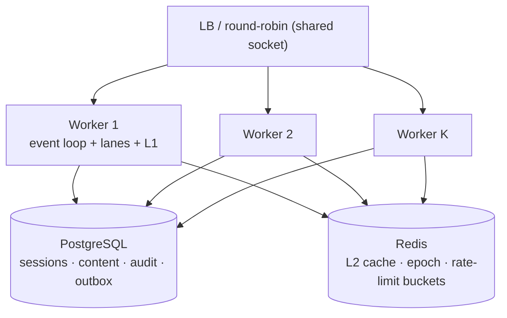

# Multi-Core Cluster Design

Status: **design (2026-09-24)** — measured anchors are from the benchmark lab; the probe ships the empirical scaling curve alongside this doc.

## Why cluster at all

Single-process saturation points measured on the bench host (adapter-node entry, PostgreSQL `bench-db`, 100k docs, 8 concurrent clients, production mode):

| Lane             | Single-process RPS | Raw driver ceiling (`raw-db-ceiling.ts`) | Headroom                 |
| :--------------- | -----------------: | ---------------------------------------: | :----------------------- |
| `findById` (hot) |            ~13 600 |                                   15 400 | reads are at the ceiling |
| `findByIdRandom` |             ~4 500 |                        15 400 (findById) | app-bound, not DB-bound  |
| `listPlain`      |            ~12 000 |                            11 300–13 500 | at the ceiling           |
| create / update  |             ~1 500 |                            3 200 / 2 900 | commit-bound (WAL flush) |

Two consequences:

1. **Reads are framework/transport-bound in the app, not DB-bound** — a second process gets its own event loop, its own lane registries and its own L1, so read RPS multiplies until the shared Postgres driver ceiling (≈ 15k `findById` on the bench host) is reached. On this host the crossover is already at K = 2–4 (5.8k per-process random reads vs a 15.4k shared ceiling), so cluster turns single-node headroom into a knob — more hosts, not more workers, move the ceiling.
2. **Writes are commit-bound** — the `synchronous_commit=off` engine-knob probe (2026-09-23) measured +21.7 % at 8 workers / +93.1 % at 1 worker, i.e. per-process write throughput is dominated by the WAL flush wait, not by CPU. More processes overlap more transactions and PostgreSQL already group-commits them, so aggregate write RPS also scales — but with a smaller slope and a hard shared ceiling (the WAL), which no CMS-side trick can move without a DB tweak. Measured on the cluster curve: create goes 1 361 → 1 750 → 1 995 → 1 966 RPS for K = 1 → 8 (+45 %, then flat).

## The design



**One host: `node:cluster`, K workers, one shared listening socket.** Every worker runs the same built entry (`index.server.mjs`); Node's cluster module binds the socket once in the primary and distributes connections round-robin (SCHED_RR) to the workers. No per-worker ports, no external LB for the single-node case. **Multiple hosts:** N replicas of the same shape behind any HTTP LB (sticky not required — see sessions), sharing PostgreSQL + Redis.

Worker count heuristic: `K = min(cpu cores, DB read ceiling ÷ per-process read RPS)` — on the bench host that is 3–4 for reads; writes add another ~1.5k RPS per worker up to the WAL ceiling. `SVELTY_CLUSTER_WORKERS` (design knob) drives a tiny primary bootstrap; the primary never serves traffic, it only forks, supervises (restart on crash) and handles the rolling restart.

## State partition — what lives where

| State                                                            | Location today                                                                          | Multi-process verdict                                                                                                                                                              |
| :--------------------------------------------------------------- | :-------------------------------------------------------------------------------------- | :--------------------------------------------------------------------------------------------------------------------------------------------------------------------------------- |
| Sessions                                                         | DB (`dbAdapter.auth.*`)                                                                 | ✅ shared — any worker validates any session                                                                                                                                       |
| Turbo-auth session cache                                         | in-process (`handle-turbo-get`)                                                         | ⚠️ per-process — a session is cold on each worker once (measured cost ≈ 3.8 ms, then warm). No stickiness required; the re-warm is one full pipeline pass per session per process. |
| Response cache L1 (point FIFO + list tier)                       | in-process (`response-cache.ts`)                                                        | ⚠️ per-process slice — each worker caches what it served; aggregate hit rate unchanged for a random stream, slightly lower for small hot sets (each worker warms its own copy).    |
| Response cache L2 + epochs + tag index                           | Redis (`cache-service.ts`, edge-sync subscriber)                                        | ✅ already cross-process — `bumpCollectionEpoch` / `clearByTags` propagate through Redis, so a write on worker A invalidates worker B's L1 via the epoch check.                    |
| Rate limiting                                                    | Redis-primary token buckets, in-memory fallback (`handle-rate-limit`)                   | ✅ with Redis the buckets are distributed; without Redis the limits are per-process (documented degradation, not a correctness hole).                                              |
| Auth lockout (5 fails → 15 min)                                  | DB-backed                                                                               | ✅ shared.                                                                                                                                                                         |
| Outbox                                                           | DB table + per-process coalesced buffer (`post-write.ts`)                               | ✅ multi-writer safe — each worker flushes its own batch; the table is the source of truth.                                                                                        |
| Audit chain                                                      | DB (`audit_logs`)                                                                       | ✅ shared; `AUDIT_CHAIN_SYNC` behavior is per-process config, keep it uniform across workers.                                                                                      |
| Lazy sort expression indexes                                     | per-process FIFO registry + `CREATE INDEX IF NOT EXISTS` (`postgresql/adapter-core.ts`) | ✅ idempotent — two workers may both schedule the same index; PostgreSQL dedupes via IF NOT EXISTS.                                                                                |
| Behavioral learner                                               | in-process scored maps + 15-min DB flush (`behavioral-learner.ts`)                      | ⚠️ per-process predictions — acceptable: each worker predicts from its own slice; hot-collection warmers may run once per process.                                                 |
| **Pub/Sub (`entryUpdated`, `contentStructureUpdated`, `yjs:*`)** | **in-process `graphql-yoga` pubsub** (`src/services/background/pub-sub.ts`)             | ❌ **the one real gap** — events do not cross process boundaries.                                                                                                                  |
| SSE connections (collaboration, live preview)                    | attached to the process that holds the yjs doc                                          | ❌ same gap — a client on worker B never sees events raised on worker A.                                                                                                           |
| Widget store / schema LRU / hot flags                            | in-process, DB-backed source                                                            | ⚠️ per-process warm copies; invalidation via L2/epoch where relevant.                                                                                                              |
| `config/private.ts`                                              | build-time                                                                              | ✅ identical in every worker.                                                                                                                                                      |

## Closing the pub/sub gap (the single required component)

The graphql-yoga pubsub instance is deliberately in-process (zero-latency for a single node). For K workers there are two honest options:

1. **Redis-backed pub/sub bridge (recommended).** Wrap the existing pubsub behind an interface whose transport is Redis pub/sub (the repo already owns three Redis consumers: L2 cache, edge-sync subscriber, rate-limit buckets). `entryUpdated`/`yjs:*` publish to a Redis channel; every worker subscribes and replays into its local pubsub. SSE then works on any worker; collaborative editing rooms become multi-process. This is the same pattern the L2 edge-sync subscriber already uses, so it is a second subscriber, not new infrastructure.
2. **Sticky-by-cookie routing for SSE/collab only** (simpler, weaker): a cookie pins `/api/.../sse` and the yjs endpoints to one worker. Sessions stay round-robin. Collaboration stays single-process per room — a dead worker kills its rooms, and cross-worker events still don't exist.

The design takes option 1 as the target and option 2 as the interim deployment note. Nothing else in the cluster is blocked by this gap — plain CRUD, lanes, cache coherence and writes work today.

## Deployment & operations

- **Single node / VPS:** `node:cluster` in-process (`SVELTY_CLUSTER_WORKERS`), the primary supervises workers and restarts crashed ones; `SIGTERM` → `server.close()` drain + in-flight grace, then respawn (rolling restart, zero dropped connections on the shared socket).
- **Kubernetes / multi-node:** prefer one pod per worker (or per worker pair) + HPA over in-pod cluster — health probes, memory limits and rolling updates are per-pod primitives. Redis (L2 + pub/sub + rate limit) and PostgreSQL are the only shared state.
- **Memory budget:** each worker carries its own L1 slices; the per-process governor (`memory-governor`) keeps one worker honest, and the cluster primary sums worker RSS from the soak buckets (`rssMb`) to decide when K must shrink. No hard limits are introduced — K is a deployment knob, not a capability cap.
- **Zero-downtime deploys:** out of scope here (roadmap "Zero-Downtime Deployment Verifier") — the cluster's rolling restart is the prerequisite it builds on.

## Measurement

`scripts/benchmark-matrix/probe-cluster-scaling.ts` boots the built server K ∈ {1,2,4,8} times on one shared socket and prints RPS(K) plus per-worker efficiency (`rps ÷ K ÷ rps(K=1)`, ideal = 1.00). The load runs in a forked child process — never in the primary's event loop — because an in-primary undici loop measured ~12 requests/10 s on Windows (a libuv/cluster interaction), while the forked shape measures 9–10k RPS against the same server.

```bash
bun run build
DB_TYPE=postgresql DB_HOST=127.0.0.1 DB_PORT=5433 DB_USER=bench \
DB_PASSWORD=bench DB_NAME=sveltycms_bench PORT=4317 \
RATE_LIMIT_MAX_REQUESTS=1000000 SECURITY_RATE_LIMIT_SCALE=100 \
ADMIN_PASSWORD=Admin123! NODE_ENV=production BENCHMARK=true \
node scripts/benchmark-matrix/probe-cluster-scaling.ts
```

**Measured curve (2026-09-24, bench host, 16 clients, 10 s/op, production mode, same shared `bench-db` that also hosts the other probes):**

| op             |    K=1 |    K=2 |    K=4 |    K=8 |
| :------------- | -----: | -----: | -----: | -----: |
| findByIdRandom |  5 769 |  8 089 |  8 452 |  9 361 |
| listPlain      | 11 183 | 13 257 | 11 900 | 13 602 |
| create         |  1 361 |  1 750 |  1 995 |  1 966 |

Per-worker efficiency leaves ~1.0 already at K=2 and falls to 0.15–0.20 at K=8: the shared database is the crossover, not the app. `listPlain` hits the measured driver ceiling (~13.5k) at K=2–4; `create` is WAL-bound and gains only +45 % from K=1 → K=4 before flattening. **The sizing formula lands at K = 2–4 on this host** (15.4k ceiling ÷ 5.8k per-process random reads ≈ 2.7) — more workers buy queueing, not throughput, until the database itself is scaled.

Read the curve, not a single row: run-to-run spread on this machine is ±8–30 % per lane, so a step is only real when the efficiency row moves monotonically across K.

### Per-tier memory + tail accounting (2026-09-24)

`tests/benchmarks/probe-cache-tiers.test.ts` drives each tier with targeted load and snapshots `/api/system/health?verbose=true` (process RSS is reachable there) + `/api/dashboard/cache-metrics` between phases — the qualitative "bounded" claim is now quantified:

| Tier                                      | Driven by                          | Measured                                                                                                                                 |
| :---------------------------------------- | :--------------------------------- | :--------------------------------------------------------------------------------------------------------------------------------------- |
| Point-read FIFO (`responseCache.pointL1`) | 2 100 distinct ids × 3 passes      | 2 000/2 100 resident (2-touch admission; FIFO cap), ≈ 6.8 MB @ 1.2 KB/entry ×3 copies; `cacheService` Δ 0 (lane uses `skipCacheService`) |
| List tier (`responseCache.localL1`)       | 1 500 unique list URLs × 2 passes  | 1 500/1 500 resident, ≈ 53.5 MB for the bodies (12.2 KB/entry ×3 copies); all URLs share ONE canonical find key (unparsed cache-buster)  |
| L1 content cache (`cacheService.l1` LRU)  | 400 identical `refresh=true` lists | 0 entries Δ — the canonical key serves every URL (bypass only skips the response cache read)                                             |
| GraphQL response/schema cache             | 200 identical POSTs                | 199/200 HITs                                                                                                                             |
| **Process RSS**                           | full probe (≈ 10 k requests)       | **234.9 → 472.7 MB (+237.8 MB)** — the tiers are the bulk of the delta, consistent with the soak verdict (commitment, not retention)     |

Write-lane tails (Postgres, 8c, `probe-write-split.test.ts`): create srv-dur p50 3.89 / p95 5.41 / p99 7.44 / **p999 18.19 ms** — the p999 is the WAL-flush outlier class; update p50 3.58 / p95 4.75 / p99 5.14 / p999 5.24 ms. App phases stay flat into the tail (security/parse/schema/prep ≤ 0.18 ms p999) — `dbwrite` owns the tail exactly like the median.

## Non-goals (decisions NOT taken)

- **`worker_threads`**: request handling is I/O-bound; threads share a heap (GC coupling) and buy nothing over processes here. Not used.
- **Shared in-process state between workers**: none — every worker owns its slice, coherence goes through DB/Redis, exactly like N separate hosts. This is what makes the K=1 path and the K=8 path identical code.
- **Hard per-tenant or per-collection limits**: none introduced — cluster is a deployment topology, not a capability gate.
