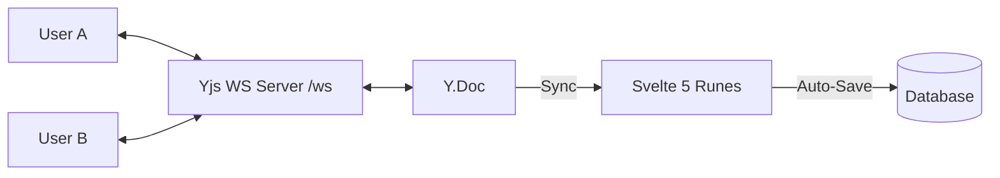

# Collaborative Editing Architecture

SveltyCMS utilizes **Yjs CRDTs** and a **lightweight WebSocket sync server** (`ws` + `y-protocols`) to provide a seamless, conflict-free collaborative editing experience — no Hocuspocus dependency needed.

## 🚀 The Single Source of Truth (SSoT) Model

Unlike traditional CMS editors that rely on periodic auto-saves, SveltyCMS treats the **Y.Doc** as the active source of truth during an editing session.

---

## 📈 Implementation Details

### Phase 2: Full CRDT Concurrent Editing (Active)

1. **Yjs Integration**: Leveraging `yjs` for the core CRDT logic and `y-svelte` for native Rune bindings.
2. **Synchronization**:
   - **Primary**: WebSocket via lightweight `ws` + `y-protocols` server at `/ws` for sub-10ms latency.
   - **Fallback**: Server-Sent Events (SSE) for environments with restrictive proxies.
   - **Plesk/VPS**: Enable with `ENABLE_WEBSOCKET=true` env var and `websocket: true` in adapter config.
3. **Presence & Cursors**:
   - Real-time remote cursor tracking with user-specific colors.
   - "Active Editors" avatar stack in the header.
   - Field-level focus highlights to prevent overlapping edits.
4. **RichText**: Native Yjs integration for the TipTap/ProseMirror based RichText widget.

## 🔬 What Makes SveltyCMS's Implementation So Special?

The key is its architectural choice. Instead of building real-time features on top of a traditional database, SveltyCMS has integrated a **CRDT engine** directly into its core editing experience. This enables granular, conflict-free synchronization typically found only in high-end tools like Google Docs or Figma.

### 1. CRDT Engine: The Gold Standard for Real-Time Sync

Traditional CMSs prevent "lost updates" by locking fields (e.g., Directus) or relying on a central server to resolve conflicts. This can feel clunky and interrupt the creative flow.

SveltyCMS uses **Yjs**, a high-performance Conflict-free Replicated Data Type (CRDT) implementation. CRDTs allow multiple users to edit the same document simultaneously without a central server. Each user's changes are merged mathematically, ensuring consistency without locking or data loss.

The Yjs framework treats the shared document as the **Single Source of Truth (SSoT)** during an editing session, enabling true real-time collaboration.

### 2. Lightweight Yjs Sync Server: Zero External Dependencies

SveltyCMS ships with a built-in Yjs WebSocket sync server (`src/services/collaboration/yjs-sync-server.ts`) that uses only `ws` + `y-protocols` — no Hocuspocus or external sync engine required. The server handles:

- **Document synchronization**: Full Yjs sync protocol (SyncStep1/SyncStep2/Update)
- **Awareness**: Real-time cursor presence and user state
- **Multi-document**: Documents keyed by `tenantId:docId` for tenant isolation
- **Graceful shutdown**: Cleans up all Y.Doc instances on server stop

### 3. Character-Level Sync & Remote Cursors

Because of the CRDT foundation, SveltyCMS provides a seamless, collaborative editing experience within its **RichText widget**. Editors see changes character-by-character as they are typed and can view other users' cursors in real-time. This level of fidelity is a hallmark of the SveltyCMS experience, setting it apart from standard CMS implementations.

---

## 🛠️ Technical Components

| Component              | Responsibility                                                                                 |
| :--------------------- | :--------------------------------------------------------------------------------------------- |
| **yjs-sync-server.ts** | Lightweight WebSocket sync server using ws + y-protocols. Handles document sync and awareness. |
| **Awareness.svelte**   | High-level component managing user presence and cursor rendering.                              |
| **Yjs Binding**        | Custom logic in `fields.svelte` that reconciles `Y.Doc` updates with `collectionValue`.        |

---

## ⚙️ Configuration

Collaborative editing is **built-in** but can be toggled per collection:

- **Enable Collaborative**: Full CRDT-based multi-user editing.
- **Strict Locking**: Classic field-level locking (one editor at a time).
- **Disabled**: Standard save/overwrite behavior.

> [!TIP]
> **Data Integrity**: Yjs ensures that even if a user goes offline, their changes are merged mathematically correctly once they reconnect, preventing the "Lost Update" problem prevalent in REST-only systems.

---

## Related

- [Architecture Overview](./index.mdx)
- [Security Overview](../security/index.mdx)
- [State Management](./state-management.mdx)
