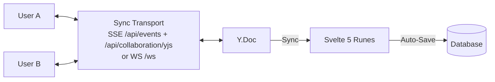

# Collaborative Editing Architecture

SveltyCMS utilizes **Yjs CRDTs** for conflict-free collaborative editing — no Hocuspocus dependency. Two adapter-node-compatible transports exist:

- **SSE (primary for the built-in editor)** — `SseProvider` connects to `/api/events` and syncs via `GET/POST /api/collaboration/yjs`.
- **WebSocket (optional, for y-websocket-compatible clients)** — a lightweight `ws` + `y-protocols` server at `/ws` (`yjs-sync-server`), mounted by the custom production entry `index.cjs`.

## 🚀 The Single Source of Truth (SSoT) Model

Unlike traditional CMS editors that rely on periodic auto-saves, SveltyCMS treats the **Y.Doc** as the active source of truth during an editing session.

```mermaid
flowchart LR
    A[User A] <--> T[Sync Transport<br/>SSE /api/events + /api/collaboration/yjs<br/>or WS /ws]
    B[User B] <--> T
    T <--> YD[Y.Doc]
    YD --"Sync"--> S[Svelte 5 Runes]
    S --"Auto-Save"--> DB[(Database)]
```

---

## 📈 Implementation Details

### Yjs Integration

- **CRDT core**: `yjs`.
- **Client service**: `collaboration-service.svelte.ts` — Svelte 5 `$state`/`$derived` wrapper that owns the `Y.Doc`, awareness, and the transport provider. Wired into the field editor (`fields.svelte`) when a collection sets `collaboration.enabled: true`.
- **Server state**: `yjs-service.ts` holds per-`docId` Yjs documents keyed by tenant; updates flow through `pubSub` (`yjs:update` / `yjs:sync`).

### Transport 1 — SSE (primary for the built-in editor)

1. **Full-state bootstrap**: `GET /api/collaboration/yjs?docId=...` returns the server document as base64.
2. **Updates**: clients POST base64-encoded Yjs updates to `POST /api/collaboration/yjs`; the server applies them via `pubSub` → `yjsService` and echoes changes back through the SSE stream (`/api/events`).
3. **Awareness (presence/cursors)**: throttled (10/s) POSTs to the same endpoint with `awareness: true`; `yjsService` applies the update and broadcasts `yjs:awareness` over SSE — remote editors' cursors/presence update in real time. Clients apply remote state with `origin: "server"`, which the send-path skips (no echo loop).
4. **Transport client**: `SseProvider` (`src/services/collaboration/sse-provider.svelte.ts`) — EventSource + batched POSTs.

### Transport 2 — WebSocket `/ws` (optional)

- **Server**: `src/services/collaboration/yjs-sync-server.ts` — `ws` + `y-protocols` sync + awareness, multi-document `tenantId:docId` isolation, graceful shutdown.
- **Mounting**: only via the custom production entry **`index.cjs`** (Plesk/Passenger), which attaches the upgrade handler to its own `http.createServer`. The default `@sveltejs/adapter-node` entry (`node build/index.js`) does **not** mount `/ws` — use `index.cjs` for WebSocket deployments.
- **Clients**: y-websocket-compatible clients connect to `ws://[domain]/ws?docId=...&tenantId=...`. The built-in editor does **not** use this path (it uses SSE).

> **Auth (2026-08-10):** `/ws` upgrades are **session-validated and fail-closed** — the app registers an authenticator (`ws-auth-registry` → `hooks.ws upgrade()`) that reuses the HTTP session pipeline (LRU → store → Redis → DB, negative cache). Unauthenticated upgrades receive `HTTP 401`. The tenant used for `tenantId:docId` document keys comes from the **resolved session** — a client-supplied `tenantId` query param can never override it. Test mode accepts the standard `x-test-secret` bypass. If the server runs without the app (no authenticator registered), all upgrades are rejected.

### Presence & Cursors

- Real-time remote cursor tracking with user-specific colors via the Yjs **awareness** protocol.
- "Active Editors" presence rendered inline in `fields.svelte`.
- Field-level focus highlights to prevent overlapping edits (`setFieldFocus`).

### RichText

TipTap/ProseMirror RichText integration rides the same Y.Doc via `y-prosemirror` / TipTap collaboration extensions (client-side packages; sync transport as above).

---

## 🛠️ Technical Components

| Component                 | Responsibility                                                                                         |
| :------------------------ | :----------------------------------------------------------------------------------------------------- |
| **collaboration-service** | Client `$state` service — Y.Doc lifecycle, awareness, provider wiring (used by `fields.svelte`)        |
| **SseProvider**           | SSE transport: EventSource subscription + batched `POST /api/collaboration/yjs` updates                |
| **yjs-service**           | Server-side per-`docId` Y.Doc store, applied from `pubSub` updates; `GET /api/collaboration/yjs` state |
| **yjs-sync-server.ts**    | Optional `ws` + `y-protocols` WebSocket server at `/ws` (mounted by `index.cjs`)                       |
| **Yjs Binding**           | `fields.svelte` reconciliation of Y.Doc updates with `collectionValue`                                 |

---

## ⚙️ Configuration

Collaborative editing is **built-in** but can be toggled per collection:

- **Enable Collaborative**: Full CRDT-based multi-user editing (SSE transport).
- **Strict Locking**: Classic field-level locking (one editor at a time).
- **Disabled**: Standard save/overwrite behavior.

> [!TIP]
> **Data Integrity**: Yjs ensures that even if a user goes offline, their changes are merged mathematically correctly once they reconnect, preventing the "Lost Update" problem prevalent in REST-only systems.

---

## 🚀 Performance & Scalability

Collaboration runs on standard Node.js WebSockets (`ws`) or plain HTTP SSE — no native addons, so resource profiles are predictable:

- **Idle connections (memory-bound)**: ~15–30 KB RAM per socket (estimate) → ~15,000 idle clients per 512 MB container.
- **Active editors (CPU-bound)**: a typing editor generates roughly 1–2 sync updates per second; throughput is bounded by the sync server's update rate.
- **Active low-frequency clients**: supports tens of thousands of concurrent clients at low update rates.

> [!NOTE]
> Latency/throughput figures for collaboration are **not yet part of the recorded benchmark suite** (`tests/benchmarks/`) and are not claimed here. The HTTP hooks pipeline is measured separately — see the [Performance Benchmarks](../../../tests/benchmarks/hooks-performance.test.ts) and [Technical Evaluation](../../project/technical-evaluation-2026.mdx).

---

## Related

- [Architecture Overview](./index.mdx)
- [Security Overview](../security/index.mdx)
- [Real-Time Updates (SSE + Yjs)](../api/graphql-subscriptions.mdx)
- [State Management](./state-management.mdx)
