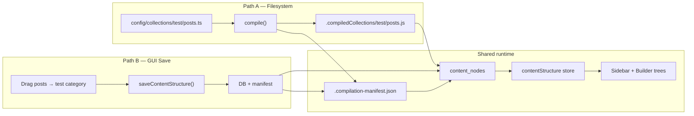

# Collection Builder Architecture

This document details the technical architecture of the SveltyCMS Collection Builder. It explains how the system maintains a "Single Source of Truth" by reconciling filesystem definitions with database state and presenting a consistent view to the user.

## System Overview

The Collection Builder operates on a **Canonical Flat List** architecture. Instead of storing complex nested trees, both the server and the UI operate on flat arrays of nodes that are linked via `parentId`.

### Core Data Flow

The following diagram illustrates the reconciliation flow:

## Key Components

### 1. Filesystem (The Configuration Truth)

The `config/collections` directory is the primary source of truth for **Collections** (existence and structure).

- If a collection file exists on disk, it MUST exist in the system.
- If a file is deleted from disk, the corresponding collection is marked for deletion (or becomes a "ghost" if not cleaned up).

> [!NOTE]
> **Categories** come from two sources:
>
> 1. **Path-derived** (`source: "filesystem"`) — auto-created when collections live in subfolders, e.g. `config/collections/test/posts.ts` → category `test`.
> 2. **Builder-created** (`source: "builder"`) — virtual folders created in the GUI. Persisted in `content_nodes` and backed up in `.compilation-manifest.json` under `structureNodes`.
>
> GUI drag-and-drop updates **organization** (parentId, order) in DB + manifest. It does **not** move `.ts` files on disk unless you save a new collection path or move files manually.

### 2. ContentSystem (The Reconciliation Engine)

Located at `src/content/index.ts`, this singleton is responsible for bridging the gap between static files and dynamic database state.

**Key responsibilities:**

- **Startup Sync**: On boot, it scans `compiledCollections` and compares them against the `system_content_structure` table/collection in the active database adapter.
- **Defensive Import**: It actively filters out "garbage" nodes from the database (e.g., nodes where `path` is a UUID instead of a valid file path) to prevent database corruption from looping back into the application state.
- **ID Persistence**: While collection _definitions_ come from disk, `_id`, `parentId`, and `order` are preserved from the database and manifest (`collectionOrder`, `structureNodes`).
- **Save without destructive refresh**: `executeGuiStructureSave()` (via `saveContentStructure` remote or legacy `?/saveConfig` action) upserts `move` / `rename` / `create` / `delete` operations, syncs `contentStore`, writes the manifest, and broadcasts SSE — it does **not** call `fullReload()`.
- **Boot manifest watchdog**: On `syncContentState({ reason: "boot" })`, `reconcileOrganizationalManifest()` compares `.compilation-manifest.json` (`collectionOrder`, `structureNodes`) against the DB flat structure and re-aligns the manifest when drift is detected (e.g. after manual DB edits).
- **Cross-tab sync**: Server-side saves call `notifyContentUpdate()`; the browser `contentSystem.refresh()` handler syncs both `contentStore` and `collectionStore.contentStructure` so the sidebar updates without navigation.

### 3. Organizational vs Filesystem Boundaries

| Operation                     | DB + manifest                              | Filesystem (`config/collections/`) |
| :---------------------------- | :----------------------------------------- | :--------------------------------- |
| Drag collection into category | `parentId`, `order` updated                | **Unchanged** — org-only           |
| Create virtual category       | New `content_nodes` row + `structureNodes` | No folder created                  |
| Delete builder category       | Removed from DB + manifest                 | N/A                                |
| Save new collection schema    | Reconcile creates/updates DB node          | `.ts` file written by editor       |

> [!NOTE]
> GUI drag-and-drop is **organizational only**. To change where a collection lives on disk, edit or move the `.ts` file under `config/collections/` (or use the collection editor save path). The compile pipeline and boot drift detection (`detectCompilationDrift`) handle filesystem ↔ compiled output separately from organizational manifest drift (`detectOrganizationalDrift`).

### 4. Integrity & Safety Layer

Located in `src/utils/schema/` and `src/services/MigrationEngine.ts`, this layer guards against data corruption:

- **Tree Validator**: Prevents cyclic dependencies (A->B->A) and path collisions during reordering.
- **Drift Detection**: Compares the _Code Definition_ (Target) vs _Database Schema_ (Current) to detect potentially destructive changes (e.g., removing a field, changing a widget type).
- **Migration Engine**: Orchestrates necessary DB updates **agnostically** via the `IDBAdapter` interface, ensuring compatibility across different database backends.

### 5. Database (State & Metadata)

The active database adapter stores the _metadata_ that cannot live in static files, specifically:

- **`_id`**: The stable UUID for the collection.
- **`parentId`**: Which category or folder the collection currently resides in.
- **`order`**: The sort order within that parent.

### 6. Client UI (The View)

The Collection Builder board (`tree-view-board.svelte`) and admin sidebar (`collections.svelte` → `tree-view.svelte`) both consume the same `contentStructure` store. The sidebar additionally applies `page.data.collectionOrder` from the manifest for user-defined sort overrides.

- **Input**: A flat array of `ContentNode` objects from the API.
- **Process**: A lightweight `buildTree` function groups nodes by `parentId`.
- **Render**: The UI renders the hierarchical tree based on this computed logical structure.
- **Interaction**: Drag-and-drop operations do **not** mutate the tree structure directly. Instead, they emit updates to the flat list (e.g., `updateNode(id, { parentId: newParent })`), which triggers a server save and a reactive re-render.

## ⌨️ Keyboard-Driven UX

The Collection Builder is designed for rapid iteration using a unified hotkey system.

### Standard Controls

- `Mod + S`: Save the entire collection and trigger database reconciliation.
- `Escape`: Cancel current operation or exit the builder shell.

### BuzzForm (Visual Canvas)

- `Delete`: Instantly remove the selected field from the canvas.
- `Mod + D`: Duplicate the selected field, automatically generating a unique `db_fieldName`.

### Widget Editor (Multi-Step)

- `Mod + Enter`: Advance to the next configuration step or "Finish" the widget.
- `Escape`: Navigate back to the previous step.

## Failure Scenarios & Recovery

| Scenario                      | Handling                                                                                                                       |
| :---------------------------- | :----------------------------------------------------------------------------------------------------------------------------- |
| **Invalid Component Loaders** | The `createWidget` factory and TypeScript/Vite validate loaders at compile-time. Broken imports fail during build/development. |
| **Orphaned Database Nodes**   | The `ContentSystem` validation logic detects nodes with invalid structure and prevents them from loading into memory.          |
| **Disk/DB Mismatch**          | The Filesystem is treated as the "Definition of Done". If a collection is in DB but not Disk, it is flagged for removal.       |
| **Circular Dependencies**     | The `buildTree` logic includes cycle detection to prevent infinite recursion loop crashing the UI.                             |

## Related Architecture

- [Collection Store Data Flow](./collection-store-dataflow.mdx) - Explains how the _content_ within these collections is loaded, cached, and managed via SSR.
