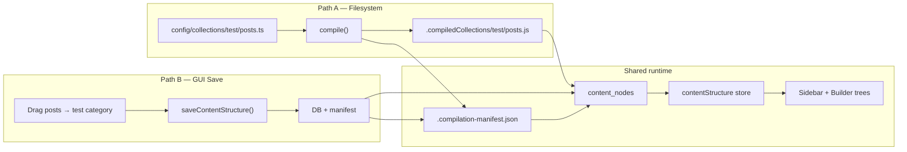

# Collection Builder Architecture

This document details the technical architecture of the SveltyCMS Collection Builder. It explains how the system maintains a "Single Source of Truth" by reconciling filesystem definitions with database state and presenting a consistent view to the user.

## System Overview

The Collection Builder operates on a **Canonical Flat List** architecture. Instead of storing complex nested trees, both the server and the UI operate on flat arrays of nodes that are linked via `parentId`.

### Core Data Flow

The following diagram illustrates the reconciliation flow:

```mermaid
flowchart LR
    subgraph CodePath["Path A — Filesystem"]
        F1["config/collections/test/posts.ts"]
        F2["compile()"]
        F3[".compiledCollections/test/posts.js"]
        F1 --> F2 --> F3
    end

    subgraph GuiPath["Path B — GUI Save"]
        G1["Drag posts → test category"]
        G2["saveContentStructure()"]
        G3["DB + manifest"]
        G1 --> G2 --> G3
    end

    subgraph Shared["Shared runtime"]
        R1["content_nodes"]
        M1[".compilation-manifest.json"]
        S1["contentStructure store"]
        U1["Sidebar + Builder trees"]
    end

    F3 --> R1
    G3 --> R1
    G3 --> M1
    F2 --> M1
    M1 --> R1
    R1 --> S1 --> U1
```

## Key Components

### 1. Filesystem (The Configuration Truth)

The `config/collections` directory is the primary source of truth for **Collections** (existence and structure).

- If a collection file exists on disk, it MUST exist in the system.
- If a file is deleted from disk, the corresponding collection is marked for deletion (or becomes a "ghost" if not cleaned up).

> [!NOTE]
> **Categories** come from two sources:
>
> 1. **Path-derived** (`source: "filesystem"`) — auto-created when collections live in subfolders, e.g. `config/collections/test/posts.ts` → category `test`.
> 2. **Builder-created** (`source: "builder"`) — virtual folders created in the GUI. Persisted in `content_nodes` and backed up in `.compilation-manifest.json` under `structureNodes`.
>
> GUI drag-and-drop updates **organization** (parentId, order) in DB + manifest. It does **not** move `.ts` files on disk unless you save a new collection path or move files manually.

### 2. ContentSystem (The Reconciliation Engine)

Located at `src/content/index.ts`, this singleton is responsible for bridging the gap between static files and dynamic database state.

**Key responsibilities:**

- **Startup Sync**: On boot, it scans `compiledCollections` and compares them against the `system_content_structure` table/collection in the active database adapter.
- **Defensive Import**: It actively filters out "garbage" nodes from the database (e.g., nodes where `path` is a UUID instead of a valid file path) to prevent database corruption from looping back into the application state.
- **ID Persistence**: While collection _definitions_ come from disk, `_id`, `parentId`, and `order` are preserved from the database and manifest (`collectionOrder`, `structureNodes`).
- **Save without destructive refresh**: `executeGuiStructureSave()` (via `saveContentStructure` remote or legacy `?/saveConfig` action) upserts `move` / `rename` / `create` / `delete` operations through `syncContentState({ reason: "gui-save" })`, syncs `contentStore`, writes the manifest, and broadcasts SSE — it does **not** call `fullReload()`.
- **Schema save**: Editor `saveCollection` writes `.ts` then `syncContentState({ reason: "collection-save", targetFile })` — compile + incremental refresh + model provision under a **GUI compile lock** so the Vite watcher does not double-compile.
- **Soft UI refresh**: Presets, quick-start, and structure saves use `invalidate("app:content")` only — **no** `window.location.reload()` (session, consent, and builder context stay intact).
- **Boot manifest watchdog**: On `syncContentState({ reason: "boot" })`, `reconcileOrganizationalManifest()` compares `.compilation-manifest.json` (`collectionOrder`, `structureNodes`) against the DB flat structure and re-aligns the manifest when drift is detected (e.g. after manual DB edits).
- **Cross-tab sync**: Server-side saves call `notifyContentUpdate()`; the browser `contentSystem.refresh()` handler syncs both `contentStore` and `collectionStore.contentStructure` so the sidebar updates without navigation.

### 3. Organizational vs Filesystem Boundaries

| Operation                     | DB + manifest                              | Filesystem (`config/collections/`)    |
| :---------------------------- | :----------------------------------------- | :------------------------------------ |
| Drag collection into category | `parentId`, `order` updated                | **Unchanged** — org-only              |
| Create virtual category       | New `content_nodes` row + `structureNodes` | No folder created                     |
| Delete builder category       | Removed from DB + manifest                 | N/A                                   |
| Save new collection schema    | `collection-save` reconcile + models       | `.ts` written; compile under GUI lock |

> [!NOTE]
> GUI drag-and-drop is **organizational only**. To change where a collection lives on disk, edit or move the `.ts` file under `config/collections/` (or use the collection editor save path). The compile pipeline and boot drift detection (`detectCompilationDrift`) handle filesystem ↔ compiled output separately from organizational manifest drift (`detectOrganizationalDrift`).

### 4. Integrity & Safety Layer

Located in `src/utils/schema/` and `src/services/MigrationEngine.ts`, this layer guards against data corruption:

- **Tree Validator**: Prevents cyclic dependencies (A->B->A) and path collisions during reordering.
- **Drift Detection**: Compares the _Code Definition_ (Target) vs _Database Schema_ (Current) to detect potentially destructive changes (e.g., removing a field, changing a widget type).
- **Migration Engine**: Orchestrates necessary DB updates **agnostically** via the `IDBAdapter` interface, ensuring compatibility across different database backends.

### 5. Database (State & Metadata)

The active database adapter stores the _metadata_ that cannot live in static files, specifically:

- **`_id`**: The stable UUID for the collection.
- **`parentId`**: Which category or folder the collection currently resides in.
- **`order`**: The sort order within that parent.

### 6. Client UI (The View)

The Collection Builder board (`tree-view-board.svelte`) and admin sidebar (`collections.svelte` → `tree-view.svelte`) both consume the same `contentStructure` store. The sidebar additionally applies `page.data.collectionOrder` from the manifest for user-defined sort overrides.

- **Input**: A flat array of `ContentNode` objects from the API.
- **Process**: A lightweight `buildTree` function groups nodes by `parentId`.
- **Render**: The UI renders the hierarchical tree based on this computed logical structure using accessible card nodes (`tree-view-node.svelte`), token-based badges, category item counters, and a portal-based floating drag preview (`tree-drag-preview.svelte`).
- **Interaction**: Drag-and-drop operations support nesting collections inside categories with real-time drop target feedback (`↳ Inside {category}`), RTL-safe coordinate mapping, and full keyboard navigation (roving tabindex and `Alt+Up/Down` reordering). Operations emit updates to the flat list (e.g., `updateNode(id, { parentId: newParent })`), persisting via `saveContentStructure()`.

### 7. Advanced Builder Subsystems (Enterprise Extensions)

#### Smart Type Inference (`smart-inference.ts`)

A zero-dependency client-side heuristic engine that parses natural language field names into fully-typed SveltyCMS widgets.

- **Pattern Matching**: Evaluates exact keywords and token prefixes/suffixes (e.g. `is_*`, `has_*`, `*_id`, `*_price`, `*_url`).
- **Deterministic Field Naming**: Converts arbitrary inputs to sanitized snake_case `db_fieldName` identifiers.
- **Fallback Resolution**: Queries available core/custom widgets in `widgetStore` to guarantee valid schema bindings.

#### Real-Time TypeScript Code Generator (`collection-code-generator.ts`)

Generates production-grade `defineCollection({ ... })` TypeScript source code in real time on the client.

- **Bi-Directional Parity**: Produces an identical AST to the server-side compilation pipeline (`compilation/compile.ts`).
- **Live Split-View**: Embedded in `collection-widget.svelte`, updating reactively as users reorder or edit fields.
- **Zero Disk Overhead**: Operates entirely in-memory using Svelte 5 derived state runes.

#### Database DDL & Schema Ingestion Engine (`ddl-schema-parser.ts`)

Reverse-engineers existing database schemas and API payloads directly into collections.

- **Multi-Dialect DDL Parsing**: Supports PostgreSQL, MySQL, MariaDB, and SQLite `CREATE TABLE` syntaxes.
- **Relational Introspection**: Resolves `FOREIGN KEY ... REFERENCES table(id)` into target collection references.
- **Enum & Check Constraints**: Translates `ENUM(...)` and `CHECK` values into populated `Select` dropdown options.
- **JSON Payload Reverse-Engineering**: Synthesizes schema definitions and widget bindings from sample JSON objects/arrays.

#### Unified Metadata & Tagging Store (`collection-metadata-store.svelte.ts`)

A cross-cutting reactive store that maintains favorites and tag metadata across all administrative views.

- **Reactive State Sync**: Powered by Svelte 5 `$state` runes, immediately broadcasting favorite toggles and tag changes between the Collection Builder tree, the Collection Editor form, and the LeftSidebar navigation tree.
- **Cross-Tab Storage Sync**: Listens to the `storage` event to propagate changes across concurrent browser tabs.
- **Deterministic Color Hashing**: Maps tag names to WCAG 2.2 AA compliant status-shade tokens (`tertiary`, `primary`, `secondary`, `warning`, `success`) without requiring manual color picker configuration.

## ⌨️ Keyboard-Driven UX

The Collection Builder is designed for rapid iteration using a unified hotkey system.

### Standard Controls

- `Mod + S`: Save the entire collection and trigger database reconciliation.
- `Escape`: Cancel current operation or exit the builder shell.

### BuzzForm (Visual Canvas)

- `Delete`: Instantly remove the selected field from the canvas.
- `Mod + D`: Duplicate the selected field, automatically generating a unique `db_fieldName`.

### Widget Editor (Multi-Step)

- `Mod + Enter`: Advance to the next configuration step or "Finish" the widget.
- `Escape`: Navigate back to the previous step.

## Failure Scenarios & Recovery

| Scenario                      | Handling                                                                                                                       |
| :---------------------------- | :----------------------------------------------------------------------------------------------------------------------------- |
| **Invalid Component Loaders** | The `createWidget` factory and TypeScript/Vite validate loaders at compile-time. Broken imports fail during build/development. |
| **Orphaned Database Nodes**   | The `ContentSystem` validation logic detects nodes with invalid structure and prevents them from loading into memory.          |
| **Disk/DB Mismatch**          | The Filesystem is treated as the "Definition of Done". If a collection is in DB but not Disk, it is flagged for removal.       |
| **Circular Dependencies**     | The `buildTree` logic includes cycle detection to prevent infinite recursion loop crashing the UI.                             |

## Related Architecture

- [Configuration Promotion API](../api/configuration-promotion.mdx) — Schema as Code, drift detection, and multi-environment promotion
- [Compilation Pipeline](./compilation-pipeline.mdx) — ContentSync, atomic compile, HMR payload
- [Content System Architecture](./content-system.mdx) — coordinator, stores, SSE
- [Collection Store Data Flow](./collection-store-dataflow.mdx) — active collection SSR flow

### Tests

| Layer       | Path                                                                  |
| :---------- | :-------------------------------------------------------------------- |
| Unit        | `tests/unit/collectionbuilder/*`, `tests/unit/content/sync-content-*` |
| Integration | `tests/integration/collectionbuilder/*`                               |
| E2E         | `tests/e2e/routes/collection-builder/builder.spec.ts`                 |
