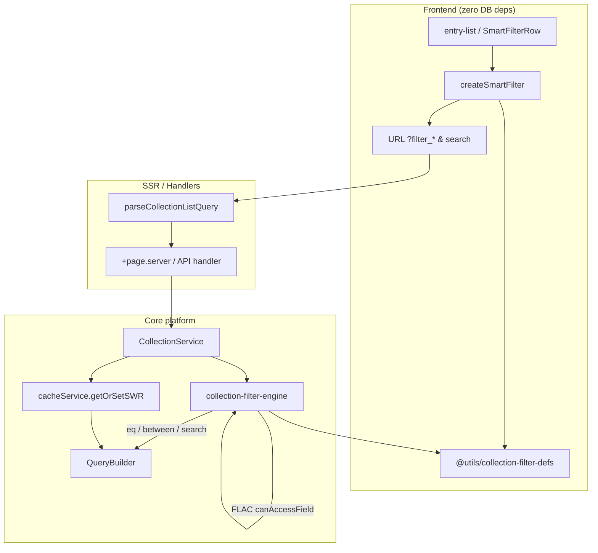

# Collection Filtering Platform

SveltyCMS treats **list filtering as a core platform capability**, not a one-off UI feature.
It is CMS-native, secure, cache-aware, and schema-driven — reusable beyond `entry-list`.

## Why this is a platform capability

| Advantage                          | How                                                                                                      |
| ---------------------------------- | -------------------------------------------------------------------------------------------------------- |
| **Schema + widgets**               | Control types derived from field widgets (`Input`, `Select`, `Date`, `Number`, `Checkbox`, …)            |
| **RBAC / field-level permissions** | `canAccessField` (FLAC) drops fields the user cannot read before compile                                 |
| **Cacheable + invalidatable**      | Stable `queryHash` → L1/L2 SWR keys under `collection:{id}:query:{hash}:…`                               |
| **Zero frontend deps**             | Pure defs in `@utils/collection-filter-defs` (no DB/cache/auth imports)                                  |
| **Security at query builder**      | Compile to portable `where` / `whereBetween` / `search` — never raw `{ contains }` objects into SQL `eq` |

---

## Architecture



### Module map

| Module                                   | Runtime          | Responsibility                                               |
| ---------------------------------------- | ---------------- | ------------------------------------------------------------ |
| `@utils/collection-filter-defs`          | Browser + server | Widget → control type, unsafe widgets, number-range encode   |
| `@utils/collection-query-filters`        | Browser + server | URL parse, schema id whitelist, stable hash, cache key shape |
| `services/core/collection-filter-engine` | Server           | FLAC resolve, secure compile, apply to QueryBuilder          |
| `services/core/collection-service`       | Server           | SWR cache + load path using the engine                       |
| `create-smart-filter.svelte.ts`          | Browser          | Reactive URL/filter state for admin tables                   |

---

## Security pipeline

```
Client filter keys
  → URL parse (filter_*)
  → Schema field id whitelist (parseCollectionListQuery)
  → resolveFilterableFields (schema ∩ safe widgets ∩ FLAC read)
  → compileSecureFilters (type validation, reject unknown)
  → applyFiltersToQueryBuilder (portable IR only)
  → tenantId injected in baseWhere (never from client)
```

| Layer                | What is enforced                                                                             |
| -------------------- | -------------------------------------------------------------------------------------------- |
| **Schema whitelist** | Unknown field names dropped                                                                  |
| **Unsafe widgets**   | Media, rich text, relations, groups, … never filterable                                      |
| **FLAC**             | `permissions.readRoles` / hidden fields — non-readers cannot filter (or search) those fields |
| **Value validation** | Booleans, numbers, dates validated; garbage rejected                                         |
| **Query builder**    | Only `where` / `whereBetween` / `search` — no Mongo-only objects on SQL adapters             |
| **Tenant**           | `tenantId` always from session, merged in `baseWhere`                                        |

> [!CAUTION]
> UI `safeForFiltering` / `allowedFieldIds` are **UX guards only**. Authoritative enforcement is always server-side in `compileSecureFilters`.

---

## Portable IR (QueryBuilder)

| Control / op                 | Compile result          | QueryBuilder method                                               |
| ---------------------------- | ----------------------- | ----------------------------------------------------------------- |
| `select` / `status`          | equality                | `where({ field: value })`                                         |
| `boolean`                    | equality `true`/`false` | `where`                                                           |
| `date` full day `YYYY-MM-DD` | **day bounds**          | `whereBetween` (00:00–23:59 UTC)                                  |
| `in` / comma list            | multi-value             | `whereIn`                                                         |
| `isNull` / `__null__`        | null check              | `whereNull` / `whereNotNull`                                      |
| `numberRange` `min:max`      | range                   | `whereBetween` (open bounds use sentinels until QB gains gte/lte) |
| `text` (single)              | partial                 | `search(value, [field])`                                          |
| Global `?search=`            | FTS                     | `search(q, searchableFields)`                                     |

**Facets:** `CollectionService.getStatusFacets` / `countStatusFacets` → entry-list `SmartTableStatusFacets` chips

**Metrics:** `recordListQuery` on list loads; SSR snapshot as `listMetrics` → `SmartTableMetricsBadge` when `?debug=table`

This replaces the previous anti-pattern of passing `{ field: { contains: "x" } }` into `where()`, which SQL adapters treated as `eq(column, object)` and never matched.

---

## Caching (L1 + optional Redis)

| Item                | Value                                                                                  |
| ------------------- | -------------------------------------------------------------------------------------- |
| **Key**             | `collection:{id}:query:{hash}:page:{n}:size:{s}:lang:{l}:tenant:{t}:user:{u}:edit:{e}` |
| **Hash input**      | Accepted (compiled) equality + ranges + textSearch + search + sort                     |
| **Strategy**        | `getOrSetSWR` — 60s fresh / 300s stale                                                 |
| **Category / tags** | `COLLECTION` · `collection` · `collection:{id}`                                        |
| **Invalidation**    | `cacheService.invalidateCollection(id)` → prefix clear                                 |
| **Negative Bloom**  | **Not** used for empty list pages (valid editorial state)                              |

User id is part of the key so FLAC-different roles never share a poisoned cache entry.

---

## Reuse beyond entry-list

| Surface                              | How to integrate                                                       |
| ------------------------------------ | ---------------------------------------------------------------------- |
| **entry-list**                       | `createSmartFilter` + URL → SSR → CollectionService (current)          |
| **REST `GET /api/collections/{id}`** | Parse query → `compileSecureFilters` → LocalCMS / QueryBuilder         |
| **GraphQL list args**                | Map args → `CollectionFilterMap` → same engine                         |
| **LocalCMS / SDK**                   | `compileAndApplyFilters(qb, raw, schema, user)`                        |
| **Data ops post-import**             | Always `invalidateCollection(id)` so filtered pages refresh            |
| **Dashboard widgets**                | Same defs for “filter by status” chips without duplicating widget maps |

```typescript
import {
  compileSecureFilters,
  applyFiltersToQueryBuilder,
} from "@src/services/core/collection-filter-engine";

const compiled = compileSecureFilters(rawFilters, schema, user);
let qb = dbAdapter.queryBuilder(`collection_${schema._id}`);
qb = applyFiltersToQueryBuilder(qb, compiled, {
  baseWhere: { tenantId },
  globalSearch: search,
  collection: schema,
  user,
}).qb;
```

---

## Related documentation

- [entry-list](../components/entry-list.mdx) — admin table UI
- [Cache System](./cache-system.mdx) — L1/L2, SWR, prefix invalidation
- [Content API](../api/content.mdx) — URL query params vs global search
- [Data Operations](./data-operations.mdx) — invalidate after import/sync
- Field access: `src/utils/field-access.ts` (`canAccessField`)

---

**Last Updated**: 2026-07-15
