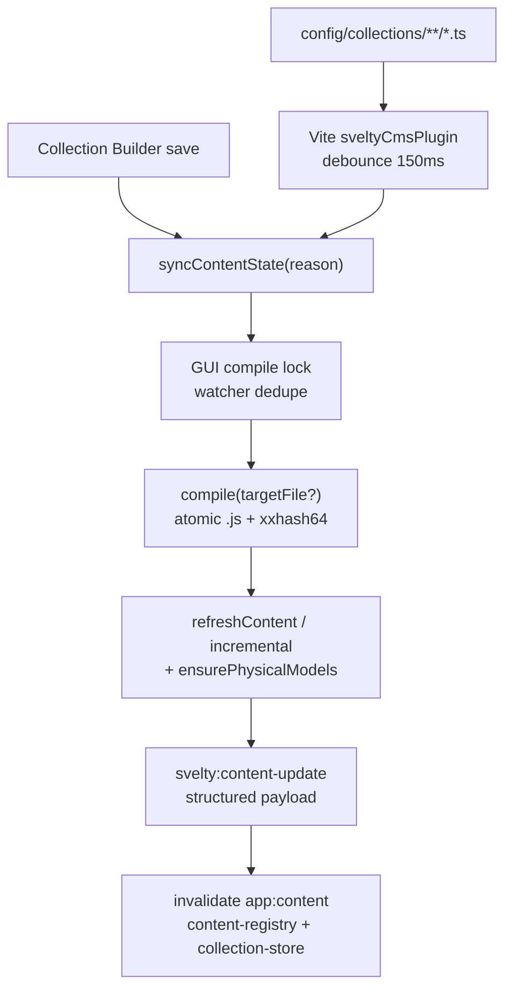

# Compilation Pipeline

The SveltyCMS compilation system transforms TypeScript collection configurations into runtime-optimized JavaScript. It ensures data integrity, maintains stable field UUIDs and collection `_id`s across edits, and feeds a **single content-sync coordinator** so IDE edits and Collection Builder saves stay fully dynamic without session-breaking reloads.

## Architecture

The system is modularized into three core components located in `src/utils/compilation/`, plus the content-sync coordinator:

1.  **`compile.ts`** (The Orchestrator)
    - Manages the build lifecycle: scanning, detection, compilation, and cleanup.
    - Implements concurrency control for performance.
    - **Atomic `.js` writes** (`atomicWriteFile`) + manifest atomic JSON.
    - Returns `changedJsPaths`, `changedSourceFiles`, and `noOp` for surgical HMR.
2.  **`transformers.ts`** (The AST Surgeon)
    - Single-pass composite AST transforms.
    - Deterministic widget UUIDs, schema `_id`/`tenantId` injection, import rewrites.
3.  **`types.ts`** (The Contract)
    - `CompileOptions`, `ManifestEntry`, `CompilationResult` (including HMR fields).
4.  **`src/content/sync-content-state.server.ts`** (ContentSync coordinator)
    - Reasons: `boot` | `compile` | `gui-save` | `watcher` | `sidebar-reorder` | `collection-save`.
    - GUI ↔ watcher **compile lock** (dedupe double compile after builder save).
    - Hash-backed drift detection, metrics, structured HMR payload fields.

## Key Features

### 1. Single-Pass Composite Transformer

Instead of running 5 separate AST traversals (one per transformer), the compiler now uses a **single-pass composite transformer** (`createCompositeTransformer`):

- **Before**: `widgetTransformer` → `aliasResolverTransformer` → `schemaTransformer` → `commonjsToEsModuleTransformer` → `addJsExtensionTransformer` (5 traversals)
- **After**: `createCompositeTransformer` (1 traversal, ~5x faster)

All transformation logic (alias resolution, widget proxy removal, .js extension injection, \_\_filename→ESM conversion, schema \_id/tenantId injection, widget UUID injection) is inlined into one visitor switch with shared state.

### 2. Persistent UUID Synchronization

The compiler ensures that your content schemas maintain stable IDs, even when you rename files or change content.

- **Mechanism**: Before compiling, the system scans the `compiledCollections` directory.
- **Logic**:
  1.  If a target file exists, its UUID is extracted and reused.
  2.  If the file is new but shares a content hash with a deleted file (detecting a move/rename), the old UUID is preserved.
  3.  Only if no history is found is a new Version 4 UUID generated.

### 2. AST-Based Validation

Instead of regex-based replacement, we use the TypeScript Compiler API to perform safe code transformations.

- **Schema Injection**: Safely injects the `_id` property into your `export const schema` object.
- **Widget Transformation**: Automatically wraps widget function calls (e.g., `widgets.Text(...)`) with necessary metadata like unique instance IDs.
- **Import Rewriting**: Converts developer-friendly imports (e.g., `@widgets`) into absolute or relative paths suitable for the runtime environment.

### 3. Concurrency & Performance

- **O(1) Dequeue**: Uses an index cursor instead of `Array.shift()` for O(1) job dispatching.
- **Parallel Processing**: Adaptive concurrency set to 75% of CPU cores (minimum 4) using a shared index cursor across workers.
- **Intelligent Caching**: Skips recompilation if the source file's content hash matches the existing compiled file with the same tenant context.
- **Early Exit**: Returns immediately when no source files are found (with orphan cleanup still performed).

### 4. Smart Path Resolution (Tenant-Aware)

When compiling with a `tenantId`, the compiler first checks the tenant-scoped path (`config/{tenantId}/collections/`). If no `.ts` files exist there, it falls back to the flat `config/collections/` directory. This enables:

- **Fresh multi-tenant installs**: Writes directly to `config/{tenantId}/collections/`
- **Non-migrated single-tenant sites**: Falls back gracefully
- **Migration safety**: No broken compilations during the transition

### 5. Automatic Orphan & Empty Directory Cleanup

After full builds, the compiler:

1. **Removes orphaned files** — compiled outputs whose source has been deleted
2. **Removes empty directories** — stale mirrored directories from renamed/deleted source folders (e.g., renaming `subfolder/` → `subfolder1/`)

The manifest keys use absolute paths with compiled-dir prefix stripping so orphan cleanup never deletes freshly compiled output.

## Integration (2026 unified path)

All live updates go through **`syncContentState`** — never a one-off `compile()` + sequential `createModel` loop in Vite.



### Vite Plugin (`vite.config.ts`)

In development, `sveltyCmsPlugin()` batches collection file events and calls:

```typescript
// vite.config.ts — handleHmr (collections branch)
await syncContentState({
  reason: "watcher",
  changedFile: absolutePath,
  targetFile: relativeSource, // single-file incremental
  fullBuild: deleteOrMultiFile, // unlink / multi-file → full + orphan cleanup
});

// noOp → skip generateContentTypes + skip client work
// else → structured WS:
// { reason, contentVersion, changedIds, processed, durationMs, noOp }
```

| Event                       | Compile mode                    | Notes                                    |
| :-------------------------- | :------------------------------ | :--------------------------------------- |
| Single `.ts` / `.js` change | `targetFile` incremental        | Hash skip when unchanged                 |
| Multi-file batch            | Full build                      | Debounced set of paths                   |
| `unlink` / `unlinkDir`      | Full build                      | Orphan cleanup                           |
| GUI save in flight          | **Skipped** (`skippedByDedupe`) | `beginGuiCompileSession` lock + cooldown |
| Compile `noOp`              | No types gen / soft HMR         | Client ignores when `noOp: true`         |

`.compiledCollections/**` is on Vite’s `watch.ignored` list so compiler writes do not re-enter the watcher.

### Collection Builder (`+page.server.ts`)

Schema save and delete use **`reason: "collection-save"`** (acquires GUI lock so Vite does not double-compile):

```typescript
await syncContentState({
  reason: "collection-save",
  tenantId,
  targetFile: "posts.ts",
  changedFile: collectionPath,
  fullBuild: renamed, // rename → full build
});
// Returns { contentVersion, changedIds, metrics }
```

Organizational drag/save still uses **`reason: "gui-save"`** (structure ops + optional compile).

Presets / quick-start use **`invalidate("app:content")`** — no `window.location.reload()` (session, consent, and editor context preserved).

### Content types generation

`scripts/generate-content-types.ts` rewrites `src/content/types.generated.ts` after a successful non-no-op compile (best-effort; missing/failing script must not break HMR).

## Logging & metrics

- **Compile logger** (`types.ts` `Logger`): quiet under Vitest/CI unless verbose.
- **ContentSync metrics** on each `syncContentState` result:

| Field       | Meaning                             |
| :---------- | :---------------------------------- |
| `totalMs`   | End-to-end coordinator time         |
| `compileMs` | `compile()` duration                |
| `refreshMs` | Engine refresh / incremental reload |
| `processed` | Files written this run              |
| `skipped`   | Hash-skipped files                  |
| `orphaned`  | Orphaned compiled outputs removed   |

## Schema integrity & drift

| Layer                   | Location                         | Role                                                           |
| :---------------------- | :------------------------------- | :------------------------------------------------------------- |
| Compile transform       | `transformers.ts`                | Stable `_id`, deterministic widget UUIDs                       |
| Post-load contract      | `src/content/schema-contract.ts` | Shape, duplicate `db_fieldName`; soft empty-fields draft       |
| Engine hard validation  | `validateSchemaFields`           | Rejects empty/invalid before DB provision                      |
| Offline drift           | `detectCompilationDrift`         | mtime prefilter + **manifest `sourceHash`** (xxhash64) confirm |
| Org drift               | `detectOrganizationalDrift`      | Manifest order/structure vs DB                                 |
| GUI destructive changes | MigrationEngine                  | Blocks field drops without confirmation                        |

```typescript
import { compile } from "@src/utils/compilation/compile";
import { syncContentState } from "@src/content/sync-content-state.server";

// Direct compile (scripts / tests)
await compile({
  userCollections: "./config/collections",
  compiledCollections: "./.compiledCollections",
  concurrency: 10,
});

// Preferred runtime path (boot, watcher, GUI)
await syncContentState({ reason: "boot", tenantId: null });
```

Compiled modules are loaded by **`loader.server.ts`** (path sandbox + optional worker pool) and reconciled by **`engine.server.ts`**.

## Manifest (`.compilation-manifest.json`)

The manifest is a **dual-purpose** file in `.compiledCollections/`:

| Key                         | Written by                                        | Purpose                                                       |
| :-------------------------- | :------------------------------------------------ | :------------------------------------------------------------ |
| `{absolutePath}.js` entries | `compile()`                                       | Source hash cache — skip unchanged files                      |
| `collectionOrder`           | GUI Save, sidebar `POST /api/collections/reorder` | `{ [collectionId]: number }` sort overrides                   |
| `structureNodes`            | GUI Save (`setOrganizationalManifest`)            | Builder categories (`source: "builder"`) for restart recovery |

`compile()` **preserves** `collectionOrder` and `structureNodes` when recompiling — only compile-hash entries are updated.

Path normalization uses absolute paths under `.compiledCollections/` so orphan cleanup never deletes freshly compiled output (see `tests/unit/compilation/compile-manifest.test.ts`).

### Example: filesystem folder `test/`

```
config/collections/test/posts.ts
        ↓ compile()
.compiledCollections/test/posts.js   ← manifest hash entry
.compiledCollections/.compilation-manifest.json
        ↓ reconcile
content_nodes: collection posts, category test (path-derived)
        ↓
Sidebar + Collection Builder (via contentStructure store)
```

`collectionOrder` is **not** auto-generated from folder names — set it via GUI Save or sidebar reorder if you need explicit ordering beyond DB defaults.

## Related Documentation

- [Content System Architecture](./content-system.mdx) — ContentSync, stores, SSE, loader
- [Collection Builder Architecture](./collection-builder-architecture.mdx) — GUI ↔ filesystem reconciliation
- [Collection Builder Guide](/docs/guides/content/collection-builder) — Visual builder UX
- [Initialization Workflow](./initialization-workflow.mdx) — Boot compile + drift
- [Widget Architecture](/docs/development/widgets/development) — Widget transform surface

### Tests

| Layer       | Path                                                  | Covers                                        |
| :---------- | :---------------------------------------------------- | :-------------------------------------------- |
| Unit        | `tests/unit/compilation/compile-manifest.test.ts`     | Atomic output, `changedJsPaths`, `noOp`       |
| Unit        | `tests/unit/content/sync-content-state.test.ts`       | Drift hash, GUI lock, boot/gui-save/watcher   |
| Unit        | `tests/unit/content/schema-contract.test.ts`          | Post-load contract                            |
| Unit        | `tests/unit/content/collection-save-sync.test.ts`     | collection-save compile, no-op, lock cooldown |
| Integration | `tests/integration/collectionbuilder/`                | gui-save structure + parity                   |
| E2E         | `tests/e2e/routes/collection-builder/builder.spec.ts` | Shell + soft-refresh + golden lifecycle       |
