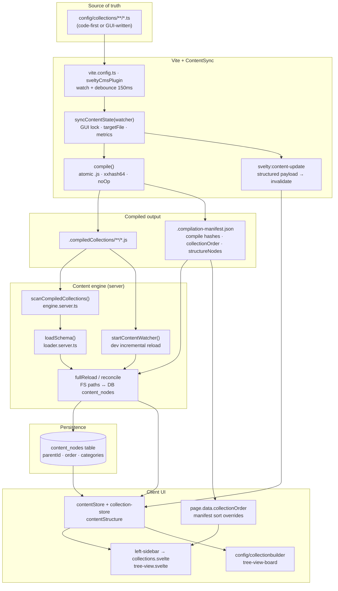

# Content System Architecture (2026 Edition)

The SveltyCMS Content System is a high-performance, reactive engine. The server tier centers on **`engine.server.ts`** (scan, reconcile, cache, watcher, CRUD), **`loader.server.ts`** (path security + worker pool), and **`sync-content-state.server.ts`** (unified ContentSync for boot, IDE watch, and Collection Builder).

## 📁 Module Layout (`src/content/`)

| File                              | Role                                                                                        |
| :-------------------------------- | :------------------------------------------------------------------------------------------ |
| `index.ts`                        | Browser-safe public facade (`contentSystem`, SSE init)                                      |
| `index.server.ts`                 | Server facade + `ensureContentInitialized()` + re-exports ContentSync                       |
| `sync-content-state.server.ts`    | **ContentSync** — `boot` / `compile` / `gui-save` / `watcher` / `collection-save` / reorder |
| `schema-contract.ts`              | Post-load schema assert (Valibot shape, soft empty fields, structure fingerprint)           |
| `schema-hooks.ts`                 | Optional `beforeValidate` / `afterValidate` — **write path only**                           |
| `engine.server.ts`                | Scanner, reconciliation, cache invalidation, dev watcher, CRUD                              |
| `loader.server.ts`                | `loadSchema()`, worker pool, `isSafeCollectionPath()`, `contentRuntime`                     |
| `module-worker.server.ts`         | Worker-thread entry (spawned by loader pool; must stay separate)                            |
| `content-utils.ts`                | Navigation tree, progressive nav, field sanitize/validate helpers                           |
| `content-hmr.ts`                  | Client-safe surgical HMR patch (`applyContentHmrPatch`) vs full layout invalidate           |
| `content-sse.svelte.ts`           | Client SSE → debounced `contentSystem.refresh()`                                            |
| `types.ts` / `types.generated.ts` | Domain types + build-time collection unions (`generate-content-types.ts`)                   |

## 🏗️ The 5 Pillars

### 1. Reactive Stores (Client)

| Store                | File                                    | Role                                                                                          |
| :------------------- | :-------------------------------------- | :-------------------------------------------------------------------------------------------- |
| **Content registry** | `src/stores/content-registry.svelte.ts` | Global tree + schema catalog; `contentVersion`; `waitForReload()`                             |
| **Collection store** | `src/stores/collection-store.svelte.ts` | Active collection, mode, form `activeValue`; FNV structure fingerprint; `patchActiveSchema()` |
| **Consent store**    | `src/stores/consent-store.svelte.ts`    | GDPR prefs (localStorage) — **never cleared by content HMR**                                  |

Content registry uses **Svelte 5 runes** as the single source of truth for the content tree. Soft HMR only runs `invalidate("app:content")` so consent, session cookies, and editor mode survive schema recompiles.

### 2. Public API Facade (Universal)

**Files**: `src/content/index.ts` (browser), `src/content/index.server.ts` (server)  
Exposes `contentSystem`. Handles initialization, context (`useContent`), and delegates server operations to `engine.server.ts`. Fully integrated with the **Local SDK** (`locals.cms`).

**Init coordinator** — `ensureContentInitialized(tenantId, options?, adapter?)` in `index.server.ts` is the single entry point used by hooks and direct callers. One `initPromises` map per tenant prevents reload storms.

### 3. Incremental Reconciliation (Server)

**File**: `src/content/engine.server.ts`  
The intelligent core. Uses **mtime-based scanning** + schema hashing to skip unchanged files and minimize database writes.

#### Unified ContentSync + refresh API

Prefer **`syncContentState`** for boot, filesystem, and GUI entry points. It compiles when needed, refreshes the engine, and returns metrics:

```typescript
import { syncContentState } from "@src/content/sync-content-state.server";
import { refreshContent } from "@src/content/engine.server";

// Boot / drift heal
await syncContentState({ reason: "boot", tenantId: null, adapter: db });

// IDE edit (Vite) — single-file or fullBuild
await syncContentState({
  reason: "watcher",
  targetFile: "posts.ts",
  fullBuild: false,
});

// Collection Builder schema save (holds GUI lock → watcher dedupe)
await syncContentState({
  reason: "collection-save",
  targetFile: "posts.ts",
  tenantId,
});

// Engine-only modes (internal / benchmarks)
await refreshContent(tenantId, { mode: "full", adapter: db });
await refreshContent(tenantId, { mode: "schemas", adapter: db });
await refreshContent(tenantId, { mode: "incremental", changedFile: absJsPath });
```

| Reason            | Compile                        | Refresh                      | GUI lock         |
| :---------------- | :----------------------------- | :--------------------------- | :--------------- |
| `boot`            | On drift                       | Full                         | No               |
| `watcher`         | Yes (`targetFile` / fullBuild) | Incremental / batched        | Skip if GUI lock |
| `collection-save` | Yes                            | Incremental / full on rename | Yes              |
| `gui-save`        | After structure ops            | Structure upsert + SSE       | Yes              |
| `sidebar-reorder` | No                             | Schemas mode                 | No               |

`contentService.fullReload()` and `refreshCollectionsCache()` remain exported for benchmarks and internal callers.

#### Vectorized Processing & API Optimization

SveltyCMS utilizes a **Vectorized `modifyRequest` pipeline** to handle large data batches:

- **Scalability**: Handles 10,000+ item imports without blocking the event loop.
- **Memory Efficiency**: Reduced object allocations by ~90% for standard fields.
- **Relational Performance**: Achieved a ~28% boost in relational averages (5.29ms → 3.81ms) by removing redundant processing in hot paths.

#### Self-Healing & Native Introspection

SveltyCMS utilizes native database introspection via the unified `listSchemas` SDK method to maintain parity and recover from drift:

1. **MongoDB (`listCollections`)**: Native document-store command — faster than SQL simulation.
2. **PostgreSQL/MariaDB (`information_schema`)**: ANSI SQL standard for multi-tenant introspection.
3. **SQLite (`sqlite_master`)**: High-performance table discovery for file-based deployments.

### 4. Smart Module Processing (Server)

**Files**: `src/content/loader.server.ts` + `src/content/module-worker.server.ts`

Safe sandboxed parsing of compiled collection modules with widget proxy support. Backed by a **native `worker_threads` pool** (zero external dependencies).

**Worker Pool Features**:

- Fixed-size pool (CPU cores / 2, minimum 2)
- Automatic worker replacement on crash/timeout
- Per-task 10s timeout guard
- Idle worker cleanup after 30s (keeps 1 alive)
- `getModuleWorkerPool()` singleton + `shutdownWorkerPool()`
- **Production default**: `loadSchema()` routes to `loadSchemaPooled()` when `NODE_ENV=production` **and** the worker chunk exists next to the module (the build script copies `module-worker.server.ts` into the output). Dev/test use native in-process loading; when the chunk is missing (vite build SSR evaluation, harness runs) the pool is skipped and loading falls back to native automatically.
- **Path hardening**: `isSafeCollectionPath()` enforced in main process and worker threads

**Mtime cache busting**: Dynamic imports use `?v={mtimeMs}` instead of `Date.now()`, enabling ESM module cache hits on warm scans.

**Dual-layer cache alignment** (inlined in `engine.server.ts`): Schema entries use `CacheCategory.SCHEMA` with tags `["schema", "schema:{id}"]`; navigation trees use `CacheCategory.CONTENT`. Full reload clears `schema:` via prefix invalidation; every `content:update` clears `navigation:tree:` in L1/L2.

**Watcher batching**: `flushChangedFiles()` + `processBatchedIncrementalReload()` collapse multi-file saves into one debounced pass with a single `content:update` broadcast. The dev watcher lives in `engine.server.ts` (`startContentWatcher()`).

**Security Benefit**: Process isolation prevents supply-chain attacks from malicious collection files.

### 5. Real-time Synchronization

**Files**:

- `engine.server.ts` → `startContentWatcher()` (dev-only, **recursive** native `fs.watch`)
- `src/content/content-sse.svelte.ts` (client-side SSE listener)
- `src/routes/api/[...path]/handlers/content.ts` (`normalizeSseEventPayload`)

**Development flow**: A change under `.compiledCollections/` triggers a debounced incremental reload via `handleIncrementalReload()` — no full SCHEMA cache wipe.

**Production / multi-user flow**:

1. Server reconciles and broadcasts `content:update` on the internal `eventBus`.
2. The SSE handler normalizes payloads to `{ type: "content_update", event, version, tenantId, timestamp }`.
3. The browser client (`contentLiveSync`) debounces and calls `contentSystem.refresh()`.
4. `contentSystem.refresh()` fetches `GET /api/content-structure?action=getStructure` and syncs `contentRegistry`.

---

## 🔄 Data Flow & Lifecycle

End-to-end pipeline from collection definitions to sidebar and Collection Builder. Two organizational paths converge on the same runtime stores.



### Path A — Code / filesystem (e.g. `config/collections/test/posts.ts`)

1. Developer creates folder `config/collections/test/` and moves `posts.ts` into it.
2. Vite detects the change → `syncContentState({ reason: "watcher", fullBuild })` → `compile()` writes atomic `.compiledCollections/test/posts.js` and updates compile hashes.
3. Incremental refresh loads the schema via **schema contract**, provisions models for **changed** schemas only, upserts `contentStore`.
4. `enrichSchemaWithMetadata()` sets schema path `/collection/test/posts`; path-derived categories reconcile as needed.
5. Structured `svelty:content-update` → client `invalidate("app:content")` when `noOp` is false (no full page reload).

**Filesystem limits:** folder nesting defines category structure; explicit sort order is **not** encoded by the OS. Order comes from DB + optional `collectionOrder` in the manifest (set via GUI Save or sidebar drag → `POST /api/collections/reorder`).

### Path B — GUI Collection Builder (virtual organization)

1. User creates category `test` in the builder and drags `posts` under it, then clicks **Save**.
2. `saveContentStructure()` persists `move` / `create` ops to `content_nodes` (no destructive `fullReload`).
3. `setOrganizationalManifest()` writes `collectionOrder` + `structureNodes` (GUI categories with `source: "builder"`) to `.compilation-manifest.json`.
4. `contentStore` updates in memory; `invalidate("app:content")` reloads layout data for sidebar and builder.

**GUI advantages:** arbitrary category order, collection order, and parent links **without** moving `.ts` files. The schema file may stay at `config/collections/posts.ts` while the UI shows it under `test`.

### Is code vs GUI fully dynamic?

| Capability                 | Code / filesystem                              | GUI Collection Builder                                                                      |
| :------------------------- | :--------------------------------------------- | :------------------------------------------------------------------------------------------ |
| Collection schema on disk  | **Required** — `.ts` is definition truth       | Written when saving a **new** collection; drag-reorder does **not** relocate existing files |
| Subfolder → category       | **Automatic** from path                        | **Virtual** category in DB + `structureNodes`                                               |
| Compiled JS mirror path    | **Yes** — `test/posts.ts` → `test/posts.js`    | Unchanged unless the `.ts` file path changes                                                |
| Manifest compile hashes    | Updated on every compile                       | Preserved across compiles                                                                   |
| Manifest `collectionOrder` | Applied on reconcile; optional via sidebar API | Written explicitly on Save                                                                  |
| Manifest `structureNodes`  | GUI categories only                            | Written on Save                                                                             |
| Sidebar + builder refresh  | ContentSync watcher + structured HMR           | `collection-save` / `gui-save` + `invalidate` (no full reload)                              |

**Summary:** Both paths are **live and reactive** for UI updates. They are **not identical**:

- **Filesystem** owns collection **existence** and **path-derived** folders.
- **GUI** owns **fine-grained order** and **virtual categories** without OS constraints.
- Dragging in the builder updates DB + manifest, **not** the on-disk folder layout. Moving files on disk updates compile output + path-derived categories, **not** GUI-only virtual folders unless reconciled from manifest.

For identical behavior, keep filesystem folders aligned with GUI categories, or treat GUI layout as the display layer and files as the schema layer.

---

## 🚀 Performance Architecture

The 2026 update introduced a massive architectural leap in content processing. Measured scan and reload latencies are documented in [Performance Benchmarks](../../project/benchmarks/index.mdx).

### 🧵 1. Worker Thread Pooling

Module parsing and widget proxy creation run in a **dedicated pool of background workers** (`module-worker.server.ts`, managed by `loader.server.ts`). The main UI thread stays responsive even when thousands of schemas are processed simultaneously.

### 🌳 2. Persistent Mtime Tree (Dirty Bits)

The scanner maintains a persistent, in-memory **"Dirty Bit" tree**:

- **Steady State**: If no files changed, the scanner skips unnecessary work and returns the cached schema map instantly.
- **Micro-Surgical Invalidation**: When a file changes, only that node is marked dirty.

### 📦 3. Batch Cache Retrieval (`getMany`)

Individual cache lookups are replaced by **Vectorized Batching**. The system fetches all schema metadata blocks in a single `O(1)` trip to Redis/Memory via `CacheService.getMany`.

### 🔢 4. Fast Deterministic Hashing

Lightweight numeric string hash in `loader.server.ts` (`generateSchemaHash`). Reduces reconciliation time for unchanged schemas by ~40%.

### 🧠 5. Smart / Lazy Usage Rules

| Workload                            | Use                                                                     | Avoid                                    |
| :---------------------------------- | :---------------------------------------------------------------------- | :--------------------------------------- |
| Resolve schema in UI/API            | `contentStore.getCollection` / LocalCMS `getSchema` (LRU + alias index) | Full `syncContentState` / scan           |
| Entry `findById` / create / update  | LocalCMS collections namespace (hot flags skip unused work)             | Reconcile / content-structure refresh    |
| Structure change (builder, reorder) | `syncContentState` with targeted reason                                 | Entry mutation paths                     |
| Dev HMR small schema edit           | `applyContentHmrPatch` + `changedNodes`                                 | Full layout invalidate when not required |
| Production schema load              | Worker pool only when uncached files need import                        | Eager pool on every request              |

**Entry vs structure:** Entry create/update/delete **must not** bump `contentStore.contentVersion`. Structure version drives nav cache keys and SSE full refreshes — only schema/tree sync paths update it.

**Schema hot flags** (cached on first `getSchema`): `_hasActiveWidgets`, `_hasNumberFields`, `_hasSanitizableFields`, `_hasHooks` — so create/update/find skip field walks and `modifyRequest` when the schema does not need them.

**Registry indexes:** `contentStore` keeps path → id and lowercased alias → schema id maps for O(1) `getNodeByPath` / `getCollection` after warm-up.

### 📐 6. Baseline Benchmarks (CRUD)

Use these suites for create / update / find / mixed baselines (SQLite default local):

| Suite            | File                                            | What it measures                                     |
| :--------------- | :---------------------------------------------- | :--------------------------------------------------- |
| Adapter CRUD     | `tests/benchmarks/database-performance.test.ts` | INSERT / FIND ONE / UPDATE / DELETE (direct adapter) |
| Local throughput | `tests/benchmarks/local-api-throughput.test.ts` | Wave writes + `findOne` reads (no HTTP)              |
| HTTP findById    | `tests/benchmarks/api-latency.test.ts`          | `HTTP: findById @ 8c`                                |
| Mixed workload   | `tests/benchmarks/mixed-workload.test.ts`       | Weighted REST read/search + GraphQL + health         |
| Truth layers     | `tests/benchmarks/truth-latency.test.ts`        | Logic vs LocalCMS vs HTTP                            |

```bash
# Baseline adapter CRUD (record into history / MDX when desired)
BENCHMARK_RECORD=1 bun test tests/benchmarks/database-performance.test.ts

# Local CMS write/read throughput
bun test tests/benchmarks/local-api-throughput.test.ts

# HTTP findById + mixed
bun test tests/benchmarks/api-latency.test.ts
bun test tests/benchmarks/mixed-workload.test.ts
```

Raw adapter FIND ONE / INSERT are typically **sub-0.1 ms** on SQLite; HTTP findById and mixed runs include middleware and should be compared against the ledger in `docs/project/benchmarks/benchmark_sqlite.mdx`.

---

## 🛡️ Schema Validation & Path Hardening

**Schema contract** (`schema-contract.ts` → used by `loader.server.ts`):

- Normalizes module export → schema object; fills `name` / `_id` from path when missing
- Missing `fields` → coerced to `[]` (draft-friendly)
- Hard-fail: non-object, non-array `fields`, duplicate `db_fieldName`
- Soft: empty `fields` (draft) loads with a debug note; engine may still refuse provision

**Engine hard validation** (`validateSchemaFields` in `engine.server.ts`):

- Rejects missing `name` or invalid `fields` array before cache/DB
- Empty fields log as draft (not hard-delete loop) — invalid schemas are skipped; last-good runtime state retained

**Path Security** (`isSafeCollectionPath` in `loader.server.ts`):

1. Must be within `.compiledCollections` (`.js`) or `config/collections` (`.ts`)
2. Blocks path traversal outside allowed directories
3. Enforced in both main process and worker threads

**Compile lock** (`beginGuiCompileSession` / `shouldSkipWatcherSync`):

- Builder writes trigger Vite; lock + cooldown suppress redundant watcher compile
- Prevents double work and racey dual refresh

---

## 🛠️ Developer Experience

- **Zero full reload**: Soft HMR (`invalidate("app:content")`) keeps session, consent, and form mode.
- **Structured HMR payload**: `{ reason, contentVersion, changedIds, processed, durationMs, noOp }`.
- **Strong Typing**: `types.generated.ts` via `scripts/generate-content-types.ts` after non-no-op compiles.
- **Tenant Isolation**: All content operations respect the `tenantId` context from middleware.
- **Single coordinator**: Vite, builder, and boot all call `syncContentState` — no ad-hoc model loops.

---

## Related Documentation

- [Compilation Pipeline](./compilation-pipeline.mdx) — compile, transformers, ContentSync HMR
- [Collection Builder Architecture](./collection-builder-architecture.mdx)
- [Collection Store Data Flow](./collection-store-dataflow.mdx)
- [Performance Benchmarks](../../project/benchmarks/index.mdx)
- [Local SDK vs HTTP API](../../development/local-vs-http-api.mdx)
- [Server Hooks](./server-hooks.mdx)

### Tests

| Layer       | Path                                                  |
| :---------- | :---------------------------------------------------- |
| Unit        | `tests/unit/content/sync-content-state.test.ts`       |
| Unit        | `tests/unit/content/collection-save-sync.test.ts`     |
| Unit        | `tests/unit/content/schema-contract.test.ts`          |
| Unit        | `tests/unit/content/content-reconcile.test.ts`        |
| Integration | `tests/integration/collectionbuilder/*`               |
| E2E         | `tests/e2e/routes/collection-builder/builder.spec.ts` |

- [State Management & Readiness](./state-management.mdx)
- [Cache System](./cache-system.mdx)
- [Content Type System](./content-type-system.mdx)
