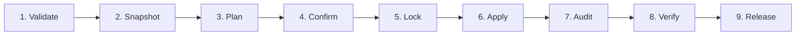
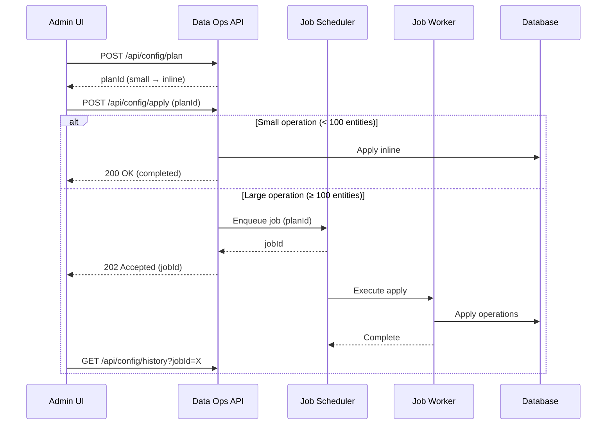
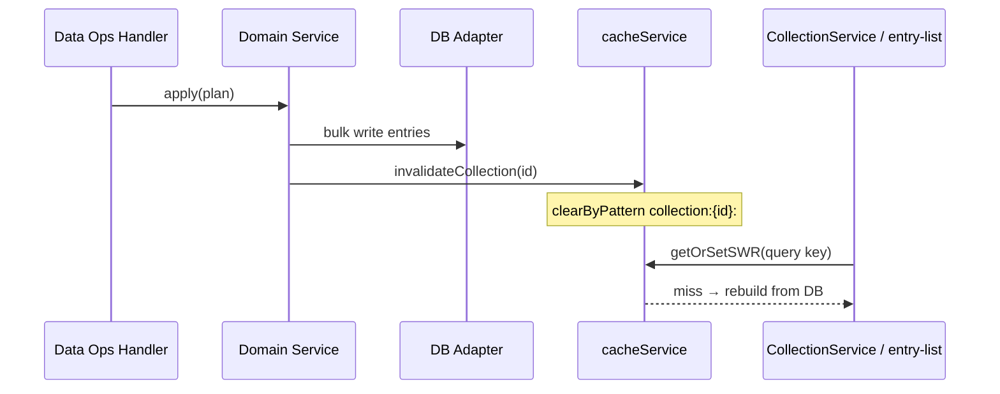

# Data Operations Architecture

The Data Operations framework is a unified, safety-first system for moving and transforming data across SveltyCMS environments. It consolidates six operation domains under a shared lifecycle with consistent audit logging, background job support, and identity matching.

---

## 📁 Six-Domain Separation

Data Operations span six distinct domains, each with its own namespace, handler, and permission model:

|  #  | Domain                      | Namespace                                       | Handler               | Purpose                                                           |
| :-: | :-------------------------- | :---------------------------------------------- | :-------------------- | :---------------------------------------------------------------- |
|  1  | **Configuration Promotion** | `/api/config/*`                                 | `config.ts`           | Move site structure (collections, settings, roles) between envs   |
|  2  | **Content Packages**        | `/api/content-export/*` `/api/content-import/*` | `content-transfer.ts` | Portable editorial record transfers with NDJSON streaming         |
|  3  | **Data Migrations**         | `/api/migrations/*`                             | `migrations.ts`       | Transform stored data or schema state in place                    |
|  4  | **External Importers**      | `/api/importers/*`                              | `importers.ts`        | Import from WordPress, Drupal, CSV, JSON, and other sources       |
|  5  | **Backups**                 | `/api/backups/*`                                | `backups.ts`          | Disaster recovery archives with encrypted manifests and checksums |
|  6  | **Content Sync**            | `/api/content-sync/*`                           | `content-sync.ts`     | Explicit push/pull between configured environments                |

---

## 🔄 Shared Operation Lifecycle

All six domains follow a common **validate → plan → apply → verify** lifecycle. Each phase gates the next, ensuring no destructive operation proceeds without explicit confirmation:



### Phase Details

| Phase        | Responsibility                                                                       | Failure Behavior                               |
| :----------- | :----------------------------------------------------------------------------------- | :--------------------------------------------- |
| **Validate** | Check inputs, permissions, resource existence, schema compatibility                  | Abort with specific error                      |
| **Snapshot** | Capture pre-operation state for rollback reference                                   | Warn, continue (best-effort)                   |
| **Plan**     | Build an explicit operation list with risk assessment and blocked-reason enumeration | Return plan with warnings/blocks, no mutations |
| **Confirm**  | Require explicit user consent for destructive plans (`mirror`, `replace`, deletes)   | Block until confirmed                          |
| **Lock**     | Acquire a domain-specific operation lock to prevent concurrent mutations             | Wait with timeout, fail if contention detected |
| **Apply**    | Execute queued operations in dependency order, with per-operation error isolation    | Roll back completed operations on failure      |
| **Audit**    | Write structured audit log entries with operation metadata, plan ID, and outcome     | Fire-and-forget (non-blocking)                 |
| **Verify**   | Run postcondition checks: resource counts, checksums, referential integrity          | Report discrepancies, flag for manual review   |
| **Release**  | Release operation lock, clear temporary state, broadcast completion event            | Always runs (even on prior failure)            |

---

## 🛡️ Safety Modes

All mutation-capable domains support four safety modes that control merge behavior:

| Mode          | Creates | Updates | Deletes | Rollback | Use Case                                              |
| :------------ | :-----: | :-----: | :-----: | :------: | :---------------------------------------------------- |
| **`add`**     |   ✅    |    —    |    —    | Trivial  | Bootstrap: only add missing resources, never modify   |
| **`merge`**   |   ✅    |   ✅    |    —    | Reverse  | **Default.** Safe promotion: add new, update existing |
| **`mirror`**  |   ✅    |   ✅    |   ✅    | Snapshot | Full alignment: make target exactly match source      |
| **`replace`** |   ✅    |   ✅    |   ✅    | Snapshot | Fresh install: drop all existing, import from source  |

> [!CAUTION]
> **Destructive modes (`mirror`, `replace`) require explicit confirmation.** Plans with these
> modes carry `risk: "destructive"` and `requiresConfirmation: true`. The confirm phase will
> block until the user explicitly acknowledges the plan. Snapshot-before-apply provides a
> rollback path, but verify the plan output carefully before confirming.

### Mode Selection by Domain

| Domain                    | Available Modes                     | Default |
| :------------------------ | :---------------------------------- | :------ |
| Configuration Promotion   | `add`, `merge`, `mirror`, `replace` | `merge` |
| Content Packages (import) | `add`, `merge`, `mirror`            | `merge` |
| Data Migrations           | `merge` only                        | `merge` |
| External Importers        | `add`, `merge`                      | `add`   |
| Content Sync              | `merge`, `mirror`                   | `merge` |

---

## 🔑 Identity Matching Priority

When moving resources between environments, the framework must match source entities to target entities. Identity resolution follows this priority chain:

| Priority | Match Key          | Example                                            | Used By                |
| :------: | :----------------- | :------------------------------------------------- | :--------------------- |
|    1     | **`syncId`**       | Explicit UUID set during initial export            | Configuration, Content |
|    2     | **External ID**    | Source-system identifier (e.g., WordPress post ID) | Importers              |
|    3     | **Natural Key**    | Domain-unique composite (e.g., `collection.name`)  | Configuration          |
|    4     | **Manual Mapping** | User-provided map in the plan confirmation step    | All domains            |

When no match is found, the entity is treated as **new**. When multiple candidates match, the operation is flagged for **manual resolution** and included in the plan's `warnings`.

---

## 📋 Background Job Integration

Large operations (1,000+ entities) are dispatched as background jobs via the Adaptive Job Scheduler:



**Job thresholds**:

| Domain                    | Inline Threshold | Background Above |
| :------------------------ | :--------------: | :--------------: |
| Configuration Promotion   |   100 entities   |        ✅        |
| Content Packages (import) |   500 entities   |        ✅        |
| Data Migrations           |  Always inline   |        —         |
| External Importers        |   100 entities   |        ✅        |
| Backups (restore)         |  Always inline   |        —         |
| Content Sync              |   500 entities   |        ✅        |

---

## 📊 Audit & Observability

Every data operation writes structured audit log entries with crypto-chained integrity (SHA-256 hash chain).

### Audit Entry Schema

```typescript
interface DataOperationAuditEntry {
  timestamp: ISODateString;
  domain: "config" | "content-package" | "migration" | "importer" | "backup" | "content-sync";
  operation: "export" | "import" | "plan" | "apply" | "restore";
  planId: string;
  mode: "add" | "merge" | "mirror" | "replace";
  actor: { userId: string; tenantId: string };
  outcome: "success" | "partial" | "failure" | "rollback";
  summary: {
    created: number;
    updated: number;
    deleted: number;
    skipped: number;
    failed: number;
  };
  durationMs: number;
  previousHash: string; // SHA-256 chain link
  currentHash: string; // SHA-256 of this entry
}
```

### Observability Requirements

| Signal                 | Implementation                            |
| :--------------------- | :---------------------------------------- |
| **Operation logs**     | Structured audit entries per domain       |
| **Plan diffs**         | Resource-level change enumeration         |
| **Duration metrics**   | Per-phase timing (validate, plan, apply)  |
| **Error counters**     | Per-domain failure tracking               |
| **Chain verification** | `GET /api/config/history` with hash check |
| **Completion events**  | SSE broadcast on operation finish         |

---

## 🔗 Service / Handler Patterns (Content Lists)

Data operations that **mutate entries** (content packages, importers, content sync, migrations)
must stay consistent with how the CMS **reads** list data:

| Layer                                                  | Responsibility                                                                                                                                   |
| :----------------------------------------------------- | :----------------------------------------------------------------------------------------------------------------------------------------------- |
| **Handler** (`content-transfer.ts`, `importers.ts`, …) | Validate → plan → apply; permission-gated namespaces                                                                                             |
| **Service** (`CollectionService`, domain services)     | Shared load/mutate logic; no raw DB outside adapters                                                                                             |
| **Cache**                                              | After apply, `cacheService.invalidateCollection(collectionId)` clears all `collection:{id}:query:*` list variants (filtered pages, search, sort) |
| **Admin UI**                                           | `entry-list` + `createSmartFilter` re-fetch via URL params → SSR loader → SWR                                                                    |



> [!TIP]
> Do **not** invalidate only a single page key. Filtered lists use `query:{hash}` fragments;
> prefix invalidation is required so editors never see stale rows after import/sync.
> See [Cache System — Collection List Queries](./cache-system.mdx#collection-list-queries-entry-list--collectionservice).

**Related**: [Collection Filtering Platform](./collection-filtering.mdx) · [Content query params](../api/content.mdx#2b-collection-list-query-params-ssr--entry-list) · [entry-list](../components/entry-list.mdx)

---

## 🗺️ Route Architecture

The Data Operations framework is dispatched through the Unified Gatekeeper (`src/routes/api/[...path]/+server.ts`):

```
api/
├── config/
│   ├── resources          GET  — List syncable resource types
│   ├── status             GET  — Drift summary
│   ├── export             POST — DB → Filesystem
│   ├── plan               POST — Dry-run operation list
│   ├── apply              POST — Execute confirmed plan
│   └── history            GET  — Past operations
├── config_sync            GET  — Deprecated alias → /api/config/status
├── config-sync            GET  — Deprecated alias → /api/config/status
├── content-export/
│   ├── validate           POST — Validate export selection
│   ├── plan               POST — Preview export contents
│   ├── run                POST — Execute export
│   ├── download           GET  — Download exported package
│   └── jobs               GET  — Export job status
├── content-import/
│   ├── validate           POST — Validate import package
│   ├── plan               POST — Preview import changes
│   ├── apply              POST — Execute import
│   └── jobs               GET  — Import job status
├── migrations/
│   ├── status             GET  — Pending migration list
│   ├── history            GET  — Past migration runs
│   ├── plan               POST — Dry-run migration
│   ├── apply              POST — Execute migration
│   └── verify             POST — Post-migration checks
├── importers/
│   ├── sources            GET  — Available import sources
│   ├── validate           POST — Validate import file
│   ├── preview            POST — Preview field mapping
│   ├── run                POST — Execute import
│   └── jobs               GET  — Import job status
├── backups/
│   ├── (list)             GET  — List backups
│   ├── create             POST — Create backup
│   ├── validate           POST — Validate backup integrity
│   ├── restore-plan       POST — Preview restore
│   ├── restore            POST — Execute restore
│   └── jobs               GET  — Backup job status
└── content-sync/
    ├── channels           GET  — List configured sync channels
    ├── plan               POST — Preview sync operations
    ├── push               POST — Push to target environment
    ├── pull               POST — Pull from source environment
    └── jobs               GET  — Sync job status
```

### Permission Model

| Namespace        | GET Permission   | POST Permission   |
| :--------------- | :--------------- | :---------------- |
| `config`         | `config:read`    | `config:write`    |
| `content-export` | `content:read`   | `content:export`  |
| `content-import` | `content:read`   | `content:import`  |
| `migrations`     | `migration:read` | `migration:apply` |
| `importers`      | `content:read`   | `content:import`  |
| `backups`        | `backup:read`    | `backup:create`   |
| `content-sync`   | `content:read`   | `content:sync`    |

All unmapped namespaces fail-closed with `403 Forbidden`. Admin users bypass RBAC via the dispatcher fast-path.

---

## 📦 File Format Plans

### Configuration Sync Manifest

Deterministic JSON files for version-controlled site structure in `/config/sync/`:

```
/config/sync/
├── config.manifest.json
├── collections/
│   └── blog-posts.f47ac10b.json
├── system/
│   ├── widget.state.json
│   ├── theme.state.json
│   ├── webhooks.state.json
│   └── automations.state.json
└── roles/
    └── editor.a1b2c3d4.json
```

Each file includes a deterministic checksum and UUID for cross-environment identity matching.

### Content Package (`.svelty-content-package`)

Portable content bundles using NDJSON streaming:

```
package.svelty-content-package
├── manifest.json         ← Metadata, source info, creation timestamp
├── schema/               ← Collection schemas referenced by content
│   └── {collection-name}.json
├── data/
│   ├── entries-0001.ndjson
│   ├── entries-0002.ndjson
│   └── ...
└── media/
    ├── media-manifest.json
    └── files/             ← Optional, for small transfers
```

### Backup Archive (`.svelty-backup`)

Disaster-recovery archives with encryption and integrity verification:

```
backup-2026-07-10.svelty-backup
├── backup.manifest.json   ← Timestamp, checksums, adapter type, version
├── content/
│   └── {collection}/
│       └── entries.ndjson
├── config/
│   └── snapshot.json
├── media/
│   └── media.manifest.json
└── signatures/
    └── sha256.checksums
```

---

## 🏗️ Current Implementation Status

| Domain                  | Handler | Core Logic                               | Status         |
| :---------------------- | :------ | :--------------------------------------- | :------------- |
| Configuration Promotion | ✅      | Partial (status, resources, plan, apply) | 🟡 In progress |
| Content Packages        | ✅      | Stub (501)                               | 🔴 Planned     |
| Data Migrations         | ✅      | Stub (501)                               | 🔴 Planned     |
| External Importers      | ✅      | Hybrid (sources implemented)             | 🟡 Partial     |
| Backups                 | ✅      | Stub (501)                               | 🔴 Planned     |
| Content Sync            | ✅      | Stub (501)                               | 🔴 Planned     |

> **Legend**: 🟢 Complete · 🟡 In progress / Partial · 🔴 Planned

---

## Related Documentation

- [Configuration Promotion API](../api/configuration-promotion.mdx)
- [Configuration Management Architecture](./configuration-management.mdx)
- [Server Hooks (Middleware Pipeline)](./server-hooks.mdx)
- [State Management & Readiness](./state-management.mdx)
- [Cache System](./cache-system.mdx)
- [System & Infrastructure API](../api/system.mdx)
- [Utilities API](../api/utility.mdx)
