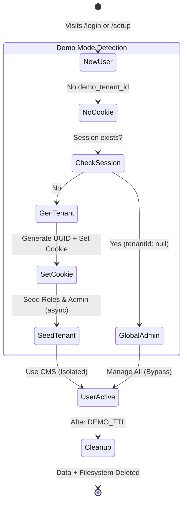

# Demo Mode Architecture

Demo Mode is a specialized configuration of the Multi-Tenancy system designed to provide instant, ephemeral, and isolated environments for users to evaluate SveltyCMS.

## Features

- **Instant Provisioning**: Every visitor is assigned a unique tenant ID via `crypto.randomUUID()`. No hostname-based deduplication — each visitor gets their own isolated tenant.
- **Cookie-First Assignment**: The `demo_tenant_id` cookie is set _before_ async seeding completes, preventing race conditions where sign-up requests could generate a mismatched tenant ID.
- **Automatic Seeding**: The system seeds the new tenant with default settings, themes, roles, and a demo admin user (`demo-{shortId}@sveltycms.com`).
- **Ephemeral Sessions**: Tenants and their data are automatically deleted after a configurable expiration time (default: 60 minutes, configurable via `DEMO_TTL` public setting).
- **Isolation**: Each demo user sees only their own data.

### 1. Project Setup (Clone & Link)

- Clone your `next` branch: `git clone -b next <repo>`
- Run setup: `bun install && bun run dev`
- Setup Wizard: Connect to your **existing Demo Database**.
- **Important**: Manually set `MULTI_TENANT: true` and `DEMO: true` in `config/private.ts` (requires restart).

### Bypassing Host Validation (March 2026)

In March 2026, the `handleSystemState` hook was optimized to allow bootstrap routes (like `/setup`) from any host when `DEMO: true` is active (`process.env.SVELTYCMS_DEMO === "true"`). This ensures that live demo environments on dynamic URLs (e.g., Vercel, Netlify) do not trigger 403 Forbidden errors before the system is fully initialized.

### Enabling Demo Mode

Demo mode is strictly controlled via `config/private.ts` to prevent accidental disabling in production.

> [!IMPORTANT]
> **Both `MULTI_TENANT` and `DEMO` must be set to `true`** for demo mode to function correctly. Demo mode leverages the multi-tenancy architecture to isolate ephemeral user data.

1.  **Strict Configuration**:
    - Edit `config/private.ts`:

    ```typescript
    export const privateEnv = {
      // ...
      MULTI_TENANT: true,
      DEMO: true,
    };
    ```

    - Restart the server.

2.  **Environment Variable** (Dev only):
    - `SVELTYCMS_DEMO=true bun run dev`

### Configurable TTL

The demo session time-to-live is controlled by the `DEMO_TTL` public setting (default: 60 minutes). This value drives:

- **Cookie `maxAge`**: The `demo_tenant_id` cookie expires after `DEMO_TTL` minutes (synced at assignment time).
- **Cleanup cutoff**: Background cleanup deletes tenants where the admin user's `createdAt` exceeds `DEMO_TTL` minutes.
- **Login countdown**: The login page displays remaining time based on `DEMO_TTL`.

To change the TTL, update the `DEMO_TTL` public setting via System Settings or the API (`min: 1`, `max: 1440` minutes).

### Tenant Lifecycle



1.  **Creation**:
    - **Method A (No Token)**: User visits `/login` -> Click "Sign Up".
      - If `MULTI_TENANT=true` AND `DEMO=true`, they can register _without_ a token.
      - The registration UI automatically hides the "Registration Token" field in Demo Mode to simplify the experience.
      - The sign-up handler reads the `demo_tenant_id` cookie (checking both `__Host-demo_tenant_id` and `demo_tenant_id` variants) to ensure the tenant ID matches what the middleware assigned.
      - A new Tenant is created for them automatically.
    - **Method B (Automatic)**: `handleAuthentication` hook detects missing `demo_tenant_id` cookie.
      - Generates a new `tenantId` using `crypto.randomUUID()` — no hostname-based deduplication.
      - **Sets the cookie immediately** (before async seeding) to avoid race conditions with concurrent sign-up requests.
      - Cookie uses `__Host-` prefix on HTTPS (RFC 6265bis subdomain isolation), `sameSite: strict`, `httpOnly: true`.
      - Cookie `maxAge` is synchronized with the `DEMO_TTL` public setting.
      - Calls `seedDemoTenant(tenantId)` to populate the database with default roles, settings, and a demo admin.

2.  **Usage**:
    - User interacts with the CMS as a normal tenant.
    - `tenantId` is preserved in the cookie and session.

3.  **Expiration & Cleanup**:
    - A background job (`setInterval` in `src/databases/db.ts`) runs every **5 minutes**.
    - It identifies tenanted admin users created past the cleanup TTL (configurable via `DEMO_TTL`, default 60 minutes) or those with expired sessions.
    - **Global Administrator Protection**: The primary administrator (created during setup with `tenantId: null`) is explicitly excluded from cleanup to ensure the system remains manageable.
    - **Cleanup scope** per expired tenant:
      - **Media**: Full pagination through all media files, physical file deletion, media record deletion, and empty directory cleanup.
      - **Content**: `content_nodes`, `content_drafts`, `content_revisions`.
      - **Filesystem**: `.compiledCollections/{tenantId}/`, `config/{tenantId}/`, `uploads/{tenantId}/`.
      - **System**: Themes, user-scoped preferences, virtual folders.
      - **Auth**: Sessions invalidated, users deleted, expired sessions/tokens purged globally.
    - **Security**: The cleanup process queries the central user registry and then iterates through each expired tenant, using its specific `tenantId` to safely delete associated data without violating tenant isolation.

### Seeding Strategy

The `seedDemoTenant` function (`src/routes/setup/seed.ts`) performs:

1.  **Settings**: Seeds default settings including `DEMO_TTL=60`, `SEASONS=true`, `SEASON_REGION='Western_Europe'`.
2.  **Theme**: Seeds the default SveltyCMS theme.
3.  **Roles**: Seeds default roles.
4.  **User**: Creates a `demo-{shortId}@sveltycms.com` admin user with password `demo`.

## Security

- **Cookie Hardening**: `__Host-` prefix on HTTPS prevents subdomain cookie leakage per RFC 6265bis. `sameSite: strict` blocks cross-site request forgery.
- **Tenant Isolation**: Each demo visitor receives a unique `tenantId` — no shared tenants between concurrent visitors.
- **Global Capacity Limit**: A hard cap of 100 total users prevents resource exhaustion (`signUpInternal` in `auth.remote.ts`).
- **Setup Completion Gating**: All `/api/setup` requests are rejected with 403 after setup completes.
- **Host Validation Bypass**: When `DEMO: true`, `handleSystemState` allows bootstrap routes from any host, enabling dynamic URL deployments.

---

## Related

- [Architecture Overview](./index.mdx)
- [Multi-Tenancy Architecture](./multi-tenancy.mdx)
- [Security Overview](../security/index.mdx)
- [State Management](./state-management.mdx)
