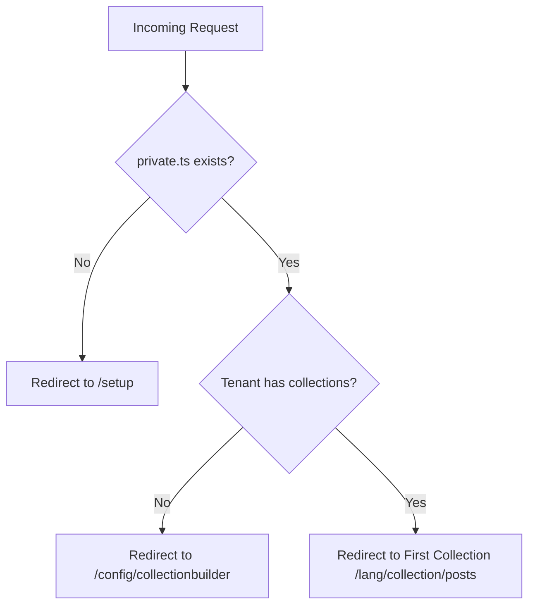
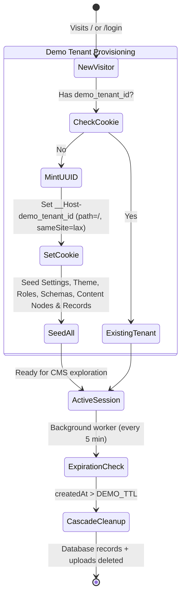

# Demo Mode Architecture

Demo Mode is a specialized configuration of the Multi-Tenancy system designed to provide instant, ephemeral, and isolated environments for users to evaluate SveltyCMS with zero setup overhead.

## Core Capabilities

- **Instant Provisioning**: Every visitor is assigned a unique tenant ID via `crypto.randomUUID()`. No hostname-based deduplication — each visitor receives an isolated tenant environment.
- **Cookie-First Assignment**: The `demo_tenant_id` cookie is set with `path: "/"` and `sameSite: "lax"` before seeding, preventing race conditions with concurrent sign-up requests while preserving sessions across external referral links (e.g. docs, GitHub).
- **Full Content & Collection Seeding**: When a demo tenant is initialized, the system automatically seeds settings, default theme, roles, preset collection schemas (`posts`, `categories`, `authors`), content nodes, and sample records.
- **Deterministic First-Collection Routing**: Navigation and initial redirects land deterministically on the headline preset collection (`posts`) via a unified resolver that respects declared schema order across server restarts.
- **Ephemeral Sessions & Cascade Cleanup**: Tenants and their associated data (media files, DB records, compiled collections, virtual folders) are automatically pruned by background workers after expiration (default: 60 minutes, configurable via `DEMO_TTL`).
- **Strict Isolation**: Each demo tenant operates with isolated content nodes, collections, and database records.

---

## Enabling Demo Mode

Demo mode is strictly controlled via `config/private.ts` to prevent accidental activation in standard production deployments.

> [!IMPORTANT]
> **Both `MULTI_TENANT` and `DEMO` must be set to `true`** for demo mode to function correctly. Demo mode leverages the multi-tenancy architecture to isolate ephemeral user data.

```typescript
export const privateEnv = {
  // ...
  MULTI_TENANT: true,
  DEMO: true,
};
```

Environment variable alternative (development):

```bash
SVELTYCMS_DEMO=true bun run dev
```

---

## Redirect & Routing Behavior

The routing middleware in `hooks.server.ts` enforces a deterministic 3-tier redirect hierarchy:


```mermaid
flowchart TD
    A[Incoming Request] --> B{private.ts exists?}
    B -- No --> C[Redirect to /setup]
    B -- Yes --> D{Tenant has collections?}
    D -- No --> E[Redirect to /config/collectionbuilder]
    D -- Yes --> F[Redirect to First Collection /lang/collection/posts]
```

1. **Unconfigured System (`private.ts` missing)** $\rightarrow$ `/setup` (Setup Wizard).
2. **Empty Tenant (zero collections configured)** $\rightarrow$ `/config/collectionbuilder` (Collection Builder).
3. **Active Tenant (collections exist)** $\rightarrow$ `/${lang}/collection/${firstCollection}` (e.g., `/en/collection/posts`).

---

## Unified First-Collection Resolution

To ensure the setup wizard, sidebar navigation, content registry, and route redirects agree on the initial landing collection:

- **Canonical Resolver (`src/content/first-collection.ts`)**: Evaluates collections against a unified system filter (`Menu`, `Navigation`, `Form`, `WidgetTest`, `Relation`, `redirects`, `404_logs`, `plugin_`, `workflow_`, `system_`).
- **Order-First Sorting**: Respects explicit `schema.order` or `manifestOrder` metadata ahead of alphabetical file order, ensuring preset intent (e.g. `posts` before `authors`) survives server restarts.
- **Tenant-Scoped Caching**: Caches redirect targets by `${tenantId}:${language}` to prevent cross-tenant cache contamination.

---

## Tenant Lifecycle


```mermaid
stateDiagram-v2
    [*] --> NewVisitor: Visits / or /login
    state "Demo Tenant Provisioning" as Provision {
        NewVisitor --> CheckCookie: Has demo_tenant_id?
        CheckCookie --> ExistingTenant: Yes
        CheckCookie --> MintUUID: No
        MintUUID --> SetCookie: Set __Host-demo_tenant_id (path=/, sameSite=lax)
        SetCookie --> SeedAll: Seed Settings, Theme, Roles, Schemas, Content Nodes & Records
    }
    SeedAll --> ActiveSession: Ready for CMS exploration
    ExistingTenant --> ActiveSession
    ActiveSession --> ExpirationCheck: Background worker (every 5 min)
    ExpirationCheck --> CascadeCleanup: createdAt > DEMO_TTL
    CascadeCleanup --> [*]: Database records + uploads deleted
```

### 1. Creation & Seeding (`seedDemoTenant`)

When `handleAuthentication` detects a visitor without a `demo_tenant_id` cookie:

1. Generates `tenantId = crypto.randomUUID()`.
2. Sets `__Host-demo_tenant_id` cookie (`path: "/"`, `sameSite: "lax"`, `httpOnly: true`, `secure: isSecure`, `maxAge: DEMO_TTL`).
3. Executes synchronous tenant seeding:
   - **Settings**: Seeds default system settings (`DEMO_TTL=60`, `SEASONS=true`, `SEASON_REGION='Western_Europe'`).
   - **Theme**: Applies default SveltyCMS theme.
   - **Roles**: Configures default RBAC roles (`admin`, `editor`, `viewer`).
   - **Collections**: Creates models for `PRESET_COLLECTIONS.demo` (`posts`, `categories`, `authors`, `BenchmarkStable`).
   - **Content Structure**: Persists `content_nodes` to the database and initializes `contentSystem`.
   - **Sample Records**: Seeds introductory blog posts and menu items.
   - **Admin User**: Creates `demo-{shortId}@sveltycms.com` with a secure randomized credential.

### 2. Ephemeral Expiration & Cascade Cleanup

A background job in `src/databases/db.ts` executes every 5 minutes:

- Queries tenanted admin accounts created beyond `DEMO_TTL` (default: 60 minutes).
- **Global Admin Exclusion**: The root system administrator (`tenantId: null`) is permanently protected from cleanup.
- **Cascade Purge Scope**:
  - **Media**: Paginated deletion of physical files, media records, and empty directories in `uploads/{tenantId}/`.
  - **Content**: Purges `content_nodes`, `content_drafts`, and `content_revisions`.
  - **Filesystem**: Deletes `.compiledCollections/{tenantId}/` and `config/{tenantId}/`.
  - **System**: Deletes tenant-scoped themes, preferences, and virtual folders.
  - **Auth**: Revokes sessions, API tokens, and deletes tenant user records.

---

## Security Architecture

- **Subdomain Cookie Isolation**: Uses `__Host-` prefix on HTTPS with `path: "/"` per RFC 6265bis.
- **Cross-Site Navigation Stability**: `sameSite: "lax"` permits external referral navigation without minting duplicate tenants while defending against CSRF on state-changing requests.
- **No Hardcoded Credentials**: Demo user accounts are generated with secure random tokens via CSPRNG (`globalThis.crypto.getRandomValues`).
- **Global User Cap**: A ceiling of 100 concurrent users prevents denial-of-service or storage exhaustion.
- **Dynamic Host Validation**: When `DEMO: true`, bootstrap routes allow dynamic cloud deployments (e.g. preview environments) without triggering host mismatch errors.

---

## Related Documentation

- [Architecture Overview](./index.mdx)
- [Multi-Tenancy Architecture](./multi-tenancy.mdx)
- [Security Overview](../security/index.mdx)
- [State Management](./state-management.mdx)
