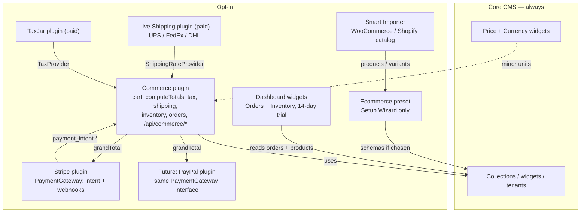

# E-commerce architecture {#e-commerce-overview}

This page is the engine: extension surfaces, the totals pipeline, the checkout services, and the HTTP contract. Turning a store on and running orders is the [E-commerce guide](../../guides/content/ecommerce.mdx).

SveltyCMS is a headless CMS first, so commerce ships as an opt-in add-on graph rather than a store kernel. The sections below are how that graph is wired, what each part owns, and what stays out of the boot path.

## Keep the core light (extensions, not a store kernel)

SveltyCMS stays a **CMS**. Checkout is an **add-on graph** you enable. That is how a docs site, SaaS admin, or brochure install avoids loading cart cookies, tax tables, Stripe SDK, and order menus.

There is **no fifth product type** called "API extension". HTTP is either a **plugin `{ type: "route" }`** or a **catch-all handler** that refuses work until the matching plugin is on.

| Layer                           | Kind                                         | In core boot?                                                       | Job                                                                                      | Stay out of core because                                                            |
| ------------------------------- | -------------------------------------------- | ------------------------------------------------------------------- | ---------------------------------------------------------------------------------------- | ----------------------------------------------------------------------------------- |
| **CMS kernel**                  | Always-on                                    | Yes                                                                 | Collections, RBAC, tenants, license manager, global rate limit, catch-all dispatcher     | This is the product. Keep it small.                                                 |
| **Field widgets**               | Content field (Definition + Input + Display) | Only the widget you put on a schema                                 | Price / Currency on any entry — not only stores                                          | A widget cannot own sessions, HTTP, or inventory.                                   |
| **Dashboard widgets**           | Admin package (`widget.json`)                | No — picker install                                                 | Orders / Inventory snapshots                                                             | Read-only chrome. Empty if `orders` / `products` are missing.                       |
| **Ecommerce preset**            | Setup Wizard template                        | No — only if chosen                                                 | Collection **schemas** (`products`, `carts`, `orders`, …)                                | Data shape, not behavior. A blog that never picks it never lists those collections. |
| **Commerce plugin**             | `definePlugin`, **disabled**                 | No                                                                  | Cart, `computeTotals`, tax/shipping **table** quotes, inventory, guest `/api/commerce/*` | Store pipeline. Blogs must not boot it.                                             |
| **Payment plugin**              | `definePlugin` (Stripe today)                | No                                                                  | `PaymentGateway`: intent + webhooks + Elements                                           | Card data and PSP keys. Usable for memberships **without** Commerce.                |
| **Live shipping / tax plugins** | Paid `definePlugin`                          | No                                                                  | UPS/FedEx/DHL (`ShippingRateProvider`), TaxJar (`TaxProvider`)                           | Carrier/tax vendor SDKs and secrets. Table rates stay free inside Commerce.         |
| **Gated API handlers**          | Catch-all `handlers/commerce.ts`             | Dispatcher always exists; **logic** is behind `assertPluginEnabled` | CSRF, tenant, public cart/pay                                                            | Not a new extension kind. Disabled plugin → `403 COMMERCE_DISABLED`.                |

**Performance rule:** unused store code stays out of the boot path and out of the client bundle. Tree-shaken field widgets, disabled plugins, and picker-only dashboard packages are the four surfaces — plus gated handlers so guest HTTP does not invent a fifth.

### Why commerce stays opt-in (no fifth "API extension" type)

A headless CMS is often a marketing site, docs hub, or app backend — not a store. Shipping carts, tax, and order menus on every install would add unused collections and checkout code to those sites.

SveltyCMS already has four extension surfaces. HTTP APIs are **plugin routes** or **gated core handlers**, not a separate product type:

| Surface                      | Location                              | Role                                                                                                                                                                                              |
| ---------------------------- | ------------------------------------- | ------------------------------------------------------------------------------------------------------------------------------------------------------------------------------------------------- |
| **Plugins** (`definePlugin`) | `src/plugins/<name>/`                 | Full-stack: `{ type: "route" }` HTTP APIs, hooks, schemas, settings. Disabled until enabled in Extensions.                                                                                        |
| **Field widgets**            | `src/widgets/`                        | Price, Currency, repeaters — content modeling, including non-store money fields                                                                                                                   |
| **Dashboard widgets**        | `src/routes/(app)/dashboard/widgets/` | Admin snapshots (Orders / Inventory). Empty if the preset is missing.                                                                                                                             |
| **Catch-all API handlers**   | `src/routes/api/[...path]/handlers/`  | Domain controllers in `commerce.ts`: `handleCommerceRoutes` gates every action on `assertPluginEnabled` → `403 COMMERCE_DISABLED`, `handleStripeRoutes` serves the public Stripe config + webhook |

`{ type: "route" }` on a plugin is registered in `pluginRouteRegistry` and dispatched by the catch-all API when the path is not a core namespace. Guest commerce stays on `/api/commerce/*` (dedicated handler) because CSRF, tenant, and public cart rules are domain-specific — still **off** until the Commerce plugin is enabled.

Setup Wizard **E-commerce** preset is independent: it only creates collections if that template is chosen. A blog install that never picks it never sees `products` / `orders` in the admin list.

### Plugin vs widget vs preset

A **cart widget** is not a substitute for a Commerce plugin.

In this CMS a [widget](../../development/widgets/index.mdx) is a **field type** (definition + Input + Display): Price, Currency, relation, repeater. It cannot own a guest session, HTTP routes, inventory decrement, or tax quotes.

| Piece                                             | Kind                                     | Role                                              |
| ------------------------------------------------- | ---------------------------------------- | ------------------------------------------------- |
| Ecommerce **preset**                              | Setup template                           | Optional **schemas** (`carts`, `orders`, …)       |
| Price / Currency                                  | **Field widgets** (core)                 | Store money on a product or line item             |
| Commerce Orders / Inventory                       | **Dashboard widgets** (freemium)         | Admin snapshot of `orders` / `products` stock     |
| Smart Importer (Woo / Shopify)                    | **Plugin**                               | Catalog **import**, not checkout                  |
| Line-items repeater / cart-line Display           | **Field widgets** (optional, Commerce)   | How a row _looks_ in admin or a storefront block  |
| Cart session, merge, totals, tax, shipping, stock | **Commerce plugin services**             | Behavior — not a field                            |
| Stripe Elements / payment status column           | **Stripe plugin UI**                     | How you **pay**                                   |
| Live UPS / FedEx / DHL                            | **Paid plugin** (`plugin:shipping-live`) | Live carrier quotes — not a shipping field widget |
| TaxJar                                            | **Paid plugin** (`plugin:taxjar`)        | Live sales tax — not a tax field widget           |

If Commerce is not a plugin, it still must not be "just a cart widget". The remaining honest options are: (1) **Commerce plugin** (recommended — off unless enabled), or (2) core services that every install loads (rejected: this CMS is not always a store). There is no third option where a widget replaces checkout.

Storefront may still _render_ a cart with widgets/blocks; those call `/api/commerce/cart` from the plugin.

## Architecture



A site that never enables Commerce or Stripe behaves like any other CMS. Enabling Stripe alone is enough for "paywall this entry". Enabling Commerce + Stripe is a store. Enabling Commerce + a future PayPal plugin is the same checkout with a different PSP.

### What Drupal Commerce does when you “enable ecommerce”

Drupal core is also **not** a store. [Drupal Commerce](https://docs.drupalcommerce.org/v2/developer-guide/core/core/) (public docs, Commerce 2.x) is a **set of Drupal modules** you enable on top of core — the same idea as our optional Commerce plugin. Enabling it does **not** replace nodes/users; it **registers extra entity types** (Product, Variation, Order, Order item, Store, Payment) and **plugin managers** (Drupal’s small strategy plugins, not Drupal modules).

| Drupal Commerce piece (public docs)                                                                                                               | What enabling it adds                                                                                        | SveltyCMS analogue                                                                                              |
| ------------------------------------------------------------------------------------------------------------------------------------------------- | ------------------------------------------------------------------------------------------------------------ | --------------------------------------------------------------------------------------------------------------- |
| Modules (`commerce_product`, `commerce_order`, `commerce_cart`, `commerce_payment`, `commerce_tax`, `commerce_promotion`, `commerce_checkout`, …) | Opt-in packages; unused sites never load them                                                                | **Commerce plugin** (`definePlugin`, off by default) + ecommerce **preset** for schemas                         |
| `commerce_shipping` (**contrib**, not core Commerce)                                                                                              | Extra **adjustment types** (`shipping`, shipping promotion)                                                  | Shipping **service** inside Commerce, or a later add-on plugin that registers an adjustment type                |
| **Adjustment types** + **order processors**                                                                                                       | Promotions, tax, fees (and shipping from contrib) applied on order refresh; order- or item-level; **weight** | `adjustment-engine.ts` (`computeTotals`)                                                                        |
| **Price resolvers** (service chain)                                                                                                               | Resolve unit price from store/customer/currency before adjustments                                           | Price resolver inside Commerce; Stripe never picks the price                                                    |
| **Conditions** (AND/OR plugin list)                                                                                                               | Gate promotions **and** payment gateways                                                                     | Not built — `ConditionPlugin` / AND-OR groups are on the [2026 roadmap](../../project/roadmap-2026.mdx)         |
| **Offers** (`apply()` on order/item)                                                                                                              | How a promotion changes totals                                                                               | Shipped for coupons: the four preset `discountType` values in `quotes.ts`. Promotion offer plugins are backlog. |
| **Payment gateway plugin** + config entity                                                                                                        | PSP implementation vs configured instance; conditions choose which gateway is offered                        | **Stripe plugin** implements `PaymentGateway`; PayPal would be another plugin                                   |
| **Checkout flow** + **checkout panes**                                                                                                            | Flow = ordered panes (contact, shipping, payment, review); custom pane = new plugin in a custom module       | Commerce Pro: custom panes are license-gated (`checkoutPanes`); the default four panes are free                 |
| **State machine** (order/checkout workflows, guards)                                                                                              | Allowed transitions only                                                                                     | `ALLOWED` transition table in `order-service.ts`                                                                |

**Take from Drupal:** optional module, payment as a **gateway plugin** (not the store), adjustments with weight, conditions on both promotions and gateways, checkout as **flow + panes**, shipping as an extra adjustment contributor.

**Do not copy:** Drupal’s PHP module + YAML + cache-rebuild cycle, or folding the store into core. SveltyCMS already has `definePlugin` parts (routes, schemas, capabilities, settings) — Commerce should use those so a non-store CMS never boots checkout.

Public sources: [Adjustments](https://docs.drupalcommerce.org/v2/developer-guide/pricing/adjustments/), [Conditions](https://docs.drupalcommerce.org/v2/developer-guide/core/conditions/), [Payments](https://docs.drupalcommerce.org/v2/developer-guide/payments/payments/), [Checkout](https://docs.drupalcommerce.org/v2/developer-guide/checkout/checkout/). Date-stamped August 2026.

## Service layout

Home: **`src/plugins/commerce/`** (`definePlugin`, **disabled by default**).

| Layer   | Module                                       | Notes                                                                                                                         |
| ------- | -------------------------------------------- | ----------------------------------------------------------------------------------------------------------------------------- |
| Totals  | `src/services/commerce/adjustment-engine.ts` | `subtotal → adjustments[]` sorted by **weight** → `grandTotal`; pure function, no DB I/O                                      |
| Cart    | `cart-service.ts`                            | Guest `sessionId`, 30-day expiry, 50-line cap (`CART_MAX_ITEMS`), **merge on login**                                          |
| Quotes  | `quotes.ts`                                  | Coupon (4 preset types), tax (`country`/`state`/`shippingTaxable`), shipping (`freeThreshold`); live providers beat tables    |
| Stock   | `inventory-service.ts`                       | Decrement / restore **per variant**; idempotent through the order row's `inventoryCommitted` flag                             |
| Orders  | `order-service.ts`                           | Cart → order, status guards, cancel **and** refund restore stock                                                              |
| HTTP    | `/api/commerce/*` catch-all                  | Guest cart/checkout **public + CSRF**; dedicated rate-limit **lane**; **not** `plugins:execute`; order **read** authenticated |
| Gateway | `payment-gateway.ts` + Stripe                | `POST /api/commerce/pay` uses `order.totalCents`                                                                              |
| Tenancy | `tenant.ts` + `CommerceStore`                | `locals.tenantId` on every query; cookie holds session id only                                                                |

## Totals and pricing engine

Lookups (tax rates, zones, coupons) happen **before** `computeTotals`. The engine is a pure function so it can stay under the **&lt; 5 ms** budget (plan E2).

`computeTotals` sorts adjustments by `weight` and folds them into the subtotal; the same inputs always produce the same breakdown, and a negative result clamps to zero. `AdjustmentType` is `promotion | fee | shipping | tax` — today only `promotion` (coupons at weight 10, gift cards at weight 40), `shipping` (20), and `tax` (30) are emitted. Nothing emits `fee` yet.

`quotes.ts` resolves each adjustment tenant-scoped, live provider first, then the preset tables:

- **Coupon** — `expiresAt` → `COUPON_EXPIRED`, `minSpend` → `COUPON_MIN_SPEND`, `usageLimit` vs `usedCount` → `COUPON_LIMIT`. Types: `percentage`, `fixed_cart`, `fixed_product` (amount × total cart units), `free_shipping`.
- **Shipping** — first zone whose `countries` list is empty or matches the order country; free when `freeThreshold` is reached or the coupon is `free_shipping`. Digital-only carts skip shipping entirely.
- **Tax** — rates for the country, preferring an exact `state` match, then a row without `state`; `shippingTaxable` adds the shipping amount to the base.

### Price calculator (shipped)

`src/services/commerce/types.ts` + `price.ts` — integer minor units, `CurrencyMismatchError`, rounding (JPY 0 decimal places; EUR/USD/CHF 2). Tests: `tests/unit/services/commerce/price.test.ts`.

Preset number fields (`products.price`, coupon `amount` / `minSpend`, zone `rate` / `freeThreshold`, tax `rate`) hold **major units**; `money.ts` converts them (`majorToPrice` / `priceToMajor`). The commerce `Price` type is the **service-layer** representation (integer minor units + ISO code) used by totals — keep the two aligned when wiring the engine.

This helper is **not** a reason to boot commerce on every CMS. Checkout imports it from the Commerce plugin path so unused installs do not run cart HTTP.

```typescript
import { money, add, roundForCurrency } from "@src/services/commerce/price";

const subtotal = money(1999, "EUR"); // €19.99
const shipping = roundForCurrency(4.5, "EUR"); // 450
const total = add(subtotal, shipping); // 2449
```

## Order state machine

Preset `orders.status` values come from `ORDER_STATUSES` in `src/services/commerce/types.ts`: `pending` · `processing` · `shipped` · `delivered` · `cancelled` · `refunded`. The `ALLOWED` map in `order-service.ts` accepts only these moves; anything else raises `409 INVALID_STATUS`:

| From         | To                                 |
| ------------ | ---------------------------------- |
| `pending`    | `processing`, `cancelled`          |
| `processing` | `shipped`, `cancelled`, `refunded` |
| `shipped`    | `delivered`, `refunded`            |
| `delivered`  | `refunded`                         |
| `cancelled`  | —                                  |
| `refunded`   | —                                  |

`cancelOrder` adds a window on top of the transition table: the order must still be `pending` **and** younger than one hour (`canCancelOrder`, `CANCEL_WINDOW_MS = 60 * 60 * 1000`), otherwise `409 CANCEL_WINDOW`. Cancel and refund both restore stock through `restoreStock`, and a cancel that used a coupon decrements `usedCount` again. Checkout also accepts offline methods (`cod`, `bank_transfer` via `OFFLINE_METHODS`) alongside `stripe`.

## Payments and fulfillment ports

`payment-gateway.ts` defines the PSP port (`createIntent` / `retrieveIntent`). Stripe implements it today; a PayPal plugin would implement the same interface, which is why the store never talks to a gateway directly.

- `POST /api/commerce/pay` takes `orderId` only. A client-supplied `amount` is logged and ignored (F1); the PaymentIntent amount is the server's `order.totalCents`.
- `POST /api/commerce/confirm` retrieves the intent, requires `intent.amount === order.totalCents` (`409 AMOUNT_MISMATCH`) and `succeeded`, then moves the order to `processing`.
- Webhooks: `handleStripeWebhook` verifies the Stripe signature, takes the tenant from the intent metadata, and upserts on `{ stripeIntentId, tenantId }` in `plugin_stripe_payments` — duplicate deliveries are safe. `GET /api/stripe/config` returns the tenant's publishable key.

`fulfillment.ts` holds the `ShippingRateProvider` / `TaxProvider` registries (`registerShippingRateProvider`, `registerTaxProvider`, `resetFulfillmentProviders`). The first non-null quote wins. A provider that is disabled, unlicensed, or unconfigured reports `ready: false` through `isFulfillmentPluginReady` and returns `null`, so guest checkout quietly falls back to the preset `shipping_zones` / `tax_rates` tables instead of failing.

## Licensing and enforcement

`checkExtensionLicense(type, id)` verifies against the marketplace (`POST /api/v1/license/verify`) with `extension: "plugin:commerce"` (or `"plugin:stripe"`). Keys follow `LICENSE_KEY_<TYPE>_<ID>` — `LICENSE_KEY_PLUGIN_COMMERCE`, `LICENSE_KEY_PLUGIN_STRIPE` — or the master `LICENSE_KEY`. The 14-day key-less trial is keyed off the install's first user (`computeTrialStatus`). A verify `404` means "not listed on the marketplace" and is treated as local/free; the only fail-open path is a marketplace outage **with** a key configured.

### Recommended SKU split (four streams, one license system)

Keep **one** plugin id `plugin:commerce` (do not ship a second `plugin:commerce-pro` toggle). Free checkout stays on; Pro is `requireCommercePro()` / field strip. Payment PSPs and live carriers are **separate plugins** so a membership site can buy Stripe without a store, and a store can add UPS later without a Commerce Pro bundle rewrite.

| Stream                     | What it is                                                                                           | License id                                                                                           | Notes                                                                                                                                       |
| -------------------------- | ---------------------------------------------------------------------------------------------------- | ---------------------------------------------------------------------------------------------------- | ------------------------------------------------------------------------------------------------------------------------------------------- |
| **A. Commerce plugin**     | Free cart/checkout; Pro unlocks bundles, gift cards, subscriptions, BOGO/tiered, multi-warehouse, FX | `plugin:commerce`                                                                                    | Indicative Pro **€79 / year** or lifetime list on marketplace.sveltycms.com. Same 14-day trial as other plugins.                            |
| **B. Marketplace add-ons** | Dashboard widgets, **Live Shipping**, **TaxJar**, invoice/PDF packs                                  | `dashboard:commerce-orders`, `dashboard:commerce-inventory`, `plugin:shipping-live`, `plugin:taxjar` | Widgets **€12.99**; live carriers / TaxJar are **Paid plugins** (not field widgets). Platform fee is a marketplace term, not CMS code.      |
| **C. Payment plugins**     | Stripe (shipped), future PayPal / others                                                             | `plugin:stripe`, `plugin:paypal`                                                                     | Application fees (Stripe Connect) are a **payments-platform** contract, not `checkExtensionLicense`. Do not mix Connect fees with SLM keys. |
| **D. Managed cloud**       | Hosted instances, backups, Redis                                                                     | SaaS SKU, not an extension id                                                                        | Roadmap item; license-manager does not bill monthly hosting.                                                                                |

Live UPS / FedEx / DHL and TaxJar are **paid plugins** (`plugin:shipping-live`, `plugin:taxjar`) on the Commerce `ShippingRateProvider` / `TaxProvider` ports — same idea as Stripe on `PaymentGateway`. They are **not** field widgets and **not** Commerce Pro. Unlicensed or disabled: guest checkout keeps free `shipping_zones` / `tax_rates` (no guest `403`). A tracking or tax-report **dashboard widget** would be a later SKU; it would not replace the quote plugins.

### Enforcement (must match widgets)

**Server (source of truth)** — plugin routes and `beforeSave` / order hooks:

```typescript
import { checkExtensionLicense } from "@src/utils/license-manager";

const status = await checkExtensionLicense("plugin", "commerce");
if (!status.active) {
  // 403 LICENSE_REQUIRED on Pro endpoints (gift cards, subscriptions, …)
  // Strip Pro fields on save — never persist unlicensed data
}
```

**Client** — admin Commerce settings / pane builder:

```svelte
<UpgradePrompt extensionId="plugin:commerce" price="€79 / year" />
```

Same pattern as [dashboard marketplace](../../development/dashboard/marketplace.mdx) and Stripe's premium-field strip — `src/plugins/stripe/index.ts` deletes `_stripeSubscriptionPlan`, `_stripeInvoiceSettings`, `_stripeMultiCurrency`, `_stripeCustomTheme`, and `_stripeAnalytics` in `beforeSave` when no licence is active.

## Security

| Risk                | Rule                                                                                                                                                                                   |
| ------------------- | -------------------------------------------------------------------------------------------------------------------------------------------------------------------------------------- |
| Amount manipulation | Never take PaymentIntent amount from the client                                                                                                                                        |
| Coupon abuse        | Server-side expiry / usage / minSpend; audit usage                                                                                                                                     |
| Webhook spoofing    | Stripe signature verify + tenant-scoped event upsert (see Payments and fulfillment ports)                                                                                              |
| Inventory races     | Check-then-decrement per variant: `qty < line.qty` → `409 OUT_OF_STOCK`; repeat commits of the same order are skipped while `inventoryCommitted` is set                                |
| IDOR / tenants      | `tenantId` in every commerce query                                                                                                                                                     |
| CSRF                | Commerce mutations are CSRF-gated even when public (`ensureCsrfToken` per request, dispatcher check); the Stripe webhook is exempt because it carries a signature                      |
| Guest checkout DoS  | Dedicated `/api/commerce` rate-limit lane (`handle-rate-limit.ts` + WAF `/api/commerce` 60/min). Coupon/pay/checkout/confirm cost 4× a cart mutation. Isolated from admin API buckets. |
| PCI                 | Card data stays in Stripe Elements; store `stripePaymentIntentId` only                                                                                                                 |
| Guest checkout      | Do not require `plugins:execute` on public cart/checkout                                                                                                                               |

## Multi-tenancy

Core CMS already scopes collections by `tenantId`. Commerce uses the same filter on carts, orders, coupons, tax rates, shipping zones, and inventory, and every commerce query uses `locals.tenantId`. `requireCommerceTenantId` fails closed (`400 TENANT_REQUIRED`) when multi-tenancy is on and no tenant was resolved, and `CommerceStore` injects `tenantId` into every filter and write. Stripe keys are resolved per tenant (`getStripe(tenantId)`). Unit isolation: `tests/unit/plugins/commerce.test.ts`. HTTP two-tenant cart→order is still open.

The plugin's own migration (`001_commerce_addresses`) creates the tenant-scoped `commerce_addresses` collection; the address API returns an empty list until that collection exists.

## Tests

| Suite                                                 | Covers                                                               |
| ----------------------------------------------------- | -------------------------------------------------------------------- |
| `tests/unit/services/commerce/price.test.ts`          | Integer-cent math, rounding, currency mismatch                       |
| `tests/unit/plugins/commerce.test.ts`                 | Tenant isolation, cart merge, totals, F1, variant matrix, digital    |
| `tests/unit/hooks/rate-limit.test.ts`                 | Dedicated `/api/commerce` lane isolated from admin mutations         |
| `tests/unit/plugins/commerce-fulfillment.test.ts`     | Paid Live Shipping / TaxJar: live quote vs table-rate fallback       |
| `tests/e2e/routes/site/commerce-golden.spec.ts`       | Guest `/shop` → add to cart → `/cart` over `/api/commerce/cart`      |
| `tests/unit/api/collections.test.ts`                  | Admin collection `POST /batch` delete / status / clone / schedule    |
| `tests/integration/api/collections-mutations.test.ts` | HTTP create → update → schedule → bulk publish → clone → bulk delete |

HTTP `/api/commerce` cart→order→refund (two tenants) is not in the integration suite yet. Collection mutations are a separate contract (content entries, not checkout).

## Related

| Doc                                                                   | Why                                                |
| --------------------------------------------------------------------- | -------------------------------------------------- |
| [E-commerce guide](../../guides/content/ecommerce.mdx)                | The operator task: preset, providers, orders       |
| [Commerce plugin](../../../src/plugins/commerce/commerce.mdx)         | Plugin page and Commerce Pro map                   |
| [Marketplace](./marketplace.mdx)                                      | Catalog, `plugin:commerce` listing, license verify |
| [Dashboard widget development](../../development/dashboard/index.mdx) | Commerce Orders + Inventory packages               |
| [Test-to-docs map](../../tests/test-to-docs-map.mdx)                  | Which suite backs which claim                      |
| [2026 roadmap](../../project/roadmap-2026.mdx)                        | Remaining commerce backlog                         |
| [Concepts](../../concepts/index.mdx)                                  | Product-level orientation                          |
| [Guides](../../guides/index.mdx)                                      | Task-level orientation                             |
