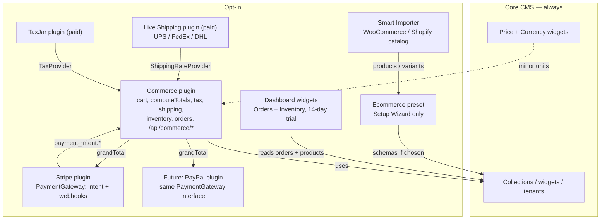

# E-Commerce Overview

SveltyCMS is a **headless CMS first**. Most installs never run a store. Commerce is therefore **opt-in**, not part of the boot path:

| Layer                 | What it is                                                                      | When it loads                                                                            |
| --------------------- | ------------------------------------------------------------------------------- | ---------------------------------------------------------------------------------------- |
| **Core CMS**          | Collections, widgets (including generic Price/Currency), RBAC, tenants          | Always                                                                                   |
| **Ecommerce preset**  | Optional Setup Wizard template: products, carts, orders, coupons, tax, shipping | Only if you pick **E-commerce**                                                          |
| **Smart Importer**    | WooCommerce (WXR/REST) and Shopify catalog → `products` (+ variants)            | Only when the plugin is **enabled**                                                      |
| **Dashboard widgets** | Commerce Orders + Commerce Inventory (freemium, 14-day trial)                   | Add from the dashboard picker; empty state if the preset is missing                      |
| **Commerce plugin**   | Cart, quotes, inventory, guest `/api/commerce/*` checkout                       | Only when the plugin is **enabled**                                                      |
| **Stripe plugin**     | Payment adapter: keys, Elements, PaymentIntent, webhooks                        | Only when **enabled** — also usable for memberships / gated content **without** Commerce |

**Do not put shipping, tax, coupons, or carts inside Stripe.** Stripe is one payment gateway. PayPal (or others) would implement the same `PaymentGateway` interface. Catalog + checkout belong in the Commerce plugin so a blog/SaaS/docs site never ships a store pipeline.

## Keep the core light (extensions, not a store kernel)

SveltyCMS stays a **CMS**. Checkout is an **add-on graph** you enable. That is how a docs site, SaaS admin, or brochure install avoids loading cart cookies, tax tables, Stripe SDK, and order menus.

There is **no fifth product type** called “API extension”. HTTP is either a **plugin `{ type: "route" }`** or a **catch-all handler** that refuses work until the matching plugin is on.

| Layer                           | Kind                                                   | In core boot?                                                       | Job                                                                                      | Stay out of core because                                                            |
| ------------------------------- | ------------------------------------------------------ | ------------------------------------------------------------------- | ---------------------------------------------------------------------------------------- | ----------------------------------------------------------------------------------- |
| **CMS kernel**                  | Always-on                                              | Yes                                                                 | Collections, RBAC, tenants, license manager, global rate limit, catch-all dispatcher     | This is the product. Keep it small.                                                 |
| **Field widgets**               | Content field (Definition + Input + Display)           | Only the widget you put on a schema                                 | Price / Currency on any entry — not only stores                                          | A widget cannot own sessions, HTTP, or inventory.                                   |
| **Dashboard widgets**           | Admin package (`widget.json`)                          | No — picker install                                                 | Orders / Inventory snapshots                                                             | Read-only chrome. Empty if `orders` / `products` are missing.                       |
| **Ecommerce preset**            | Setup Wizard template                                  | No — only if chosen                                                 | Collection **schemas** (`products`, `carts`, `orders`, …)                                | Data shape, not behavior. A blog that never picks it never lists those collections. |
| **Commerce plugin**             | `definePlugin`, **disabled**                           | No                                                                  | Cart, `computeTotals`, tax/shipping **table** quotes, inventory, guest `/api/commerce/*` | Store pipeline. Blogs must not boot it.                                             |
| **Payment plugin**              | `definePlugin` (Stripe today)                          | No                                                                  | `PaymentGateway`: intent + webhooks + Elements                                           | Card data and PSP keys. Usable for memberships **without** Commerce.                |
| **Live shipping / tax plugins** | Paid `definePlugin`                                    | No                                                                  | UPS/FedEx/DHL (`ShippingRateProvider`), TaxJar (`TaxProvider`)                           | Carrier/tax vendor SDKs and secrets. Table rates stay free inside Commerce.         |
| **Gated API handlers**          | Catch-all `handlers/commerce.ts`, `handlers/stripe.ts` | Dispatcher always exists; **logic** is behind `assertPluginEnabled` | CSRF, tenant, public cart/pay                                                            | Not a new extension kind. Disabled plugin → `403 COMMERCE_DISABLED`.                |

**What loads on a blog/SaaS install (Commerce off, no ecommerce preset):** kernel + whatever field widgets the content model uses. No carts collection, no `/shop`, no Stripe SDK, no order dashboard widgets unless someone adds them (they render empty).

**What loads on a store:** enable Commerce + (optional) Stripe + pick the ecommerce preset. Add dashboard widgets if you want admin snapshots. Add Live Shipping / TaxJar only if table rates are not enough.

That split is the performance rule: unused store code stays out of the boot path and out of the client bundle. Tree-shaken field widgets, disabled plugins, and picker-only dashboard packages are the four surfaces — plus gated handlers so guest HTTP does not invent a fifth.

### Why commerce stays opt-in (no fifth “API extension” type)

A headless CMS is often a marketing site, docs hub, or app backend — not a store. Shipping carts, tax, and order menus on every install would add unused collections and checkout code to those sites.

SveltyCMS already has four extension surfaces. HTTP APIs are **plugin routes** or **gated core handlers**, not a separate product type:

| Surface                      | Location                              | Role                                                                                                                                 |
| ---------------------------- | ------------------------------------- | ------------------------------------------------------------------------------------------------------------------------------------ |
| **Plugins** (`definePlugin`) | `src/plugins/<name>/`                 | Full-stack: `{ type: "route" }` HTTP APIs, hooks, schemas, settings. Disabled until enabled in Extensions.                           |
| **Field widgets**            | `src/widgets/`                        | Price, Currency, repeaters — content modeling, including non-store money fields                                                      |
| **Dashboard widgets**        | `src/routes/(app)/dashboard/widgets/` | Admin snapshots (Orders / Inventory). Empty if the preset is missing.                                                                |
| **Catch-all API handlers**   | `src/routes/api/[...path]/handlers/`  | Domain controllers (`commerce.ts`, `stripe.ts`) that call `assertPluginEnabled` so a disabled plugin returns `403 COMMERCE_DISABLED` |

`{ type: "route" }` on a plugin is registered in `pluginRouteRegistry` and dispatched by the catch-all API when the path is not a core namespace. Guest commerce stays on `/api/commerce/*` (dedicated handler) because CSRF, tenant, and public cart rules are domain-specific — still **off** until the Commerce plugin is enabled.

Setup Wizard **E-commerce** preset is independent: it only creates collections if that template is chosen. A blog install that never picks it never sees `products` / `orders` in the admin list.

### Plugin vs widget vs preset

A **cart widget** is not a substitute for a Commerce plugin.

In this CMS a [widget](../../development/widgets/widget-system-overview.mdx) is a **field type** (definition + Input + Display): Price, Currency, relation, repeater. It cannot own a guest session, HTTP routes, inventory decrement, or tax quotes.

| Piece                                             | Kind                                     | Role                                              |
| ------------------------------------------------- | ---------------------------------------- | ------------------------------------------------- |
| Ecommerce **preset**                              | Setup template                           | Optional **schemas** (`carts`, `orders`, …)       |
| Price / Currency                                  | **Field widgets** (core)                 | Store money on a product or line item             |
| Commerce Orders / Inventory                       | **Dashboard widgets** (freemium)         | Admin snapshot of `orders` / `products` stock     |
| Smart Importer (Woo / Shopify)                    | **Plugin**                               | Catalog **import**, not checkout                  |
| Line-items repeater / cart-line Display           | **Field widgets** (optional, Commerce)   | How a row _looks_ in admin or a storefront block  |
| Cart session, merge, totals, tax, shipping, stock | **Commerce plugin services**             | Behavior — not a field                            |
| Stripe Elements / payment status column           | **Stripe plugin UI**                     | How you **pay**                                   |
| Live UPS / FedEx / DHL                            | **Paid plugin** (`plugin:shipping-live`) | Live carrier quotes — not a shipping field widget |
| TaxJar                                            | **Paid plugin** (`plugin:taxjar`)        | Live sales tax — not a tax field widget           |

If Commerce is not a plugin, it still must not be “just a cart widget”. The remaining honest options are: (1) **Commerce plugin** (recommended — off unless enabled), or (2) core services that every install loads (rejected: this CMS is not always a store). There is no third option where a widget replaces checkout.

Storefront may still _render_ a cart with widgets/blocks; those call `/api/commerce/cart` from the plugin.

**Status (August 2026):** ecommerce **preset**, `Price` + `computeTotals`, **Commerce plugin** (guest cart, quotes, inventory, checkout — tenant-scoped), Stripe PaymentIntent from **server `grandTotal`**, Smart Importer Woo/Shopify catalog import, and two **freemium dashboard widgets**. Storefront `/shop`, `/cart`, `/checkout`, `/account/orders`, `/account/addresses`. Transactional mail via nodemailer + better-svelte-email. Commerce Pro (gift cards, bundles, custom panes, analytics) is license-gated.

Honest read: **guest checkout exists when the Commerce plugin is enabled.** Enable it in Extensions; pick the ecommerce preset for collections. Every commerce query uses `locals.tenantId`.

### Still open (not a separate plan file)

| Item                                                        | Notes                                      |
| ----------------------------------------------------------- | ------------------------------------------ |
| `ConditionPlugin` / AND-OR promotion groups                 | Not shipped                                |
| BOGO / tiered promotions, multi-warehouse, FX resolver      | Commerce Pro backlog                       |
| Stripe Billing (real subscriptions)                         | Endpoint is Pro-gated `501`                |
| `computeTotals` &lt; 5 ms benchmark                         | No commerce row in the matrix yet          |
| HTTP integration: cart → order → refund, two tenants        | Unit isolation exists; no integration file |
| Schema.org Product/Offer/Review, order emails already exist | Structured data on `/shop` not shipped     |

Remaining work lives on the [2026 roadmap](../../project/roadmap-2026.mdx), not in a parallel plan MDX.

### Progress vs like-for-like (public docs, August 2026)

Not a ranking. Like-for-like = self-hosted CMS that can run a store. Shopify is listed as a packaging reference (SaaS, not the same product class). Sources: Payload [ecommerce overview](https://payloadcms.com/docs/ecommerce/overview) and [RFC #14239](https://github.com/payloadcms/payload/discussions/14239); Drupal Commerce 2.x developer guide; WooCommerce.com feature list. Re-check those pages before a purchase decision.

| Capability                              | SveltyCMS (this tree)                                                                | Payload ecommerce plugin                                                                              | Drupal Commerce (modules)                       | WooCommerce (WordPress)                    |
| --------------------------------------- | ------------------------------------------------------------------------------------ | ----------------------------------------------------------------------------------------------------- | ----------------------------------------------- | ------------------------------------------ |
| Catalog schema (products, variants)     | **Shipped** (optional preset)                                                        | Documented native                                                                                     | Documented native                               | Documented native                          |
| Reviews                                 | **Shipped** (`product_reviews`)                                                      | Not listed as native                                                                                  | Contrib / custom                                | Native comments / plugins                  |
| Coupon / tax / shipping **data**        | **Shipped** (collections only)                                                       | Documented as native gaps / RFC                                                                       | Native tax + promotions; shipping often contrib | Native + extensions                        |
| Catalog import (Woo / Shopify)          | **Shipped** (Smart Importer; Woo/Shopify are Pro platforms)                          | Import paths vary by project                                                                          | Migrate modules                                 | N/A (it is the source)                     |
| Admin orders / inventory UI             | **Shipped** (2 freemium dashboard widgets, 14-day trial)                             | Documented as part of the plugin admin                                                                | Native order / product UIs                      | Native wp-admin                            |
| Cart session, merge, guest checkout     | **Shipped** (`src/plugins/commerce/`, opt-in)                                        | Documented native carts                                                                               | Native `commerce_cart`                          | Native                                     |
| Totals engine (tax/ship/coupon applied) | **Shipped** (`computeTotals` + `quotes.ts`)                                          | Documented native checkout; shipping/tax not native; Stripe adapter uses `cart.subtotal` (open issue) | Adjustments + order processors                  | Native cart totals                         |
| Inventory reserve / decrement           | **Shipped** (per-variant decrement/restore, `orderRef`)                              | Inventory fields documented; multi-warehouse not first-class                                          | Stock + order workflow                          | Native stock                               |
| Payments (Stripe)                       | **Shipped** (Elements, webhooks, server `grandTotal` intent)                         | Stripe adapter documented                                                                             | `commerce_payment` gateways                     | Stripe / other gateways as extensions      |
| Subscriptions / gift cards / bundles    | **Partial** (Pro-gated; Stripe Billing not wired)                                    | Documented native gaps / RFC                                                                          | Contrib                                         | Often paid extensions (e.g. Subscriptions) |
| Multi-tenancy                           | **Shipped** (`locals.tenantId` on every commerce query)                              | Not documented as built-in                                                                            | Typically one site / Domain Access              | Typically one site / multisite             |
| Public storefront                       | **Shipped** (`/shop`, `/cart`, `/checkout`, `/account/orders`, `/account/addresses`) | Template documented                                                                                   | Theme / storefront                              | Theme                                      |

**Where this puts us:** a guest can complete a priced checkout when Commerce + the ecommerce preset are enabled. Account order history, addresses, and transactional mail are in this tree. Still behind Drupal Commerce / WooCommerce on `ConditionPlugin`/BOGO promotions, Stripe Billing, and Schema.org Product/Offer markup. Like-for-like notes only — not a ranking.

---

## Architecture



A site that never enables Commerce or Stripe behaves like any other CMS. Enabling Stripe alone is enough for “paywall this entry”. Enabling Commerce + Stripe is a store. Enabling Commerce + a future PayPal plugin is the same checkout with a different PSP.

### What Drupal Commerce does when you “enable ecommerce”

Drupal core is also **not** a store. [Drupal Commerce](https://docs.drupalcommerce.org/v2/developer-guide/core/core/) (public docs, Commerce 2.x) is a **set of Drupal modules** you enable on top of core — the same idea as our optional Commerce plugin. Enabling it does **not** replace nodes/users; it **registers extra entity types** (Product, Variation, Order, Order item, Store, Payment) and **plugin managers** (Drupal’s small strategy plugins, not Drupal modules).

| Drupal Commerce piece (public docs)                                                                                                               | What enabling it adds                                                                                        | SveltyCMS analogue                                                                               |
| ------------------------------------------------------------------------------------------------------------------------------------------------- | ------------------------------------------------------------------------------------------------------------ | ------------------------------------------------------------------------------------------------ |
| Modules (`commerce_product`, `commerce_order`, `commerce_cart`, `commerce_payment`, `commerce_tax`, `commerce_promotion`, `commerce_checkout`, …) | Opt-in packages; unused sites never load them                                                                | **Commerce plugin** (`definePlugin`, off by default) + ecommerce **preset** for schemas          |
| `commerce_shipping` (**contrib**, not core Commerce)                                                                                              | Extra **adjustment types** (`shipping`, shipping promotion)                                                  | Shipping **service** inside Commerce, or a later add-on plugin that registers an adjustment type |
| **Adjustment types** + **order processors**                                                                                                       | Promotions, tax, fees (and shipping from contrib) applied on order refresh; order- or item-level; **weight** | `adjustment-engine.ts` (`computeTotals`)                                                         |
| **Price resolvers** (service chain)                                                                                                               | Resolve unit price from store/customer/currency before adjustments                                           | Price resolver inside Commerce; Stripe never picks the price                                     |
| **Conditions** (AND/OR plugin list)                                                                                                               | Gate promotions **and** payment gateways                                                                     | `conditions.ts` + `ConditionGroup`                                                               |
| **Offers** (`apply()` on order/item)                                                                                                              | How a promotion changes totals                                                                               | Coupon/promotion offer plugins                                                                   |
| **Payment gateway plugin** + config entity                                                                                                        | PSP implementation vs configured instance; conditions choose which gateway is offered                        | **Stripe plugin** implements `PaymentGateway`; PayPal would be another plugin                    |
| **Checkout flow** + **checkout panes**                                                                                                            | Flow = ordered panes (contact, shipping, payment, review); custom pane = new plugin in a custom module       | Commerce Pro: checkout flow + pane plugins (not a field widget)                                  |
| **State machine** (order/checkout workflows, guards)                                                                                              | Allowed transitions only                                                                                     | Order status guards (`pending` → `processing`, etc.)                                             |

**Take from Drupal:** optional module, payment as a **gateway plugin** (not the store), adjustments with weight, conditions on both promotions and gateways, checkout as **flow + panes**, shipping as an extra adjustment contributor.

**Do not copy:** Drupal’s PHP module + YAML + cache-rebuild cycle, or folding the store into core. SveltyCMS already has `definePlugin` parts (routes, schemas, capabilities, settings) — Commerce should use those so a non-store CMS never boots checkout.

Public sources: [Adjustments](https://docs.drupalcommerce.org/v2/developer-guide/pricing/adjustments/), [Conditions](https://docs.drupalcommerce.org/v2/developer-guide/core/conditions/), [Payments](https://docs.drupalcommerce.org/v2/developer-guide/payments/payments/), [Checkout](https://docs.drupalcommerce.org/v2/developer-guide/checkout/checkout/). Date-stamped August 2026.

Lookups (tax rates, zones, coupons) happen **before** `computeTotals`. The engine is a pure function so it can stay under the **&lt; 5 ms** budget (plan E2).

---

## What is in the product today

### Ecommerce preset

Enable **E-commerce** in the [Setup Wizard](../../guides/configuration/setup-wizard.mdx). Collections (verified `db_fieldName` values in `src/routes/setup/presets.ts`):

| Collection           | Role                                                                                                                                    |
| -------------------- | --------------------------------------------------------------------------------------------------------------------------------------- |
| `products`           | Catalog: price, SKU, inventory, **variants** (own SKU / price / inventory), categories, media, `downloadable` flag                      |
| `product_categories` | Nested categories                                                                                                                       |
| `product_reviews`    | Rating + visibility (`approved` boolean)                                                                                                |
| `coupons`            | `percentage`, `fixed_cart`, `fixed_product`, `free_shipping`; server-managed `usedCount`                                                |
| `tax_rates`          | `country`, **`state`**, `rate`, `label`, **`shippingTaxable`**                                                                          |
| `shipping_zones`     | **`name`**, `countries`, `method`, `rate`, **`freeThreshold`**                                                                          |
| `carts`              | `sessionId`, customer, items, subtotal, coupon, `expiresAt`                                                                             |
| `orders`             | Line items, totals (`total`/`totalCents`/`currency`), addresses, **status** (see below), server-managed `inventoryCommitted` + `cartId` |

Headless storefronts already read catalog via `/api/collections/products` (auth + publication policy apply). Checkout **services** are not on that path yet.

### Catalog import — Smart Importer (shipped)

The [Smart Importer](../../../src/plugins/smart-importer/smart-importer.mdx) plugin maps an existing store catalog into the ecommerce **preset**. It does **not** run checkout.

| Source          | Format                                        | What lands                                                                |
| --------------- | --------------------------------------------- | ------------------------------------------------------------------------- |
| **WooCommerce** | WXR XML or REST JSON (`--format=woocommerce`) | `products` with nested `product_variation`, SKU, price, sale price, stock |
| **Shopify**     | Products JSON / CSV (`--format=shopify`)      | Same `ecommerce` block (SKU, price, inventory, variants)                  |

Enable the plugin (Admin → Config → Migration tile), then import into `products`. Mixed WordPress dumps (posts + products) still use `--format=wordpress`; product items also get an `ecommerce` block from `_sku` / `_price` / `_stock` meta. Platform guide: [WordPress migration](../../../src/plugins/smart-importer/docs/wordpress-migration.mdx) (WooCommerce section). Editorial path: [Migration & Data Operations](../../guides/content/migration-and-import.mdx).

After import, add the Commerce Orders / Inventory **dashboard widgets** to watch stock and recent orders (empty until you have those collections and data).

### Admin dashboard widgets (shipped)

Two marketplace-portable packages under `src/routes/(app)/dashboard/widgets/`. **Freemium** — 14-day key-less trial, then `checkExtensionLicense("dashboard", id)`. Not a cart widget.

| Widget             | Marketplace id                          | Endpoint                                | Reads                                  |
| ------------------ | --------------------------------------- | --------------------------------------- | -------------------------------------- |
| Commerce Orders    | `dashboard:commerce-orders` · €12.99    | `GET /api/dashboard/commerce-orders`    | `orders`                               |
| Commerce Inventory | `dashboard:commerce-inventory` · €12.99 | `GET /api/dashboard/commerce-inventory` | `products` (variant-aware `inventory`) |

Add them from the dashboard widget picker. Missing preset collections → empty state, not 404. After trial without a key: `<UpgradePrompt>` on the client and `403 LICENSE_REQUIRED` on the API. Details: [Dashboard widgets](../../development/dashboard/index.mdx), [Dashboard API](../api/dashboard.mdx).

### Order status

Preset options (do not invent `paid` / `fulfilled`):

`pending` · `processing` · `shipped` · `delivered` · `cancelled` · `refunded`

Mapping when integrating gateways: **paid → `processing`**, **fulfilled → `shipped`**. Guards in `order-service.ts`: `cancelled` only from `pending` or `processing`.

### Price calculator (shipped)

`src/services/commerce/types.ts` + `price.ts` — integer minor units, `CurrencyMismatchError`, rounding (JPY 0 decimal places; EUR/USD/CHF 2). Tests: `tests/unit/services/commerce/price.test.ts`.

This helper is **not** a reason to boot commerce on every CMS. Checkout imports it from the Commerce plugin path so unused installs do not run cart HTTP.

```typescript
import { money, add, roundForCurrency } from "@src/services/commerce/price";

const subtotal = money(1999, "EUR"); // €19.99
const shipping = roundForCurrency(4.5, "EUR"); // 450
const total = add(subtotal, shipping); // 2449
```

### Stripe plugin (payments only)

Stripe stays a **payment plugin**. It must not grow into a store: no shipping tables, no tax engine, no cart.

| Shipped                                                 | Stripe’s job                                                                | Not Stripe’s job                                             |
| ------------------------------------------------------- | --------------------------------------------------------------------------- | ------------------------------------------------------------ |
| Tenant-aware keys, Elements, webhook signature + upsert | Create/confirm PaymentIntent; map `succeeded` / `failed` / later `refunded` | Cart, coupons, tax, shipping, inventory, order state machine |
| Payment status column on entries                        | Accept `grandTotal` from Commerce **or** a simple amount for gated content  | Trust client `amount` as the charge                          |

When Commerce is enabled, Stripe receives **server `grandTotal`**. When Commerce is off, Stripe can still charge a single amount (membership, donation, paywalled entry). Plugin docs: [stripe.mdx](../../../src/plugins/stripe/stripe.mdx).

### Field widgets

[Price](../../../src/widgets/custom/price/price.mdx) and [Currency](../../../src/widgets/custom/currency/currency.mdx) store money on entries. The commerce `Price` type is the **service-layer** representation (cents + ISO code) used by totals — keep them aligned when wiring the engine. Admin **dashboard widgets** (Orders / Inventory) are a separate package type — see above.

---

## Commerce plugin (shipped, disabled by default)

Home: **`src/plugins/commerce/`** (`definePlugin`, **disabled by default**). Enable in Extensions. Core CMS does not register checkout unless the plugin is on. Guest HTTP is `/api/commerce/*` — **not** `/api/plugins/commerce` (`plugins:execute` is never required).

| Layer   | Module                                       | Notes                                                                                                                         |
| ------- | -------------------------------------------- | ----------------------------------------------------------------------------------------------------------------------------- |
| Totals  | `src/services/commerce/adjustment-engine.ts` | `subtotal → adjustments[]` (promotion / fee / shipping / tax + **weight**) → `grandTotal`                                     |
| Cart    | `cart-service.ts`                            | Guest `sessionId`, expiry, max items, **merge on login**                                                                      |
| Quotes  | `quotes.ts`                                  | Coupon (4 preset types), tax (`country`/`state`/`shippingTaxable`), shipping (`freeThreshold`)                                |
| Stock   | `inventory-service.ts`                       | Decrement / restore **per variant**; idempotent `orderRef`                                                                    |
| Orders  | `order-service.ts`                           | Cart → order, status guards, refund restores stock                                                                            |
| HTTP    | `/api/commerce/*` catch-all                  | Guest cart/checkout **public + CSRF**; dedicated rate-limit **lane**; **not** `plugins:execute`; order **read** authenticated |
| Gateway | `PaymentGateway` + Stripe                    | `POST /api/commerce/pay` uses `order.totalCents`                                                                              |
| Tenancy | `tenant.ts` + `CommerceStore`                | `locals.tenantId` on every query; cookie holds session id only                                                                |

**PaymentIntent amount** is the **server** `grandTotal` (`POST /api/commerce/pay` with `orderId` only). Confirm compares Stripe amount to `order.totalCents` (F1). Webhooks are tenant-scoped (`stripeIntentId` + `tenantId`).

---

## Monetization (marketplace, same as widgets/plugins)

Commerce is **not** a paid cart widget. It uses the existing [license manager](../../../src/utils/license-manager.ts) and the three marketplace tiers already documented for [widgets](../../development/widgets/marketplace.mdx): **Free**, **Freemium (14-day key-less trial)**, **Paid**.

`checkExtensionLicense(type, id)` → marketplace `POST /api/v1/license/verify` with `extension: "plugin:commerce"` (or `"plugin:stripe"`). Keys: `LICENSE_KEY_PLUGIN_COMMERCE` or master `LICENSE_KEY`. 14-day trial is keyed off the first admin’s `createdAt` (same as widgets). Fail-open only when a key is configured and the marketplace is down.

### Recommended SKU split (four streams, one license system)

Keep **one** plugin id `plugin:commerce` (do not ship a second `plugin:commerce-pro` toggle). Free checkout stays on; Pro is `requireCommercePro()` / field strip. Payment PSPs and live carriers are **separate plugins** so a membership site can buy Stripe without a store, and a store can add UPS later without a Commerce Pro bundle rewrite.

| Stream                     | What it is                                                                                           | License id                                                                                           | Notes                                                                                                                                       |
| -------------------------- | ---------------------------------------------------------------------------------------------------- | ---------------------------------------------------------------------------------------------------- | ------------------------------------------------------------------------------------------------------------------------------------------- |
| **A. Commerce plugin**     | Free cart/checkout; Pro unlocks bundles, gift cards, subscriptions, BOGO/tiered, multi-warehouse, FX | `plugin:commerce`                                                                                    | Indicative Pro **€79 / year** or lifetime list on marketplace.sveltycms.com. Same 14-day trial as other plugins.                            |
| **B. Marketplace add-ons** | Dashboard widgets, **Live Shipping**, **TaxJar**, invoice/PDF packs                                  | `dashboard:commerce-orders`, `dashboard:commerce-inventory`, `plugin:shipping-live`, `plugin:taxjar` | Widgets **€12.99**; live carriers / TaxJar are **Paid plugins** (not field widgets). Platform fee is a marketplace term, not CMS code.      |
| **C. Payment plugins**     | Stripe (shipped), future PayPal / others                                                             | `plugin:stripe`, `plugin:paypal`                                                                     | Application fees (Stripe Connect) are a **payments-platform** contract, not `checkExtensionLicense`. Do not mix Connect fees with SLM keys. |
| **D. Managed cloud**       | Hosted instances, backups, Redis                                                                     | SaaS SKU, not an extension id                                                                        | Roadmap item; license-manager does not bill monthly hosting.                                                                                |

Live UPS / FedEx / DHL and TaxJar are **paid plugins** (`plugin:shipping-live`, `plugin:taxjar`) on the Commerce `ShippingRateProvider` / `TaxProvider` ports — same idea as Stripe on `PaymentGateway`. They are **not** field widgets and **not** Commerce Pro. Unlicensed or disabled: guest checkout keeps free `shipping_zones` / `tax_rates` (no guest `403`). A tracking or tax-report **dashboard widget** would be a later SKU; it would not replace the quote plugins.

### What to sell vs what stays free

Give away a working store so people adopt the CMS; charge for extras that other ecosystems often sell as paid add-ons (subscriptions, gift cards, live carriers — verify current third-party pricing before any public comparison).

| SKU                                            | Marketplace id                 | Tier                        | Includes                                                                                                                                                       | After trial / without key                                                         |
| ---------------------------------------------- | ------------------------------ | --------------------------- | -------------------------------------------------------------------------------------------------------------------------------------------------------------- | --------------------------------------------------------------------------------- |
| Ecommerce **preset**                           | — (Setup Wizard)               | Free                        | Collections only                                                                                                                                               | Always available if the template is chosen                                        |
| Price / Currency **widgets**                   | core widgets                   | Free                        | Money fields                                                                                                                                                   | Never gated                                                                       |
| **Smart Importer** (catalog)                   | `plugin:smart-importer`        | **Freemium** (already)      | WooCommerce WXR/REST + Shopify JSON/CSV → `products`                                                                                                           | 5 platforms free; extra store platforms (Shopify, Woo, …) are Pro                 |
| **Commerce** (plugin)                          | `plugin:commerce`              | **Freemium**                | Cart, `computeTotals`, tax, shipping quotes, 4 coupon types, per-variant inventory, guest `/api/commerce/*`, order/refund machine, Stripe `grandTotal` handoff | Basic checkout **keeps working**; Pro features strip / `403 LICENSE_REQUIRED`     |
| **Commerce Pro** (same plugin, premium fields) | `plugin:commerce`              | Paid add-on inside Freemium | Checkout flows + panes, gift cards, bundles, BOGO/tiered promotions, multi-location inventory, subscriptions, multi-currency resolver                          | `UpgradePrompt` in admin; server strips Pro payloads                              |
| **Stripe**                                     | `plugin:stripe`                | Freemium (already)          | One-time PaymentIntent + webhooks                                                                                                                              | Subscriptions / invoices / analytics already stripped in `beforeSave`             |
| **Commerce Orders** (dashboard widget)         | `dashboard:commerce-orders`    | **Freemium** · €12.99       | Recent orders + status mix from the `orders` collection                                                                                                        | `UpgradePrompt`; `GET /api/dashboard/commerce-orders` → `403 LICENSE_REQUIRED`    |
| **Commerce Inventory** (dashboard widget)      | `dashboard:commerce-inventory` | **Freemium** · €12.99       | Low-stock / out-of-stock, variant-aware `inventory`                                                                                                            | `UpgradePrompt`; `GET /api/dashboard/commerce-inventory` → `403 LICENSE_REQUIRED` |
| **Live Shipping** (UPS / FedEx / DHL)          | `plugin:shipping-live`         | **Paid** · ~€24.99          | Live carrier quotes via `ShippingRateProvider`; sandbox `testRateCents` until carrier HTTP is keyed                                                            | After trial, checkout **keeps table rates** until a key is active                 |
| **TaxJar**                                     | `plugin:taxjar`                | **Paid** · ~€19.99          | Live sales-tax via `TaxProvider`; sandbox `testRatePercent` until TaxJar HTTP is keyed                                                                         | After trial, checkout **keeps `tax_rates`** until a key is active                 |
| Future **PayPal** (etc.)                       | `plugin:paypal`                | Paid or Freemium            | Another `PaymentGateway`                                                                                                                                       | Independent license                                                               |

Do **not** license-gate: enabling the Commerce plugin, adding to cart, coupon validate, tax/shipping quote, or placing an order with the four preset coupon types. That would make “CMS that is not always a store” painful and would hide the free core. **Do** license-gate admin extras: the Commerce Orders and Commerce Inventory dashboard widgets (14-day key-less trial, then `checkExtensionLicense("dashboard", id)`). They never load a store into a blog install — if the ecommerce preset collections are missing, the widgets render an empty state.

Dashboard widget SKUs (`dashboard:commerce-orders`, `dashboard:commerce-inventory`) use the same 14-day trial as [dashboard marketplace](../../development/dashboard/marketplace.mdx). Listing them on marketplace.sveltycms.com is what turns verify-404 (local/free) into a paid SKU after the trial. See [Admin dashboard widgets](#admin-dashboard-widgets-shipped) above.

Indicative list prices: **Commerce Pro ~€79 / year** (or a lifetime SKU on the marketplace); Stripe plugin ~€4.99; dashboard widgets €12.99. Stripe stays its own SKU so a membership site can pay for Stripe Pro without buying a store. List the packages on marketplace.sveltycms.com or verify-404 treats them as local/free.

### Enforcement (must match widgets)

**Server (source of truth)** — plugin routes and `beforeSave` / order hooks:

```typescript
import { checkExtensionLicense } from "@src/utils/license-manager";

const status = await checkExtensionLicense("plugin", "commerce");
if (!status.active) {
  // 403 LICENSE_REQUIRED on Pro endpoints (gift cards, subscriptions, …)
  // Strip Pro fields on save — never persist unlicensed data
}
```

**Client** — admin Commerce settings / pane builder:

```svelte
<UpgradePrompt extensionId="plugin:commerce" price="€24.99" />
```

Same pattern as [dashboard marketplace](../../development/dashboard/marketplace.mdx) and Stripe’s premium-field strip. Listing the package on marketplace.sveltycms.com as `plugin:commerce` is what makes verify return 404 (treated as free/local) vs a paid SKU.

---

## Security

| Risk                | Rule                                                                                                                                                                           |
| ------------------- | ------------------------------------------------------------------------------------------------------------------------------------------------------------------------------ |
| Amount manipulation | Never take PaymentIntent amount from the client                                                                                                                                |
| Coupon abuse        | Server-side expiry / usage / minSpend; audit usage                                                                                                                             |
| Webhook spoofing    | Stripe signature (exists) + event upsert (exists)                                                                                                                              |
| Inventory races     | Decrement only when `inventoryQty >= qty`; retry; `orderRef`                                                                                                                   |
| IDOR / tenants      | `tenantId` in every commerce query                                                                                                                                             |
| CSRF                | Same pattern as other mutating admin/API routes                                                                                                                                |
| Guest checkout DoS  | Dedicated `/api/commerce` rate-limit lane (`handle-rate-limit.ts` + WAF `/api/commerce` 60/min). Coupon/pay/checkout cost 4× a cart mutation. Isolated from admin API buckets. |
| PCI                 | Card data stays in Stripe Elements; store `stripePaymentIntentId` only                                                                                                         |
| Guest checkout      | Do not require `plugins:execute` on public cart/checkout                                                                                                                       |

---

## Multi-tenancy

Core CMS already scopes collections by `tenantId`. Commerce uses the same filter on carts, orders, coupons, tax rates, shipping zones, and inventory (`CommerceStore` / `requireCommerceTenantId`). Stripe keys are resolved per tenant (`getStripe()`). Unit isolation: `tests/unit/plugins/commerce.test.ts`. HTTP two-tenant cart→order is still open.

---

## Tests

| Suite                                                 | Covers                                                               |
| ----------------------------------------------------- | -------------------------------------------------------------------- |
| `tests/unit/services/commerce/price.test.ts`          | Integer-cent math, rounding, currency mismatch                       |
| `tests/unit/plugins/commerce.test.ts`                 | Tenant isolation, cart merge, totals, F1, variant matrix, digital    |
| `tests/unit/hooks/rate-limit.test.ts`                 | Dedicated `/api/commerce` lane isolated from admin mutations         |
| `tests/unit/plugins/commerce-fulfillment.test.ts`     | Paid Live Shipping / TaxJar: live quote vs table-rate fallback       |
| `tests/unit/api/collections.test.ts`                  | Admin collection `POST /batch` delete / status / clone / schedule    |
| `tests/integration/api/collections-mutations.test.ts` | HTTP create → update → schedule → bulk publish → clone → bulk delete |

HTTP `/api/commerce` cart→order→refund (two tenants) is not in the integration suite yet. Collection mutations are a separate contract (content entries, not checkout).

---

## Related

| Doc                                                                                                   | Why                                                       |
| ----------------------------------------------------------------------------------------------------- | --------------------------------------------------------- |
| [Roadmap 2026](../../project/roadmap-2026.mdx)                                                        | Remaining commerce backlog                                |
| [Competitive comparison](../../project/competitive-comparison.mdx)                                    | Commerce packaging table                                  |
| [Setup Wizard](../../guides/configuration/setup-wizard.mdx)                                           | Ecommerce preset                                          |
| [Site Starter](../../development/site-starter.mdx)                                                    | Public `/shop`, `/cart`, `/checkout`, `/account`          |
| [Smart Importer](../../../src/plugins/smart-importer/smart-importer.mdx)                              | Shopify JSON + WooCommerce WXR/REST catalog → `products`  |
| [WordPress / WooCommerce migration](../../../src/plugins/smart-importer/docs/wordpress-migration.mdx) | WXR + `--format=woocommerce` catalog path                 |
| [Migration & Data Operations](../../guides/content/migration-and-import.mdx)                          | Admin Migration tile                                      |
| [Dashboard widgets](../../development/dashboard/index.mdx)                                            | Commerce Orders + Inventory packages, 14-day trial        |
| [Dashboard API](../api/dashboard.mdx)                                                                 | `/api/dashboard/commerce-orders` and `commerce-inventory` |
| [Widget marketplace licensing](../../development/widgets/marketplace.mdx)                             | Free / Freemium / Paid + `checkExtensionLicense`          |
| [Marketplace](./marketplace.mdx)                                                                      | Catalog, `plugin:commerce` listing, license verify        |
| [Live Shipping](../../../src/plugins/shipping-live/shipping-live.mdx)                                 | Paid UPS / FedEx / DHL plugin                             |
| [TaxJar](../../../src/plugins/taxjar/taxjar.mdx)                                                      | Paid live tax plugin                                      |
