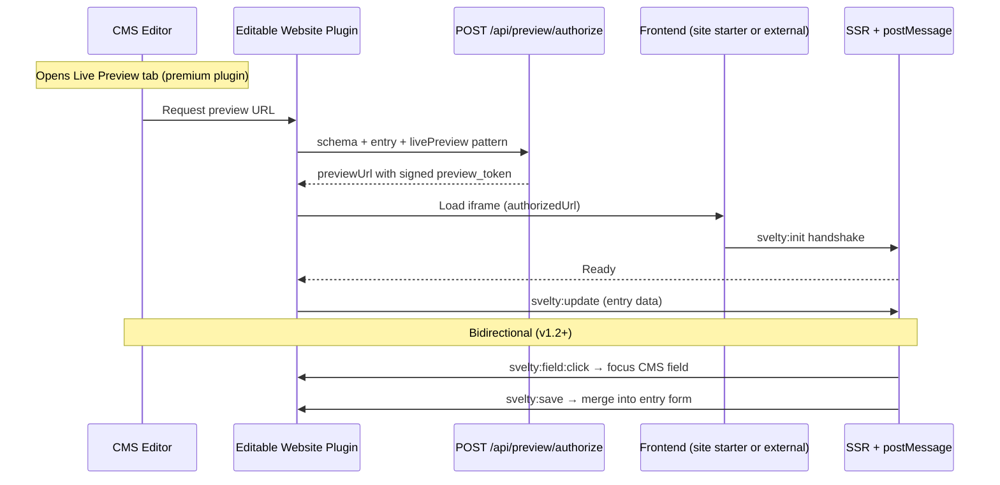

# Live Preview Architecture

SveltyCMS implements an **Enterprise Handshake Protocol** for Live Preview. Signed preview tokens establish draft sessions; a `postMessage` bridge keeps the CMS editor and frontend preview in sync.

Live preview is delivered by the **[Editable Website & Live Preview](/src/plugins/editable-website/editable-website.mdx)** plugin — a **premium marketplace extension** (€14.99, 14-day trial). The CMS core, APIs, and optional [SvelteKit Site Starter](/docs/development/site-starter.mdx) work without the plugin; the plugin adds the **Live Preview tab**, bidirectional iframe sync, and click-to-edit.

---

## Deployment Options

| Approach                                                                 | Best for                                   | Live Preview plugin                                       |
| ------------------------------------------------------------------------ | ------------------------------------------ | --------------------------------------------------------- |
| **[Site Starter](/docs/development/site-starter.mdx)** (`routes/(site)`) | Same-repo SvelteKit, zero extra dev server | Recommended — previews same-origin `/`                    |
| **External SvelteKit / Astro / Next.js**                                 | Production decoupled frontends             | Required for iframe tab; implement protocol in your theme |
| **API-only headless**                                                    | Mobile apps, static exports                | Optional — no iframe UI without the plugin                |

---

## Architecture Overview

This "Handshake" architecture solves three critical enterprise challenges:

| Challenge       | Solution                                                                                          |
| --------------- | ------------------------------------------------------------------------------------------------- |
| **Security**    | Prevents unauthorized access to draft content via a shared Secret Token                           |
| **Stability**   | Sets Server-Side Cookies to ensure A/B tests and draft modes work with SSR (no layout shift)      |
| **Reliability** | Initializes the session on the correct domain, bypassing 3rd-party cookie restrictions in iframes |



---

## 1. CMS Configuration

### Enable the premium plugin

1. Purchase or start the **14-day trial** for [Editable Website & Live Preview](/src/plugins/editable-website/editable-website.mdx) on [marketplace.sveltycms.com](https://marketplace.sveltycms.com)
2. Enable the plugin for your tenant (**Config → Plugins**)
3. Add `plugins: ["editable-website"]` on collections that should show the Live Preview tab

### Collection `livePreview` pattern

Use a URL pattern (relative for same-origin site starter, absolute for external frontends):

```typescript
// config/collections/pages.ts — Website Starter preset
export default {
  _id: "pages",
  livePreview: "/{slug}?lang={lang}",
  plugins: ["editable-website"],
  fields: [/* ... */],
};
```

| Placeholder      | Resolves to                               |
| ---------------- | ----------------------------------------- |
| `{slug}`         | Entry slug (`home` → `/` on site starter) |
| `{lang}`         | Active content language                   |
| `{_id}` / `{id}` | Entry database id                         |

For external domains:

```typescript
livePreview: "https://www.example.com/{slug}?lang={lang}",
```

### System settings

- **`PREVIEW_SECRET`** (private) — HMAC signing key for `preview_token` (fail-closed if missing)
- **`HOST_PROD` / `HOST_DEV`** — Base URL when `livePreview` is a relative path
- **`SITE_STARTER_ENABLED`** (public, default `true`) — Toggle the in-repo site starter at `/`

---

## 2. Frontend Implementation

### Built-in: SvelteKit Site Starter

If you use the [Site Starter](/docs/development/site-starter.mdx), these routes are already implemented:

| Route                         | Purpose                                                  |
| ----------------------------- | -------------------------------------------------------- |
| `POST /api/preview/authorize` | CMS generates signed `previewUrl` (plugin calls this)    |
| `GET /api/preview`            | Validates token, sets `cms_draft_mode` cookie, redirects |
| `routes/(site)/*`             | Public pages with `createSitePreviewBridge()`            |

### External frontends: handshake endpoint

For decoupled SvelteKit/Astro/Next apps, add a preview route that validates the signed token (or legacy shared secret) and sets draft cookies.

**Example: `src/routes/api/preview/+server.ts`**

```typescript
import { redirect, error } from "@sveltejs/kit";
import { previewService } from "$lib/preview"; // wrap SveltyCMS validateToken

export async function GET({ url, cookies }) {
  const token = url.searchParams.get("preview_token");
  const slug = url.searchParams.get("slug") || "/";

  if (!token) throw error(400, "Missing preview_token");

  const validated = previewService.validateToken(token);
  if (!validated.valid) throw error(401, "Invalid or expired token");

  cookies.set("cms_draft_mode", "true", {
    path: "/",
    httpOnly: true,
    sameSite: "none",
    secure: true,
    maxAge: 60 * 60,
  });

  throw redirect(307, slug);
}
```

### Middleware Integration (hooks.server.ts)

If your frontend uses the SveltyCMS Middleware (`handleApiRequests.ts`) to guard `/api/*` routes, you must whitelist the preview endpoint.

Since the CMS iframe might not share the user's login session (especially in cross-domain multi-tenancy), this endpoint relies on the **Secret Token** for security, not the User Session.

Update `src/databases/auth/apiPermissions.ts` or your whitelist logic:

```
// Allow public access to the preview endpoint
export const API_PERMISSIONS = {
  // ... existing permissions ...
  "api:preview": ["*"], // Allow all (guarded by Secret inside the endpoint)
};
```

Or update `handleApiRequests.ts` logic:

```
function isPublicApiRoute(pathname: string, method?: string): boolean {
  // ... existing checks ...

  // Allow Handshake Endpoint
  if (pathname === "/api/preview") return true;

  return false;
}
```

---

## 3. Data Fetching (Draft Mode)

Your page load functions should check for the cookie set by the handshake.

```
// src/routes/posts/[slug]/+page.server.ts
export const load = async ({ cookies, params }) => {
  const isDraft = cookies.get("cms_draft_mode") === "true";
  const variant = cookies.get("ab_test_variant") || "A";

  // Fetch from CMS
  const post = await cms.getPost(params.slug, {
    draft: isDraft, // Fetch draft if cookie exists
    variant: variant,
  });

  return { post };
};
```

---

## 4. Real-Time Updates (postMessage Protocol v1.2)

After SSR load, the frontend and CMS communicate via `postMessage`. Types live in `src/plugins/editable-website/types.ts`.

| Message                  | Direction      | Purpose                              |
| ------------------------ | -------------- | ------------------------------------ |
| `svelty:init`            | Frontend → CMS | Handshake ready                      |
| `svelty:update`          | CMS → Frontend | Push entry data on every edit        |
| `svelty:field:click`     | Frontend → CMS | Click-to-edit — focus CMS field      |
| `svelty:field:select`    | CMS → Frontend | Highlight field in preview           |
| `svelty:save`            | Frontend → CMS | Merge visual edits into entry form   |
| `svelty:document:update` | Frontend → CMS | Targeted field update (svedit-ready) |
| `svelty:edit-mode`       | CMS → Frontend | Toggle visual editing                |

### Frontend helper (framework-agnostic)

```typescript
import { createLivePreviewListener } from "@utils/preview";

// Site starter uses createSitePreviewBridge() for bidirectional save
const { destroy } = createLivePreviewListener({
  onUpdate: (data) => {
    /* merge into page state */
  },
  visualEditing: true,
});
```

Mark editable elements with `data-svelty-field="fieldName"` matching CMS `db_fieldName` values.

---

## 5. Performance Optimization: Deferred Rendering

In 2026, SveltyCMS implemented **Deferred Rendering** to maximize Admin UI performance.

- **Lazy Handshake**: The preview iframe and authorized URL handshake are deferred until the user first clicks the "Live Preview" tab. This saves significant CPU and network resources on initial page loads.
- **Dormant State**: When a user switches away from the Live Preview tab, the iframe remains mounted but enters a "Dormant" (paused) state. This ensures that switching back to the preview is instantaneous without re-triggering the handshake.
- **Manual Override**: A manual "Initialize Preview Now" button is available if an editor needs to force-start the preview before switching tabs.

---

## 6. Enterprise Considerations

### A/B Testing Stability

This architecture is superior for A/B testing because the variant is established via **Cookie before the page renders**.

| Approach              | Behavior                                                                                                       |
| --------------------- | -------------------------------------------------------------------------------------------------------------- |
| **Without Handshake** | `?variant=B` query param. If the user clicks a link, the param is lost, and they might flip back to Variant A. |
| **With Handshake**    | The cookie persists. The user stays in Variant B for the entire session.                                       |

### Cache Control & Treeshaking

- **Headers**: The handshake endpoint should set `Cache-Control: no-store` to prevent CDN caching of the redirect.
- **Optimization**: The preview logic is isolated in `/api/preview`. It adds zero JavaScript bundle size to your actual production pages.

---

## Comparison

| Feature                  | Direct URL (`?preview=true`) | API Handshake (`/api/preview`)   |
| ------------------------ | ---------------------------- | -------------------------------- |
| **Security**             | ❌ Low (Guessable)           | ✅ High (Token guarded)          |
| **Multi-Tenant Cookies** | ❌ Blocked by Safari         | ✅ Works (First-party context)   |
| **A/B Consistency**      | ⚠️ Query Param based         | ✅ Cookie based (Session sticky) |
| **Setup Effort**         | Low                          | Medium (One-time endpoint setup) |

> [!IMPORTANT]
> Use the API Handshake method for all production deployments.

---

## Related Documentation

- [SvelteKit Site Starter](/docs/development/site-starter.mdx) — Optional in-repo public frontend
- [Editable Website Plugin](/src/plugins/editable-website/editable-website.mdx) — Premium live preview (€14.99)
- [fields Component](/docs/reference/components/fields.mdx) — Entry editor with Live Preview tab
- [Unified Error Handling](/docs/development/error-handling.mdx) — API error handling patterns
- [Widget System Overview](/docs/development/widgets/widget-system-overview.mdx) — Widget architecture
