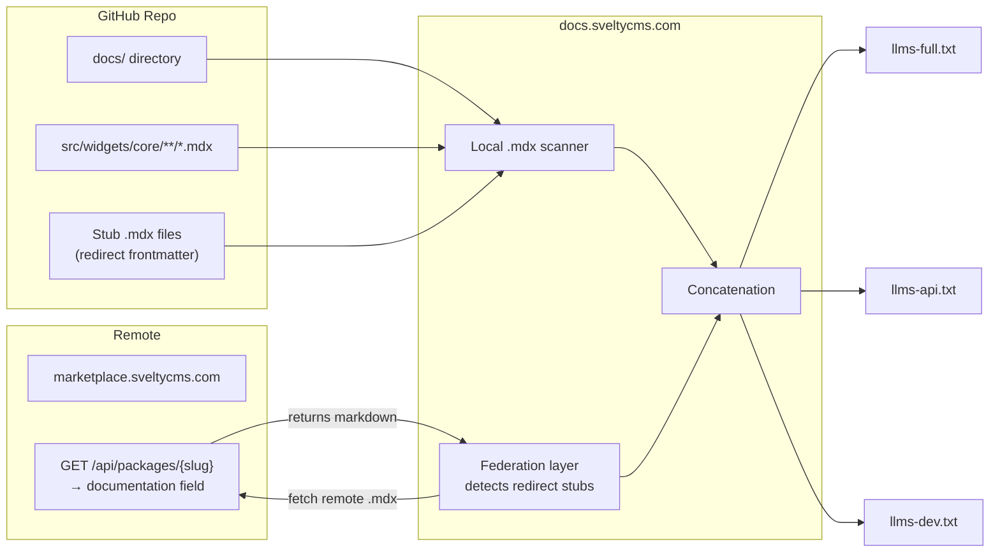

# Marketplace System

SveltyCMS connects to the hosted marketplace at **marketplace.sveltycms.com** for plugin discovery, license verification, and one-click installation. Combined with the [AI Widget Scaffolder](../../development/ai-integration.mdx), this provides two complementary paths for extending the CMS.

## Architecture

```mermaid
flowchart TD
    subgraph Local["Local CMS"]
        CLI["CLI: bun marketplace"]
        ADMIN["Admin UI"]
        INSTALL["installPlugin()"]
        SCAFFOLD["AI Widget Scaffolder"]
    end

    subgraph Remote["marketplace.sveltycms.com"]
        AUTH["POST /api/login"]
        REGISTER["POST /api/register"]
        PACKAGES["GET /api/packages"]
        DETAIL["GET /api/packages/{slug}"]
        CREATE["POST /api/packages"]
        UPLOAD["POST /api/upload (50MB)"]
        DOWNLOAD["GET /api/download/{id}"]
        CHECKOUT["POST /api/checkout"]
        WEBHOOK["POST /api/webhooks/stripe"]
        LICENSE_V1["POST /api/v1/license/verify"]
        EXTENSIONS["GET /api/v1/extensions"]
        EXT_ACTION["POST /api/v1/extensions/{type}/{action}"]
    end

    CLI -->|"browse/search"| PACKAGES
    ADMIN -->|"discover"| PACKAGES
    CLI -->|"details"| DETAIL
    INSTALL -->|"purchase-verified"| DOWNLOAD
    ADMIN -->|"publish"| CREATE
    ADMIN -->|"upload package"| UPLOAD
    CLI -->|"verify license"| LICENSE_V1
    ADMIN -->|"checkout"| CHECKOUT
    STRIPE["Stripe"] -.->|"events"| WEBHOOK

    SCAFFOLD -->|"generate from config"| LOCAL_WIDGETS["src/widgets/core/"]
    INSTALL -->|"write files"| LOCAL_PLUGINS["src/plugins/"]

    AUTH --> STORE[(Marketplace DB)]
    REGISTER --> STORE
    PACKAGES --> STORE
    DOWNLOAD --> STORE
    LICENSE_V1 --> STORE
    EXT_ACTION --> STORE


```



## Marketplace API (marketplace.sveltycms.com)

| Method | Endpoint                             | Description                                        |
| :----- | :----------------------------------- | :------------------------------------------------- |
| `GET`  | `/api`                               | Health check + endpoint index                      |
| `POST` | `/api/login`                         | Authentication (bcrypt)                            |
| `POST` | `/api/logout`                        | Clear session                                      |
| `POST` | `/api/register`                      | User registration                                  |
| `GET`  | `/api/packages`                      | List packages (type, category, search, pagination) |
| `POST` | `/api/packages`                      | Create package (authenticated)                     |
| `GET`  | `/api/packages/{slug}`               | Package detail with versions                       |
| `POST` | `/api/checkout`                      | Create Stripe Checkout Session                     |
| `POST` | `/api/upload`                        | Upload package file (multipart, 50MB max)          |
| `GET`  | `/api/download/{id}`                 | Download package (purchase-verified)               |
| `POST` | `/api/webhooks/stripe`               | Stripe webhook handler                             |
| `POST` | `/api/v1/license/verify`             | Validate license key                               |
| `GET`  | `/api/v1/extensions`                 | List available extension types                     |
| `POST` | `/api/v1/extensions/{type}/{action}` | Premium extension logic                            |

## Two Paths to Extend

| Path                    | How                                                     | Best For                                 |
| ----------------------- | ------------------------------------------------------- | ---------------------------------------- |
| **Marketplace Install** | Browse → Download → `installPlugin()`                   | Ready-made plugins, themes, integrations |
| **AI Scaffolder**       | Describe → `scaffoldWidget(config)` → 3 files generated | Custom widgets unique to your project    |

The marketplace hosts community-built plugins. The scaffolder generates custom code on demand. Together they cover the full spectrum from "I need a Stripe integration" to "I need a very specific testimonial carousel."

## Marketplace Client API

### List plugins

```typescript
import { marketplace } from "@src/services/intelligence/marketplace-client";

// Browse all plugins
const { plugins, total } = await marketplace.list({
  type: "widget",
  limit: 10,
});

// Search
const results = await marketplace.search("seo");

// Filter by license tier
const freePlugins = await marketplace.list({ license: "free" });
```

### Install a plugin

```typescript
import { installPlugin } from "@src/services/intelligence/marketplace-client";

const plugin = await installPlugin("svelty-stripe");
// → Downloads files, creates src/plugins/stripe/, writes all files
```

### License management

```typescript
import { setLicenseKey } from "@src/services/intelligence/marketplace-client";

// Set your pro/enterprise license
setLicenseKey("svl_xxxxxxxxxxxxxxxxxxxxxxxx");

// Check if license allows a specific plugin
const { valid, tier } = await marketplace.checkLicense("enterprise-audit");
```

### Check for updates

```typescript
// Pass your installed plugins
const updates = await marketplace.checkUpdates([
  { id: "redirect-manager", version: "1.0.0" },
  { id: "sitemap", version: "1.0.0" },
]);

// → [{ id: "sitemap", version: "1.1.0", ... }]
```

## Extension Types

| Type        | Install Path      | Example                           | Migration Status                     |
| ----------- | ----------------- | --------------------------------- | ------------------------------------ |
| `widget`    | `src/widgets/`    | Star rating, testimonial carousel | Core in repo → custom to marketplace |
| `plugin`    | `src/plugins/`    | Stripe, PageSpeed, Sitemap        | In repo → phased migration           |
| `theme`     | `src/themes/`     | Dark Corporate, Minimal Blog      | Marketplace-only (target)            |
| `dashboard` | `src/dashboards/` | Analytics, activity feed          | Marketplace-only (planned)           |
| `extension` | `src/extensions/` | Slack webhook, GA, webhooks       | Marketplace-only (planned)           |

> [!NOTE]
> **Phased Migration**: Widgets, plugins, themes, dashboards, and extensions will gradually move from the GitHub monorepo to `marketplace.sveltycms.com`. Core widgets (checkbox, input, rich-text, etc.) remain in the repo as the essential building blocks. Community and premium extensions become marketplace-exclusive for discovery, licensing, and distribution.

## License Tiers

| Tier           | Price   | Features                                            |
| -------------- | ------- | --------------------------------------------------- |
| **Free**       | $0      | Community plugins, unlimited installs               |
| **Pro**        | Contact | Premium plugins, priority support                   |
| **Enterprise** | Contact | All plugins, custom SLA, on-prem marketplace mirror |

## Performance

| Operation             | Latency                      | Cached      |
| --------------------- | ---------------------------- | ----------- |
| `list()` (first call) | ~200ms (network)             | 30 min      |
| `list()` (cached)     | <0.1ms                       | In-memory   |
| `download()`          | ~500ms-2s (download + write) | N/A         |
| `checkUpdates()`      | ~150ms                       | Per-request |

The marketplace client is **offline-resilient**: if marketplace.sveltycms.com is unreachable, it serves cached listings and degrades gracefully.

## Phased Migration & Documentation Federation

As extensions migrate from the monorepo to `marketplace.sveltycms.com`, their co-located `.mdx` documentation leaves the local source tree. This creates a challenge for `docs.sveltycms.com`, which generates `llms-full.txt` and subset variants (`llms-api.txt`, `llms-dev.txt`, `llms-guides.txt`) by scanning local `{name}/{name}.mdx` files.

### Migration Phases

| Phase       | Scope                                                                                                                       | Status         |
| ----------- | --------------------------------------------------------------------------------------------------------------------------- | -------------- |
| **Phase 1** | Core widgets stay in repo (checkbox, input, rich-text, etc.); all widget `.mdx` files follow `{name}/{name}.mdx` convention | ✅ Complete    |
| **Phase 2** | Custom widgets move to marketplace; leave **doc stubs** in repo referencing marketplace URLs                                | 🏗️ In Progress |
| **Phase 3** | Plugins move to marketplace; doc stubs remain                                                                               | 🚀 Planned     |
| **Phase 4** | Themes, dashboards, extensions — marketplace-only with federated docs                                                       | 🚀 Planned     |

### Doc Stub Pattern

During migration, each removed extension leaves a lightweight `.mdx` stub in its original path that redirects readers to the marketplace:

```markdown
---
title: "Remote Video Widget"
redirect: "https://marketplace.sveltycms.com/packages/remote-video"
---

# Remote Video Widget

This widget has moved to the [SveltyCMS Marketplace](https://marketplace.sveltycms.com/packages/remote-video).
```

The docs pipeline detects `redirect` frontmatter and fetches the full documentation from the marketplace API.

### Federation Architecture



### Marketplace API — Documentation Endpoint

The marketplace package schema includes a `documentation` field for serving the full `.mdx` content:

| Field               | Type     | Description                    |
| ------------------- | -------- | ------------------------------ |
| `documentation`     | `string` | Full `.mdx` content (markdown) |
| `documentation_url` | `string` | URL to hosted documentation    |

This field is exposed via `GET /api/packages/{slug}` and is ingested at build time by the docs pipeline. Cached with a 30-minute TTL, matching the marketplace client cache duration.

### llms-full.txt Coverage Guarantee

| Source                                  | Mechanism                           | Latency                           |
| --------------------------------------- | ----------------------------------- | --------------------------------- |
| Local `.mdx` (repo docs + core widgets) | Filesystem scan at build            | <1ms                              |
| Stub → Marketplace fetch                | `GET /api/packages/{slug}` at build | ~200ms per package (parallelized) |
| Cached marketplace docs                 | In-memory, 30-min TTL               | <0.1ms                            |

The federation layer ensures **0% documentation loss** during migration — every extension, whether local or marketplace-hosted, appears in `llms-full.txt` for AI agents and RAG pipelines.

## Related

- [AI Integration & Hosted Knowledge](../../development/ai-integration.mdx) — AI widget scaffolder and behavioral learning
- [Behavioral Learning Engine](./behavioral-learning.mdx) — Learns from usage patterns
- [Plugin Architecture](../../development/plugins/architecture.mdx) — Building plugins for SveltyCMS
- [Widget Development](../../development/widgets/index.mdx) — Building custom widgets
- [Project Roadmap](../../project/roadmap-2026.mdx) — Migration timeline and milestones
