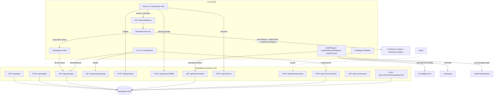
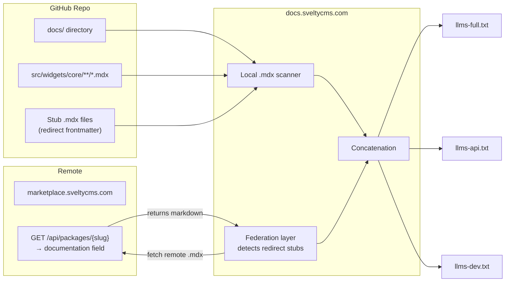

# Marketplace System

SveltyCMS connects to the hosted marketplace at **marketplace.sveltycms.com** for plugin discovery, license verification, and package distribution. Combined with the [AI Widget Scaffolder](../../development/ai-integration.mdx), this provides two complementary paths for extending the CMS.

**Phase 2 (August 2026):** An **in-app catalog** lives under **Config → Extensions → Marketplace**. It merges local listings with the remote catalog offline-first — the CMS stays usable when marketplace.sveltycms.com is unreachable.

## Architecture


```mermaid
flowchart TD
    subgraph Local["Local CMS"]
        CLI["CLI: bun marketplace"]
        ADMIN["Admin UI: marketplace-view"]
        API["GET /api/marketplace"]
        SVC["MarketplaceService"]
        CLIENT["marketplace-client"]
        INSTALL["installPlugin() / installDashboardWidget() / installTheme()"]
        SCAFFOLD["AI Widget Scaffolder"]
    end

    subgraph Remote["marketplace.sveltycms.com"]
        AUTH["POST /api/login"]
        REGISTER["POST /api/register"]
        PACKAGES["GET /api/packages"]
        DETAIL["GET /api/packages/{slug}"]
        CREATE["POST /api/packages"]
        UPLOAD["POST /api/upload (50MB)"]
        DOWNLOAD["GET /api/download/{id}"]
        CHECKOUT["POST /api/checkout"]
        WEBHOOK["POST /api/webhooks/stripe"]
        LICENSE_V1["POST /api/v1/license/verify"]
        EXTENSIONS["GET /api/v1/extensions"]
        EXT_ACTION["POST /api/v1/extensions/{type}/{action}"]
    end

    ADMIN -->|"search / type filter"| API
    API --> SVC
    SVC -->|"local themes + plugin stubs + dashboard widgets"| LOCAL_LIST["src/themes / plugins / dashboard widgets"]
    SVC -->|"best-effort remote"| CLIENT
    CLIENT -->|"30 min cache"| PACKAGES
    CLI -->|"browse/search"| PACKAGES
    CLI -->|"details"| DETAIL
    INSTALL -->|"purchase-verified"| DOWNLOAD
    ADMIN -->|"publish"| CREATE
    ADMIN -->|"upload package"| UPLOAD
    CLI -->|"verify license"| LICENSE_V1
    ADMIN -->|"checkout"| CHECKOUT
    STRIPE["Stripe"] -.->|"events"| WEBHOOK

    SCAFFOLD -->|"generate from config"| LOCAL_WIDGETS["src/widgets/core/"]
    INSTALL -->|"write files"| LOCAL_PLUGINS["src/plugins/"]
    INSTALL -->|"write package folder"| DASHBOARD_WIDGETS["dashboard/widgets/<folder>/"]

    AUTH --> STORE[(Marketplace DB)]
    REGISTER --> STORE
    PACKAGES --> STORE
    DOWNLOAD --> STORE
    LICENSE_V1 --> STORE
    EXT_ACTION --> STORE
```

## Marketplace API (marketplace.sveltycms.com)

| Method | Endpoint                             | Description                                        |
| :----- | :----------------------------------- | :------------------------------------------------- |
| `GET`  | `/api`                               | Health check + endpoint index                      |
| `POST` | `/api/login`                         | Authentication (bcrypt)                            |
| `POST` | `/api/logout`                        | Clear session                                      |
| `POST` | `/api/register`                      | User registration                                  |
| `GET`  | `/api/packages`                      | List packages (type, category, search, pagination) |
| `POST` | `/api/packages`                      | Create package (authenticated)                     |
| `GET`  | `/api/packages/{slug}`               | Package detail with versions                       |
| `POST` | `/api/checkout`                      | Create Stripe Checkout Session                     |
| `POST` | `/api/upload`                        | Upload package file (multipart, 50MB max)          |
| `GET`  | `/api/download/{id}`                 | Download package (purchase-verified)               |
| `POST` | `/api/webhooks/stripe`               | Stripe webhook handler                             |
| `POST` | `/api/v1/license/verify`             | Validate license key                               |
| `GET`  | `/api/v1/extensions`                 | List available extension types                     |
| `POST` | `/api/v1/extensions/{type}/{action}` | Premium extension logic                            |

### Security & license enforcement

The marketplace surface is protected at multiple layers:

1. **License manager** — `checkExtensionLicense(type, id)` verifies keys against the marketplace (`POST /api/v1/license/verify`), falls back to the local 14-day key-less trial, and is fail-open only when a license key is configured (marketplace-outage resilience). See [License Gate Inventory](../security/license-endpoint-inventory.mdx).
2. **Client-side gates** — premium widgets/plugins resolve `/api/system/license-status` and render an upgrade prompt instead of content when the trial expired without a key.
3. **Server-side gates (defense-in-depth)** — premium dashboard endpoints (`dashboard-license.ts`) call `checkExtensionLicense("dashboard", widgetId)` and return `403 LICENSE_REQUIRED`; plugin lifecycle hooks gate premium paths identically. Premium data is never served without entitlement.
4. **Admin-gated catalog & install** — `GET /api/marketplace` and `POST /api/marketplace/install` are admin-only; the install handler validates `locals.isAdmin` / role `admin` before any write.
5. **Fail-closed dispatcher** — the `marketplace` namespace is mapped in `ENDPOINT_PERMISSIONS`; unmapped namespaces return `403` by default.
6. **Plugin route security** — `definePlugin` requires `requiredCapabilities` on every `route` part (compile-time error when omitted): `[]` = auth-only, `"public"` = explicit unauthenticated opt-out.
7. **No secrets in code** — marketplace license keys live in system settings (`LICENSE_KEY`, `LICENSE_KEY_{TYPE}_{ID}`), never in source.

## In-App Catalog (Phase 2)

| Surface     | Location                                                     | Role                                                              |
| ----------- | ------------------------------------------------------------ | ----------------------------------------------------------------- |
| **UI**      | `src/routes/(app)/config/extensions/marketplace-view.svelte` | Search, type filter, cards, install/homepage CTAs                 |
| **API**     | `GET /api/marketplace?type=&search=`                         | Admin-gated offline-first catalog                                 |
| **Install** | `POST /api/marketplace/install`                              | Admin-only; theme install path today                              |
| **Service** | `src/services/core/marketplace-service.ts`                   | Merge local + remote, return `{ source, remoteAvailable, items }` |
| **Client**  | `@src/services/intelligence/marketplace-client`              | Remote list/search with 30 min in-memory cache                    |

### Offline-first merge

1. **Always** include local built-in themes (`adminThemeService.listThemes`), dashboard widget packages (`getInstalledDashboardWidgets()`), and known plugin stubs (e.g. Unified Data Hub listing).
2. **Best-effort** call `marketplace.list()` against marketplace.sveltycms.com.
3. Deduplicate by `id` / slug; set `source` to `local` | `remote` | `mixed` and `remoteAvailable` accordingly.
4. Apply optional `type` / `search` filters on the merged list.

Response shape (via `successResponse`):

```json
{
  "success": true,
  "data": {
    "source": "mixed",
    "remoteAvailable": true,
    "items": [
      {
        "id": "1",
        "name": "Default",
        "type": "theme",
        "source": "local",
        "installed": true,
        "version": "1.0.0"
      }
    ]
  }
}
```

> [!NOTE]
> **Still open (Phase 2 follow-ups):** full one-click install pipeline for remote packages, richer package cards, and in-app license UX. See [Roadmap 2026](../../project/roadmap-2026.mdx).

The Marketplace tab's type filter includes **`dashboard`** — local dashboard widget packages (from `widgets/<folder>/widget.json`) appear with their license model (Free / Freemium / Paid) and price, sourced from the offline-first merge.

## Two Paths to Extend

| Path                    | How                                                                                | Best For                                                    |
| ----------------------- | ---------------------------------------------------------------------------------- | ----------------------------------------------------------- |
| **Marketplace Install** | Browse (in-app or CLI) → Download → `installPlugin()` / `installDashboardWidget()` | Ready-made plugins, dashboard widgets, themes, integrations |
| **AI Scaffolder**       | Describe → `scaffoldWidget(config)` → 3 files generated                            | Custom widgets unique to your project                       |

Dashboard widget packages install into `src/routes/(app)/dashboard/widgets/<folder>/` and appear in the dashboard picker after restart — no registration step. The marketplace hosts community-built plugins, widgets, and dashboard widgets; the scaffolder generates custom code on demand.

## Marketplace Client API

### List plugins

```typescript
import { marketplace } from "@src/services/intelligence/marketplace-client";

// Browse all plugins
const { plugins, total } = await marketplace.list({
  type: "widget",
  limit: 10,
});

// Search
const results = await marketplace.search("seo");

// Filter by license tier
const freePlugins = await marketplace.list({ license: "free" });
```

### Install a plugin

```typescript
import { installPlugin } from "@src/services/intelligence/marketplace-client";

const plugin = await installPlugin("svelty-stripe");
// → Downloads files, creates src/plugins/stripe/, writes all files
```

### Install a dashboard widget

```typescript
import { installDashboardWidget } from "@src/services/intelligence/marketplace-client";

const widget = await installDashboardWidget("request-rate");
// → Downloads files, creates src/routes/(app)/dashboard/widgets/request-rate/,
//   writes component + widget.json + docs; visible in the picker after restart
```

### License management

```typescript
import { setLicenseKey } from "@src/services/intelligence/marketplace-client";

// Set your pro/enterprise license
setLicenseKey("svl_xxxxxxxxxxxxxxxxxxxxxxxx");

// Check if license allows a specific plugin
const { valid, tier } = await marketplace.checkLicense("enterprise-audit");
```

### Check for updates

```typescript
// Pass your installed plugins
const updates = await marketplace.checkUpdates([
  { id: "redirect-manager", version: "1.0.0" },
  { id: "sitemap", version: "1.0.0" },
]);

// → [{ id: "sitemap", version: "1.1.0", ... }]
```

## Extension Types

| Type        | Install Path                                                     | Example                           | Migration Status                     |
| ----------- | ---------------------------------------------------------------- | --------------------------------- | ------------------------------------ |
| `widget`    | `src/widgets/`                                                   | Star rating, testimonial carousel | Core in repo → custom to marketplace |
| `plugin`    | `src/plugins/`                                                   | Stripe, PageSpeed, Sitemap        | In repo → phased migration           |
| `theme`     | `src/themes/`                                                    | Dark Corporate, Minimal Blog      | Marketplace-only (target)            |
| `dashboard` | `src/routes/(app)/dashboard/widgets/<folder>/` (package folders) | Analytics, activity feed          | 🏗️ In progress — folder packages     |
| `extension` | `src/extensions/`                                                | Slack webhook, GA, webhooks       | Marketplace-only (planned)           |

> [!NOTE]
> **Dashboard widget packages** ship as self-contained kebab-case folders (`widgets/<folder>/<component>.svelte` + `widget.json`) and are discovered via `import.meta.glob` — installing a package folder makes the widget appear in the dashboard picker without registration. The core bundled packages live in the repo; community and premium widgets become marketplace-exclusive for discovery, licensing, and distribution. See [Dashboard Widget Development](../../development/dashboard/index.mdx).

## License Tiers

| Tier           | Price   | Features                                            |
| -------------- | ------- | --------------------------------------------------- |
| **Free**       | $0      | Community plugins, unlimited installs               |
| **Pro**        | Contact | Premium plugins, priority support                   |
| **Enterprise** | Contact | All plugins, custom SLA, on-prem marketplace mirror |

### Extension Pricing Overview

| Extension                     | Type             | License  | Price  | Icon                       | Pricing Description                                                                         |
| ----------------------------- | ---------------- | -------- | ------ | -------------------------- | ------------------------------------------------------------------------------------------- |
| Cookie Consent                | Plugin           | Free     | —      | `mdi:cookie-cog`           | Included with SveltyCMS                                                                     |
| Editable Website              | Plugin           | Paid     | €14.99 | `mdi:web`                  | Live preview iframe + bidirectional sync; 14-day trial; site starter works without plugin   |
| PageSpeed Insights            | Plugin           | Freemium | €19.99 | `mdi:speedometer`          | Free: single-page; Pro: bulk audits, scheduled scanning, historical trends                  |
| Redirect Manager              | Plugin           | Free     | —      | `mdi:directions-fork`      | Included with SveltyCMS                                                                     |
| Sitemap Generator             | Plugin           | Free     | —      | `mdi:sitemap`              | Included with SveltyCMS                                                                     |
| Smart AI-Driven Migration Pro | Plugin           | Freemium | €29.99 | `mdi:transfer`             | Free: 5 platforms; Pro: all 36 platforms + enterprise features                              |
| Stripe Payments               | Plugin           | Freemium | €4.99  | `mdi:credit-card-outline`  | Free: basic checkout; Pro: subscription billing, webhooks                                   |
| Unified Data Hub              | Plugin           | Freemium | €59.99 | `mdi:database-sync`        | Free: 1 connector + 3 collections; Pro: unlimited connectors + cross-source                 |
| WebMCP Server Gateway         | Plugin           | Paid     | €29.99 | `mdi:robot`                | License required, no free tier                                                              |
| SEO Widget                    | Custom Widget    | Freemium | €14.99 | `mdi:search-web`           | Free: title, description, focus keyword, previews; Pro: AI suggestions, bulk                |
| Remote Video                  | Custom Widget    | Freemium | €9.99  | `mdi:video-vintage`        | Free: basic embed (YouTube, Vimeo, Twitch, TikTok); Pro: custom branding, advanced metadata |
| Logs                          | Dashboard Widget | Freemium | €6.99  | `mdi:text-box-outline`     | Free: basic viewer; Pro: advanced filtering, export, real-time tail                         |
| Unified Metrics               | Dashboard Widget | Freemium | €14.99 | `mdi:chart-donut`          | Free: current snapshot; Pro: historical trends, alerting                                    |
| Security                      | Dashboard Widget | Freemium | €19.99 | `mdi:shield-alert`         | Free: basic checks; Pro: full audit, vulnerability DB, automated fixes                      |
| Audit Log                     | Dashboard Widget | Freemium | €24.99 | `mdi:history`              | Free: last 100 entries; Pro: full history, export, compliance reports                       |
| DB Pool Diagnostics           | Dashboard Widget | Freemium | €9.99  | `mdi:database-cog`         | Free: live status; Pro: historical tracking, query analysis, alerting                       |
| SCIM Status                   | Dashboard Widget | Paid     | €12.99 | `mdi:cloud-sync`           | License required, no free tier                                                              |
| Commerce Orders               | Dashboard Widget | Freemium | €12.99 | `mdi:receipt-text-outline` | Recent orders + status mix; empty state without the ecommerce preset                        |
| Commerce Inventory            | Dashboard Widget | Freemium | €12.99 | `mdi:warehouse`            | Low-stock / out-of-stock, variant-aware; empty state without `products`                     |

> [!NOTE]
> **Additional premium dashboard widgets** — Cache Performance, Performance Monitor, Online Users, Commerce Orders, and Commerce Inventory are trial-gated in code (14-day key-less trial, then `403 LICENSE_REQUIRED` without a key); their prices are configured in the marketplace listing.

## Performance

| Operation             | Latency                      | Cached      |
| --------------------- | ---------------------------- | ----------- |
| `list()` (first call) | ~200ms (network)             | 30 min      |
| `list()` (cached)     | <0.1ms                       | In-memory   |
| `download()`          | ~500ms-2s (download + write) | N/A         |
| `checkUpdates()`      | ~150ms                       | Per-request |

The marketplace client is **offline-resilient**: if marketplace.sveltycms.com is unreachable, it serves cached listings and degrades gracefully.

Local **dashboard widget packages** (core bundled) and built-in themes always appear in `GET /api/marketplace` (type `dashboard`) so the in-app catalog works offline; the remote catalog adds marketplace-published widgets when reachable.

## Telemetry & Ecosystem Health

SveltyCMS measures extension adoption anonymously through the [Security Updates & Telemetry](./telemetry-ecology.mdx) heartbeat, which now reports the marketplace ecosystem:

| Payload field       | Content                                                                      |
| :------------------ | :--------------------------------------------------------------------------- |
| `widgets`           | Custom content widget names                                                  |
| `dashboard_widgets` | Installed dashboard widget package ids (from `widgets/<folder>/widget.json`) |
| `plugins`           | Installed plugin ids                                                         |

This powers the BSL 1.1 economy (small business free, enterprise licensed), update/security alerts, and adoption prioritization — without tracking content, credentials, or raw IPs. See [Telemetry Server Implementation](./telemetry-server-implementation.mdx) for the receiver contract.

## Phased Migration & Documentation Federation

As extensions migrate from the monorepo to `marketplace.sveltycms.com`, their co-located `.mdx` documentation leaves the local source tree. This creates a challenge for `docs.sveltycms.com`, which generates `llms-full.txt` and subset variants (`llms-api.txt`, `llms-dev.txt`, `llms-guides.txt`) by scanning local `{name}/{name}.mdx` files.

### Migration Phases

| Phase       | Scope                                                                                                                       | Status                                                                                         |
| ----------- | --------------------------------------------------------------------------------------------------------------------------- | ---------------------------------------------------------------------------------------------- |
| **Phase 1** | Core widgets stay in repo (checkbox, input, rich-text, etc.); all widget `.mdx` files follow `{name}/{name}.mdx` convention | ✅ Complete                                                                                    |
| **Phase 2** | **In-app catalog** (Extensions Marketplace tab + offline-first API) + custom widgets toward marketplace with **doc stubs**  | 🏗️ In Progress                                                                                 |
| **Phase 3** | Plugins move to marketplace; doc stubs remain                                                                               | 🚀 Planned                                                                                     |
| **Phase 4** | Themes, dashboards, extensions — marketplace-only with federated docs                                                       | 🏗️ In Progress — dashboard widget package folders live in repo; marketplace publishing follows |

### Doc Stub Pattern

During migration, each removed extension leaves a lightweight `.mdx` stub in its original path that redirects readers to the marketplace:

```markdown
---
title: "Remote Video Widget"
redirect: "https://marketplace.sveltycms.com/packages/remote-video"
---

# Remote Video Widget

This widget has moved to the [SveltyCMS Marketplace](https://marketplace.sveltycms.com/packages/remote-video).
```

The docs pipeline detects `redirect` frontmatter and fetches the full documentation from the marketplace API.

### Federation Architecture


```mermaid
flowchart LR
    subgraph Local["GitHub Repo"]
        DOCS[docs/ directory]
        CORE_WIDGETS[src/widgets/core/**/*.mdx]
        STUBS["Stub .mdx files<br/>(redirect frontmatter)"]
    end

    subgraph Remote
        MP["marketplace.sveltycms.com"]
        MP_DOCS["GET /api/packages/{slug}<br/>→ documentation field"]
    end

    subgraph Pipeline["docs.sveltycms.com"]
        SCANNER["Local .mdx scanner"]
        FEDERATOR["Federation layer<br/>detects redirect stubs"]
        MERGE["Concatenation"]
    end

    DOCS --> SCANNER
    CORE_WIDGETS --> SCANNER
    STUBS --> SCANNER
    SCANNER --> MERGE
    FEDERATOR -->|"fetch remote .mdx"| MP_DOCS
    MP_DOCS -->|"returns markdown"| FEDERATOR
    FEDERATOR --> MERGE

    MERGE --> LLMS["llms-full.txt"]
    MERGE --> API["llms-api.txt"]
    MERGE --> DEV["llms-dev.txt"]
```

### Marketplace API — Documentation Endpoint

The marketplace package schema includes a `documentation` field for serving the full `.mdx` content:

| Field               | Type     | Description                    |
| ------------------- | -------- | ------------------------------ |
| `documentation`     | `string` | Full `.mdx` content (markdown) |
| `documentation_url` | `string` | URL to hosted documentation    |

This field is exposed via `GET /api/packages/{slug}` and is ingested at build time by the docs pipeline. Cached with a 30-minute TTL, matching the marketplace client cache duration.

### llms-full.txt Coverage Guarantee

| Source                                  | Mechanism                           | Latency                           |
| --------------------------------------- | ----------------------------------- | --------------------------------- |
| Local `.mdx` (repo docs + core widgets) | Filesystem scan at build            | <1ms                              |
| Stub → Marketplace fetch                | `GET /api/packages/{slug}` at build | ~200ms per package (parallelized) |
| Cached marketplace docs                 | In-memory, 30-min TTL               | <0.1ms                            |

The federation layer ensures **0% documentation loss** during migration — every extension, whether local or marketplace-hosted, appears in `llms-full.txt` for AI agents and RAG pipelines.

## Related

- [Utility API — Marketplace](../api/utility.mdx#marketplace) — `GET /api/marketplace` contract
- [AI Integration & Hosted Knowledge](../../development/ai-integration.mdx) — AI widget scaffolder and behavioral learning
- [Behavioral Learning Engine](./behavioral-learning.mdx) — Learns from usage patterns
- [Plugin Architecture](../../development/plugins/architecture.mdx) — Building plugins for SveltyCMS
- [Widget Development](../../development/widgets/index.mdx) — Building custom widgets
- [Project Roadmap](../../project/roadmap-2026.mdx) — Migration timeline and milestones
