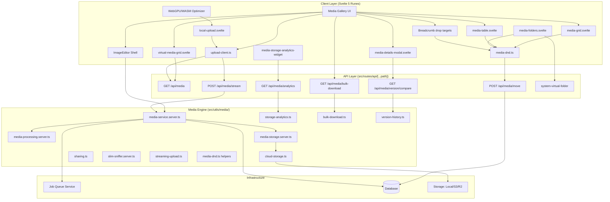
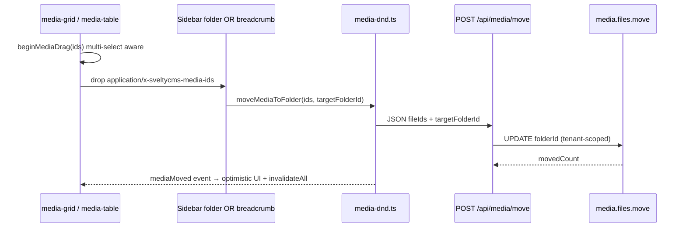

# Media System Architecture & Guide

The SveltyCMS Media system is a decoupled, performance-first engine. Built with Svelte 5 and Sharp.js, it prioritizes native Node/Bun utilities over heavy third-party dependencies to ensure sub-millisecond latency and reduced bundle size.

---

## 🏗️ Layered Architecture

The system follows a strict 4-layer architecture to ensure storage and framework portability.



---

## JSON Path Media Filter

Gallery filtering supports a small JSON-path expression language (client + server + DB).

| Layer        | Location                               | Behavior                                                       |
| :----------- | :------------------------------------- | :------------------------------------------------------------- |
| **Client**   | `+page.svelte` + `json-path-filter.ts` | Instant filter on loaded items                                 |
| **Server**   | `+page.server.ts` `?jsonPath=`         | Passes `jsonPath` into `getByFolder`; post-filters SSR payload |
| **Database** | `media-json-path.ts` + adapters        | Native pushdown for `metadata.*` on large libraries            |

### Syntax

```
metadata.camera = Canon
metadata.camera ~ canon
metadata.iso >= 400
metadata.tags[0] = nature
metadata.camera = Canon; metadata.iso > 100
```

Operators: `=` / `==`, `!=`, `~` / `*=` (contains), `>`, `<`, `>=`, `<=`. Multi-clause AND via `;` or `&&`.

Shareable URL example: `/mediagallery?folderId=…&jsonPath=metadata.camera%20%3D%20Canon`

### DB-native pushdown (large libraries)

When `options.jsonPath` is set on `media.files.getByFolder`:

| Adapter           | Mechanism                                       |
| :---------------- | :---------------------------------------------- |
| **SQLite**        | JSON1 `json_extract(metadata, '$.…')`           |
| **PostgreSQL**    | jsonb `metadata->>` / `metadata#>>`             |
| **MariaDB/MySQL** | `JSON_UNQUOTE(JSON_EXTRACT(metadata, …))`       |
| **MongoDB**       | Dotted-path filters + case-insensitive `$regex` |

Only simple `metadata.*` paths (no array indices) are pushed to the DB. Array paths (`metadata.tags[0]`) and non-metadata fields stay as in-memory post-filters so pagination remains correct when every clause is native.

Implementation:

- Parser: `src/utils/json-path-filter.ts`
- SQL/Mongo builders: `src/databases/core/media-json-path.ts`
- Unit: `tests/unit/utils/json-path-filter.test.ts`, `tests/unit/databases/media-json-path.test.ts`
- Integration: `tests/integration/api/media-jsonpath.test.ts` (`?jsonPath=` reduces load payload)

---

## Upload Progress & Cancel

| Feature        | Implementation                                                |
| :------------- | :------------------------------------------------------------ |
| Progress %     | XHR `upload.progress` in `upload-client.ts`                   |
| Per-file batch | Sequential upload when `onFileProgress` / `sequential: true`  |
| Cancel         | `AbortSignal` + `MediaUploadHandle.cancel()`                  |
| UI             | Gallery toolbar + `local-upload.svelte` progress bar + Cancel |

Large batches still use `/api/media/stream` when over `STREAM_UPLOAD_THRESHOLD_BYTES` (10 MB).

---

## 🛡️ Published-Reference Protection (Media Integrity Gate)

The media system prevents mutation of assets referenced by published content entries. This protects against broken references on live pages.

### How It Works

1. **Service Layer** (`media-service.server.ts`): `getPublishedReferences()` scans all collection schemas for entries with `status: "publish"` that reference a given media ID (by ID, path, URL, or embedded object reference).

2. **Handler Layer** (`handlers/media.ts`): A `checkMediaNotReferencedByPublishedContent()` helper is called in all 6 mutation handlers before performing the operation. Returns **409 Conflict** with details identifying which content entries reference the asset.

3. **UI Layer** (`media-grid.svelte`, `media-table.svelte`, `virtual-media-grid.svelte`): Edit/delete buttons are disabled with contextual tooltip "Referenced by published content". A lock badge appears at the top-left of affected media cards.

4. **Server Load** (`+page.server.ts`): Batched `Promise.allSettled` pre-checks all visible media items for published references before rendering.

### Gated Operations

| Handler         | HTTP Method                       | Response     |
| --------------- | --------------------------------- | ------------ |
| Direct delete   | `DELETE /api/media/:id`           | 409 Conflict |
| POST delete     | `POST /api/media/delete`          | 409 Conflict |
| Manipulate      | `POST /api/media/manipulate`      | 409 Conflict |
| Version create  | `POST /api/media/version`         | 409 Conflict |
| Version upload  | `POST /api/media/version/upload`  | 409 Conflict |
| Version restore | `POST /api/media/version/restore` | 409 Conflict |

### Error Response Format

```json
{
  "error": {
    "message": "Cannot modify asset: referenced by published content - \"Blog Post\" in \"Posts\" (featuredImage) and 2 more",
    "code": "MEDIA_REFERENCED_BY_PUBLISHED_CONTENT"
  }
}
```

---

## 🚀 The Media Pipeline (4-Stage Workflow)

SveltyCMS employs a high-performance ingestion and delivery pipeline designed for massive scale and resilience.

### Phase I: Ingestion (Client-Side & Hashing)

- **WebGPU/WASM Optimization**: **[Client-Only]** Large images are compressed, focal-cropped, and converted to WebP/AVIF directly in the browser _before_ upload, saving >90% bandwidth (`local-upload.svelte`).
- **Smart Upload Routing** (`upload-client.ts`): The gallery and dedicated upload page route payloads automatically — files or batches under **10 MB** use the SvelteKit form action (`?/upload`); larger payloads stream to `POST /api/media/stream` with the `folder` field preserved.
- **Hash-First Approach**: Every file is identified by a **20-character SHA-256 hash**. This hash is the primary key for global deduplication across the entire system.
- **SlimSniffer**: A lightweight native Magic Byte inspector replaces heavy MIME detection libraries, ensuring instant file validation.

### Phase II: Processing (Deep Metadata & AI)

- **Deep Metadata Extraction**: Automatically parses **EXIF, IPTC, and XMP** data using a single `sharp.metadata()` call to minimize CPU overhead.
- **AI-Native Tagging [WIP]**: A conceptual background task that hooks into local Ollama (`llava`) for privacy-first image analysis.
- **Document Thumbnails**: Automated extraction of PDF first-pages (requires `imagemagick`).

### Phase III: Storage & Deduplication

- **Deduplication Engine**: Before storing, the system checks if a file with the same SHA-256 hash already exists. If so, it increments the reference count instead of duplicating physical bytes.
- **Hybrid Storage**: Supports Local, S3, and R2 storage backends via the `CloudStorage` abstraction.
- **ETag/304 Handling**: Unified ETag strategy ensures high-performance browser caching and avoids redundant 307 redirects for cloud assets.

### Phase IV: Delivery & Transformation

- **On-the-Fly Transforms**: Responsive images are generated via `GET /api/media/transform` using the `Sharp.js` thread pool and instance cloning for ~70% lower latency.
- **Focal Points**: Visual crosshair coordinates are injected into delivery APIs to support art-directed cropping in the frontend.
- **Lazy Loading**: `virtual-media-grid.svelte` handles 10,000+ files with sub-millisecond scroll performance using Svelte 5 runes.

---

## 📁 Virtual Folders & Drag-and-Drop Moves

Assets live in **virtual folders**: a logical `folderId` on each media row, not a physical directory tree. Folder definitions are stored as system virtual folders (`/api/system-virtual-folder`). Moving media updates metadata only — blobs and share URLs stay put.

### Data model

| Field on media | Meaning                                             |
| :------------- | :-------------------------------------------------- |
| `folderId`     | Virtual folder ID, or `null` / unset for media root |
| `path` / `url` | Storage-relative / public URL (unchanged by moves)  |

### Move pipeline



### Equivalent drop targets

On desktop, **sidebar** and **breadcrumb** are first-class peers — same payload, same API, same result:

| Drop surface                | Component / location                  | Targets available                     |
| :-------------------------- | :------------------------------------ | :------------------------------------ |
| Sidebar virtual folder tree | `media-folders.svelte` (left sidebar) | Full tree + Media Root                |
| Gallery path breadcrumbs    | `mediagallery/+page.svelte`           | Ancestor crumbs (incl. Media Gallery) |

| Drag source          | Notes                                                                           |
| :------------------- | :------------------------------------------------------------------------------ |
| `media-grid.svelte`  | Thumbnail cards; multi-select moves the whole set when dragged item is selected |
| `media-table.svelte` | Desktop table + mobile list rows; same multi-select rules                       |

**Mobile**: limited room for the sidebar — users drag (or select + tap) onto **breadcrumb parents**. Desktop users may use either surface interchangeably.

**Shared client module**: `src/utils/media/media-dnd.ts`

- MIME: `application/x-sveltycms-media-ids`
- `resolveMediaDragIds` — Windows Explorer–style selection expansion
- `beginMediaDrag` / `endMediaDrag` — DataTransfer + multi-item ghost
- `moveMediaToFolder` — `POST /api/media/move` + `mediaMoved` document event

**Server**: `handleMediaMove` → `MediaNamespace.move` → `dbAdapter.media.files.move`.

### Left sidebar context

On `/mediagallery`, the left sidebar shows virtual folders and a back-to-collections control (not dual Collections + Media section headers). On collection routes, only the collections tree is shown. See `left-sidebar.svelte`.

---

## 🗂️ DAM Admin UI Integration

The DAM API endpoints are wired into native Svelte 5 admin surfaces — no third-party asset browser required.

| Feature                   | UI Surface                                               | API / Utility                                           |
| :------------------------ | :------------------------------------------------------- | :------------------------------------------------------ |
| **Virtual folder move**   | Grid/table drag → sidebar folders or breadcrumb parents  | `POST /api/media/move` via `media-dnd.ts`               |
| **Folder tree CRUD**      | Sidebar `media-folders.svelte` + gallery “New Folder”    | `/api/system-virtual-folder`                            |
| **Bulk archive download** | Selection toolbar in `mediagallery/+page.svelte`         | `GET /api/media/bulk-download?id=…` → TAR.GZ            |
| **Storage analytics**     | Dashboard widget `media-storage-analytics-widget.svelte` | `GET /api/media/analytics` (60s poll)                   |
| **Version diff**          | Versions tab in `media-details-modal.svelte`             | `GET /api/media/version/{id}/compare?from=&to=`         |
| **Version history**       | Versions tab (upload, restore, download)                 | `POST /api/media/version/{id}`, `/restore`, `/upload`   |
| **Secure share links**    | Share tab in `media-details-modal.svelte`                | `POST /api/media/share/{id}`, `DELETE …/{token}`        |
| **Streaming upload**      | Gallery toolbar + `local-upload.svelte`                  | `upload-client.ts` → form action or `/api/media/stream` |

### Media Details Modal

`media-details-modal.svelte` is the asset control center with four tabs:

1. **Info** — Inline editable name, alt text, caption, and tags (`PATCH /api/media/{id}`).
2. **Versions** — Upload new version, restore historical copies, compare two versions with field-level diffs.
3. **References** — Live scan of collection entries referencing the asset (`GET /api/media/references/{id}`).
4. **Share** — Generate expiring, password-protected public links and revoke active tokens.

---

## 🔄 Asynchronous Processing & Job Queue

Heavy processing tasks (AI analysis, bulk variant generation, video transcoding) are decoupled from the main request/response cycle.

1. **Immediate Success**: The API returns a `202 Accepted` status along with an **`OperationID`**.
2. **Background Execution**: The `Job Queue Service` picks up the task and executes it across multiple worker threads.
3. **Polling/SSE**: The client polls the **`/api/media/jobs/:id`** endpoint or listens via SSE for the completion event.
4. **Metadata Update**: Once complete, the `MediaItem` metadata in the database is atomically updated.

---

## 🎨 Image Editor Integration

The gallery is deeply integrated with the canvas-based Image Editor:

- **Non-Destructive Editing**: Originals are preserved; edits are saved as linked variants.
- **Interactive Focal Points**: Visual crosshair selection for art-directed cropping.
- **Watermark Caching**: Pre-rendered watermark buffers are cached in-memory to avoid redundant re-scaling.

---

## ⚡ Performance Benchmarks

For comprehensive performance details regarding media hashing, metadata extraction, and multi-scale resizing block times, please reference the [**SQLite Benchmarks**](../../project/benchmarks/benchmark_sqlite.mdx).

---

## 📚 API Reference

For detailed developer endpoints (upload, transform, **move**, job polling, focal points), read the comprehensive [**Media Reference**](../api/media.mdx).

---

## 🔍 Media Reference Reverse-Index

> Added 2026-07-16 — replaces O(n × entries) full-scan with O(1) indexed lookups.

### Problem

`getMediaReferences()` and `getPublishedReferences()` previously scanned **every entry in every collection** for each query — O(n × entries) per call. On a CMS with 50 collections and 10,000 entries, this meant 500,000 field traversals per reference check.

### Solution

`MediaReferenceIndex` (`src/utils/media/media-reference-index.ts`) is an in-memory reverse-index that maps media identifiers to the entries that reference them:

```typescript
// First query triggers a full rebuild (lazy)
// Subsequent queries are O(1) Map lookups
const refs = await mediaService.getMediaReferences(mediaId);
```

| Component                 | Location                                    | Purpose                                             |
| :------------------------ | :------------------------------------------ | :-------------------------------------------------- |
| `MediaReferenceIndex`     | `media-reference-index.ts`                  | In-memory `Map<mediaId, MediaReference[]>`          |
| `rebuildReferenceIndex()` | `media-service.server.ts`                   | Full scan → populates index, status map, name map   |
| `eventBus` invalidation   | Constructor + `SystemEvents.CONTENT_UPDATE` | Auto-clears index on any content mutation           |
| `enrichReferences()`      | `media-service.server.ts`                   | Backfills `fieldName`/`entryName` for API consumers |

### Architecture

```
Content mutation (create/update/delete)
  → eventBus.emit(CONTENT_UPDATE)
    → referenceIndex.clear()  (cache invalidated)

Next getMediaReferences() call
  → lazy rebuildReferenceIndex()  (one full scan)
    → O(1) lookups for all subsequent queries
```

**Design note**: The index is in-memory only. On first query it performs a full scan (rebuild), then subsequent queries are O(1). For production with thousands of entries, consider a periodic rebuild via `setInterval` or stale-while-revalidate. The `eventBus` listener ensures the cache is invalidated on any content update.

---

## 📤 Streaming Upload Parser

> Added 2026-07-16 — true streaming multipart parser with backpressure, replacing the previous TextDecoder→TextEncoder implementation that corrupted binary uploads.

### Problem

The previous `streaming-upload.ts` had two critical bugs:

1. **Binary corruption**: `TextDecoder`→`TextEncoder` round-trip replaced non-UTF8 bytes with replacement characters
2. **Not streaming**: Read the entire request body into RAM before parsing — OOM on large files

### Solution

A byte-level state machine (`streaming-upload.ts`) that processes `ReadableStream` chunks incrementally:

| Feature                   | Implementation                                                     |
| :------------------------ | :----------------------------------------------------------------- |
| **True streaming**        | Incremental byte-level parser — never buffers the full body        |
| **Binary-safe**           | Raw `Uint8Array` chunks pass through untouched                     |
| **Backpressure**          | Per-file `ReadableStream` pipes directly to storage adapter        |
| **Size limits**           | Configurable `maxFileSize` (1 GiB) and `maxTotalSize` (5 GiB)      |
| **MIME validation**       | Files rejected before body is consumed (415 on disallowed types)   |
| **Filename sanitization** | Path separators, control chars, Windows reserved names stripped    |
| **Error cleanup**         | Active push streams errored on parser failure — no hanging readers |
| **Timeout**               | Configurable per-chunk read timeout (default 300s)                 |

```typescript
// Storage adapters receive a per-file ReadableStream — direct pipe to S3/disk
await parseMultipartStream(request, {
  onFile: async ({ filename, contentType, stream }) => {
    await getStorageAdapter().uploadStream(stream, filename);
  },
});
```

---

## 🛡️ Type-Safe Media Models

> Refactored 2026-07-16 — discriminated union with type guards, DTO types, and exhaustiveness checking.

### Design

`media-models.ts` uses `as const` maps (not enums) for tree-shakable, JSON-safe value lists. Each map doubles as the runtime valid-value list:

```typescript
// Type guards — narrow discriminated union at runtime
if (isMediaImage(item)) item.width;           // MediaImage
if (isStoredMedia(item)) item.hash;           // StoredMedia (excludes remote video)
if (isMediaOfType(item, MediaType.Video)) item.duration; // MediaVideo

// DTO types — server-assigned fields rejected at compile time
const draft: NewMedia<MediaImage> = { ... };  // no _id, hash, url, createdBy
const patch: MediaPatch = { alt: "photo" };   // PATCH-safe fields only

// Exhaustiveness — add a new media type and every switch fails to compile
switch (item.type) {
  case MediaType.Image:    return item.width;
  case MediaType.RemoteVideo: return item.provider;
  // ...
  default: return assertNever(item);
}
```

| Improvement         | Before                                      | After                                                    |
| :------------------ | :------------------------------------------ | :------------------------------------------------------- |
| Type safety         | `any` everywhere, zero guards               | Discriminated union + 7 type guards                      |
| DTO safety          | Client could PATCH `hash`/`url`/`createdBy` | `NewMedia<T>`, `MediaPatch` block server-assigned fields |
| Exhaustiveness      | Missing type = silent bug                   | `assertNever()` catches at compile time                  |
| Tree-shaking        | `enum` blocks `erasableSyntaxOnly`          | `as const` maps are fully erasable                       |
| Watermark positions | Sharp-rejected `"top"`/`"bottom"`           | `normalizeWatermarkPosition()` maps to compass values    |

---

## Related

- [Architecture Overview](./index.mdx)
- [Media Reference (API)](../api/media.mdx) — `POST /api/media/move`, folders, DAM endpoints
- [Media Sharing Endpoint](../api/media-sharing.mdx) — share links survive virtual folder moves
- [Security Overview](../security/index.mdx)
- [State Management](./state-management.mdx)
