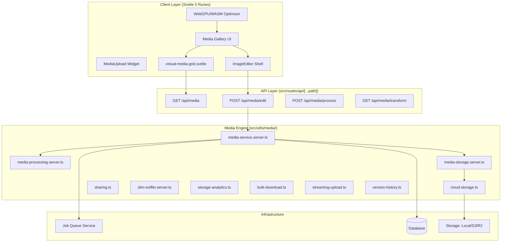

# Media System Architecture & Guide

The SveltyCMS Media system is a decoupled, performance-first engine. Built with Svelte 5 and Sharp.js, it prioritizes native Node/Bun utilities over heavy third-party dependencies to ensure sub-millisecond latency and reduced bundle size.

---

## 🏗️ Layered Architecture

The system follows a strict 4-layer architecture to ensure storage and framework portability.

---

## 🚀 The Media Pipeline (4-Stage Workflow)

SveltyCMS employs a high-performance ingestion and delivery pipeline designed for massive scale and resilience.

### Phase I: Ingestion (Client-Side & Hashing)

- **WebGPU/WASM Optimization**: **[Client-Only]** Large images are compressed, focal-cropped, and converted to WebP/AVIF directly in the browser _before_ upload, saving >90% bandwidth.
- **Hash-First Approach**: Every file is identified by a **20-character SHA-256 hash**. This hash is the primary key for global deduplication across the entire system.
- **SlimSniffer**: A lightweight native Magic Byte inspector replaces heavy MIME detection libraries, ensuring instant file validation.

### Phase II: Processing (Deep Metadata & AI)

- **Deep Metadata Extraction**: Automatically parses **EXIF, IPTC, and XMP** data using a single `sharp.metadata()` call to minimize CPU overhead.
- **AI-Native Tagging [WIP]**: A conceptual background task that hooks into local Ollama (`llava`) for privacy-first image analysis.
- **Document Thumbnails**: Automated extraction of PDF first-pages (requires `imagemagick`).

### Phase III: Storage & Deduplication

- **Deduplication Engine**: Before storing, the system checks if a file with the same SHA-256 hash already exists. If so, it increments the reference count instead of duplicating physical bytes.
- **Hybrid Storage**: Supports Local, S3, and R2 storage backends via the `CloudStorage` abstraction.
- **ETag/304 Handling**: Unified ETag strategy ensures high-performance browser caching and avoids redundant 307 redirects for cloud assets.

### Phase IV: Delivery & Transformation

- **On-the-Fly Transforms**: Responsive images are generated via `GET /api/media/transform` using the `Sharp.js` thread pool and instance cloning for ~70% lower latency.
- **Focal Points**: Visual crosshair coordinates are injected into delivery APIs to support art-directed cropping in the frontend.
- **Lazy Loading**: `virtual-media-grid.svelte` handles 10,000+ files with sub-millisecond scroll performance using Svelte 5 runes.

---

## 🔄 Asynchronous Processing & Job Queue

Heavy processing tasks (AI analysis, bulk variant generation, video transcoding) are decoupled from the main request/response cycle.

1. **Immediate Success**: The API returns a `202 Accepted` status along with an **`OperationID`**.
2. **Background Execution**: The `Job Queue Service` picks up the task and executes it across multiple worker threads.
3. **Polling/SSE**: The client polls the **`/api/media/jobs/:id`** endpoint or listens via SSE for the completion event.
4. **Metadata Update**: Once complete, the `MediaItem` metadata in the database is atomically updated.

---

## 🎨 Image Editor Integration

The gallery is deeply integrated with the canvas-based Image Editor:

- **Non-Destructive Editing**: Originals are preserved; edits are saved as linked variants.
- **Interactive Focal Points**: Visual crosshair selection for art-directed cropping.
- **Watermark Caching**: Pre-rendered watermark buffers are cached in-memory to avoid redundant re-scaling.

---

## ⚡ Performance Benchmarks

For comprehensive performance details regarding media hashing, metadata extraction, and multi-scale resizing block times, please reference the [**SQLite Benchmarks**](../../project/benchmarks/benchmark_sqlite.mdx).

---

## 📚 API Reference

For detailed developer endpoints (upload, transform, job polling, focal points), read the comprehensive [**Media Reference**](../api/media.mdx).

---

## Related

- [Architecture Overview](./index.mdx)
- [Security Overview](../security/index.mdx)
- [State Management](./state-management.mdx)
