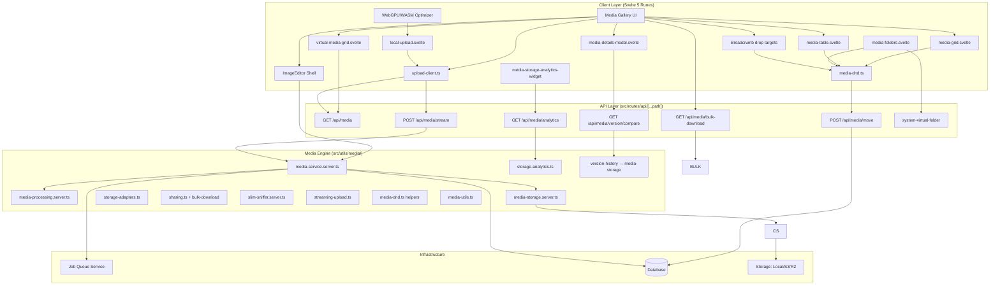
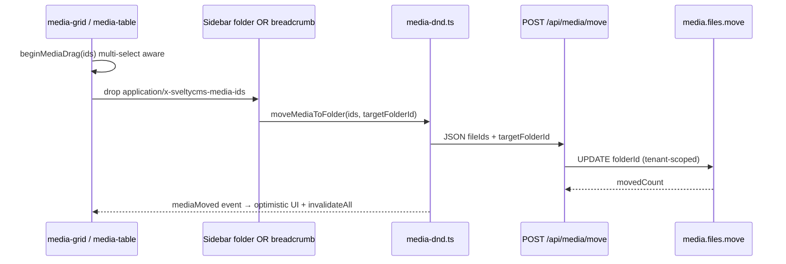

# Media system

This page is the storage and processing pipeline. Cropping in the admin is the [Image editor](../../guides/content/image-editor.mdx). Upload and download routes are the [Media API](../api/media.mdx).

The SveltyCMS Media system is a decoupled, performance-first engine. Built with Svelte 5 and Sharp.js, it prioritizes native Node/Bun utilities over heavy third-party dependencies to ensure sub-millisecond latency and reduced bundle size.

---

## 🏗️ Layered Architecture

The system follows a strict 4-layer architecture to ensure storage and framework portability.


```mermaid
graph TB
    subgraph "Client Layer (Svelte 5 Runes)"
        UI[Media Gallery UI]
        GRID[media-grid.svelte]
        TABLE[media-table.svelte]
        FOLDERS[media-folders.svelte]
        CRUMB[Breadcrumb drop targets]
        DND[media-dnd.ts]
        MODAL[media-details-modal.svelte]
        UW[local-upload.svelte]
        UPLOAD[upload-client.ts]
        DASH[media-storage-analytics-widget]
        VGRID[virtual-media-grid.svelte]
        EDITOR[ImageEditor Shell]
        WGPU[WebGPU/WASM Optimizer]
    end

    subgraph "API Layer (src/routes/api/[...path])"
        API1[GET /api/media]
        API2[POST /api/media/stream]
        API3[GET /api/media/analytics]
        API4[GET /api/media/bulk-download]
        API5[GET /api/media/version/compare]
        API6[POST /api/media/move]
        API7[system-virtual-folder]
    end

    subgraph "Media Engine (src/utils/media/)"
        MS[media-service.server.ts]
        MPS[media-processing.server.ts]
        MST[media-storage.server.ts]
        SA[storage-adapters.ts]
        SHARING[sharing.ts + bulk-download]
        SNIFF[slim-sniffer.server.ts]
        ANALYTICS[storage-analytics.ts]
        STREAM[streaming-upload.ts]
        VERSIONS[version-history → media-storage]
        DNDUTIL[media-dnd.ts helpers]
        UTILS[media-utils.ts]
    end

    subgraph "Infrastructure"
        JOBS[Job Queue Service]
        DB[(Database)]
        STORE[Storage: Local/S3/R2]
    end

    UI --> GRID
    UI --> TABLE
    UI --> CRUMB
    GRID --> DND
    TABLE --> DND
    FOLDERS --> DND
    CRUMB --> DND
    DND --> API6
    FOLDERS --> API7
    UI --> VGRID
    VGRID --> API1
    UI --> MODAL
    MODAL --> API5
    UI --> UPLOAD
    UW --> UPLOAD
    UPLOAD --> API2
    UPLOAD --> API1
    DASH --> API3
    UI --> API4
    UI --> EDITOR
    WGPU --> UW
    EDITOR --> MS
    API2 --> MS
    API6 --> DB
    API3 --> ANALYTICS
    API4 --> BULK
    API5 --> VERSIONS
    MS --> MPS
    MS --> MST
    MST --> CS
    MS --> JOBS
    MS --> DB
    CS --> STORE
```

---

## JSON Path Media Filter

Gallery filtering supports a small JSON-path expression language (client + server + DB).

| Layer        | Location                               | Behavior                                                       |
| :----------- | :------------------------------------- | :------------------------------------------------------------- |
| **Client**   | `+page.svelte` + `json-path-filter.ts` | Instant filter on loaded items                                 |
| **Server**   | `+page.server.ts` `?jsonPath=`         | Passes `jsonPath` into `getByFolder`; post-filters SSR payload |
| **Database** | `media-json-path.ts` + adapters        | Native pushdown for `metadata.*` on large libraries            |

### Syntax

```
metadata.camera = Canon
metadata.camera ~ canon
metadata.iso >= 400
metadata.tags[0] = nature
metadata.camera = Canon; metadata.iso > 100
```

Operators: `=` / `==`, `!=`, `~` / `*=` (contains), `>`, `<`, `>=`, `<=`. Multi-clause AND via `;` or `&&`.

Shareable URL example: `/mediagallery?folderId=…&jsonPath=metadata.camera%20%3D%20Canon`

### DB-native pushdown (large libraries)

When `options.jsonPath` is set on `media.files.getByFolder`:

| Adapter           | Mechanism                                       |
| :---------------- | :---------------------------------------------- |
| **SQLite**        | JSON1 `json_extract(metadata, '$.…')`           |
| **PostgreSQL**    | jsonb `metadata->>` / `metadata#>>`             |
| **MariaDB/MySQL** | `JSON_UNQUOTE(JSON_EXTRACT(metadata, …))`       |
| **MongoDB**       | Dotted-path filters + case-insensitive `$regex` |

Only simple `metadata.*` paths (no array indices) are pushed to the DB. Array paths (`metadata.tags[0]`) and non-metadata fields stay as in-memory post-filters so pagination remains correct when every clause is native.

Implementation:

- Parser: `src/utils/json-path-filter.ts`
- SQL/Mongo builders: `src/databases/core/media-json-path.ts`
- Unit: `tests/unit/utils/json-path-filter.test.ts`, `tests/unit/databases/media-json-path.test.ts`
- Integration: `tests/integration/api/media-jsonpath.test.ts` (`?jsonPath=` reduces load payload)

---

## Upload Progress & Cancel

| Feature        | Implementation                                                |
| :------------- | :------------------------------------------------------------ |
| Progress %     | XHR `upload.progress` in `upload-client.ts`                   |
| Per-file batch | Sequential upload when `onFileProgress` / `sequential: true`  |
| Cancel         | `AbortSignal` + `MediaUploadHandle.cancel()`                  |
| UI             | Gallery toolbar + `local-upload.svelte` progress bar + Cancel |

Large batches still use `/api/media/stream` when over `STREAM_UPLOAD_THRESHOLD_BYTES` (10 MB).

---

## 🛡️ Published-Reference Protection (Media Integrity Gate)

The media system prevents mutation of assets referenced by published content entries. This protects against broken references on live pages.

### How It Works

1. **Service Layer** (`media-service.server.ts`): `getPublishedReferences()` scans all collection schemas for entries with `status: "publish"` that reference a given media ID (by ID, path, URL, or embedded object reference).

2. **Handler Layer** (`handlers/media.ts`): A `checkMediaNotReferencedByPublishedContent()` helper is called in all 6 mutation handlers before performing the operation. Returns **409 Conflict** with details identifying which content entries reference the asset.

3. **UI Layer** (`media-grid.svelte`, `media-table.svelte`, `virtual-media-grid.svelte`): Edit/delete buttons are disabled with contextual tooltip "Referenced by published content". A lock badge appears at the top-left of affected media cards.

4. **Server Load** (`+page.server.ts`): Batched `Promise.allSettled` pre-checks all visible media items for published references before rendering.

### Gated Operations

| Handler         | HTTP Method                       | Response     |
| --------------- | --------------------------------- | ------------ |
| Direct delete   | `DELETE /api/media/:id`           | 409 Conflict |
| POST delete     | `POST /api/media/delete`          | 409 Conflict |
| Manipulate      | `POST /api/media/manipulate`      | 409 Conflict |
| Version create  | `POST /api/media/version`         | 409 Conflict |
| Version upload  | `POST /api/media/version/upload`  | 409 Conflict |
| Version restore | `POST /api/media/version/restore` | 409 Conflict |

### Error Response Format

```json
{
  "error": {
    "message": "Cannot modify asset: referenced by published content - \"Blog Post\" in \"Posts\" (featuredImage) and 2 more",
    "code": "MEDIA_REFERENCED_BY_PUBLISHED_CONTENT"
  }
}
```

---

## 🚀 The Media Pipeline (4-Stage Workflow)

SveltyCMS employs a high-performance ingestion and delivery pipeline designed for massive scale and resilience.

### Phase I: Ingestion (Client-Side & Hashing)

- **WebGPU/WASM Optimization**: **[Client-Only]** Large images are compressed, focal-cropped, and converted to WebP/AVIF directly in the browser _before_ upload, saving >90% bandwidth (`local-upload.svelte`).
- **Smart Upload Routing** (`upload-client.ts`): The gallery and dedicated upload page route payloads automatically — files or batches under **10 MB** use the SvelteKit form action (`?/upload`); larger payloads stream to `POST /api/media/stream` with the `folder` field preserved. Both paths share one hard ceiling: the dispatcher bounds the request at `API_MAX_BODY_SIZE_BYTES` (**15 MB**, `Content-Length` and chunked alike) and `parseMultipartStream` receives the same cap for `maxFileSize`/`maxTotalSize`, aborting incrementally with `413 PAYLOAD_TOO_LARGE` instead of buffering toward the parser defaults.
- **Hash-First Approach**: Every file is identified by the full 64-character hex **SHA-256** digest of its bytes (`hashFileContent()` in `src/utils/media/media-processing.server.ts`). The hash is both the deduplication key and the storage directory of the file: `{tenantId}/{hash}/original/<name>-<hash>.<ext>`. The lookup happens **before any derivative work** and is scoped to the tenant — see _Storage & Deduplication_ below and [#2 of the media pipeline plan](../../project/media-pipeline-plan.mdx).
- **SlimSniffer + unified allowlist**: `slim-sniffer.server.ts` (~2KB, no `mime-types`/`mrmime`) inspects magic bytes. Uploads use `isAllowedUploadMime()` (from `MIME_MAP`, minus scriptable/office types) and `assertMimeAgreement()` at write time. `/files` resolves Content-Type via extension → stored MIME → 512-byte sniff. Remote imports and `saveRemoteMedia` share `resolveRemoteAssetMime()`. All media responses send `X-Content-Type-Options: nosniff`.

### Phase II: Processing (Deep Metadata & AI)

- **Deep Metadata Extraction (opt-in)**: EXIF/IPTC/XMP, dominant colour and the 32 px WebP placeholder are extracted by `MediaProcessingService.getMetadata()` — called by `POST /api/media/process` and the SDK, not on every serve. The deep pass is more than a header read: `metadata()` **plus** `stats()` and a `resize(32,32).webp()` thumbnail (a full decode). Results are cached 24 h per file hash; `fastPath: true` returns the header-only fields (`format`, `width`, `height`, `space`, `channels`) without the decode.
- **Derivative ladder (SIZES)**: `saveResized()` (`media-storage.server.ts`) writes one primary output plus a WebP sidecar per configured `SIZES` step into `{tenantId}/{size}/<name>-<hash>.<ext>`. Two invariants hold: a step **wider than the decoded source is dropped** (plus `withoutEnlargement` at the encoder), so a 400 px icon produces the 200 px step only, and **each resolved path is written once** — a source that is already WebP no longer encodes its own primary twice. The `thumbnails` map records the encoder's real output dimensions; steps that were clamped away are simply absent, which `mediaUrl`/`mediaDisplayUrl` fall back from. Measured 2026-09-22: a 400 px source went from 8 files / 16,984 B to 2 files / 600 B.
- **Responsive variants (deferred)**: after the record exists, a fire-and-forget job derives `thumbnail`/`card`/`default` presets under `{tenantId}/{hash}/variants/{preset}-{width}.{format}` and stores them in `metadata.imageVariants`. Those paths are hash-keyed, so re-running the job is idempotent. This is the second pipeline that [#1](../../project/media-pipeline-plan.mdx) collapses into the ladder.
- **AI-Native Tagging [WIP]**: A conceptual background task that hooks into local Ollama (`llava`) for privacy-first image analysis.
- **Document Thumbnails**: Automated extraction of PDF first-pages (requires `imagemagick`).

### Phase III: Storage & Deduplication

- **Deduplication Engine**: After the hash is computed (and before any derivative work), the service looks the hash up **scoped to the tenant** (`media.files.getByHash` with `tenantId` — no cross-tenant reuse). On a hit it verifies that the record's original **and** every derivative path it advertises still exist; when they do, the existing record is reused, the deferred variant job is never scheduled, and the upload returns after at most one plain file copy (only when the same bytes arrive under a different filename, so the patched `path` stays truthful). When a file is missing — `remove()` unlinks files rather than directories, and a GC sweep can drop them — the row is **repaired in place** (original rewritten, ladder re-derived, `metadata` merged) instead of being returned with URLs that 404, and never duplicated into a second row.
- **Hybrid Storage**: Supports Local, S3, and R2 storage backends via the `CloudStorage` abstraction.
- **ETag/304 Handling**: Unified ETag strategy ensures high-performance browser caching. Cloud backends answer `/files/**` with a **302** redirect to the CDN public URL (with the object ETag when available, so `If-None-Match` can still 304); local storage streams the bytes itself. Because a dedupe hit writes nothing, the `W/"size-mtime"` ETag of an unchanged asset survives a re-upload — clients are not forced to re-download identical bytes.

### Phase IV: Delivery & Transformation

- **On-Demand Transforms**: `/files/**?w=&h=&q=&fmt=` produces cached raster variants on the delivery route (no separate `/api/media/*` transform endpoint exists). See [On-Demand Image Transforms](#-on-demand-image-transforms) below for the parameter contract, clamps, cache layout and fallback rules.
- **Focal Points**: Visual crosshair coordinates are injected into delivery APIs to support art-directed cropping in the frontend.
- **Lazy Loading**: `virtual-media-grid.svelte` handles 10,000+ files with sub-millisecond scroll performance using Svelte 5 runes.

---

## 🚀 On-Demand Image Transforms

> Added 2026-09-22 — `/files/**` honours `w`/`h`/`q`/`fmt` again with a real resize. Before this, the route ignored those parameters entirely and transferred the full original under any URL.

Transforms are **cached**: the variant is generated exactly once (single-flight), written next to the original, and every later request streams it from disk with an ETag + `Cache-Control: immutable`. Without `w`/`h` the route streams the original byte-for-byte — the parameters are opt-in and never change a plain asset URL.

### Parameters

| Param    | Aliases  | Accepted values                          | Behaviour                                                                                 |
| :------- | :------- | :--------------------------------------- | :---------------------------------------------------------------------------------------- |
| `w`      | —        | dimension ladder step                    | Target width, snapped **down** to the nearest step                                        |
| `h`      | —        | dimension ladder step                    | Target height; with `w` it becomes a bounding box (`fit: inside`, aspect preserved)       |
| `q`      | —        | quality ladder step                      | Encoder quality, snapped to the nearest step (default `82`)                               |
| `fmt`    | `format` | `webp`, `avif`, `jpeg`/`jpg`, `png`      | Explicit output format; any other value (e.g. `svg`, `gif`) rejects the transform         |
| `Accept` | —        | `image/avif`, `image/webp`, `image/jpeg` | Used (in `q=` order) only when `fmt`/`format` is absent; wildcards mean "keep the source" |

- **Dimension ladder** (`TRANSFORM_DIMENSION_STEPS`): `16, 24, 32, 48, 64, 96, 128, 160, 192, 240, 320, 384, 480, 640, 768, 960, 1280, 1600, 1920, 2560, 3840`, filtered by `MAX_OUTPUT_DIMENSION` (6000 px default). Requests are clamped **down** to a step and never upscaled (`withoutEnlargement`), so a caller cannot allocate an arbitrary resolution or fill the variant cache with one file per pixel width.
- **Quality ladder** (`TRANSFORM_QUALITY_STEPS`): `50, 60, 70, 75, 80, 82, 85, 90`. Encoder settings are shared with the upload-time variants (`applyEncoder()` in `src/services/media/image-processor.ts`), so quality stays consistent.
- Both ladders live in `src/services/media/image-processor.ts`; parsing is the pure `parseTransformParams(searchParams, accept, sourceMime)` helper.

```text
/files/global/<hash>/original/photo-<hash>.jpg?w=300          → 240 px wide, source format
/files/global/<hash>/original/photo-<hash>.jpg?w=640&h=480&q=75
/files/global/<hash>/original/photo-<hash>.jpg?w=1280&fmt=avif
/files/global/<hash>/original/photo-<hash>.jpg?w=320          + Accept: image/webp → WebP variant
```

### Cache layout

Variants reuse the existing variant store (`src/services/media/image-variant-storage.ts`):

```text
{tenantId}/{hash}/variants/t{height}q{quality}-{width}.{format}
# e.g. global/9f2c…/variants/t0q82-320.webp
```

- The key is `(hash, width, height, quality, format)` — `t0` means "height derived from the source aspect ratio". `hash` is the content hash of the original bytes, so a variant can never belong to another asset.
- The key is derived from the **original's tenant-scoped path**, never from a signed URL's signature: authorization stays with the route's tenant gate + signature validation (both run before any transform work), and differently-signed requests for the same tenant safely share one entry.
- Variant responses carry their own weak ETag, `Last-Modified`, `immutable`, `Vary: Accept` (the negotiated format depends on the request header) and `X-Media-Transform: w{width}h{height}q{quality}.{format}` for observability.

### What is never transformed

| Source / request                                                               | Result                                                                                         |
| :----------------------------------------------------------------------------- | :--------------------------------------------------------------------------------------------- |
| SVG                                                                            | Original (sanitised at upload; `/files` keeps its CSP `script-src 'none'` path)                |
| GIF (animated or still)                                                        | Original — animation must not be flattened                                                     |
| Animated WebP (`VP8X` animation flag / `ANIM` chunk)                           | Original — header sniffed, never re-encoded                                                    |
| Animated AVIF (`avis` brand)                                                   | Original — header sniffed                                                                      |
| TIFF, BMP, HEIC, PDF, video, unknown types                                     | Original                                                                                       |
| Files above `MAX_TRANSFORM_SOURCE_BYTES` (40 MB)                               | Original — bounds the one-shot read + decode                                                   |
| More than `MAX_CONCURRENT_TRANSFORMS` (8) distinct variants generating at once | Original for the excess — bounds aggregate decode memory; the rest generate on a later request |
| Paths that are not `{tenant}/{hash}/original/…`                                | Original — only canonical originals have a variant key                                         |
| Explicit unencodable `fmt`/`format`                                            | Original — a format we cannot encode is never faked                                            |
| No `w`/`h`, or both below the smallest step                                    | Original                                                                                       |

Every skip logs at **debug** level and falls back to streaming the original — a broken or hostile `?w=` can never fail the request (encoder errors, disk errors, oversized sources included).

### Storage backends

- **Local storage**: transforms are generated and cached in Node (Sharp), one generation per variant, single-flight coalesced.
- **`s3` / `r2` / `cloudinary`**: unchanged — the route keeps its **302** redirect to the CDN public URL _before_ any byte work, so transform parameters never pull the object through Node; on Cloudinary/Fastly-style CDNs the equivalent transform is applied CDN-side.

### Where the code lives

| Concern                                               | Location                                                                                                |
| :---------------------------------------------------- | :------------------------------------------------------------------------------------------------------ |
| Query parsing, ladders, encoder settings              | `src/services/media/image-processor.ts`                                                                 |
| Variant cache path + writes                           | `src/services/media/image-variant-storage.ts`                                                           |
| Route (gates → transform → stream), single-flight map | `src/routes/files/[...path]/+server.ts`                                                                 |
| Unit coverage                                         | `tests/unit/media/on-demand-transform-params.test.ts`, `tests/unit/media/files-route-transform.test.ts` |

---

## 📁 Virtual Folders & Drag-and-Drop Moves

Assets live in **virtual folders**: a logical `folderId` on each media row, not a physical directory tree. Folder definitions are stored as system virtual folders (`/api/system-virtual-folder`). Moving media updates metadata only — blobs and share URLs stay put.

### Data model

| Field on media | Meaning                                             |
| :------------- | :-------------------------------------------------- |
| `folderId`     | Virtual folder ID, or `null` / unset for media root |
| `path` / `url` | Storage-relative / public URL (unchanged by moves)  |

### Move pipeline


```mermaid
sequenceDiagram
    participant Grid as media-grid / media-table
    participant Target as Sidebar folder OR breadcrumb
    participant DND as media-dnd.ts
    participant API as POST /api/media/move
    participant DB as media.files.move

    Grid->>Grid: beginMediaDrag(ids) multi-select aware
    Grid->>Target: drop application/x-sveltycms-media-ids
    Target->>DND: moveMediaToFolder(ids, targetFolderId)
    DND->>API: JSON fileIds + targetFolderId
    API->>DB: UPDATE folderId (tenant-scoped)
    DB-->>API: movedCount
    DND-->>Grid: mediaMoved event → optimistic UI + invalidateAll
```

### Equivalent drop targets

On desktop, **sidebar** and **breadcrumb** are first-class peers — same payload, same API, same result:

| Drop surface                | Component / location                  | Targets available                     |
| :-------------------------- | :------------------------------------ | :------------------------------------ |
| Sidebar virtual folder tree | `media-folders.svelte` (left sidebar) | Full tree + Media Root                |
| Gallery path breadcrumbs    | `mediagallery/+page.svelte`           | Ancestor crumbs (incl. Media Gallery) |

| Drag source          | Notes                                                                           |
| :------------------- | :------------------------------------------------------------------------------ |
| `media-grid.svelte`  | Thumbnail cards; multi-select moves the whole set when dragged item is selected |
| `media-table.svelte` | Desktop table + mobile list rows; same multi-select rules                       |

**Mobile**: limited room for the sidebar — users drag (or select + tap) onto **breadcrumb parents**. Desktop users may use either surface interchangeably.

**Shared client module**: `src/utils/media/media-dnd.ts`

- MIME: `application/x-sveltycms-media-ids`
- `resolveMediaDragIds` — Windows Explorer–style selection expansion
- `beginMediaDrag` / `endMediaDrag` — DataTransfer + multi-item ghost
- `moveMediaToFolder` — `POST /api/media/move` + `mediaMoved` document event

**Server**: `handleMediaMove` → `MediaNamespace.move` → `dbAdapter.media.files.move`.

### Left sidebar context

On `/mediagallery`, the left sidebar shows virtual folders and a back-to-collections control (not dual Collections + Media section headers). On collection routes, only the collections tree is shown. See `left-sidebar.svelte`.

---

## 🗂️ DAM Admin UI Integration

The DAM API endpoints are wired into native Svelte 5 admin surfaces — no third-party asset browser required.

| Feature                   | UI Surface                                               | API / Utility                                           |
| :------------------------ | :------------------------------------------------------- | :------------------------------------------------------ |
| **Virtual folder move**   | Grid/table drag → sidebar folders or breadcrumb parents  | `POST /api/media/move` via `media-dnd.ts`               |
| **Folder tree CRUD**      | Sidebar `media-folders.svelte` + gallery “New Folder”    | `/api/system-virtual-folder`                            |
| **Bulk archive download** | Selection toolbar in `mediagallery/+page.svelte`         | `GET /api/media/bulk-download?id=…` → TAR.GZ            |
| **Bulk delete**           | Selection toolbar in `media.svelte` (4× concurrency)     | `POST /api/media/delete` (per-item, with publish gate)  |
| **Storage analytics**     | Dashboard widget `media-storage-analytics-widget.svelte` | `GET /api/media/analytics` (60s poll)                   |
| **Version diff**          | Versions tab in `media-details-modal.svelte`             | `GET /api/media/version/{id}/compare?from=&to=`         |
| **Version history**       | Versions tab (upload, restore, download)                 | `POST /api/media/version/{id}`, `/restore`, `/upload`   |
| **Secure share links**    | Share tab in `media-details-modal.svelte`                | `POST /api/media/share/{id}`, `DELETE …/{token}`        |
| **Streaming upload**      | Gallery toolbar + `local-upload.svelte`                  | `upload-client.ts` → form action or `/api/media/stream` |

### Media Details Modal

`media-details-modal.svelte` is the asset control center with four tabs:

1. **Info** — Inline editable name, alt text, caption, and tags (`PATCH /api/media/{id}`).
2. **Versions** — Upload new version, restore historical copies, compare two versions with field-level diffs.
3. **References** — Live scan of collection entries referencing the asset (`GET /api/media/references/{id}`).
4. **Share** — Generate expiring, password-protected public links and revoke active tokens.

---

## 🔄 Asynchronous Processing & Job Queue

Heavy processing tasks (AI analysis, bulk variant generation, video transcoding) are decoupled from the main request/response cycle.

1. **Immediate Success**: The API returns a `202 Accepted` status along with an **`OperationID`**.
2. **Background Execution**: The `Job Queue Service` picks up the task and executes it across multiple worker threads.
3. **Polling/SSE**: The client polls the **`/api/media/jobs/:id`** endpoint or listens via SSE for the completion event.
4. **Metadata Update**: Once complete, the `MediaItem` metadata in the database is atomically updated.

---

## 🎨 Image Editor Integration

The gallery is deeply integrated with the canvas-based Image Editor:

- **Non-Destructive Editing**: Originals are preserved; edits are saved as linked variants.
- **Interactive Focal Points**: Visual crosshair selection for art-directed cropping.
- **Watermark Caching**: Pre-rendered watermark buffers are cached in-memory to avoid redundant re-scaling.

---

## ⚡ Performance Benchmarks

For comprehensive performance details regarding media hashing, metadata extraction, and multi-scale resizing block times, please reference the [**SQLite Benchmarks**](../../project/benchmarks/benchmark_sqlite.mdx).

---

## 📚 API Reference

For detailed developer endpoints (upload, transform, **move**, job polling, focal points), read the comprehensive [**Media Reference**](../api/media.mdx).

---

## 🔍 Media Reference Reverse-Index

> Added 2026-07-16 — replaces O(n × entries) full-scan with O(1) indexed lookups.

### Problem

`getMediaReferences()` and `getPublishedReferences()` previously scanned **every entry in every collection** for each query — O(n × entries) per call. On a CMS with 50 collections and 10,000 entries, this meant 500,000 field traversals per reference check.

### Solution

`MediaReferenceIndex` (`src/utils/media/media-reference-index.ts`) is an in-memory reverse-index that maps media identifiers to the entries that reference them:

```typescript
// First query triggers a full rebuild (lazy)
// Subsequent queries are O(1) Map lookups
const refs = await mediaService.getMediaReferences(mediaId);
```

| Component                 | Location                                    | Purpose                                             |
| :------------------------ | :------------------------------------------ | :-------------------------------------------------- |
| `MediaReferenceIndex`     | `media-reference-index.ts`                  | In-memory `Map<mediaId, MediaReference[]>`          |
| `rebuildReferenceIndex()` | `media-service.server.ts`                   | Full scan → populates index, status map, name map   |
| `eventBus` invalidation   | Constructor + `SystemEvents.CONTENT_UPDATE` | Auto-clears index on any content mutation           |
| `enrichReferences()`      | `media-service.server.ts`                   | Backfills `fieldName`/`entryName` for API consumers |

### Architecture

```
Content mutation (create/update/delete)
  → eventBus.emit(CONTENT_UPDATE)
    → referenceIndex.clear()  (cache invalidated)

Next getMediaReferences() call
  → lazy rebuildReferenceIndex()  (one full scan)
    → O(1) lookups for all subsequent queries
```

**Design note**: The index is in-memory only. On first query it performs a full scan (rebuild), then subsequent queries are O(1). For production with thousands of entries, consider a periodic rebuild via `setInterval` or stale-while-revalidate. The `eventBus` listener ensures the cache is invalidated on any content update.

---

## 📤 Streaming Upload Parser

> Added 2026-07-16 — true streaming multipart parser with backpressure, replacing the previous TextDecoder→TextEncoder implementation that corrupted binary uploads.

### Problem {#streaming-upload-problem}

The previous `streaming-upload.ts` had two critical bugs:

1. **Binary corruption**: `TextDecoder`→`TextEncoder` round-trip replaced non-UTF8 bytes with replacement characters
2. **Not streaming**: Read the entire request body into RAM before parsing — OOM on large files

### Solution {#streaming-upload-solution}

A byte-level state machine (`streaming-upload.ts`) that processes `ReadableStream` chunks incrementally:

| Feature                   | Implementation                                                                                                                                                                                                                                                                                                                                      |
| :------------------------ | :-------------------------------------------------------------------------------------------------------------------------------------------------------------------------------------------------------------------------------------------------------------------------------------------------------------------------------------------------- |
| **True streaming parser** | Incremental byte-level parser — the multipart framing is never buffered as a whole                                                                                                                                                                                                                                                                  |
| **Binary-safe**           | Raw `Uint8Array` chunks pass through untouched                                                                                                                                                                                                                                                                                                      |
| **Backpressure**          | Per-file `ReadableStream` is pulled by the route consumer; the media route buffers the _current file_ into `chunks[]` (bounded by `API_MAX_BODY_SIZE_BYTES`) until it is complete, then hands it to the storage adapter — framing stays streaming, the part body does not                                                                           |
| **Size limits**           | `maxFileSize` / `maxTotalSize` are set by the route to `API_MAX_BODY_SIZE_BYTES` (**15 MB**) — the same ceiling the dispatcher enforces for `Content-Length` and chunked bodies. The parser's 1 GiB / 5 GiB defaults are never the effective limit on uploads; an oversize part aborts incrementally (`413 PAYLOAD_TOO_LARGE`) instead of buffering |
| **MIME validation**       | `isAllowedUploadMime()` on part Content-Type (415); magic-byte agreement after the body is available                                                                                                                                                                                                                                                |
| **Filename sanitization** | Path separators, control chars, Windows reserved names stripped                                                                                                                                                                                                                                                                                     |
| **Error cleanup**         | Active push streams errored on parser failure — no hanging readers                                                                                                                                                                                                                                                                                  |
| **Timeout**               | Configurable per-chunk read timeout (default 300s)                                                                                                                                                                                                                                                                                                  |

```typescript
// Real consumer (routes/api/[...path]/handlers/media.ts): the parser surfaces each part's
// ReadableStream; the route accumulates it under the 15 MB cap and writes one buffer —
// the StorageAdapter interface is `upload(data, relativePath)`, there is no uploadStream().
await parseMultipartStream(request, {
  onFile: async ({ filename, stream }) => {
    const chunks: Uint8Array[] = [];
    // …read with a running size check, then:
    await getStorageAdapter().upload(Buffer.concat(chunks), `global/${hash}/original/${filename}`);
  },
});
```

---

## 🛡️ Type-Safe Media Models

> Refactored 2026-07-16 — discriminated union with type guards, DTO types, and exhaustiveness checking.

### Design

`media-models.ts` uses `as const` maps (not enums) for tree-shakable, JSON-safe value lists. Each map doubles as the runtime valid-value list:

```typescript
// Type guards — narrow discriminated union at runtime
if (isMediaImage(item)) item.width;           // MediaImage
if (isStoredMedia(item)) item.hash;           // StoredMedia (excludes remote video)
if (isMediaOfType(item, MediaType.Video)) item.duration; // MediaVideo

// DTO types — server-assigned fields rejected at compile time
const draft: NewMedia<MediaImage> = { ... };  // no _id, hash, url, createdBy
const patch: MediaPatch = { alt: "photo" };   // PATCH-safe fields only

// Exhaustiveness — add a new media type and every switch fails to compile
switch (item.type) {
  case MediaType.Image:    return item.width;
  case MediaType.RemoteVideo: return item.provider;
  // ...
  default: return assertNever(item);
}
```

| Improvement         | Before                                      | After                                                    |
| :------------------ | :------------------------------------------ | :------------------------------------------------------- |
| Type safety         | `any` everywhere, zero guards               | Discriminated union + 7 type guards                      |
| DTO safety          | Client could PATCH `hash`/`url`/`createdBy` | `NewMedia<T>`, `MediaPatch` block server-assigned fields |
| Exhaustiveness      | Missing type = silent bug                   | `assertNever()` catches at compile time                  |
| Tree-shaking        | `enum` blocks `erasableSyntaxOnly`          | `as const` maps are fully erasable                       |
| Watermark positions | Sharp-rejected `"top"`/`"bottom"`           | `normalizeWatermarkPosition()` maps to compass values    |

---

## 🚀 Media Caching Layer

The media engine uses **process-local TTL caches** for repeated deterministic operations. These are separate from the global dual-layer cache (L1 LRU + L2 Redis) — media caches are smaller, shorter-lived, and scoped to their module.

| Cache                         | Location                                       | TTL   | Max entries    | Purpose                                                                       |
| ----------------------------- | ---------------------------------------------- | ----- | -------------- | ----------------------------------------------------------------------------- |
| **URL mapping**               | `storage-adapters.ts` → `getUrl()`             | 5 min | 10,000         | Path → URL resolution for every media item, thumbnail, variant on page render |
| **Metadata**                  | `media-processing.server.ts` → `getMetadata()` | 24 h  | 5,000          | Sharp metadata extraction (dimensions, EXIF, stats) by file SHA-256 hash      |
| **File existence (negative)** | `media-storage.server.ts` → `fileExists()`     | 10 s  | unbounded      | Skips adapter lookup for recently checked non-existent paths                  |
| **Watermark list**            | `media-utils.ts` → `fetchWatermarks()`         | 5 min | per-collection | Watermark collection query results                                            |

### Design decisions

- **URL cache**: Deterministic — same path always produces same URL. 10k entries covers all thumbnails + variants in a typical gallery view. LRU eviction via oldest-entry deletion at threshold.
- **Metadata cache**: File hash → metadata map. 24h TTL because image metadata never changes for the same bytes. Callers that already computed the hash (e.g., upload pipeline) pass it via `options.hash` to skip re-hashing.
- **Negative existence cache**: Short 10s TTL — prevents repeated adapter calls during upload validation without stale false negatives. Paths a dedupe hit depends on (the original and every derivative it advertises) are verified with `refresh: true`, so a cached _positive_ can never mask a file that a GC sweep removed.
- **Watermark cache**: Watermarks rarely change. 5min TTL avoids re-fetching on every watermark tool open.

All caches use plain `Map` with timestamp-based expiry — no external dependencies, no serialization overhead, zero allocation on hit.

---

## Related

- [Architecture Overview](./index.mdx)
- [Media Reference (API)](../api/media.mdx) — `POST /api/media/move`, folders, DAM endpoints
- [Media Sharing Endpoint](../api/media-sharing.mdx) — share links survive virtual folder moves
- [Security Overview](../security/index.mdx)
- [State Management](./state-management.mdx)
