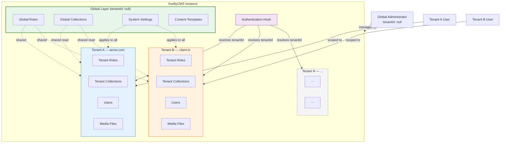
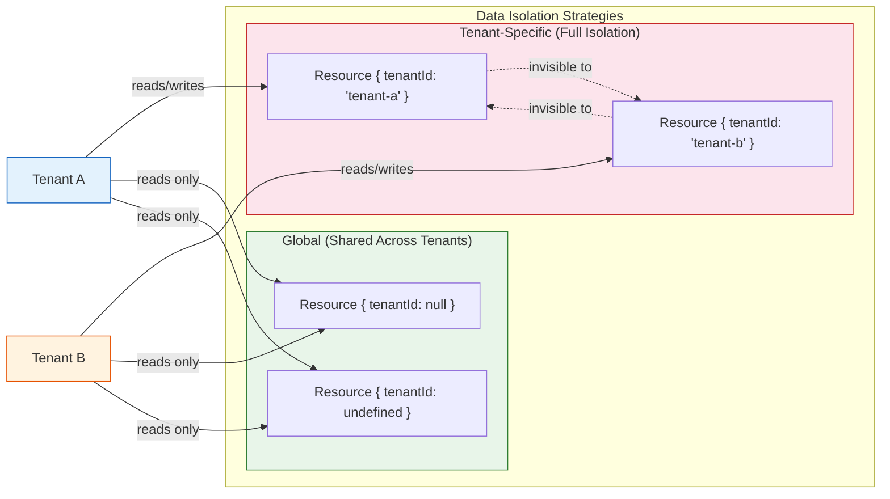
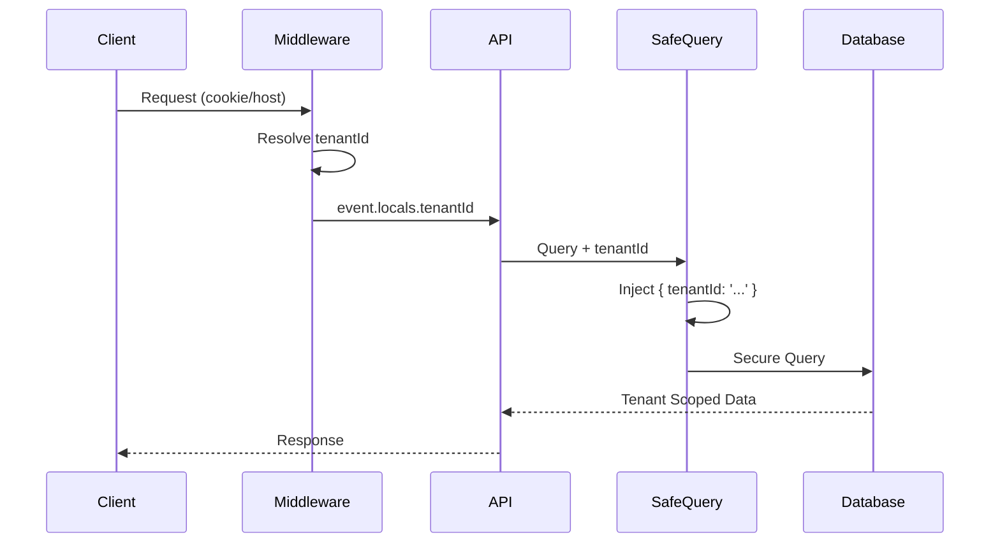
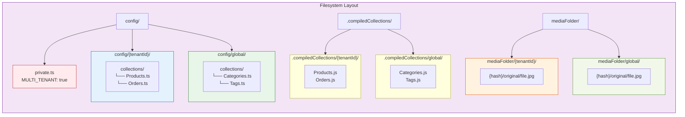

# Multi-Tenancy Architecture

SveltyCMS supports a robust multi-tenancy architecture allowing a single instance to serve multiple isolated tenants with flexible resource sharing capabilities.



## Core Concepts

### Tenant Entity Model

SveltyCMS treats tenants as first-class entities stored in the database. Each tenant record controls access, status, and resource limits.

````typescript
interface Tenant {
  _id: string; // UUID
  name: string;
  status: "active" | "suspended" | "pending";
  ownerId?: string; // Link to owner User
  plan: "free" | "pro" | "enterprise";

  // Resource Quotas
  quota: {
    maxUsers: number;
    maxStorageBytes: number;
    maxCollections: number;
  };

  // Current Usage (Updated via Telemetry/Hooks)
  usage: {
    usersCount: number;
    storageBytes: number;
    collectionsCount: number;
  };

  createdAt: string;
  updatedAt: string;
}
```text

### Tenant Identification

Tenants are identified via:

1.  **Hostname**: `tenant1.example.com` -> Resolves to Tenant ID.
2.  **Session Cookie**: `__Host-demo_tenant_id` on HTTPS / `demo_tenant_id` on HTTP (Demo Mode) or `svelty_tenant` (Standard). Uses `__Host-` prefix per RFC 6265bis for subdomain isolation on secure connections.
3.  **API Header**: `X-Tenant-ID` (for API integration).

4.  **Registration**: New users can register without a token (if `MULTI_TENANT` and `DEMO` mode are enabled) to create a brand new isolated tenant. In **Demo Mode**, the registration UI is further simplified by hiding the token field entirely.

**Global Administrator Access**:
The system maintains a concept of a **Global Administrator** (the first user created during setup). This user:

- Has no `tenantId` (`tenantId: null`, operating globally).
- Is explicitly protected from automated cleanup processes (like Demo Mode cleanup).
- Can manage all aspects of the system across all tenants.

### Data Isolation Strategies



SveltyCMS supports two primary data isolation strategies that can be mixed and matched based on your requirements:

#### 1. **Tenant-Specific Resources** (Full Isolation)

Resources with a `tenantId` field are isolated to a specific tenant. This is the default for most user-generated content.

#### 2. **Global Resources** (Shared Across Tenants)

Resources without a `tenantId` (or with `tenantId: null`) are shared across all tenants. This is ideal for:

- System-wide roles and permissions
- Shared content templates
- Global configuration settings
- Common collections accessible to all tenants

## Resource Isolation Patterns

### Roles and Permissions

Roles can be configured as either **global** or **tenant-specific**:

```
// Global Role (shared across all tenants)
interface GlobalRole {
  _id: string;
  name: string;
  permissions: string[];
  tenantId?: undefined; // No tenantId = global
}

// Tenant-Specific Role
interface TenantRole {
  _id: string;
  name: string;
  permissions: string[];
  tenantId: string; // Specific tenant ID
}
```text

**Use Cases:**

- **Global Roles**: System-wide roles like "Super Admin", "Content Manager", "Viewer" that apply across all tenants
- **Tenant-Specific Roles**: Custom roles per tenant like "Acme Corp Editor", "Client A Reviewer"

**Database Operations:**

```
// Get all roles (global + tenant-specific)
await dbAdapter.auth.getAllRoles(tenantId);

// Get only global roles
await dbAdapter.auth.getAllRoles(undefined);

// Get tenant-specific roles
await dbAdapter.auth.getAllRoles("tenant-123");
```text

### Collections

Collections can be configured as **global** or **tenant-specific**:

```
// Global Collection (accessible to all tenants)
interface GlobalCollection {
  _id: string;
  name: string;
  nodeType: "collection";
  tenantId?: undefined; // No tenantId = global
}

// Tenant-Specific Collection
interface TenantCollection {
  _id: string;
  name: string;
  nodeType: "collection";
  tenantId: string; // Specific tenant ID
}
```text

**Use Cases:**

- **Global Collections**: Shared resources like "Products", "Categories", "Tags" that all tenants can access
- **Tenant-Specific Collections**: Isolated data like "Orders", "Customers", "Internal Documents"

**Content Entries:**
All entries within a collection inherit the collection's isolation strategy:

```
interface CollectionEntry {
  _id: string;
  status?: "published" | "draft" | "archived";
  tenantId?: string; // Matches parent collection's tenantId
  createdBy?: string;
  updatedBy?: string;
}
```text

### System Settings

System settings support an explicit `isGlobal` flag:

```
interface SystemSetting {
  key: string;
  value: unknown;
  isGlobal?: boolean; // true = shared across tenants
  tenantId?: string; // undefined if isGlobal is true
}
```text

**Use Cases:**

- **Global Settings**: System-wide configuration like "SMTP Server", "Default Theme", "API Rate Limits"
- **Tenant Settings**: Per-tenant customization like "Company Logo", "Branding Colors", "Feature Flags"

## Implementation Details

### Authentication Hook

The `handleAuthentication` hook (`src/hooks/handleAuthentication.ts`) is the entry point for tenant resolution:

1.  It checks the `MULTI_TENANT` setting.
2.  It resolves the `tenantId` from the request (hostname or cookie).
3.  It sets `event.locals.tenantId`.
4.  It validates that the authenticated user belongs to the resolved tenant.

### Database Adapter

The `DatabaseAdapter` interface supports optional `tenantId` for most operations, enabling flexible resource isolation:

```
interface IAuthAdapter {
  // Roles
  getAllRoles(tenantId?: string): Promise<Role[]>;
  getRoleById(roleId: string, tenantId?: string): Promise<DatabaseResult<Role | null>>;
  createRole(role: Role): Promise<DatabaseResult<Role>>;
  updateRole(
    roleId: string,
    roleData: Partial<Role>,
    tenantId?: string,
  ): Promise<DatabaseResult<Role>>;
  deleteRole(roleId: string, tenantId?: string): Promise<DatabaseResult<void>>;

  // Users
  getUserById(user_id: string, tenantId?: string): Promise<DatabaseResult<User | null>>;
  getUserByEmail(criteria: {
    email: string;
    tenantId?: string;
  }): Promise<DatabaseResult<User | null>>;
  // ...
}
```text

**Query Behavior:**

- `tenantId` **provided**: Returns only resources for that specific tenant
- `tenantId` **undefined/null**: Returns global resources (no `tenantId` field)
- **Both**: Some operations may return both global and tenant-specific resources (e.g., roles)

### Data Isolation Enforcement

Data isolation is enforced strictly via the `safeQuery` utility and Database Adapter layers:

1. **Strict Query Isolation (`safeQuery`)**:
   - All database operations are wrapped in `safeQuery(query, tenantId)`.
   - **Mechanism**: Automatically injects `{ tenantId: '...' }` into every filter.
   - **Protection**: Throws an error if `tenantId` is missing in Multi-Tenant mode (unless explicitly `global`).
   - Prevents accidental "find all" queries from leaking cross-tenant data.

   ```
   // Example in MongoDB Adapter
   const secureFilter = safeQuery({ status: "active" }, currentTenantId);
   // Result: { status: 'active', tenantId: 'tenant-123' }
````

#### **Explicit Global Scope (System Services)**

In specific cases where the system needs to perform operations on global resources (e.g., plugins, system settings), you must explicitly use `tenantId: null`. This signifies an intentional global operation:

```typescript
// Internal system maintenance operating on global data
const plugins = await dbAdapter.crud.findMany(
  "plugins",
  {},
  {
    tenantId: null, // Explicit global scope
  },
);
```

> [!CAUTION]
> There is no longer a `sudo: true` backdoor to bypass tenant isolation. Every query must either be explicitly scoped to a `tenantId` or intentionally declared global with `null`. Attempting to omit the tenant context will result in a hard Security Violation.



2. **Database Adapter Level**:
   - Operations without a `tenantId` default to Global (if allowed) or throw errors.
   - `deleteMany` and `updateMany` are scoped strictly to the tenant.

3. **Storage Level**: Media files are stored in tenant-specific folders
   - Pattern: `uploads/{tenantId}/...` for tenant-specific files
   - Pattern: `uploads/global/...` for shared assets

4. **API Level**: Endpoints validate `tenantId` from `event.locals.tenantId`

5. **Compilation Level**: Collection schemas are compiled with `tenantId` embedded
   - The compilation system (`src/utils/compilation/`) automatically injects `tenantId` into compiled schemas
   - When compiling collections, pass `tenantId` in `CompileOptions`:
     ```typescript
     await compile({
       tenantId: "tenant-123", // Tenant-specific collection
       // or
       tenantId: null, // Global collection
       // or
       tenantId: undefined, // No multi-tenancy (default)
     });
     ```
   - Compiled files include tenant metadata in header comments for debugging:
     ```javascript
     // WARNING: Generated file. Do not edit.
     // HASH: abc123def456
     // TENANT_ID: tenant-123
     ```

### Directory Structure



Multi-tenant mode uses a tenant-based directory structure for better organization. The `config/private.ts` file is the bootstrap source for the `MULTI_TENANT` flag.

**Benefits:**

- All tenant resources in one directory
- Easy tenant backup/migration
- Clear ownership boundaries
- Scalable for additional tenant resources (themes, plugins, etc.)

**Legacy Support:**

- Single-tenant mode uses `config/collections/` (backward compatible)
- When multi-tenancy is enabled, collections are **automatically migrated** from `config/collections/` → `config/{tenantId}/collections/` via `migrateToMultiTenant()`
- When multi-tenancy is disabled, collections can be migrated back via `migrateToSingleTenant()`
- Compilation engine uses **smart path resolution**: if the tenant path has no `.ts` files, it falls back to flat `config/collections/` automatically

### Auto-Migration on Toggle

When `MULTI_TENANT` changes in `config/private.ts`, the `collections-migration.server.ts` module handles the transition:

**Single → Multi:**

```
config/collections/pages.ts  ──[migrateToMultiTenant("primary")]──►  config/primary/collections/pages.ts
```

**Multi → Single:**

```
config/primary/collections/pages.ts  ──[migrateToSingleTenant("primary")]──►  config/collections/pages.ts
```

During compilation, the engine detects empty tenant directories and falls back gracefully:

```typescript
// compile.ts — smart path resolution
const entries = await fs.readdir(tenantCollections);
if (!hasTsFiles) {
  const flatDir = getCollectionsPath(undefined);
  if (flatDirHasFiles) {
    // Fall back — not yet migrated
    userCollections = flatDir;
  }
}
```

### Configuration

Multi-tenancy is enabled via the `MULTI_TENANT` private setting in `config/private.ts` or the database settings.

### `isMultiTenantEnabled()` — Unified Detection

All runtime code uses `isMultiTenantEnabled()` from `src/utils/tenant.ts` instead of reading `config/private.ts` directly:

```typescript
// Unified checker — two sources, one answer
export function isMultiTenantEnabled(): boolean {
  // 1. Check DB setting (runtime override — set via System Settings, no restart)
  const dbVal = getPublicSettingSync("MULTI_TENANT");
  if (dbVal !== undefined) return !!dbVal;
  // 2. Fall back to file config (bootstrap default)
  return getPrivateSettingSync("MULTI_TENANT") === true;
}
```

This means:

- **Fresh install**: File is the only source (DB not seeded yet) → file wins
- **Runtime toggle**: DB setting overrides file → immediate, no restart
- **Migration UI**: Updates both → immediate effect + persists across restarts

### CRUD Tenant Guard

```mermaid
graph LR
    APP[Plugin / Widget / Extension] -->|createTenantGuardedCrud| GUARD[CRUD Tenant Guard]
    GUARD -->|mode: inject| CHECK{isMultiTenant?}
    CHECK -->|No| PASS[Pass through unchanged]
    CHECK -->|Yes| HAS_ID{has tenantId?}
    HAS_ID -->|Yes| PASS
    HAS_ID -->|No| INJECT[Inject tenantId: "global"
                         + log warning]
    INJECT --> DB[(Database)]
    PASS --> DB

    subgraph GuardModes["Guard Modes"]
        INJECT_MODE["inject — add tenantId if missing<br/>(default, safe)"]
        REJECT_MODE["reject — throw if tenantId missing<br/>(strict)"]
        BYPASS_MODE["bypass — skip all checks<br/>(system operations)"]
    end

    style APP fill:#e3f2fd,stroke:#1565c0
    style GUARD fill:#f3e5f5,stroke:#7b1fa2
    style INJECT fill:#fff3e0,stroke:#e65100
    style DB fill:#e8f5e9,stroke:#2e7d32
    style GuardModes fill:#f5f5f5,stroke:#9e9e9e,stroke-dasharray: 5
```

All database operations pass through `crud-tenant-guard.ts`, a transparent proxy that auto-injects `tenantId` into every query:

```typescript
// Wired once at boot in db.ts
adapter.crud = createTenantGuardedCrud(adapter.crud, "inject");
```

| Operation                              | Guard behavior                                                 |
| -------------------------------------- | -------------------------------------------------------------- |
| **Read** (find, findMany, etc.)        | Injects `tenantId` into query `options` — `WHERE tenantId = ?` |
| **Write** (insert, update, upsert)     | Injects `tenantId` into **both** data AND options              |
| **Delete**                             | Injects `tenantId` into query options                          |
| **Bypass** (`bypassTenantCheck: true`) | Skips enforcement — for system-level ops                       |

This protects all plugins, custom widgets, and extensions **automatically** — no code changes needed.

### Media Storage Isolation

Media files are stored with tenant-scoped paths:

```
Before: mediaFolder/global/{hash}/original/file.jpg
After:  mediaFolder/{tenantId}/{hash}/original/file.jpg  (multi-tenant)
        mediaFolder/global/{hash}/original/file.jpg       (single-tenant)
```

The `buildOriginalRelPath(hash, filename, tenantId)` function accepts optional `tenantId` — when provided, files are isolated per tenant. The file server (`/files/[...path]`) resolves URLs from the path structure.

### Dashboard & Plugin Safety

| Layer                 | Protection                                                                   |
| --------------------- | ---------------------------------------------------------------------------- |
| **Widgets**           | UI-only — render data from the server, never query the DB directly           |
| **Dashboards**        | Read from tenant-filtered API endpoints — `locals.tenantId` in every request |
| **Plugin hooks**      | `beforeSave`, `afterSave` receive `context.tenantId`                         |
| **Plugin migrations** | `ensureCollection()` accepts `{ tenantId }` in options                       |

Dashboard API endpoints use `locals.tenantId` for all database queries. Widgets are inherently safe because they're just UI — they receive data from the server, never query the DB directly.

### Migration UI

```mermaid
graph TB
    START([Check Structure]) --> DETECT[detectFullStructure]
    DETECT -->|flat files in wrong dir| NEEDS[needsMigration: true]
    DETECT -->|all correctly placed| CLEAN[needsMigration: false]

    NEEDS --> SHOW[Show "Migrate Now" button]
    SHOW --> MIGRATE([User clicks Migrate])

    MIGRATE --> DECIDE{direction?}
    DECIDE -->|flat → tenant| TOMULTI[runFullMigration<br/>direction: to-multi]
    DECIDE -->|tenant → flat| TOSINGLE[runFullMigration<br/>direction: to-single]

    subgraph Migration["Migration Steps"]
        TOMULTI --> COL1[migrateToMultiTenant]
        TOMULTI --> MED1[migrateMediaToTenant]
        COL1 --> PRIV1[updatePrivateConfigMode
                      MULTI_TENANT: true]
        MED1 --> PRIV1

        TOSINGLE --> COL2[migrateToSingleTenant]
        TOSINGLE --> MED2[migrateMediaToGlobal]
        COL2 --> PRIV2[updatePrivateConfigMode
                      MULTI_TENANT: false]
        MED2 --> PRIV2
    end

    PRIV1 --> RECOMP[Recompile with new tenant context]
    PRIV2 --> RECOMP
    RECOMP --> DONE{{✅ Migration Complete
                     Restart recommended}}

    style START fill:#e3f2fd,stroke:#1565c0
    style SHOW fill:#fff3e0,stroke:#e65100
    style MIGRATE fill:#fce4ec,stroke:#c62828
    style Migration fill:#f3e5f5,stroke:#7b1fa2,stroke-dasharray: 5
    style DONE fill:#e8f5e9,stroke:#2e7d32
```

The System Settings page (`/config/system-settings`) includes a **Multi-Tenancy Migration** panel:

1. **Check Structure** — runs `detectFullStructure()` to detect files in wrong directories
2. **Migrate Now** — button appears when migration is needed
3. Runs `runFullMigration()` which orchestrates:
   - Collection files move
   - Media files move + DB path updates
   - `config/private.ts` toggle via `updatePrivateConfigMode()`
   - Recompilation with new tenant context

Results are displayed inline: _"Migration complete: 3 collection(s) moved, 147 media file(s) moved, recompiled"_

### Compilation Engine Fallback

The compiler (`compile.ts`) handles non-migrated structures gracefully:

```typescript
// Smart fallback in compile()
if (tenantPathHasNoTsFiles && flatPathHasTsFiles) {
  logger.warn(`⚠️ Tenant path empty, falling back to flat config/collections/`);
  logger.warn(`⚠️ Run migration to move collections`);
  userCollections = flatPath; // ← Graceful fallback
}
```

### Hash-Based Stable IDs

When a collection file is renamed, the compiler preserves its identity:

```typescript
// compile.ts — hash match detection
const hashMatch = findExistingHash(manifest, sourceHash);
if (hashMatch && hashMatch.path !== currentPath) {
  // File was renamed — reuse original _id
  stableId = hashMatch.originalId;
}
```

This ensures DB records stay linked across renames — no orphaned content.

## Best Practices

### When to Use Global Resources

Use global resources when:

- ✅ Data should be shared across all tenants (e.g., product catalog, shared templates)
- ✅ Consistency is required across tenants (e.g., system-wide roles)
- ✅ Reducing data duplication is important
- ✅ Centralized management is preferred

### When to Use Tenant-Specific Resources

Use tenant-specific resources when:

- ✅ Data must be completely isolated (e.g., customer orders, private documents)
- ✅ Compliance requires data segregation (e.g., GDPR, HIPAA)
- ✅ Tenants need independent customization (e.g., custom roles, workflows)
- ✅ Data ownership is tenant-specific

### Hybrid Approach

Most applications benefit from a hybrid approach:

````
// Example: E-commerce Platform
{
  // Global Resources
  productCatalog: { tenantId: undefined }, // Shared products
  systemRoles: { tenantId: undefined },    // Base roles

  // Tenant-Specific Resources
  orders: { tenantId: 'tenant-123' },      // Isolated orders
  customers: { tenantId: 'tenant-123' },   // Isolated customer data
  customRoles: { tenantId: 'tenant-123' }  // Tenant-specific roles
}
```text

## Migration from Single-Tenant to Multi-Tenant

### Automatic Migration on Enable

When switching from single-tenant to multi-tenant mode:

1. **Primary Tenant Creation**: A primary tenant is automatically created (typically using the domain name or a configured identifier)

2. **Automatic `tenantId` Assignment**: All existing resources receive the primary `tenantId`:

````

// Collections
db.collections.updateMany(
{ tenantId: { $exists: false } },
{ $set: { tenantId: "primary-tenant-id" } },
);

// Roles
db.roles.updateMany(
{ tenantId: { $exists: false } },
{ $set: { tenantId: "primary-tenant-id" } },
);

// Users
db.users.updateMany(
{ tenantId: { $exists: false } },
{ $set: { tenantId: "primary-tenant-id" } },
);

`````

3. **100% Separation**: After migration, all resources are fully isolated to the primary tenant by default

### Creating Global Resources (Post-Migration)

To share resources across tenants after migration, explicitly set `tenantId` to `null`:

````typescript
// Make a role global (shared across all tenants)
await dbAdapter.auth.updateRole(
  roleId,
  {
    tenantId: null,
  },
  "primary-tenant-id",
);

// Make a collection global
await dbAdapter.content.nodes.update(collectionPath, {
  tenantId: null,
});
```text

### Converting Tenant-Specific to Global

```
// Remove tenantId to make resource global
await dbAdapter.crud.update("roles", roleId, {
  tenantId: null, // Explicitly set to null for global access
});
```text

### Converting Global to Tenant-Specific

```
// Add tenantId to isolate resource
await dbAdapter.crud.update("roles", roleId, {
  tenantId: "tenant-123",
});
```text

> **⚠️ Warning**: Converting resources between global and tenant-specific requires careful planning to avoid data access issues.

### Migration Checklist

When enabling multi-tenancy:

- [ ] **Backup Database**: Always backup before enabling multi-tenancy
- [ ] **Configure Primary Tenant**: Set the primary tenant identifier in configuration
- [ ] **Run Migration Script**: Execute the tenant migration script to assign `tenantId` to all resources
- [ ] **Verify Isolation**: Confirm all resources have `tenantId` assigned
- [ ] **Identify Global Resources**: Determine which resources (if any) should be shared globally
- [ ] **Update Global Resources**: Explicitly set `tenantId: null` for shared resources
- [ ] **Test Access**: Verify tenant isolation and global resource access
- [ ] **Update Documentation**: Document which resources are global vs tenant-specific

## Security Considerations

1. **Permission Checks**: Always validate that users have appropriate permissions for both global and tenant-specific resources
2. **Cross-Tenant Access**: Prevent users from accessing resources outside their tenant (except for explicitly global resources)
3. **Audit Logging**: Track access to both global and tenant-specific resources for compliance
4. **Data Leakage**: Ensure queries properly filter by `tenantId` to prevent accidental cross-tenant data exposure

## Performance Optimization

1. **Indexing**: Create compound indexes on `tenantId` + frequently queried fields

   ```
   db.collection.createIndex({ tenantId: 1, createdAt: -1 });
`````

2. **Caching**: Use tenant-aware cache keys

   ```typescript
   const cacheKey = tenantId ? `tenant:${tenantId}:roles` : "global:roles";
   ```

3. **Query Optimization**: Leverage global resources to reduce data duplication and improve query performance

## Admin Management

Admins can manage tenants via the **Tenant Dashboard** (`/admin/tenants`).

### Features

- **List View**: View all tenants, their plans, and status.
- **Quota Visualization**: Real-time progress bars for Users, Storage, and Collections.
- **Status Control**: Suspend or Activate tenants instantly.
  - **Suspended**: Users prevent from logging in; API access blocked.
- **Create Tenant**: Provision new tenants manually with specific plans.

This UI interacts directly with `TenantService`, ensuring all changes are auditable and safe.

---

## Related

- [Architecture Overview](./index.mdx)
- [Security Overview](../security/index.mdx)
- [State Management](./state-management.mdx)
