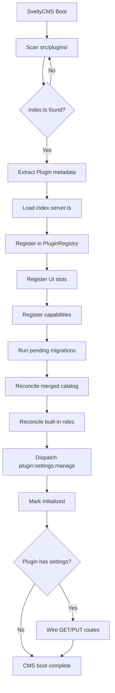
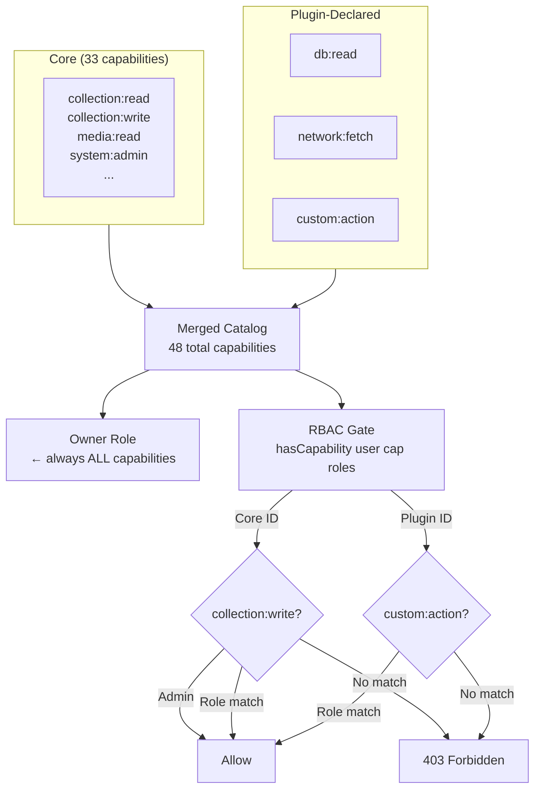
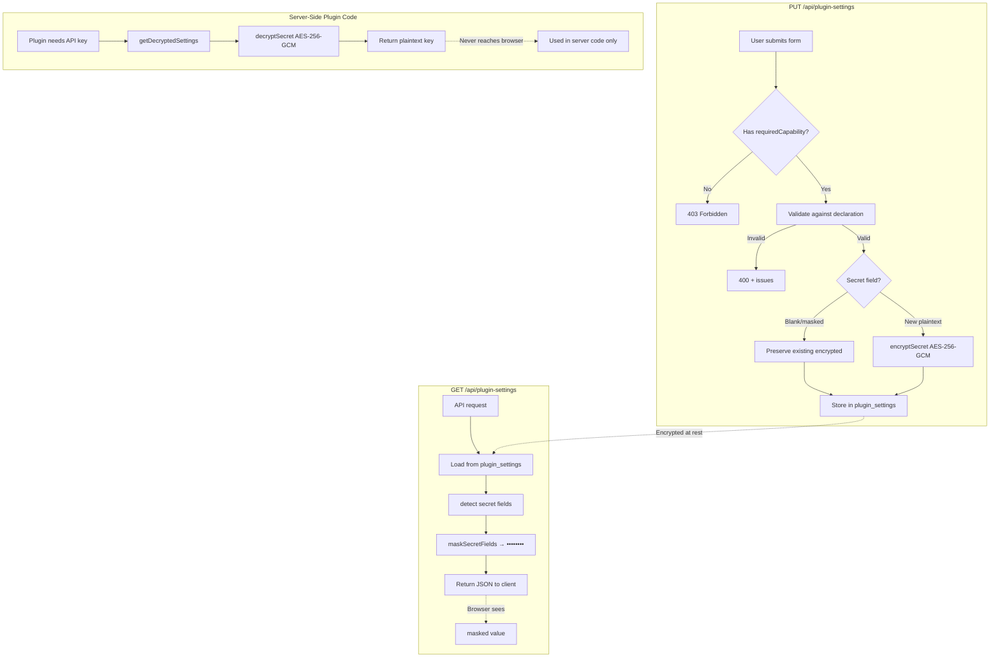
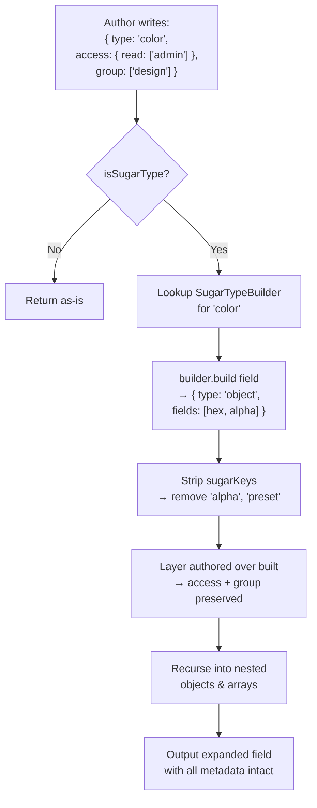
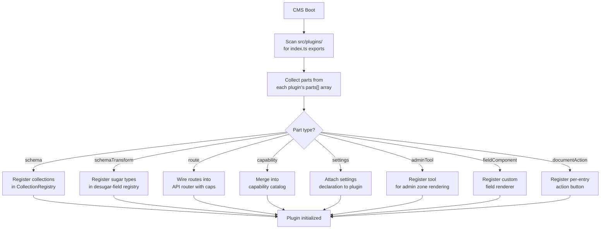
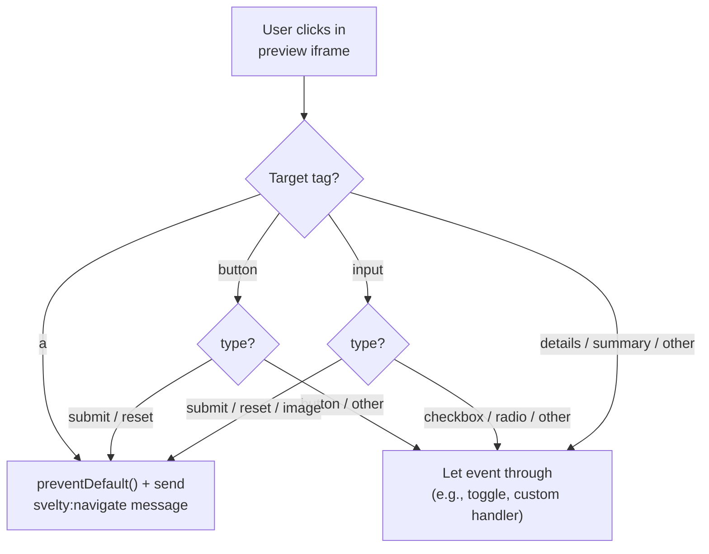

# Plugin Architecture

SveltyCMS features a robust, enterprise-grade plugin architecture. The authoritative documentation lives in the development guides:

→ **[Plugin Architecture Guide](/docs/development/plugins/architecture.mdx)** — System overview, injection zones, hooks, sandbox, config-page pattern, case studies, and available plugins.

→ **[Plugin Development Guide](/docs/development/plugins/development.mdx)** — Quick start, lifecycle hooks, SSR enrichment, UI slots, migrations, and security boundaries.

→ **[Plugin Types Reference](/src/plugins/types.ts)** — Full TypeScript type definitions.

### Plugin Boot Lifecycle



## Available Plugins

| Plugin                            | Category    | Docs                                                                                             |
| :-------------------------------- | :---------- | :----------------------------------------------------------------------------------------------- |
| **Smart AI-Driven Migration Pro** | Migration   | [smart-importer.mdx](/src/plugins/smart-importer/smart-importer.mdx)                             |
| PageSpeed                         | Performance | [pagespeed.mdx](/src/plugins/pagespeed/pagespeed.mdx)                                            |
| Redirect Manager                  | SEO         | [redirect-manager.mdx](/src/plugins/redirect-manager/redirect-manager.mdx)                       |
| Sitemap                           | SEO         | [sitemap.mdx](/src/plugins/sitemap/sitemap.mdx)                                                  |
| Stripe                            | Payments    | [stripe.mdx](/src/plugins/stripe/stripe.mdx)                                                     |
| WebMCP                            | AI          | [webmcp.mdx](/src/plugins/webmcp/webmcp.mdx)                                                     |
| Unified Data Hub                  | Data        | [unified-data-hub.mdx](/src/plugins/unified-data-hub/unified-data-hub.mdx)                       |
| Cookie Consent                    | Privacy     | [cookie-consent.mdx](/src/plugins/cookie-consent/cookie-consent.mdx)                             |
| Editable Website (premium)        | Editing     | [editable-website.mdx](/src/plugins/editable-website/editable-website.mdx) — live preview €14.99 |

## Plugin Capability System

SveltyCMS features a **merged capability catalog** that unifies core built-in capabilities with plugin-declared capabilities. This ensures that:

- **Owner always holds ALL capabilities** — including plugin-declared ones. Owners are treated as an invariant: they automatically receive every capability from the merged catalog.
- **Built-in roles are reconciled on boot** — existing organizations pick up newly added capabilities without manual intervention.
- **Capability checks accept plugin-declared IDs** — `hasCapability()` accepts both core `Capability` union members and arbitrary plugin-declared string IDs.

### Declaring Plugin Capabilities

Plugins declare their required capabilities in `metadata.capabilities`:

```typescript
// src/plugins/my-plugin/index.ts
export default {
  metadata: {
    id: "my-plugin",
    name: "My Plugin",
    capabilities: ["db:read", "media:read", "ui:slot"],
    enabled: true,
    version: "1.0.0",
    description: "Example plugin with capabilities",
  },
};
```

### Capability Reconciliation Flow



See [Capability Registry](/src/services/security/capability-registry.ts) for the full implementation.

## Encrypted Plugin Settings

Plugins can declare a **settings shape** that core renders as a configuration form, stores per tenant, and injects into the plugin's server code. Settings support a `secret` field type with **AES-256-GCM encryption at rest**.

### Key Features

- **Generic storage**: `plugin_settings` collection keyed by `(pluginId, tenantId)` — no migration needed for new plugins.
- **Secret encryption**: Fields typed `secret` are encrypted with AES-256-GCM under a versioned envelope (`v1:iv:authTag:ciphertext`).
- **Server-only decryption**: Secrets never reach the browser. The API serves masked values (`••••••••`).
- **Preservation on blank submit**: Submitting a blank/masked field leaves the stored secret untouched.
- **Validation on save**: Submitted values are validated against the declaration. Invalid patches are refused with 400 + issues.
- **Per-plugin capability gating**: `requiredCapabilities` on a SettingsPart gates specific plugin settings behind narrower capabilities.

### Configuration

Set `SECRET_ENCRYPTION_KEY` in your environment. Generate a key:

```bash
node -e "console.log(require('crypto').randomBytes(32).toString('hex'))"
```

### Example Declaration

```typescript
// In plugin's index.ts
import type { SettingsPart } from "@src/plugins/settings-declaration";

export const settings: SettingsPart = {
  label: "Stripe Configuration",
  fields: [
    { name: "apiKey", type: "secret", label: "API Key", required: true },
    { name: "webhookSecret", type: "secret", label: "Webhook Secret", required: true },
    {
      name: "currency",
      type: "string",
      label: "Default Currency",
      default: "eur",
      list: ["eur", "usd", "gbp"],
    },
  ],
  requiredCapabilities: ["settings:write"],
};
```

### API Endpoint

- `GET /api/plugin-settings/:pluginId` — Returns masked settings (secrets hidden). Requires `plugin:settings:manage` capability.
- `PUT /api/plugin-settings/:pluginId` — Saves and validates settings. Encrypts secrets automatically.

### Settings Round-Trip Flow



See [Settings Crypto](/src/plugins/settings-crypto.ts) and [Settings Declaration](/src/plugins/settings-declaration.ts) for implementation details.

## Schema Desugaring (Sugar Types)

SveltyCMS supports **shortcut field types** (sugar types) that expand into full object fields while preserving all authored metadata — access control, validation, groups, and custom properties.

### How It Works

When a collection author writes `{ type: 'color' }`, the desugaring engine:

1. Looks up the registered sugar type builder for `'color'`
2. Builds the expanded field shape (object with hex + alpha sub-fields)
3. Layers the authored field over the built one — **preservation is the default**
4. Strips sugar-only keys (e.g., `alpha` on color goes into `inputOptions.alpha`)
5. Recursively processes nested objects and array members

### Desugaring Pipeline



### Built-in Sugar Types

| Type    | Expands To                                                     | Sugar Keys        |
| :------ | :------------------------------------------------------------- | :---------------- |
| `color` | Object with `hex` (text/color), `alpha` (number), `preset`     | `alpha`, `preset` |
| `seo`   | Object with metaTitle, metaDescription, ogTitle, ogImage, etc. | `ogImageField`    |

### Extending

Plugins can register custom sugar types:

```typescript
import { registerSugarType } from "@widgets/desugar-field";

registerSugarType({
  type: "address",
  sugarKeys: ["googleMapsApiKey"],
  build(field) {
    return {
      type: "object",
      fields: [
        { name: "street", type: "text", label: "Street" },
        { name: "city", type: "text", label: "City" },
        { name: "zip", type: "text", label: "ZIP Code" },
        { name: "country", type: "text", label: "Country" },
      ],
    };
  },
});
```

See [Desugar Field](/src/widgets/desugar-field.ts) for the full API.

## Plugin Part System (`definePlugin`)

SveltyCMS plugins are now defined through a **discriminated union of structured "parts"** — typed contributions that the plugin registry resolves at boot time, replacing free-form plugin objects with compile-time safety.

### The `PluginPart` Discriminated Union

```typescript
// src/plugins/define-plugin.ts
export type PluginPart =
  | { type: "schema"; collections: SchemaDefinition[] }
  | { type: "schemaTransform"; transforms: SugarTypeBuilder[] }
  | { type: "route"; routes: PluginRoute[] }
  | { type: "capability"; capabilities: string[] }
  | { type: "settings"; declaration: SettingsPart }
  | { type: "adminTool"; tools: AdminTool[] }
  | { type: "fieldComponent"; components: FieldComponent[] }
  | { type: "documentAction"; actions: DocumentAction[] };
```

### The 8 Part Types

| Part Type         | Purpose                                                        | Resolution at Boot                                      |
| :---------------- | :------------------------------------------------------------- | :------------------------------------------------------ |
| `schema`          | Contribute entire collection schemas into the content system   | Collections registered in `CollectionRegistry`          |
| `schemaTransform` | Register sugar type builders for field desugaring              | Sugar type registry extended                            |
| `route`           | Register server routes into the route table                    | Routes wired into the API router with capability gating |
| `capability`      | Declare capabilities for the merged capability catalog         | Added to merged catalog, reconciled at boot             |
| `settings`        | Attach a settings declaration for the plugin's config form     | Settings form rendered in admin UI                      |
| `adminTool`       | Inject UI tools into admin zones (sidebar, toolbar, dashboard) | Lazy-loaded components mounted in target zones          |
| `fieldComponent`  | Register custom field renderers for the content editor         | Field type picker updated, components lazy-loaded       |
| `documentAction`  | Add per-entry action buttons in the content editor             | Action buttons rendered on entry detail pages           |

### Mandatory `requiredCapabilities` on Routes

**`PluginRoute.requiredCapabilities` is mandatory** — omitting it is a TypeScript error. This ensures no route is accidentally left open:

```typescript
export interface PluginRoute {
  path: string;
  handler: (event: RequestEvent) => Promise<Response>;
  method?: "GET" | "POST" | "PUT" | "PATCH" | "DELETE";
  /** Mandatory — use `[]` for auth-only, `"public"` for explicit opt-out. */
  requiredCapabilities: string[] | "public";
}
```

- `[]` → authentication required, no specific capability gate
- `"public"` → no authentication required (explicit opt-out for webhooks, etc.)
- `["manage:something"]` → specific capability required

### Using `definePlugin`

The `definePlugin` identity function preserves literal types for autocomplete while providing runtime dev-mode validation:

```typescript
import { definePlugin } from "@plugins/define-plugin";

export default definePlugin({
  metadata: { id: "my-plugin", name: "My Plugin", version: "1.0.0", enabled: true },
  parts: [
    { type: "capability", capabilities: ["db:read", "media:write"] },
    {
      type: "route",
      routes: [{ path: "/api/my-plugin/webhook", handler, requiredCapabilities: [] }],
    },
    {
      type: "settings",
      declaration: {
        label: "API Config",
        fields: [{ type: "secret", name: "apiKey", label: "API Key" }],
      },
    },
    {
      type: "adminTool",
      tools: [
        { id: "my-widget", label: "Dashboard", icon: "mdi:chart", zone: "dashboard", component },
      ],
    },
  ],
});
```

### Part Resolution Flow



See [define-plugin.ts](/src/plugins/define-plugin.ts) for the full type definitions.

## Admin Shell Extensions (`AdminArea`)

Plugins can declaratively extend the **admin shell chrome** — the persistent layout surrounding every admin route (sidebar, header, footer, and content regions). This is distinct from the existing `InjectionZone` slot system, which targets content-editing pages (entry editor, dashboard, media gallery) rather than the admin shell itself.

### Relationship to InjectionZone / PluginSlot

| System               | Targets                                        | Scope                               |
| :------------------- | :--------------------------------------------- | :---------------------------------- |
| `InjectionZone`      | Content pages (entry editor, dashboard, media) | Page-level content editing zones    |
| `AdminAreaExtension` | Admin shell chrome (sidebar, header, footer)   | Persistent layout around all routes |

### AdminAreaZone

Five zones define where an extension renders:

```typescript
// src/plugins/admin-area.ts
export type AdminAreaZone = "sidebar" | "header" | "footer" | "content-header" | "content-footer";
```

### AdminAreaExtension Interface

```typescript
export interface AdminAreaExtension {
  id: string; // Unique identifier
  zone: AdminAreaZone; // Target shell zone
  component: () => Promise<unknown>; // Lazy-loaded Svelte component
  order?: number; // Priority (lower = first)
  condition?: (context: AdminAreaContext) => boolean; // Conditional rendering
  requiredCapabilities?: string[]; // Capability gate (default: all authed)
  props?: Record<string, unknown>; // Static props forwarded to component
}
```

### AdminAreaContext

Extensions receive runtime context for conditional rendering:

```typescript
export interface AdminAreaContext {
  user: User | null; // Currently authenticated user
  tenantId: string; // Active tenant identifier
  pathname: string; // Current admin pathname
  collection?: string; // Current collection name (if on a collection route)
  isAdmin: boolean; // Whether the user holds the admin role
}
```

### Example: Sidebar Extension

```typescript
import type { AdminAreaExtension } from "@plugins/admin-area";

const sidebarWidget: AdminAreaExtension = {
  id: "my-plugin-sidebar",
  zone: "sidebar",
  component: () => import("./SidebarWidget.svelte"),
  order: 10,
  requiredCapabilities: ["manage:content"],
  condition: (ctx) => ctx.collection !== undefined, // Show only on collection routes
  props: { title: "Quick Actions" },
};
```

See [admin-area.ts](/src/plugins/admin-area.ts) for the full type definitions.

## Visual Editing & Preview Bridge

The **Editable Website** plugin (premium, €14.99) provides a Live Preview iframe with three key improvements for visual editing:

### 1. Click Handling Fix (`preview-bridge.ts`)

Previous implementations ran `preventDefault()` on **every** click in the capture phase, breaking all interactive elements whose default action is a click — `<details>/<summary>` toggles, checkboxes, radios, range inputs, etc.

The corrected handler only cancels **navigation-intent clicks**: anchor links and submit/reset buttons. Everything else passes through normally.



### 2. Steganography Cleaning (`stega.ts`)

During visual editing, invisible zero-width Unicode markers are embedded in text content for click-to-edit field identification. `stegaClean()` strips these markers — zero-width spaces (`U+200B`), joiners (`U+200D`), non-joiners (`U+200C`), BOM (`U+FEFF`), and bidi marks (`U+200E`/`U+200F`) — before content is rendered in production.

```typescript
import { stegaClean, hasStegaMarkers, stegaCleanDeep } from "@plugins/editable-website/stega";

stegaClean("Hello\u200B World"); // → "Hello World"
hasStegaMarkers("plain text"); // → false
stegaCleanDeep({ title: "Hi\u200B" }); // → { title: "Hi" }
```

### 3. Reactive Preview Hook (`use-preview.svelte.ts`)

A Svelte 5 rune-based singleton that components consume to determine whether they're rendering inside a Live Preview iframe. Uses `$state` runes for fine-grained reactivity — no legacy store dependency.

```typescript
import { usePreview } from "@plugins/editable-website/use-preview.svelte";

const preview = usePreview();

// Set by the CMS when entering preview mode
preview.isPreview = true;
preview.origin = "https://cms.example.com";
preview.token = "preview-token-abc";

// Mode-aware resolvers
const cleanText = preview.resolveValue(rawContent); // Strips stego in production
const imageUrl = preview.resolveImage("/uploads/cat.jpg"); // Rewrites origin in preview
```

**Key behaviors:**

- **In preview**: values pass through unchanged (stego markers preserved for click-to-edit), relative image URLs rewritten to CMS origin.
- **In production**: stego markers stripped, image URLs pass through unchanged.

See [preview-bridge.ts](/src/plugins/editable-website/preview-bridge.ts), [stega.ts](/src/plugins/editable-website/stega.ts), and [use-preview.svelte.ts](/src/plugins/editable-website/use-preview.svelte.ts) for full implementations.
