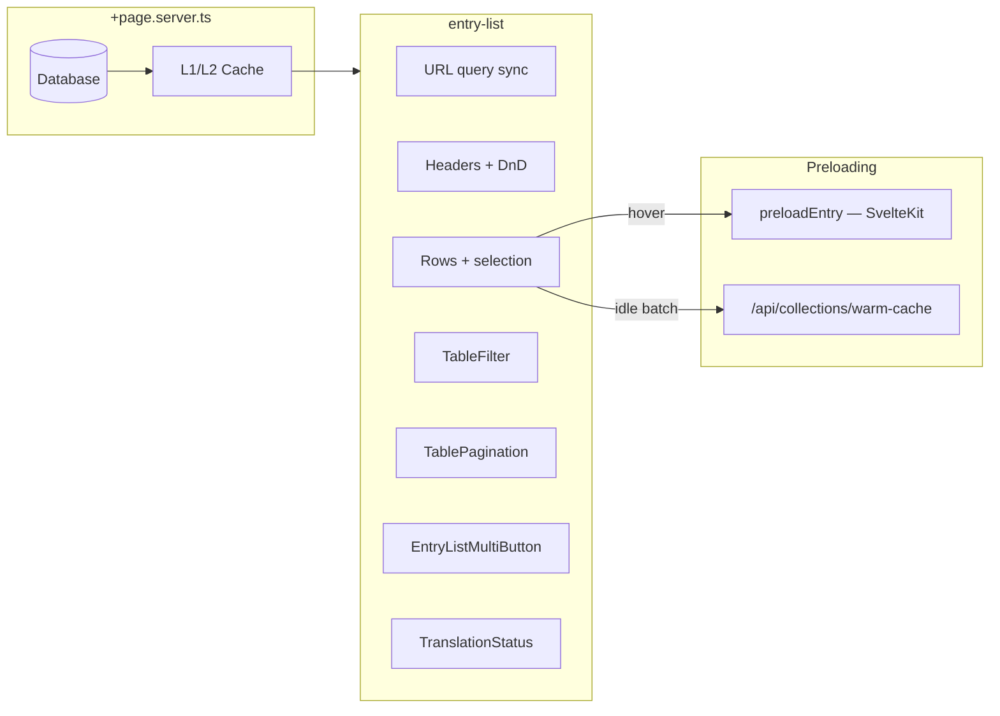

# entry-list Component

**File**: `src/components/collection-display/entry-list.svelte`

Primary table for collection **view mode**. Data comes from `+page.server.ts` props; the component does **not** perform client-side collection fetching.

---

## Architecture



---

## Features (as implemented)

| Feature                | Implementation                                                                   |
| ---------------------- | -------------------------------------------------------------------------------- |
| **Server-driven data** | `entries` and `pagination` props from SSR; `tableData = $derived(serverEntries)` |
| **URL state**          | `search`, `page`, `pageSize`, `filter_{field}`, sort fields via `goto()`         |
| **Debounced search**   | `globalSearchValue` synced to URL; resets to page 1 on new search                |
| **Column filters**     | Per-column inputs when filter row open; URL keys `filter_{name}`                 |
| **Sortable columns**   | Header click toggles ASC/DESC; synced to URL                                     |
| **Pagination**         | `TablePagination`; page sizes via `rowsPerPage` URL param                        |
| **Multi-select**       | Shift+click range selection; select-all checkbox                                 |
| **Bulk actions**       | Delegated to `entry-list-multi-button.svelte`                                    |
| **Archived view**      | `showDeleted` toggles active vs archived entries                                 |

| **Column manager** | Show/hide columns; **drag-and-drop reorder** (`svelte-dnd-action`) |
| **Density** | `normal` / `compact` via `TableFilter` → `entryListPaginationSettings.density` |
| **localStorage** | Per-collection `entryListPaginationSettings_{collectionId}` persisted |

| **Plugin columns** | `availablePlugins` → dynamic headers → `PluginComponent` cells |
| **Translation UI** | Embeds `translation-status.svelte` in filter toolbar |
| **Hover preload** | `preloadEntry()` from `@utils/navigation` on row hover |
| **Idle warm-cache** | First 5 visible rows → `POST /api/collections/warm-cache` (one ID per request) |
| **Connection-aware** | Disables preload on `slow-2g` / `2g` / `saveData` (Network Information API) |

---

## URL Parameters

| Param                | Purpose                                                               |
| -------------------- | --------------------------------------------------------------------- |
| `search`             | Global text search (server-side)                                      |
| `page`               | Current page number                                                   |
| `pageSize`           | Rows per page                                                         |
| `filter_{fieldName}` | Per-column filter value                                               |
| Sort fields          | Written by `onSortChange` (see `entryListPaginationSettings.sorting`) |

---

## Props

```typescript
interface EntryListProps {
  entries: Entry[];
  pagination: {
    currentPage: number;
    pageSize: number;
    totalItems: number;
    pagesCount: number;
  };
  contentLanguage: string;
  breadcrumb?: Array<{ name: string; path: string }>;
  collectionStats?: {
    _id: string;
    name: string;
    count: number;
    lastModified: string;
  } | null;
}
```

---

## Keyboard Shortcuts

Shortcuts are implemented on **`entry-list-multi-button`**, not in `entry-list.svelte` directly:

| Shortcut  | Action             |
| --------- | ------------------ |
| `Alt+N`   | Create             |
| `Alt+P`   | Publish selected   |
| `Alt+U`   | Unpublish selected |
| `Alt+D`   | Draft selected     |
| `Alt+Del` | Delete selected    |

---

## Scheduling Note

Bulk **Schedule** from MultiButton calls `onSchedule(date)` which sets a `_scheduled` timestamp payload on selected entries. The full **schedule-modal** (date/time/action picker) is opened from **header-edit** / **right-sidebar** / `entry-actions.ts` via `showScheduleModal()`, not from the bulk schedule stub.

---

## Plugin Columns

Plugins register `ui.columns` in their definition. `entry-list` adds headers and renders cells with:

```svelte
<PluginComponent
  pluginId={...}
  componentName={header.component}
  {...mapPluginProps(header.props, entry)}
/>
```

Zone for list-level plugin UI: **`dashboard`** slot `list_actions` (see plugin docs).

---

## Related Documentation

- [MultiButton](./entrylist-multibutton.mdx)
- [translation-status](./translation-status.mdx)
- [fields](./fields.mdx)
- [Collection page load tiers](/docs/reference/architecture/collection-store-dataflow.mdx)
