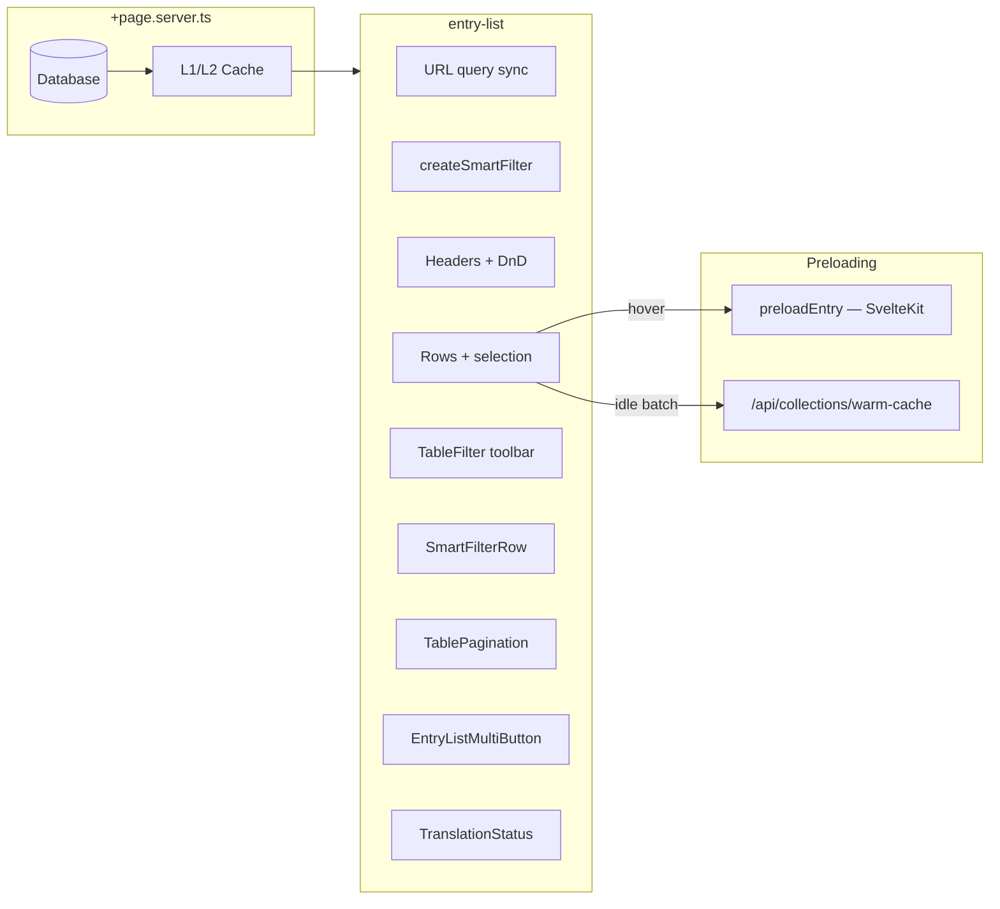
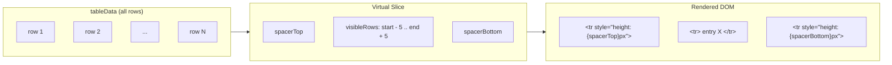

# entry-list Component

**File**: `src/components/collection-display/entry-list.svelte`

Primary table for collection **view mode**. Data comes from `+page.server.ts` props; the component does **not** perform client-side collection fetching.

> **Platform**: Built on the unified [Smart Table](./smart-table.mdx) (`createSmartTable` server mode) + [Collection Filtering](../architecture/collection-filtering.mdx). Design-system tables share the same headless controller and pagination primitive.

---

## Architecture



---

## Features (as implemented)

| Feature                  | Implementation                                                                                    |
| ------------------------ | ------------------------------------------------------------------------------------------------- |
| **Server-driven data**   | `entries` and `pagination` props from SSR; `tableData = $derived(serverEntries)`                  |
| **URL state**            | `search`, `page`, `pageSize`, `filter_{field}`, sort fields via `goto()`                          |
| **Debounced search**     | `globalSearchValue` synced to URL; resets to page 1 on new search                                 |
| **Smart column filters** | `createSmartFilter` maps widgets → text/select/date/numberRange/boolean; URL keys `filter_{name}` |
| **Active filter badges** | Dismissible chips + clear-all; `aria-live` count for accessibility                                |
| **Status facets**        | `statusFacets` from `getStatusFacets` → `SmartTableStatusFacets` chips                            |
| **Saved views**          | `SmartTableSavedViewsMenu` — named filter/sort/layout presets per collection                      |
| **Column resize**        | Header drag handles via `ColumnResizeHandle` + `layoutKey: entry-list:{id}`                       |
| **List metrics**         | SSR `listMetrics` + `SmartTableMetricsBadge` when `?debug=table`                                  |
| **Sortable columns**     | Header click toggles ASC/DESC; synced to URL                                                      |
| **Pagination**           | `TablePagination`; page sizes via `rowsPerPage` URL param                                         |
| **Multi-select**         | Shift+click range selection; select-all checkbox                                                  |
| **Bulk actions**         | Delegated to `entry-list-multi-button.svelte`                                                     |
| **Archived view**        | `showDeleted` toggles active vs archived entries                                                  |
| **Column manager**       | Show/hide columns; **drag-and-drop reorder** (`svelte-dnd-action`)                                |
| **Density**              | `normal` / `compact` via `TableFilter` → `entryListPaginationSettings.density`                    |
| **localStorage**         | Per-collection `entryListPaginationSettings_{collectionId}` + Smart Table layout prefs            |

| **Plugin columns** | `availablePlugins` → dynamic headers → `PluginComponent` cells |
| **Translation UI** | Embeds `translation-status.svelte` in filter toolbar |
| **Hover preload** | `preloadEntry()` from `@utils/navigation` on row hover |
| **Idle warm-cache** | First 5 visible rows → `POST /api/collections/warm-cache` (one ID per request) |
| **Connection-aware** | Disables preload on `slow-2g` / `2g` / `saveData` (Network Information API) |
| **Row virtualization** | On pages with >25 rows, only visible rows + buffer (5 above/below) render as DOM elements; spacers maintain scroll height |

---

## URL Parameters

| Param                | Purpose                                                               |
| -------------------- | --------------------------------------------------------------------- |
| `search`             | Global text search (server-side)                                      |
| `page`               | Current page number                                                   |
| `pageSize`           | Rows per page                                                         |
| `filter_{fieldName}` | Per-column filter value (from `createSmartFilter.toURLParams()`)      |
| Sort fields          | Written by `onSortChange` (see `entryListPaginationSettings.sorting`) |

---

## Smart Filters (`createSmartFilter`)

**Files**:

- `src/components/collection-display/create-smart-filter.svelte.ts` — reactive factory + pure helpers
- `src/components/collection-display/smart-filter-row.svelte` — type-aware filter row + badges

Filter control types are derived from collection schema widgets (database-agnostic — no adapter imports):

| Control type  | When used                               | UI control                        |
| ------------- | --------------------------------------- | --------------------------------- |
| `text`        | Default scalar fields                   | Floating search input             |
| `select`      | `status`, Select/Radio widgets          | Native select with options        |
| `date`        | Date widgets, `createdAt` / `updatedAt` | `<input type="date">`             |
| `numberRange` | Number / Price / Currency / Rating      | Min–max inputs (`min:max` in URL) |
| `boolean`     | Checkbox / toggle widgets               | Yes / No select                   |

Unsafe widgets (media, rich text, relations, groups, etc.) are excluded via `safeForFiltering: false`.

### Client API

```typescript
const smartFilter = createSmartFilter(() => collection.value);

smartFilter.setFilter("status", "publish");
smartFilter.clearFilter("status");
smartFilter.clearAll();

// URL deep-link params: { filter_status: "publish", filter_title: null, ... }
updateURL({ ...smartFilter.toURLParams(), page: "1" });

// Adapter-agnostic server payload (contains operator — adapters interpret)
smartFilter.toFilterQuery(); // { status: { contains: "publish" } }
```

### Security & architecture (must stay enforced server-side)

| Concern                 | Responsibility                                                                                                                    |
| ----------------------- | --------------------------------------------------------------------------------------------------------------------------------- |
| **Query safety**        | `parseCollectionListQuery` + `whitelistFilterParams` drop unknown field names before the DB. Client `allowedFieldIds` is UX-only. |
| **RBAC / tenant**       | Auth + permission hooks; `CollectionService` injects `tenantId` when multi-tenant is enabled.                                     |
| **Caching (L1/L2 SWR)** | `getOrSetSWR` with key `collection:{id}:query:{hash}:…` (60s fresh / 5m stale). Empty pages are **not** Bloom-negative-cached.    |
| **Prefix invalidation** | Mutations → `cacheService.invalidateCollection(id)` clears all filter/search/page variants.                                       |
| **Server hooks**        | Authentication and authorization run before the collection page loader.                                                           |

> [!IMPORTANT]
> Number ranges are stored as adapter-agnostic strings (`min:max`). Today the page loader maps every `filter_*` to `{ contains: value }`. Backend operators (gte/lte) can be added later without changing the frontend encoding.

### Shared modules

| Module                             | Role                                                               |
| ---------------------------------- | ------------------------------------------------------------------ |
| `@utils/collection-query-filters`  | URL parse, schema whitelist, stable `queryHash`, cache key builder |
| `create-smart-filter.svelte.ts`    | Reactive filter UI state + control types from schema widgets       |
| `system/table/table-filter.svelte` | Toolbar (search, density, filter/column toggles)                   |
| `ui/table/filter.svelte`           | Generic table toolbar primitive (design system)                    |
| `@utils/table-controller.svelte`   | Shared selection/sort class (re-exported from collection-display)  |

### Architecture docs

- [Collection Filtering Platform](../architecture/collection-filtering.mdx) — core capability (schema, FLAC, QueryBuilder, cache)
- [Cache System](../architecture/cache-system.mdx) — L1/L2, getOrSetSWR, prefix invalidation, negative caching rules
- [Content API — list query params](../api/content.mdx) — `search` / `filter_*` / global search vs column filters
- [Data Operations](../architecture/data-operations.mdx) — import/sync/apply must invalidate collection list caches

---

## Props

```typescript
interface EntryListProps {
  entries: Entry[];
  pagination: {
    currentPage: number;
    pageSize: number;
    totalItems: number;
    pagesCount: number;
  };
  contentLanguage: string;
  breadcrumb?: Array<{ name: string; path: string }>;
  collectionStats?: {
    _id: string;
    name: string;
    count: number;
    lastModified: string;
  } | null;
}
```

---

## Keyboard Shortcuts

Shortcuts are implemented on **`entry-list-multi-button`**, not in `entry-list.svelte` directly:

| Shortcut  | Action             |
| --------- | ------------------ |
| `Alt+N`   | Create             |
| `Alt+P`   | Publish selected   |
| `Alt+U`   | Unpublish selected |
| `Alt+D`   | Draft selected     |
| `Alt+Del` | Delete selected    |

---

## Row Virtualization

When the page size exceeds 25 rows (`useRowVirtualization = $derived(pageSize > 25)`), the component activates row virtualization to avoid rendering all rows into the DOM:



- **Row height**: 44px per row (defined in `src/utils/table-constants.ts`)
- **Buffer**: 5 rows rendered above and below the visible viewport to prevent blank flashes during scroll
- **Scroll container**: `max-h-[calc(100dvh)]` with `overflow-auto`; scroll position tracked via `onscroll` handler
- **Index mapping**: `{@const realIndex = virtualStartIndex + idx}` preserves selection state across virtual/non-virtual modes
- **`content-visibility: auto`**: Applied to virtualized rows for additional browser-level rendering optimization

Key state variables:

| Variable                     | Type       | Purpose                                                                |
| ---------------------------- | ---------- | ---------------------------------------------------------------------- |
| `virtualScrollTop`           | `$state`   | Current scroll position in pixels                                      |
| `containerHeight`            | `$state`   | Visible height of the scroll container                                 |
| `virtualStartIndex`          | `$derived` | First visible row index (minus buffer)                                 |
| `virtualEndIndex`            | `$derived` | Last visible row index (plus buffer)                                   |
| `visibleRows`                | `$derived` | `tableData.slice(virtualStartIndex, virtualEndIndex)` — rows to render |
| `spacerTop` / `spacerBottom` | `$derived` | Padding rows above/below the visible window                            |

> [!TIP]
> Virtualization is **opt-in** — it only activates when `pageSize > 25`. Below that threshold, the table renders all rows directly with no overhead from scroll tracking.

## Scheduling Note

Bulk **Schedule** from MultiButton calls `onSchedule(date)` which sets a `_scheduled` timestamp payload on selected entries. The full **schedule-modal** (date/time/action picker) is opened from **header-edit** / **right-sidebar** / `entry-actions.ts` via `showScheduleModal()`, not from the bulk schedule stub.

---

## Plugin Columns

Plugins register `ui.columns` in their definition. `entry-list` adds headers and renders cells with:

```svelte
<PluginComponent
  pluginId={...}
  componentName={header.component}
  {...mapPluginProps(header.props, entry)}
/>
```

Zone for list-level plugin UI: **`dashboard`** slot `list_actions` (see plugin docs).

---

## Related Documentation

- [MultiButton](./entrylist-multibutton.mdx)
- [translation-status](./translation-status.mdx)
- [fields](./fields.mdx)
- [Collection page load tiers](/docs/reference/architecture/collection-store-dataflow.mdx)
- [Cache System](../architecture/cache-system.mdx) — L1/L2 SWR + `collection:{id}:query:{hash}`
- [Content API query params](../api/content.mdx) — `search` / `filter_*` / global search
- [Data Operations](../architecture/data-operations.mdx) — invalidate list caches after import/sync
- Unit tests: `tests/unit/components/create-smart-filter.test.ts`, `tests/unit/utils/collection-query-filters.test.ts`
