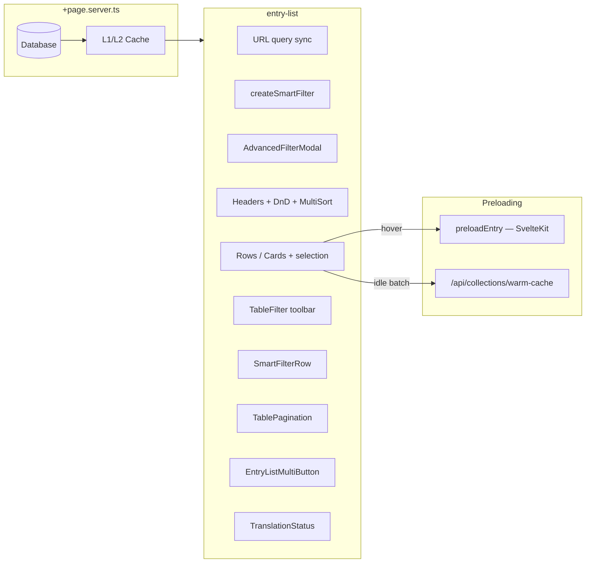
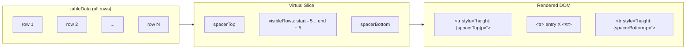

# entry-list Component

**File**: `src/components/collection-display/entry-list.svelte`

Primary table for collection **view mode**. Data comes from `+page.server.ts` props; the component does **not** perform client-side collection fetching.

> **Platform**: Built on the unified [Smart Table](./smart-table.mdx) (`createSmartTable` server mode) + [Collection Filtering](../architecture/collection-filtering.mdx). Design-system tables share the same headless controller, multi-column sorting, and pagination primitive.

---

## Architecture


```mermaid
flowchart LR
    subgraph Server["+page.server.ts"]
        DB[(Database)]
        Cache[L1/L2 Cache]
    end

    subgraph EL["entry-list"]
        URL[URL query sync]
        SF[createSmartFilter]
        AFM[AdvancedFilterModal]
        TH[Headers + DnD + MultiSort]
        TR[Rows / Cards + selection]
        TF[TableFilter toolbar]
        SFR[SmartFilterRow]
        PG[TablePagination]
        MB[EntryListMultiButton]
        TS[TranslationStatus]
    end

    subgraph Preload["Preloading"]
        PE[preloadEntry — SvelteKit]
        WC["/api/collections/warm-cache"]
    end

    DB --> Cache --> EL
    TR -->|hover| PE
    TR -->|idle batch| WC
```

---

## Features (as implemented)

| Feature                     | Implementation                                                                                                                            |
| --------------------------- | ----------------------------------------------------------------------------------------------------------------------------------------- |
| **Server-driven data**      | `entries` and `pagination` props from SSR; `tableData = $derived(serverEntries)`                                                          |
| **URL state**               | `search`, `page`, `pageSize`, `filter_{field}`, sort fields via `goto()`                                                                  |
| **Debounced search**        | `globalSearchValue` synced to URL; resets to page 1 on new search                                                                         |
| **Smart column filters**    | `createSmartFilter` maps widgets → text/select/date/numberRange/boolean; URL keys `filter_{name}`                                         |
| **Advanced filters modal**  | `AdvancedFilterModal` compound `AND`/`OR` multi-clause query builder across all schema fields with type-aware operators                   |
| **Active filter badges**    | Dismissible chips + clear-all + advanced count badge; `aria-live` count for accessibility                                                 |
| **Status facets**           | `statusFacets` from `getStatusFacets` → `SmartTableStatusFacets` chips                                                                    |
| **Saved views**             | `SmartTableSavedViewsMenu` — named filter/sort/layout presets per collection                                                              |
| **Column resize**           | Header drag handles via `ColumnResizeHandle` + `layoutKey: entry-list:{id}`                                                               |
| **List metrics**            | SSR `listMetrics` + `SmartTableMetricsBadge` when `?debug=table`                                                                          |
| **Multi-column sort**       | Shift+Click header sort; ordinal rank badges (`1`, `2`, `3`); URL query serialization `sort=col1:asc,col2:desc`                           |
| **Responsive card mode**    | View mode toggle (`table` vs `card`) in toolbar; persisted in layout prefs; adaptive mobile card presentation                             |
| **Keyboard grid traversal** | WCAG 2.2 AA / ATAG 2.0 roving `tabindex`; arrow navigation, `Home`/`End`, `PageUp`/`PageDown`, `Space` for row selection, `Enter` to edit |
| **Export filtered data**    | `Alt+X` keyboard shortcut and MultiButton action for streaming CSV export bounded to selected entries or active filter query              |
| **Pagination**              | `TablePagination`; page sizes via `rowsPerPage` URL param                                                                                 |
| **Multi-select**            | Shift+click range selection; select-all checkbox; ID-based virtualization-safe selection                                                  |
| **Bulk actions**            | `POST /api/collections/:id/batch` (`delete`, `status`, `clone`, `bulkEdit`, `export`) via `entry-list-multi-button`                       |
| **Archived view**           | `showDeleted` toggles active vs archived entries                                                                                          |
| **Column manager**          | Show/hide columns; **drag-and-drop reorder** (`@thisux/sveltednd`)                                                                        |
| **Density**                 | `normal` / `compact` / `comfortable` via `TableFilter` → `entryListPaginationSettings.density`                                            |
| **localStorage**            | Per-collection `entryListPaginationSettings_{collectionId}` + Smart Table layout prefs (`viewMode`, `density`, `columnWidths`)            |
| **Plugin columns**          | `availablePlugins` → dynamic headers → `PluginComponent` cells                                                                            |
| **Translation UI**          | Embeds `translation-status.svelte` in filter toolbar                                                                                      |
| **Hover preload**           | `preloadEntry()` from `@utils/navigation` on row hover                                                                                    |
| **Idle warm-cache**         | First 5 visible rows → `POST /api/collections/warm-cache` (one ID per request)                                                            |
| **Connection-aware**        | Disables preload on `slow-2g` / `2g` / `saveData` (Network Information API)                                                               |
| **Row virtualization**      | On pages with >25 rows, only visible rows + buffer (5 above/below) render as DOM elements; spacers maintain scroll height                 |

---

## URL Parameters

| Param                | Purpose                                                               |
| -------------------- | --------------------------------------------------------------------- |
| `search`             | Global text search (server-side)                                      |
| `page`               | Current page number                                                   |
| `pageSize`           | Rows per page                                                         |
| `filter_{fieldName}` | Per-column filter value (from `createSmartFilter.toURLParams()`)      |
| Sort fields          | Written by `onSortChange` (see `entryListPaginationSettings.sorting`) |

---

## Smart Filters (`createSmartFilter`)

**Files**:

- `src/components/collection-display/create-smart-filter.svelte.ts` — reactive factory + pure helpers
- `src/components/collection-display/smart-filter-row.svelte` — type-aware filter row + badges

Filter control types are derived from collection schema widgets (database-agnostic — no adapter imports):

| Control type  | When used                               | UI control                        |
| ------------- | --------------------------------------- | --------------------------------- |
| `text`        | Default scalar fields                   | Floating search input             |
| `select`      | `status`, Select/Radio widgets          | Native select with options        |
| `date`        | Date widgets, `createdAt` / `updatedAt` | `<input type="date">`             |
| `numberRange` | Number / Price / Currency / Rating      | Min–max inputs (`min:max` in URL) |
| `boolean`     | Checkbox / toggle widgets               | Yes / No select                   |

Unsafe widgets (media, rich text, relations, groups, etc.) are excluded via `safeForFiltering: false`.

### Client API

```typescript
const smartFilter = createSmartFilter(() => collection.value);

smartFilter.setFilter("status", "publish");
smartFilter.clearFilter("status");
smartFilter.clearAll();

// URL deep-link params: { filter_status: "publish", filter_title: null, ... }
updateURL({ ...smartFilter.toURLParams(), page: "1" });

// Adapter-agnostic server payload (contains operator — adapters interpret)
smartFilter.toFilterQuery(); // { status: { contains: "publish" } }
```

### Security & architecture (must stay enforced server-side)

| Concern                 | Responsibility                                                                                                                    |
| ----------------------- | --------------------------------------------------------------------------------------------------------------------------------- |
| **Query safety**        | `parseCollectionListQuery` + `whitelistFilterParams` drop unknown field names before the DB. Client `allowedFieldIds` is UX-only. |
| **RBAC / tenant**       | Auth + permission hooks; `CollectionService` injects `tenantId` when multi-tenant is enabled.                                     |
| **Caching (L1/L2 SWR)** | `getOrSetSWR` with key `collection:{id}:query:{hash}:…` (60s fresh / 5m stale). Empty pages are **not** Bloom-negative-cached.    |
| **Prefix invalidation** | Mutations → `cacheService.invalidateCollection(id)` clears all filter/search/page variants.                                       |
| **Server hooks**        | Authentication and authorization run before the collection page loader.                                                           |

> [!IMPORTANT]
> Number ranges are stored as adapter-agnostic strings (`min:max`). Today the page loader maps every `filter_*` to `{ contains: value }`. Backend operators (gte/lte) can be added later without changing the frontend encoding.

### Shared modules

| Module                             | Role                                                                 |
| ---------------------------------- | -------------------------------------------------------------------- |
| `@utils/collection-query-filters`  | URL parse, schema whitelist, stable `queryHash`, cache key builder   |
| `create-smart-filter.svelte.ts`    | Reactive filter UI state + control types from schema widgets         |
| `system/table/table-filter.svelte` | Toolbar (search, density, filter/column toggles)                     |
| `ui/table/filter.svelte`           | Generic table toolbar primitive (design system)                      |
| `@components/ui/smart-table`       | Shared SmartTable component suite (selection, sorting, layout prefs) |

### Architecture docs

- [Collection Filtering Platform](../architecture/collection-filtering.mdx) — core capability (schema, FLAC, QueryBuilder, cache)
- [Cache System](../architecture/cache-system.mdx) — L1/L2, getOrSetSWR, prefix invalidation, negative caching rules
- [Content API — list query params](../api/content.mdx) — `search` / `filter_*` / global search vs column filters
- [Data Operations](../architecture/data-operations.mdx) — import/sync/apply must invalidate collection list caches

---

## Props

```typescript
interface EntryListProps {
  entries: Entry[];
  pagination: {
    currentPage: number;
    pageSize: number;
    totalItems: number;
    pagesCount: number;
  };
  contentLanguage: string;
  breadcrumb?: Array<{ name: string; path: string }>;
  collectionStats?: {
    _id: string;
    name: string;
    count: number;
    lastModified: string;
  } | null;
}
```

---

## Keyboard Shortcuts & Grid Navigation

Shortcuts and accessible keyboard grid navigation follow **WCAG 2.2 AA** and **ATAG 2.0** standards:

### Global Action Shortcuts

| Shortcut  | Action                    | Context                       |
| --------- | ------------------------- | ----------------------------- |
| `Alt+N`   | Create new entry          | Global                        |
| `Alt+P`   | Publish selected          | Requires selected entries     |
| `Alt+U`   | Unpublish selected        | Requires selected entries     |
| `Alt+D`   | Move selected to draft    | Requires selected entries     |
| `Alt+E`   | Bulk edit selected fields | Opens `BulkFieldEditModal`    |
| `Alt+X`   | **Export Filtered Data**  | Streamed CSV download to disk |
| `Alt+Del` | Delete / archive selected | Requires confirmation modal   |

### Accessible Grid Traversal (Roving Tabindex)

When focused on the table body or card view container:

| Key            | Action                                                                              |
| -------------- | ----------------------------------------------------------------------------------- |
| `↓` / `↑`      | Traverse active row focus down / up with dynamic focus ring                         |
| `Home` / `End` | Jump focus directly to the first / last row on the page                             |
| `PageDown`     | Leap forward by 10 rows                                                             |
| `PageUp`       | Leap backward by 10 rows                                                            |
| `Space`        | Toggle multi-select checkbox for currently focused row                              |
| `Enter`        | Navigate directly to edit mode (`reflectModeInURL('edit', id)`) for the focused row |

---

## Multi-Column Sort & Ordinal Ranks

Clicking a table header toggles directional sort (`asc` → `desc` → none). Holding **`Shift + Click`** composes multi-column sorting:

- **Ordinal Indicators**: Badges (`1`, `2`, `3`) appear adjacent to sort direction chevrons to indicate priority order.
- **Server Serialization**: Multi-sort queries serialize to URL parameter `sort=field1:asc,field2:desc` which the SSR loader consumes.
- **Client Cascading**: In client mode, secondary and tertiary comparators break ties sequentially.

---

## Responsive Card Mode

The table toolbar includes a View Mode switcher allowing seamless toggling between **Table View** and **Responsive Card Grid View**:

- **Card Presentation**: Each card renders the selection checkbox, title/ID, status badge, top visible schema fields, relative timestamps, and quick edit action.
- **Persistence**: Saved per-collection in `SmartTableLayoutPrefs` (`layoutKey: entry-list:{collectionId}`).
- **Mobile Viewports**: Optimized for touch targets (≥40px) and auto-collapses dense multi-column headers on small viewports (<768px).

---

## Advanced Filter Operators Modal

In addition to inline scalar column filters, clicking **Advanced Filters** opens `AdvancedFilterModal`:

- **Compound Logic**: Select between `ALL conditions (AND)` and `ANY condition (OR)`.
- **Field-Specific Operators**: Text fields support `equals`, `contains`, `starts_with`, `ends_with`, `is_empty`, and `is_not_empty`. Numeric/date fields support `=`, `≠`, `>`, `≥`, `<`, `≤`.
- **Badge Indicators**: The active filter count badge reflects total applied compound clauses.

---

## Row Virtualization

When the page size exceeds 25 rows (`useRowVirtualization = $derived(pageSize > 25)`), the component activates row virtualization to avoid rendering all rows into the DOM:


```mermaid
flowchart LR
    subgraph Data["tableData (all rows)"]
        T1[row 1]
        T2[row 2]
        TX[...]
        TN[row N]
    end

    subgraph Virtual["Virtual Slice"]
        TS[spacerTop]
        VB[visibleRows: start - 5 .. end + 5]
        SB[spacerBottom]
    end

    subgraph DOM["Rendered DOM"]
        ST["&lt;tr style=&quot;height: {spacerTop}px&quot;&gt;"]
        VR["&lt;tr&gt; entry X &lt;/tr&gt;"]
        SB2["&lt;tr style=&quot;height: {spacerBottom}px&quot;&gt;"]
    end

    Data --> Virtual
    Virtual --> DOM
```

- **Row height**: 44px per row (defined in `src/utils/table-constants.ts`)
- **Buffer**: 5 rows rendered above and below the visible viewport to prevent blank flashes during scroll
- **Scroll container**: `max-h-[calc(100dvh)]` with `overflow-auto`; scroll position tracked via `onscroll` handler
- **Index mapping**: `{@const realIndex = virtualStartIndex + idx}` preserves selection state across virtual/non-virtual modes
- **`content-visibility: auto`**: Applied to virtualized rows for additional browser-level rendering optimization

Key state variables:

| Variable                     | Type       | Purpose                                                                |
| ---------------------------- | ---------- | ---------------------------------------------------------------------- |
| `virtualScrollTop`           | `$state`   | Current scroll position in pixels                                      |
| `containerHeight`            | `$state`   | Visible height of the scroll container                                 |
| `virtualStartIndex`          | `$derived` | First visible row index (minus buffer)                                 |
| `virtualEndIndex`            | `$derived` | Last visible row index (plus buffer)                                   |
| `visibleRows`                | `$derived` | `tableData.slice(virtualStartIndex, virtualEndIndex)` — rows to render |
| `spacerTop` / `spacerBottom` | `$derived` | Padding rows above/below the visible window                            |

> [!TIP]
> Virtualization is **opt-in** — it only activates when `pageSize > 25`. Below that threshold, the table renders all rows directly with no overhead from scroll tracking.

## Scheduling Note

Bulk **Schedule** from MultiButton calls `onSchedule(date)` which sets a `_scheduled` timestamp payload on selected entries. The full **schedule-modal** (date/time/action picker) is opened from **header-edit** / **right-sidebar** / `entry-actions.ts` via `showScheduleModal()`, not from the bulk schedule stub.

---

## Plugin Columns

Plugins register `ui.columns` in their definition. `entry-list` adds headers and renders cells with:

```svelte
<PluginComponent
  pluginId={...}
  componentName={header.component}
  {...mapPluginProps(header.props, entry)}
/>
```

Zone for list-level plugin UI: **`dashboard`** slot `list_actions` (see plugin docs).

---

## Related Documentation

- [MultiButton](./entrylist-multibutton.mdx)
- [translation-status](./translation-status.mdx)
- [fields](./fields.mdx)
- [Collection page load tiers](/docs/reference/architecture/collection-store-dataflow.mdx)
- [Cache System](../architecture/cache-system.mdx) — L1/L2 SWR + `collection:{id}:query:{hash}`
- [Content API query params](../api/content.mdx) — `search` / `filter_*` / global search
- [Data Operations](../architecture/data-operations.mdx) — invalidate list caches after import/sync
- Unit tests: `tests/unit/components/create-smart-filter.test.ts`, `tests/unit/utils/collection-query-filters.test.ts`
