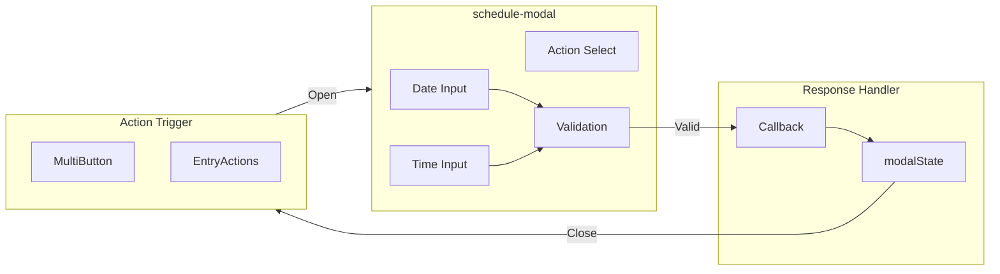
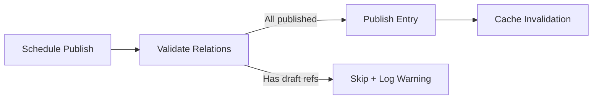

# schedule-modal Component

The `schedule-modal` component provides a user interface for scheduling future actions (publish, unpublish, delete) on collection entries.

---

## Architecture



---

## Features

| Feature                | Description                                  |
| ---------------------- | -------------------------------------------- |
| **DateTime Selection** | Separate date and time inputs for precision  |
| **Action Selection**   | Choose between publish, unpublish, or delete |
| **Future Validation**  | Enforces scheduling for future dates only    |
| **Modal Integration**  | Uses `modalState` for dialog management      |
| **Accessible**         | ARIA labels and keyboard navigation          |

---

## User Flow

```
sequenceDiagram
    participant U as User
    participant MB as MultiButton
    participant SM as schedule-modal
    participant MS as modalState
    participant API as Server

    U->>MB: Click Schedule
    MB->>MS: Open modal
    MS->>SM: Render form
    U->>SM: Select date/time/action
    SM->>SM: Validate (future date)
    U->>SM: Click Schedule
    SM->>MS: close(response)
    MS->>MB: Callback with data
    MB->>API: Schedule action
```

---

## Draft Relation Validation

When scheduling a publish action, the background scheduler (see `scheduled-jobs.ts`) now validates that all relation fields on the entry reference only **published** content. If any referenced entry is still in `draft` status, the publish is **skipped** and a warning is logged.



This prevents broken front-end experiences where an entry is published but references content not yet visible to visitors.

**Cache invalidation**: After a successful scheduled publish, the collection's cache is automatically invalidated to prevent stale relation data from being served.

---

## Response Format

```
interface ScheduleResponse {
  confirmed: boolean;
  date: Date;
  action: "publish" | "unpublish" | "delete";
}
```

---

## Usage

The modal is opened via `modalState` and returns a response object:

```
// Opening the modal
modalState.open({
  component: schedule - modal,
  props: {
    meta: { initialAction: "publish" },
  },
});

// Handling response (via modalState callback)
// { confirmed: true, date: Date, action: 'publish' }
```

---

## Related Documentation

- [MultiButton Component](./entrylist-multibutton.mdx)
- [entry-list Component](./entry-list.mdx)
