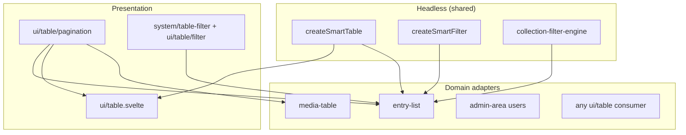

# Smart Table Platform

**Goal**: one table stack for backend CMS surfaces (`entry-list`, media, users) and frontend design-system tables (`ui/table`) — less duplication, more flexibility, performance, features, and security.

## Architecture



| Layer                   | Location                                         | Owns                                              |
| ----------------------- | ------------------------------------------------ | ------------------------------------------------- |
| **Headless table**      | `@components/ui/smart-table`                     | Selection, sort, density, page, virtualization    |
| **Headless filters**    | `createSmartFilter` + `collection-filter-engine` | Schema widgets, FLAC, QueryBuilder IR, cache hash |
| **Pagination**          | `@components/ui/table/pagination`                | One primitive (`variant="simple" \| "cms"`)       |
| **CMS shell**           | `entry-list.svelte`                              | Collection actions, preload, multibutton, plugins |
| **Design-system shell** | `ui/table.svelte`                                | Generic data grid, client or server props         |

## Modes

| Mode         | Use when                                         | Sort / page / filter                     |
| ------------ | ------------------------------------------------ | ---------------------------------------- |
| **`server`** | Collection lists, media, large multi-tenant data | URL + SSR + `CollectionService` (secure) |
| **`client`** | Small admin widgets, settings tables             | In-memory in `createSmartTable`          |

```typescript
// CMS / entry-list (server mode)
const table = createSmartTable({
  mode: "server",
  onQueryChange: (updates) => updateURL(updates),
  getRowId: (row) => String(row._id),
});
table.setRows(serverEntries);
table.setPaginationMeta(serverPagination);

// Design system (client mode)
const table = createSmartTable({ mode: "client", pageSize: 10 });
table.setRows(localRows);
```

## What was unified

| Before                                            | After                                                |
| ------------------------------------------------- | ---------------------------------------------------- |
| `system/table/table-pagination` full copy         | Thin wrapper → `ui/table/pagination` `variant="cms"` |
| Duplicate virtualization in entry-list + ui/table | `createSmartTable.virtual`                           |
| Index-based selection in entry-list               | **Id-based** selection (safe with virtual rows)      |
| Weak `TableController` class ×2                   | `createSmartTable` + legacy re-export                |
| Filters only in entry-list                        | Platform filter engine reusable by any server table  |

## Security (CMS tables)

Filtering/sorting **must not** be trusted from the client alone:

1. UI sends `?filter_*` / `sort` / `page`
2. `parseCollectionListQuery` + **schema whitelist**
3. `compileSecureFilters` + **FLAC**
4. `applyFiltersToQueryBuilder` portable IR
5. Cache key uses **compiled** hash + **user id**

See [Collection Filtering Platform](../architecture/collection-filtering.mdx).

## Migration guide

| Consumer                     | Action                                                                                                     |
| ---------------------------- | ---------------------------------------------------------------------------------------------------------- |
| **New tables**               | `createSmartTable` + `ui/table` or custom shell                                                            |
| **entry-list**               | Uses `createSmartTable` (server) + `createSmartFilter` + shared pagination                                 |
| **media / users**            | Import pagination from ui (already via system wrapper); adopt `createSmartTable` when touching those files |
| **Legacy `TableController`** | Deprecated; re-exported for compatibility                                                                  |

### Import map

```ts
// Preferred
import { createSmartTable } from "@components/ui/smart-table";
import Pagination from "@components/ui/table/pagination.svelte";
import Table from "@components/ui/table.svelte";

// CMS-stable aliases (still valid)
import TablePagination from "@components/system/table/table-pagination.svelte"; // → ui pagination cms
```

## Performance

- Virtualization threshold: `VIRTUALIZATION_THRESHOLD` (25) via `@utils/table-constants`
- Server mode: only current page in memory; SWR on service layer
- Client mode: local sort/page without network
- Id selection avoids virtual-index desync bugs

## Related

- [entry-list](./entry-list.mdx)
- [Collection Filtering](../architecture/collection-filtering.mdx)
- [Cache System](../architecture/cache-system.mdx)

---

**Last Updated**: 2026-07-15
