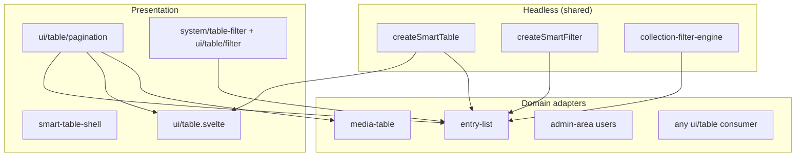

# Smart Table Platform

**Goal**: one table stack for backend CMS surfaces (`entry-list`, media, users) and frontend design-system tables (`ui/table`) — less duplication, more flexibility, performance, features, and security.

## P0 building blocks (implemented)

| Piece                     | Location                                        | Role                                                                 |
| ------------------------- | ----------------------------------------------- | -------------------------------------------------------------------- |
| **Controller**            | `createSmartTable`                              | Selection, multi-sort, page, density, virtual, **pin order**, layout |
| **Multi-column sort**     | `multiSort`, `getSortRank`, `clearSorts`        | `Shift+Click` chained ordering with ordinal badges (`1`, `2`, `3`)   |
| **View modes**            | `viewMode` (`'table' \| 'card'`), `setViewMode` | Responsive card mode toggle persisted in layout prefs                |
| **Keyboard grid nav**     | Roving `tabindex` on `role="grid"`              | Arrow traversal, `Space` toggle selection, `Enter` edit, WCAG 2.2 AA |
| **Shell**                 | `smart-table-shell.svelte`                      | Toolbar slot, empty/loading, scroll body, CMS pagination             |
| **Empty / loading**       | `smart-table-empty` / `smart-table-loading`     | Shared WCAG states                                                   |
| **Chrome**                | `chrome.ts`                                     | Class tokens + `pinCellClass` / `alignCellClass`                     |
| **Layout prefs**          | `layout-prefs.ts`                               | localStorage density / viewMode / order / visibility (`layoutKey`)   |
| **Column meta**           | `SmartTableColumn.pin`, `.align`, `.meta`       | TanStack-style defs without TanStack dependency                      |
| **Column resize**         | `setColumnWidth` + `column-resize-handle`       | Drag widths, persisted with `layoutKey`                              |
| **Saved views**           | `@utils/smart-table-saved-views` + menu UI      | Named filter/sort/layout presets (localStorage)                      |
| **Advanced filter modal** | `advanced-filter-modal.svelte`                  | Compound `AND`/`OR` multi-condition query builder                    |
| **Status facets**         | `smart-table-status-facets` + `getStatusFacets` | Server status counts as filter chips                                 |
| **List metrics**          | `@utils/list-query-metrics` + metrics badge     | Latency + cache hit; UI via `?debug=table` (SSR snapshot)            |

### Entry-list UX (P1 wired)

| Control                 | Where                             | Behavior                                                                  |
| ----------------------- | --------------------------------- | ------------------------------------------------------------------------- |
| **Views menu**          | Toolbar (desktop + mobile expand) | Save/apply/delete named views (filters, search, sort, pageSize, layout)   |
| **View mode toggle**    | Toolbar                           | Toggle between standard data table and responsive card mode               |
| **Multi-sort controls** | Column headers                    | Click or `Shift+Click` for ordinal sorting; clear all sort descriptors    |
| **Status facets**       | Above table                       | Chip filters → `?filter_status=` via `createSmartFilter` (server FLAC)    |
| **Advanced filters**    | Search / filter bar               | Compound multi-clause query builder (`AND`/`OR`) with type-aware inputs   |
| **Keyboard grid nav**   | Grid cells & cards                | Arrow navigation with roving `tabindex="0"`, `Space` select, `Enter` edit |
| **Selection export**    | MultiButton / `Alt+X`             | Stream filtered CSV download of selected or matching entries              |
| **Metrics badge**       | Toolbar when `?debug=table`       | p50/p95/hit% from SSR `listMetrics` (server ring buffer)                  |
| **Column resize**       | Header drag handles               | `setColumnWidth` + per-collection `layoutKey: entry-list:{collectionId}`  |

```svelte
<SmartTableShell
  empty={rows.length === 0}
  emptyTitle="No results"
  {currentPage} {rowsPerPage} {pagesCount} {totalItems}
  onUpdatePage={(p) => table.setPage(p)}
  onUpdateRowsPerPage={(n) => table.setPageSize(n)}
>
  <table class={SMART_TABLE}>…</table>
</SmartTableShell>
```

## Architecture


```mermaid
flowchart TB
  subgraph Headless["Headless (shared)"]
    CST[createSmartTable]
    CSF[createSmartFilter]
    CFE[collection-filter-engine]
  end

  subgraph UI["Presentation"]
    Shell[smart-table-shell]
    UItable[ui/table.svelte]
    Pag[ui/table/pagination]
    Toolbar[system/table-filter + ui/table/filter]
  end

  subgraph Adapters["Domain adapters"]
    EL[entry-list]
    Media[media-table]
    Users[admin-area users]
    Generic[any ui/table consumer]
  end

  CST --> UItable
  CST --> EL
  CSF --> EL
  CFE --> EL
  Pag --> EL
  Pag --> UItable
  Pag --> Media
  Toolbar --> EL
```

| Layer                   | Location                                         | Owns                                              |
| ----------------------- | ------------------------------------------------ | ------------------------------------------------- |
| **Headless table**      | `@components/ui/smart-table`                     | Selection, sort, density, page, virtualization    |
| **Headless filters**    | `createSmartFilter` + `collection-filter-engine` | Schema widgets, FLAC, QueryBuilder IR, cache hash |
| **Pagination**          | `@components/ui/table/pagination`                | One primitive (`variant="simple" \| "cms"`)       |
| **CMS shell**           | `entry-list.svelte`                              | Collection actions, preload, multibutton, plugins |
| **Design-system shell** | `ui/table.svelte`                                | Generic data grid, client or server props         |

## Modes

| Mode         | Use when                                         | Sort / page / filter                     |
| ------------ | ------------------------------------------------ | ---------------------------------------- |
| **`server`** | Collection lists, media, large multi-tenant data | URL + SSR + `CollectionService` (secure) |
| **`client`** | Small admin widgets, settings tables             | In-memory in `createSmartTable`          |

```typescript
// CMS / entry-list (server mode)
const table = createSmartTable({
  mode: "server",
  onQueryChange: (updates) => updateURL(updates),
  getRowId: (row) => String(row._id),
});
table.setRows(serverEntries);
table.setPaginationMeta(serverPagination);

// Design system (client mode)
const table = createSmartTable({ mode: "client", pageSize: 10 });
table.setRows(localRows);
```

## Advanced UX Capabilities

### 1. Multi-Column Sorting & Ordinal Ranks

Smart Table supports multi-tier sorting, both client-side and serialized for server queries.

- **Interaction**: Single-clicking a sortable column header replaces the sort order. Holding `Shift` while clicking appends or toggles the column in the multi-sort chain.
- **Visual Ranks**: When multiple columns are sorted, secondary and tertiary columns display ordinal rank indicators (`1`, `2`, `3`) alongside the direction arrow.
- **Controller API**:
  - `table.setSort(field, { multi: true })`: Toggles sort direction for `field` while keeping existing sorts.
  - `table.getSortRank(field)`: Returns 1-based priority rank or `null` if not sorted.
  - `table.clearSorts()`: Resets all active sort descriptors.
  - `table.multiSort`: Readonly reactive array of active `ColumnSortDescriptor[]`.
- **Query Serialization**: In server mode, multiple sorts serialize into the URL parameter format `sort=priority:desc,status:asc,title:asc`.
- **Persistence**: Saved with the view or stored in `localStorage` under `layoutKey`.

### 2. Responsive Card Mode

For mobile viewports or data presentation emphasizing rich item cards:

- **View Mode Toggle**: Users can switch between standard tabular grid (`viewMode: 'table'`) and responsive card deck (`viewMode: 'card'`).
- **Persistence**: Preserved per collection or view in `SmartTableLayoutPrefs` (`viewMode`).
- **Accessibility**: View toggle buttons carry `aria-pressed` states and clear accessible labels.
- **Cards Grid**: When `viewMode === 'card'`, entries render as responsive cards with status badges, thumbnail previews, inline selection checkboxes, and full row activation.

### 3. Keyboard Grid Navigation (WCAG 2.2 AA / ATAG 2.0)

Smart Table implements the WAI-ARIA Data Grid keyboard navigation pattern with a roving `tabindex`:

- **Focus Management**: Only the currently active cell has `tabindex="0"`; all other cells have `tabindex="-1"`.
- **Arrow Keys**:
  - `ArrowDown` / `ArrowUp`: Move focus between rows within the same column.
  - `ArrowRight` / `ArrowLeft`: Move focus between columns within the same row (RTL-aware).
  - `Home` / `End`: Jump to the first or last cell in the active row.
- **Row Selection & Activation**:
  - `Space`: Toggles row selection without navigating away.
  - `Enter`: Navigates to the entry editor or triggers the row's primary action.
- **Screen Reader Announcements**: Uses `role="grid"`, `role="row"`, and `role="gridcell"` with live selection status updates.

### 4. Advanced Filter Modal

A compound filter builder powered by `advanced-filter-modal.svelte`:

- **Rule Clauses**: Allows chaining multiple field criteria with comparison operators (`contains`, `equals`, `starts_with`, `ends_with`, `gt`, `lt`, `is_empty`, `is_not_empty`).
- **Conjunction Groups**: Supports compound `AND` / `OR` condition logic.
- **Schema-Aware Inputs**: Automatically renders appropriate inputs (text, number, date, select) based on collection field widget types.
- **URL & Engine Integration**: AND groups serialize as `?filter_<field>=...`. OR groups use `?filterLogic=` JSON (size-capped), compiled to `whereIn` (same field) or `QueryBuilder.orWhere` (mixed fields), still FLAC-whitelisted.

### 5. Filtered Selection & Export Data Streaming

Exporting dataset slices without client memory bottlenecks:

- **Shortcut**: `Alt + X` triggers export on the active collection.
- **Selection-Aware**: If entries are selected via checkboxes, exports the selected rows. If no selection is active, exports all entries matching the current filter and search query.
- **Streaming Delivery**: Downloads data as UTF-8 encoded CSV with proper escaping and column headers.

## What was unified

| Before                                            | After                                                                 |
| ------------------------------------------------- | --------------------------------------------------------------------- |
| `system/table/table-pagination` full copy         | Direct `ui/table/pagination` `variant="cms"` (compat wrapper deleted) |
| Duplicate virtualization in entry-list + ui/table | `createSmartTable.virtual`                                            |
| Index-based selection in entry-list               | **Id-based** selection (safe with virtual rows)                       |
| Weak `TableController` class ×2                   | `createSmartTable` + legacy re-export                                 |
| Filters only in entry-list                        | Platform filter engine reusable by any server table                   |

## Security (CMS tables)

Filtering/sorting **must not** be trusted from the client alone:

1. UI sends `?filter_*` / `sort` / `page`
2. `parseCollectionListQuery` + **schema whitelist**
3. `compileSecureFilters` + **FLAC**
4. `applyFiltersToQueryBuilder` portable IR
5. Cache key uses **compiled** hash + **user id**

See [Collection Filtering Platform](../architecture/collection-filtering.mdx).

## Migration guide

| Consumer                     | Action                                                                      |
| ---------------------------- | --------------------------------------------------------------------------- |
| **New tables**               | `createSmartTable` + shared chrome tokens                                   |
| **entry-list**               | `createSmartTable` (server) + `createSmartFilter` + chrome                  |
| **media-table**              | `createSmartTable` (client) + chrome + column sort                          |
| **admin-area**               | `createSmartTable` (server) + `onQueryChange` → `/api/user` \| `/api/token` |
| **website-tokens**           | `createSmartTable` (server) + `onQueryChange` → `/api/website-tokens`       |
| **tenants admin**            | Shared chrome (SSR list)                                                    |
| **Legacy `TableController`** | Deprecated; re-exported for compatibility                                   |

**Other `<table>` UIs (not full smart-table yet):** permissions matrix, media details mini-tables, migration wizard field map, accessibility help, `ui/table.svelte` design shell.

### Shared visual chrome

```ts
import {
  createSmartTable,
  SMART_TABLE,
  SMART_TABLE_THEAD,
  SMART_TABLE_TH,
  SMART_TABLE_TD,
  SMART_TABLE_SCROLL,
  SMART_TABLE_PAGINATION_BAR,
  SMART_TABLE_TOOLBAR,
  SMART_TABLE_ROW_SELECTED,
  SMART_TABLE_ROW_HOVER,
} from "@components/ui/smart-table";
```

### Import map

```ts
// Preferred
import { createSmartTable } from "@components/ui/smart-table";
import Pagination from "@components/ui/table/pagination.svelte";

// cms variant:
<Pagination variant="cms" … />
```

## Performance

- Virtualization threshold: `VIRTUALIZATION_THRESHOLD` (25) via `@utils/table-constants`
- Server mode: only current page in memory; SWR on service layer
- Client mode: local sort/page without network
- Id selection avoids virtual-index desync bugs

## Related

- [entry-list](./entry-list.mdx)
- [Collection Filtering](../architecture/collection-filtering.mdx)
- [Cache System](../architecture/cache-system.mdx)

---

**Last Updated**: 2026-09-20
