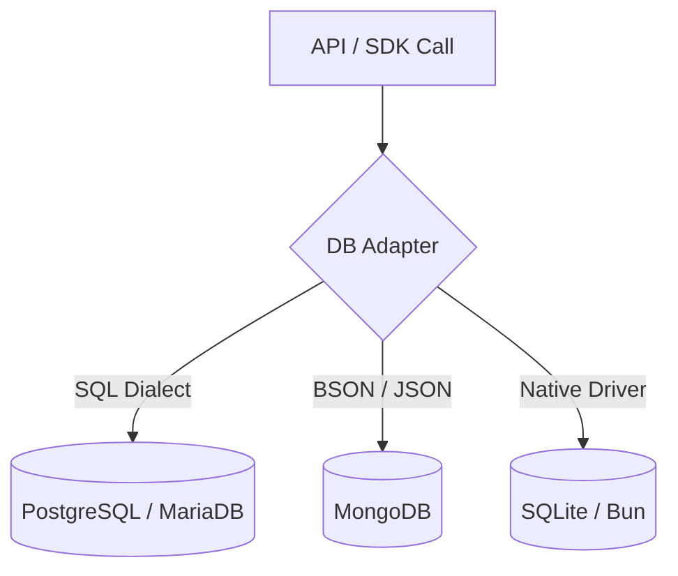

# Database Agnostic Verification

## 1. The Goal

Ensure that the SveltyCMS API remains 100% portable across all supported database engines (PostgreSQL, MariaDB, SQLite, MongoDB). By enforcing strict architectural boundaries, we prevent vendor lock-in and allow users to switch databases without changing a single line of application code.

---

## 2. The Solution

### 🚀 Architecture Reference

| Layer                  | Responsibility               | **Verification Pattern**               |
| :--------------------- | :--------------------------- | :------------------------------------- |
| **Unified Gatekeeper** | Request routing & Auth       | Centralized, fail-closed gate          |
| **Handler Layer**      | Domain-specific logic        | Verified 1:1 with documentation        |
| **Local SDK**          | Business logic & Validation  | Injected via `cms` (LocalCMS instance) |
| **DB Adapter**         | Query generation (SQL/NoSQL) | Dialect-neutral crud implementation    |

> [!IMPORTANT]
> **No Direct Queries**: Direct use of `SELECT`, `INSERT`, or MongoDB `collection.find` is strictly prohibited in `src/routes/api`. All data access must pass through the `cms` (LocalCMS SDK) or `dbAdapter` interfaces.

### Verification Status (Batch 2026-Q2)

| Namespace                           | Status | Pattern Used                             |
| :---------------------------------- | :----- | :--------------------------------------- |
| **Authentication**                  | ✅     | `cms.auth.*` (Argon2id, sessions)        |
| **Collections / Content**           | ✅     | `cms.collections.*` (Generic CRUD)       |
| **Media**                           | ✅     | `cms.media.*` (Metadata + Storage API)   |
| **Settings / System Preferences**   | ✅     | `cms.system.settings.*` (Key-value)      |
| **Website Tokens**                  | ✅     | `cms.websiteTokens.*` (CSPRNG + SHA-256) |
| **Webhooks**                        | ✅     | `cms.db.system.webhooks.*`               |
| **System Jobs (Scheduler)**         | ✅     | `cms.db.system.jobs.*`                   |
| **SCIM 2.0**                        | ✅     | `cms.auth.*` (Provisioning)              |
| **AI / Automation**                 | ✅     | `cms.system.*` (Service layer)           |
| **Import / Export**                 | ✅     | `cms.system.importer.*`                  |
| **Dashboard / Metrics / Telemetry** | ✅     | `cms.system.*` + metrics service         |
| **Theme / Virtual Folders**         | ✅     | `cms.system.themes.*` / `cms.db.*`       |
| **GraphQL**                         | ✅     | `cms.collections.*` (Content bridge)     |
| **OpenAPI 3.1.0**                   | ✅     | Dynamic spec from adapter schema         |

---

## 3. The Mechanics

### The Adapter Pattern

### Implementation Checklist

Every API endpoint is verified against these four non-negotiable rules:

1. **No Raw SQL**: No string-templated queries or direct database driver imports.
2. **Adapter Injection**: Use of `dbAdapter` or the high-level `cms` (LocalCMS instance) facade.
3. **Abstraction Usage**: Preferring `cms.system.settings.getAll()` over direct collection queries.
4. **Dialect Neutrality**: Ensuring filtering logic (e.g., regex, full-text) is supported across all adapters.

---

**Next Steps**: Review the [Database Methods Architecture](../database/index.mdx) for instructions on building custom adapters.
