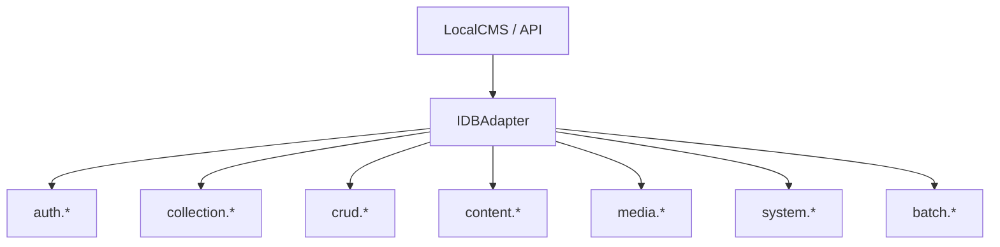

# Database Methods Interface

## 🎯 Architectural Vision

SveltyCMS leverages a **Modular Namespace** pattern to organize its database capabilities. Instead of a single monolithic adapter, functionality is divided into specialized domains. This ensures that as the system grows, the database layer remains maintainable, testable, and strictly type-safe.

**Core Principle:** Write once (in the application layer), deploy everywhere (MongoDB, SQL, etc.).



---

## 🛠️ Global Interface Contract

All methods in the SveltyCMS database layer follow the **`DatabaseResult<T>`** pattern. They MUST NOT throw exceptions for expected failures; instead, they return a structured object.

```
export type DatabaseResult<T> =
  | { success: true; data: T; meta?: QueryMeta }
  | { success: false; message: string; error: DatabaseError };
```

---

## 🛡️ `auth.*` Namespace

**Responsibility:** Identity, Session Management, and RBAC.

| Method                               | Description                                 |
| :----------------------------------- | :------------------------------------------ |
| `createUser(data, options)`          | Creates a new user with encrypted password. |
| `getUserById(id)`                    | Retrieves a user by their primary key.      |
| `getUserByEmail(email)`              | Retrieves a user for login flows.           |
| `validatePassword(userId, password)` | Securely verifies password hashes.          |
| `createSession(userId, data)`        | Generates a persistent session.             |
| `invalidateSession(sessionId)`       | Revokes a specific session.                 |
| `listUsers(options)`                 | Paginated retrieval of system users.        |

---

## 🗂️ `collection.*` Namespace

**Responsibility:** Dynamic Schema and Model Management.

| Method                  | Description                                              |
| :---------------------- | :------------------------------------------------------- |
| `createModel(schema)`   | Provisions tables or collections for a new content type. |
| `listSchemas(tenantId)` | Retrieves all registered collection definitions.         |
| `updateModel(schema)`   | Handles bi-directional schema synchronization.           |
| `deleteModel(id)`       | Drops the physical storage and definition.               |

---

## ⚡ `crud.*` Namespace

**Responsibility:** High-performance, standardized data operations.

| Method                                | Description                                                   |
| :------------------------------------ | :------------------------------------------------------------ |
| `find(collection, criteria, options)` | Advanced filtering with inlined Query IR translation support. |
| `findOne(collection, criteria)`       | Single record retrieval fast-path.                            |
| `insert(collection, data, options)`   | Standard record creation.                                     |
| `update(collection, criteria, data)`  | Scoped updates with multi-tenant safety.                      |
| `delete(collection, criteria)`        | Permanent or soft-deletion of records.                        |
| `upsert(collection, criteria, data)`  | Atomic "Update or Insert" operation.                          |

---

## 📦 `content.*` Namespace

**Responsibility:** CMS Workflows (Nodes, Drafts, Revisions).

| Method                         | Description                                     |
| :----------------------------- | :---------------------------------------------- |
| `nodes.getStructure(tenantId)` | Retrieves the hierarchical content tree.        |
| `nodes.upsertNode(node)`       | Persists structural nodes (Menus, Categories).  |
| `drafts.create(data)`          | Manages work-in-progress content nodes.         |
| `revisions.list(contentId)`    | Retrieves historical audit trail and snapshots. |

---

## 🖼️ `media.*` Namespace

**Responsibility:** File Metadata and Organization.

| Method                       | Description                                       |
| :--------------------------- | :------------------------------------------------ |
| `saveMetadata(data)`         | Persists file size, dimensions, and SHA-256 hash. |
| `getFilesByFolder(folderId)` | Paginated retrieval of media items.               |
| `updateMetadata(id, data)`   | Updates Alt text, tags, or focal points.          |

---

## ⚙️ `system.*` Namespace

**Responsibility:** Preferences, Jobs, Multi-Tenancy, and external API credentials.

| Method                                       | Description                                                    |
| :------------------------------------------- | :------------------------------------------------------------- |
| `preferences.get(key, scope)`                | Retrieves User or System settings.                             |
| `preferences.set(key, value)`                | Persists settings with automatic cache invalidation.           |
| `tenants.create(data)`                       | Provisions a new isolated workspace.                           |
| `themes.ensure(theme)`                       | Idempotent theme registration during setup.                    |
| `websiteTokens.create(data, tenantId?)`      | Creates a website token; returns plaintext once.               |
| `websiteTokens.getAll(options, tenantId?)`   | Paginated list; hashes scrubbed from response.                 |
| `websiteTokens.getByToken(token, tenantId?)` | Auth lookup by bearer value (hashed at adapter).               |
| `websiteTokens.getByName(name, tenantId?)`   | Resolves a token record by display name.                       |
| `websiteTokens.delete(id, tenantId?)`        | Hard-deletes the credential (SQL) or permanent delete (Mongo). |

---

## 🔐 Credential Storage (Website Tokens & API Keys)

SveltyCMS treats website tokens and `sck_` API keys as **credentials**, not user records. The database layer enforces the same invariants on all four engines while allowing engine-native optimizations.

### Shared contract (`ISystemAdapter.websiteTokens`)

| Invariant           | Behavior                                                                                                                      |
| :------------------ | :---------------------------------------------------------------------------------------------------------------------------- |
| **Hash at rest**    | Plaintext is hashed with `hashCredentialSha256Hex()` (`src/utils/security/credential-hash.ts`) before insert.                 |
| **One-time reveal** | `create()` returns the raw token in the response; only the digest is persisted.                                               |
| **List scrubbing**  | `getAll()` omits the `token` field from every row in the response.                                                            |
| **Tenant scope**    | Optional `tenantId` on all methods; SDK and handlers pass request context.                                                    |
| **Auth alignment**  | `handle-authentication.ts` calls `getByToken(value, locals.tenantId)` — same pattern as `auth.getApiKey(hash, { tenantId })`. |

### Per-engine implementation

| Engine                            | Module                             | Storage                                                                                | Soft-delete                                          | List performance                 |
| :-------------------------------- | :--------------------------------- | :------------------------------------------------------------------------------------- | :--------------------------------------------------- | :------------------------------- |
| **MongoDB**                       | `mongodb/website-token-methods.ts` | `system_website_tokens` collection; `strict: true` schema with `tenantId`, `isDeleted` | `safeQuery` + `{ $ne: true }` via `MongoCrudMethods` | `Promise.all([findMany, count])` |
| **PostgreSQL / MariaDB / SQLite** | `core/relational-system.ts`        | `website_tokens` table via Drizzle                                                     | Hard delete (no `isDeleted` column)                  | `Promise.all([select, count])`   |

### Indexes (all SQL engines + MongoDB)

- **Unique** on `token` (hashed value) — O(1) bearer authentication lookup
- **Compound** `{ tenantId, name }` — tenant-scoped name resolution and admin list filters

### MongoDB-specific notes

- Mongoose `strict: true` requires every persisted field to be declared on the schema. Undeclared fields (e.g. `tenantId`) are silently stripped on insert and break tenant-scoped list queries.
- Credential lookup without request tenant context uses `bypassTenantCheck` only (not `bypassSafeQuery`), so `safeQuery` still applies soft-delete boundaries.
- Do **not** use `bypassSafeQuery` for routine website-token CRUD; it is reserved for other internal fast-paths documented in the MongoDB implementation guide.

### SQL migration note

After pulling schema changes that add the `{ tenantId, name }` compound index, run:

```bash
bun run db:push
```

---

## 🚀 Implementation Matrix (Status 2026)

| Namespace   | MongoDB        | PostgreSQL     | MariaDB     | SQLite         |
| :---------- | :------------- | :------------- | :---------- | :------------- |
| **Auth**    | ✅ Production  | ✅ Production  | 🟡 Planned  | ✅ Production  |
| **CRUD**    | ✅ Production  | ✅ Production  | 🟡 Planned  | ✅ Production  |
| **Content** | ✅ Production  | ✅ Production  | 🟡 Planned  | ✅ Production  |
| **Media**   | ✅ Production  | ✅ Production  | 🟡 Planned  | ✅ Production  |
| **System**  | ✅ Production  | ✅ Production  | 🟡 Planned  | ✅ Production  |
| **Batch**   | ✅ Production  | ✅ Production  | 🟡 Planned  | ✅ Production  |
| **SCIM**    | ✅ Production¹ | ✅ Production¹ | 🟡 Planned¹ | ✅ Production¹ |

¹ SCIM 2.0 endpoints are production-ready (RFC 7644: Users, Groups, Bulk, filters, PATCH, Okta/Azure) but route through the `auth.*` adapter directly rather than a dedicated `IScimAdapter` namespace.

---

## 📓 Developer Best Practices

1. **Always use the Interface**: Never cast `IDBAdapter` to a concrete class like `SQLiteAdapter` unless performing emergency maintenance.
2. **Favor `LocalCMS`**: Use the SDK bridge in server files for 0ms internal latency.
3. **Respect `tenantId`**: Ensure every query includes a tenant scope to maintain data isolation. For bearer auth, pass `locals.tenantId` into `websiteTokens.getByToken()` when the request tenant is already resolved.
4. **Error Checking**: Always check `result.success` before accessing `result.data`.

---

## Related Documentation

- [Core Infrastructure](./core-infrastructure.mdx) - The internal engine and `db.ts` lifecycle.
- [Database Resilience](./database-resilience.mdx) - Error handling and recovery patterns.
- [SQLite Implementation](./sqlite-implementation.mdx) - Specific optimizations for edge deployments.
- [PostgreSQL Implementation](./postgresql-implementation.mdx) - Enterprise scaling with JSONB.
