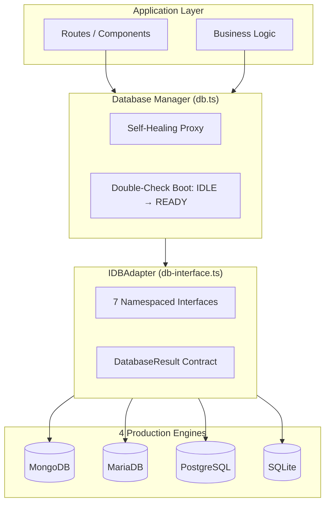

# Database Documentation Hub

Welcome to the SveltyCMS Database Engine documentation. Our architecture is built on the principle of **Strict Agnosticism**, allowing you to swap between NoSQL and Relational engines without changing a single line of application logic.

---

## 📚 Documentation Structure

### 1. Database-Agnostic Architecture

- **[Core Infrastructure](./core-infrastructure.mdx)** — `db.ts` lifecycle, self-healing proxy, topological service boot (`db-init.ts`), LocalCMS SDK
- **[Database Methods Interface](./database-methods.mdx)** — `IDBAdapter` namespaces: `auth`, `crud`, `content`, `media`, `system`, `batch`, `collection`
- **[Database Resilience](./database-resilience.mdx)** — Error handling, retry logic, circuit breaker, connection health monitoring
- **[Performance Architecture](./performance-architecture.mdx)** — `findPage` / count modes / count cache (equal on all engines), allocation-floor, schema-aware conversion, ring-buffer pools
- **[SQL Query Builder](./sql-query-builder.mdx)** — the single dialect-parameterized builder shared by SQLite, MariaDB and PostgreSQL: compiled prepared-statement list/count plans, Drizzle fallback, hybrid-schema JSON, keyset pagination

### 2. Engine Implementations

- **[SQLite Implementation](./sqlite-implementation.mdx)** ✅ **Platinum** — Default for local/edge. Sub-ms CRUD, WAL mode, zero network overhead.
- **[PostgreSQL Implementation](./postgresql-implementation.mdx)** ✅ **Production** — Enterprise scaling, native JSONB, GIN indexing, PgBouncer support.
- **[MariaDB Implementation](./mariadb-implementation.mdx)** ✅ **Production** — High-concurrency pooling via `mysql2`, shared `findPage` / count estimate path.
- **[MongoDB Implementation](./mongodb-implementation.mdx)** ✅ **Production** — NoSQL engine, safeQuery security, wire compression.

---

## 🏗️ Architecture Overview

### Shared list & count contract (all adapters)

| API                    | Default product use               | Benefit                                     |
| ---------------------- | --------------------------------- | ------------------------------------------- |
| `crud.findPage`        | Admin/API lists (`total: "none"`) | One query; `hasMore` via limit+1 — no COUNT |
| `crud.count({ mode })` | Badges / dashboards               | `exact` \| `estimate` \| `auto`             |
| Count L1 cache (30s)   | Repeated tenant counts            | ~0.024 ms hits after warm (all engines)     |

Details and measured gains: [Performance Architecture](./performance-architecture.mdx#product-layer-list--count-equal-on-all-engines) · method signatures: [Database Methods](./database-methods.mdx#-crud-namespace).

---

## 🛡️ Shared Security Principles (All Adapters)

- **4-Layer Defense-in-Depth**: Middleware → Dispatcher → Handler → Page Action
- **Tenant Isolation**: Every query scoped by `tenantId` at adapter level — architecturally impossible to bypass
- **Credential Hashing**: Website tokens and API keys are stored as SHA-256 digests only; plaintext is returned once on creation. See [`system.websiteTokens`](./database-methods.mdx#-credential-storage-website-tokens--api-keys).
- **Tenant-Scoped Bearer Lookup**: Auth passes `locals.tenantId` into credential lookups (aligned with `auth.getApiKey`) to narrow multi-tenant queries.

- **MongoDB Soft-Delete Safety**: `safeQuery()` applies `isDeleted: { $ne: true }` so legacy documents without the field remain visible to active queries.
- **SSRF Prevention**: Cloud storage adapters validate endpoints before connection
- **NoSQL Injection Protection**: `sanitizeMongoQuery` blocks `$where`, `$function`, `$expr`
- **CSPRNG-Only Tokens**: `globalThis.crypto.getRandomValues()`, no `Math.random()` fallback
- **Fail-Closed API**: Unmapped namespaces return 403 by default

## 🔄 Shared Resilience Patterns (All Adapters)

- **Circuit Breaker**: 5 consecutive failures → 60s open → probe recovery
- **Self-Healing Reconnection**: Auto-recovery on connection loss + HMR reload
- **Exponential Backoff with Jitter**: 1s→2s→4s→8s→16s, ±500ms
- **Connection Pool Diagnostics**: `GET /api/database/pool-diagnostics` + dashboard widget — see [Database Resilience](./database-resilience.mdx)
- **Migration Safety**: `CREATE TABLE IF NOT EXISTS` — idempotent

## ⚡ 2027 Allocation-Floor Optimizations

| Optimization                               | SQLite | PostgreSQL   | MariaDB      | MongoDB          |
| ------------------------------------------ | ------ | ------------ | ------------ | ---------------- |
| Schema-aware row conversion                | ✅     | ✅           | ✅           | N/A              |
| Ring-buffer result pool (64 slots)         | ✅     | ✅           | ✅           | ✅               |
| Conditions array pool (32 slots)           | ✅     | ✅           | ✅           | N/A              |
| Fused mapQuery (no IR objects)             | ✅     | ✅           | ✅           | ✅               |
| for...in (zero Object.entries)             | ✅     | ✅           | ✅           | ✅               |
| Pre-allocated meta object                  | ✅     | ✅           | ✅           | ✅               |
| MariaDB double-parse isolated              | N/A    | ✅ Benefit   | ✅           | N/A              |
| Prepared-statement cache                   | ✅     | N/A (driver) | N/A (driver) | N/A              |
| Projection (`fields` → skip `data`)        | ✅     | ✅           | ✅           | ✅ (driver)      |
| Targeted column UPDATE (omit empty `data`) | ✅     | ✅           | ✅           | ✅ (`$set` only) |
| `createdAt` insert-only on UPDATE          | ✅     | ✅           | ✅           | ✅               |

> **SQL family**: ~5-8 fewer allocations per filtered query (self-assessed estimate — not instrumented). **MongoDB**: ~2-3 fewer (result pool + fused mapQuery). **All 4**: benefit from shared BaseAdapter optimizations plus the core widget/session/cache pipeline. The paths that promise _no_ allocation are pinned by reference-identity assertions (`tests/unit/core/relational-utils.test.ts`, `tests/unit/security/safe-query-manual.test.ts`). See [Performance Architecture](./performance-architecture.mdx#core--adapter-communication-all-4-engines).

## ⚡ 2026-10 Write-Path Optimizations (self-measured, same WSL2/Docker host)

| Optimization                                                        | Engine               | Measured gain                                                                             |
| ------------------------------------------------------------------- | -------------------- | ----------------------------------------------------------------------------------------- |
| Durability knob (`PG_SYNCHRONOUS_COMMIT`, opt-in per connection)    | PostgreSQL           | update `dbwrite` p50 **9.76 → 2.3–2.9 ms**; lane ~1.5k → 2.0–3.1k RPS (warm 8c)           |
| Durability parity (`innodb_flush_log_at_trx_commit=2`, harness DBs) | MariaDB              | update 1,269 → 1,918 RPS (+51 %); create +42 %; seed 5,686 → 7,676 docs/s                 |
| `INSERT … UNNEST` / `UPDATE … FROM UNNEST` bulk writes              | PostgreSQL           | one array per column, plan-cache-stable statements                                        |
| `UPDATE … JOIN JSON_TABLE` bulk update (10.6+)                      | MariaDB              | heterogeneous 100-row batch **68.4 → 3.6 ms (19×)**                                       |
| `PATCH …?fields=_id,count,updatedAt` projection                     | PostgreSQL (all SQL) | prunes `RETURNING` — the `data` blob is never re-read/de-TOASTed                          |
| Lane-lean rate limit (local bucket + async Redis ledger)            | all                  | warm create/update srv-dur **1.86/1.49 → 0.36/0.31 ms (−79–81 %)** with Redis up (SQLite) |

Details, harness commands, and the measured-and-declined experiments: [Achievements §3.45](/docs/project/achievements-2026). The PostgreSQL commit (~2.4–2.8 ms) remains the documented write floor.

### 3. Distributed Cache Layer (Optional)

- **[Cache System Architecture](../architecture/cache-system.mdx)** — Dual-layer L1/L2 engine with stampede locking, atomic `INCRBY` versioning, and zero-tax `mGet` batching.

---

## 📈 Performance Benchmarks (SQLite, Latest)

| Operation             | Latency      | RPS               |
| --------------------- | ------------ | ----------------- |
| FIND ONE              | **0.004 ms** | 196,854           |
| UPDATE (no-returning) | **0.024 ms** | 25,516            |
| DELETE                | **0.038 ms** | 15,399            |
| Peak Throughput       | —            | **572,738 ops/s** |
| LocalCMS SDK Overhead | —            | **0.00%**         |

Full cross-database benchmarks: [Performance Benchmarks](/docs/project/benchmarks/index).

## Adapter & Cache Selection Guide

| Scale                             | Recommended DB                             | Redis L2?         | Why                                                                                                                                            |
| :-------------------------------- | :----------------------------------------- | :---------------- | :--------------------------------------------------------------------------------------------------------------------------------------------- |
| **Dev, edge, small teams**        | **SQLite** (default)                       | **No** (Optional) | In-process, zero network overhead, sub-ms CRUD. RAM L1 cache handles hot reads.                                                                |
| **Production single node**        | **PostgreSQL** or **MariaDB**              | **Optional**      | Native JSONB/JSON, relational ACID, robust pooling. Enable Redis for high-traffic spikes.                                                      |
| **High-volume NoSQL**             | **MongoDB**                                | **Recommended**   | Cuts BSON serialization overhead by ~20% and lowers p95 read latencies.                                                                        |
| **Enterprise Multi-Node Cluster** | **PostgreSQL** / **MariaDB** / **MongoDB** | **Recommended**   | Synchronizes cluster nodes via Redis Pub/Sub (`svelty:cache:invalidation`), prevents cache stampedes, and lowers p95 tail latencies by 30–35%. |

> [!NOTE]
> **Redis is Strictly Optional Across All 4 Adapters**: Without Redis, SveltyCMS automatically operates using its built-in in-memory LRU cache (`<0.001ms` hit time) with zero degraded features.

---

**Last Updated**: 2026-10-06 (write-path optimizations: durability knobs, UNNEST/JSON_TABLE bulk writes, `?fields=` RETURNING projection, lane-lean rate limit — see the section above; benchmark table refreshed from the 2026-10-06 SQLite run)
**Maintained by**: SveltyCMS Team
