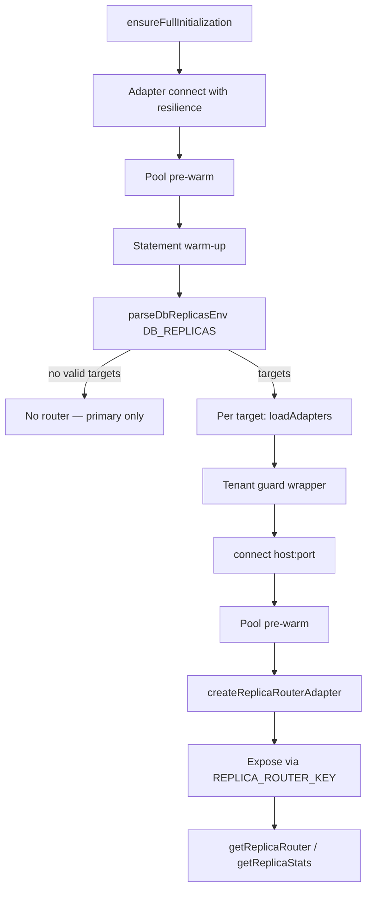

# Read Replicas (Read-Your-Writes Routing)

Read-replica routing splits read traffic (`crud.find*`, `count`, `aggregate`) across replica pools while every mutation stays on the primary. The routing core lives in `src/databases/core/replica-router.ts` (`ReplicaRouterAdapter`); this page documents the **Option 4 boot wiring** in `src/databases/db.ts` that parses the `DB_REPLICAS` environment variable, constructs replica adapters, and exposes the router.

> [!NOTE]
> The router is **disabled by default**. With no `DB_REPLICAS` environment variable set, the boot path performs no extra work — no router is constructed and no additional queries run.

---

## Configuration

`DB_REPLICAS` is a comma-separated list of `host:port` entries:

```bash
DB_REPLICAS="replica-a:5432,replica-b:5432" bun run dev
```

Rules applied by `parseDbReplicasEnv()`:

- Unset, blank, or whitespace-only values disable replica routing.
- Entries are trimmed; empty segments (trailing commas) are ignored.
- IPv6 literals use bracket notation: `DB_REPLICAS="[::1]:5432"`.
- Ports must be integers in the range 1–65535.
- Malformed entries are skipped individually — one typo does not disable the remaining replicas or block boot. A list with no valid entries leaves the router disabled.

Replica adapters reuse the primary's private config for credentials and database name (`DB_USER`, `DB_PASSWORD`, `DB_NAME`) and only override `host`/`port`. `replicaSettings` from `config/private.ts` is forwarded to the router (`readYourWritesWindowMs`, `loadBalancing`, `maxConsecutiveErrors`, `cooldownMs`, `replicaTimeoutMs`).

Engine notes:

- Replica routing applies to the networked engines (`postgresql`, `mariadb`, `mongodb`).
- When the active engine is `sqlite`, a configured `DB_REPLICAS` is ignored with a boot warning.
- Replica adapters connect through the adapter's normal `connect()` path, which includes idempotent schema bootstrap. A replica database user therefore needs permission for idempotent DDL (`CREATE ... IF NOT EXISTS`) on an already-provisioned schema, or an adapter-level read-only connect mode where available.

---

## Boot Wiring



Wiring details:

- Each replica adapter receives the same fail-closed tenant guard as the primary (`applyTenantIsolationGuards`), so replica-routed reads stay tenant-scoped.
- Replica connections use explicit `{ host, port, user, password, database }` options — the global connection string always points at the primary.
- The bootstrap **fails open**: a replica that cannot be constructed or connected is skipped with a warning; with zero healthy replicas no router is created and the primary serves all traffic.
- The router is exposed through the `REPLICA_ROUTER_KEY` global (`__DB_REPLICA_ROUTER__`) and read via `getReplicaRouter()` / `getReplicaStats()` from `@src/databases/db`.

---

## Routing Semantics

| Operation                                                             | Route                                                  |
| :-------------------------------------------------------------------- | :----------------------------------------------------- |
| `crud.insert` / `update` / `delete` / batch writes                    | Primary, always                                        |
| `crud.find*` / `count` / `aggregate`                                  | Replica pool (round-robin by default)                  |
| Reads inside a transaction                                            | Pinned to primary                                      |
| Reads with `consistency: "strong"` or `readPreference: "primary"`     | Primary                                                |
| Reads from a client with a recent write (`clientId` / `sessionToken`) | Primary for `readYourWritesWindowMs` (default 2000 ms) |
| Replica failure or unhealthy pool                                     | Transparent primary fallback                           |

The circuit breaker (3 consecutive errors, 10 s cooldown by default) and the per-`(tenantId, clientId)` Read-Your-Writes watermark are implemented in `core/replica-router.ts` and covered by `tests/unit/databases/replica-router.test.ts`.

Boot wiring is covered by `tests/unit/databases/replica-router-boot.test.ts` (env parsing, adapter construction, connection options, fail-open behavior, exposure).

---

## A/B Verification Protocol

The routing core ships with unit tests, but multi-replica behavior — load distribution, RYW correctness under replication lag, circuit-breaker recovery — is verified with a live primary + replicas. A single local PostgreSQL container cannot exercise this, so the protocol below targets CI or a staging environment with streaming replication.

### 1. Environment setup

Provision one primary and two streaming replicas:

```bash
# Primary
docker run -d --name pg-primary -p 5432:5432 \
  -e POSTGRES_PASSWORD=cms -e POSTGRES_DB=sveltycms postgres:16

# Replica 1 (after enabling wal_level=replica + a replication slot on the primary)
docker run -d --name pg-replica-a -p 5433:5432 \
  -e PG_REPLICATE_FROM=pg-primary -e POSTGRES_PASSWORD=cms postgres:16

# Replica 2
docker run -d --name pg-replica-b -p 5434:5432 \
  -e PG_REPLICATE_FROM=pg-primary -e POSTGRES_PASSWORD=cms postgres:16
```

Start the CMS with the replica list:

```bash
DB_REPLICAS="127.0.0.1:5433,127.0.0.1:5434" bun run dev
```

Expected boot log lines: `[Boot] Read replica connected: 127.0.0.1:5433`, the same for `:5434`, then `[Boot] Read-replica router enabled: 2/2 replica(s) serving reads.`

### 2. Expected scaling (throughput)

Run the same read-heavy workload against two configurations:

- **(A) Baseline** — primary only, no `DB_REPLICAS`.
- **(B) Replicas** — primary + 2 replicas.

Use the existing benchmark harness (`BENCHMARK_RECORD=1`) or a read-only mix of `findPage` / `findById` / `count` over `content_nodes`.

Assertions:

- Read throughput in (B) trends toward roughly (A) × (number of replicas + 1), bounded by the client count and the primary's write duty cycle. Write throughput stays on the primary and is expected to remain unchanged between (A) and (B).
- `getReplicaStats()` reports `replicaReads` ≈ total reads served, with `primaryReads` limited to RYW hits, explicit strong-consistency reads, and failover traffic.
- Latency per read stays within the existing budgets; pool pre-warm at boot keeps the first request warm.

### 3. Read-Your-Writes correctness checks

1. With `clientId: "editor-x"`, write a document through the router, then immediately read it back with the same `clientId`. The read must hit the primary and return the freshly written data (watch `rywHits` increment and `primaryReads` move while `replicaReads` stays flat).
2. Repeat the read with a different `clientId` (or none). The read may be served from a replica; with default settings it can observe replication lag for up to the configured window.
3. After `readYourWritesWindowMs` expires, reads from `editor-x` return to the replica pool.

### 4. Failure injection

| Step | Action                                       | Expected                                                                                                                                                                                                 |
| :--- | :------------------------------------------- | :------------------------------------------------------------------------------------------------------------------------------------------------------------------------------------------------------- |
| 1    | `docker stop pg-replica-a`                   | Reads transparently fail over to `pg-replica-b` and the primary; `failoverHits` increments; no client-visible errors.                                                                                    |
| 2    | Continue traffic past `maxConsecutiveErrors` | Circuit breaker marks `replica-1` unhealthy (`getReplicaStats().replicas[0].healthy === false`); no further queries are sent to it during cooldown.                                                      |
| 3    | `docker start pg-replica-a`                  | After `cooldownMs` the router probes the replica and returns it to the pool (`healthy === true`, `activeReplicas` back to 2).                                                                            |
| 4    | Stop **both** replicas                       | All reads fall back to the primary; error rate stays at zero.                                                                                                                                            |
| 5    | Stop the primary                             | Writes fail as expected (single primary); recovery follows the [Database Resilience](/docs/reference/database/database-resilience) reconnect path — replica routing is not a primary-failover mechanism. |

### 5. Reporting

Record the (A)/(B) benchmark results with methodology and reproduction commands in `docs/project/benchmarks/`, following the standard benchmark format. Comparative statements must cite the measured numbers, environment (hardware, PostgreSQL version, replication mode) and the date of the run.

---

## Related Documentation

- [Core Database Infrastructure](/docs/reference/database/core-infrastructure)
- [Database Resilience](/docs/reference/database/database-resilience)
- [Performance Architecture](/docs/reference/database/performance-architecture)
