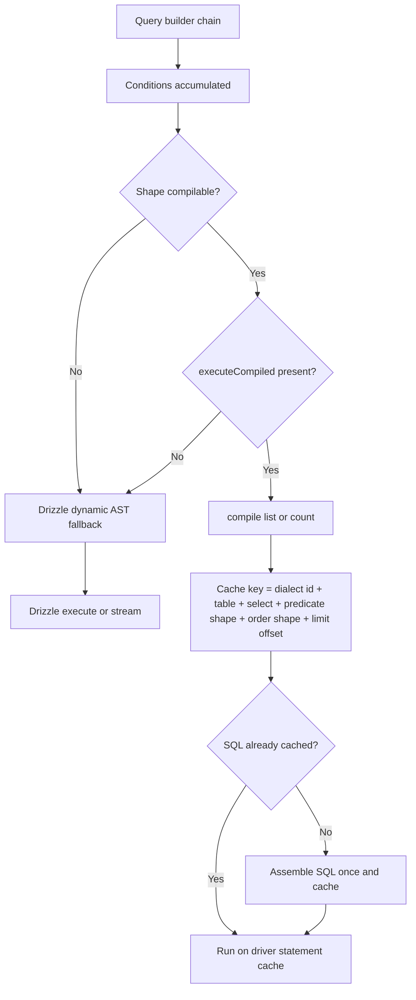

# SQL Query Builder (Shared)

The SQL family of adapters — **SQLite**, **MariaDB** and **PostgreSQL** — previously shipped ~80% duplicated builder classes with drifting semantics: PostgreSQL skipped `ISODateString` conversion on read paths, silently dropped unknown sort fields, treated `select()` as a no-op, and threw on function-based `where()`. `SqlQueryBuilder<T extends BaseEntity>` (`src/databases/core/sql-query-builder.ts`) is now the **single implementation** for all three engines. Per-engine behavior is expressed entirely through the `SqlDialect` constant supplied at construction time; the class body contains no engine-specific branches.

MongoDB is the exception by design: it has its own `MongoQueryBuilder`, documented in [MongoDB Implementation](./mongodb-implementation.mdx). Every other engine resolves `dbAdapter.queryBuilder(collection)` to this shared class.

---

## Dialect Surface

All engine divergence is captured in the exported `SqlDialect` interface and its three constants:

| Constant           | Engine     | `id`         | Bind          | `quoteIdent` | `likeOperator` | `stream` | `mariaDoubleParseJson` |
| ------------------ | ---------- | ------------ | ------------- | ------------ | -------------- | -------- | ---------------------- |
| `SQLITE_DIALECT`   | SQLite     | `sqlite`     | `?`           | `"name"`     | `LIKE`         | ❌       | ❌                     |
| `MARIADB_DIALECT`  | MariaDB    | `mariadb`    | `?`           | `` `name` `` | `LIKE`         | ❌       | ✅                     |
| `POSTGRES_DIALECT` | PostgreSQL | `postgresql` | `$1`, `$2`, … | `"name"`     | `ILIKE`        | ✅       | ❌                     |

The remaining surface members:

- `supportsReturning` — `true` only on PostgreSQL; drives whether `updateMany`/`deleteMany` count affected rows from `RETURNING` result length vs. `extractAffectedRows`.
- `coerceJsonValue(value)` — JSON-extract comparisons render scalars as text on MariaDB (`JSON_UNQUOTE(JSON_EXTRACT(...))`) and PostgreSQL (`data->>`); booleans (and PostgreSQL numbers) must bind as text. SQLite `json_extract` is typed and needs no coercion.
- `extractAffectedRows(result)` — reads the affected-row count from a non-RETURNING Drizzle write result (`.changes` on SQLite, `[0].affectedRows` on MariaDB).
- `mariaDoubleParseJson` — MariaDB JSON columns round-trip double-encoded, so read conversion needs the double-parse flag.

Identifiers are validated by `assertSafeSqlIdentifier` before quoting; the dialect only chooses the quote character.

---

## Two Execution Paths

`execute()`, `findOne()`, `exists()` and `count()` all attempt the compiled prepared-statement path first and fall back to Drizzle's dynamic AST when the query shape cannot be compiled.



The two arms are interchangeable for the _same_ logical query: the only difference is a single truthiness check on `SqlQueryBuilderCore.executeCompiled`. The diagnostic A/B probe (`tests/benchmarks/probe-query-builder-ab.test.ts`) hides that method behind a proxy to isolate the translation/execution overhead from the SQL plan, filters, and index set.

### Compiled (prepared-statement) path

`compile(mode: "list" | "count")` returns `{ sql, params } | null`. It returns `null` — forcing the Drizzle path — when:

- any condition touched a JSON/blob-backed dynamic field,
- a value was not bindable,
- a projection referenced an unknown column,
- an `OR` alternative could not be fully compiled, or
- the adapter core has no `executeCompiled` (test doubles stay on Drizzle).

#### Cache key

Compiled SQL is cached in `compiledSqlCache`, a **256-entry LRU** (`Map`), keyed by a **shape signature** — never the bound values:

```
{dialect.id}\0{safeTable}\0{selectSig}\0{predSig}\0{orderSig}\0{limitSig}
```

| Segment     | Contents                                                                |
| ----------- | ----------------------------------------------------------------------- |
| `selectSig` | `"count"` for `count()`, the joined `select()` fields, or `"*"`         |
| `predSig`   | comma-joined predicate shapes (see below)                               |
| `orderSig`  | comma-joined `column:direction` pairs                                   |
| `limitSig`  | `L` (limit present), `LO` (limit + offset) — presence flags, not values |

Two queries differing only in their bound values share one cached statement; a different column, IN arity, OR structure, sort direction, or limit/offset presence produces a different key. When the cache is full, the oldest entry (insertion order) is evicted.

#### Compiled predicate shapes

The `CompiledPred` union and its `CompiledOrAlt` member define exactly what the prepared plan can bind:

| Shape                 | Source                                       | Emitted SQL                         | Signature           |
| --------------------- | -------------------------------------------- | ----------------------------------- | ------------------- |
| `eq`                  | `where()` equality                           | `col = ?`                           | `eq:col`            |
| `isnull`              | `whereNull`, `where(null)`                   | `col IS NULL`                       | `isnull:col`        |
| `notnull`             | `whereNotNull`                               | `col IS NOT NULL`                   | `notnull:col`       |
| `gt`/`gte`/`lt`/`lte` | `where({ f: { $gt } })`, keyset `paginate()` | `col > ?` / `col < ?`               | `gt:col` / `lt:col` |
| `in`                  | `whereIn()`                                  | `col IN (?, ?, …)`                  | `in:col:N`          |
| `notin`               | `whereNotIn()`                               | `col NOT IN (?, ?, …)`              | `notin:col:N`       |
| `range`               | `whereBetween()`                             | `col >= ? AND col <= ?` (inclusive) | `range:col`         |
| `or`                  | `orWhere()`                                  | `(a = ? OR (b = ? AND c < ?) OR …)` | `or(eq:a,lt:c&…)`   |

Each OR alternative is either a single `CompiledOrLeaf` (`eq`, `isnull`, `gt`, `gte`, `lt`, `lte`) or an `and` group of leaves — the compound keyset cursor shape `{ $or: [ { f: { $lt } }, { $and: [{ f: v }, { _id: { $lt } }] } ] }`. A nested `$or`, a JSON field, a multi-operator object, or a non-bindable value keeps the **whole** OR predicate on Drizzle; the builder never partially compiles an `OR`.

`applyFilterAndOptions` also flattens `$and` conjunctions (top-level and nested) by applying each element's fields in turn — so the `{ $and: [base, cursor] }` wrapper that `mergeKeysetFilter` emits stays on the compiled plan. Physical date/timestamp columns coerce ISO strings and epoch numbers to `Date` via `coerceDateColumnValue` (the same helper `mapQuery` uses), so a compiled comparison never binds TEXT against an `INTEGER` `timestamp_ms` column.

The `whereIn`/`whereNotIn` compiled path requires a **physical column + a non-empty, fully-bindable array**; `whereBetween` requires a physical column and bindable `min`/`max`. An empty `IN` array stays on Drizzle (or emits `1=0` on the JSON path).

#### Running the statement

`executeCompiled?(sqlText, params)` is **optional** on `SqlQueryBuilderCore`; the shared base implements it once and each adapter overrides it with its driver's prepared execution:

| Engine     | Implementation                                                        |
| ---------- | --------------------------------------------------------------------- |
| Base       | `raw.execute(sqlText, [...params])` (`SqlAdapterCore`)                |
| SQLite     | `executePreparedStatement(sqlText, "all", params)` → `client.prepare` |
| MariaDB    | `pool.execute(sqlText, params)` (tenant-aware pool)                   |
| PostgreSQL | `sql.unsafe(sqlText, params, { prepare: true })`                      |

### Drizzle dynamic-AST fallback

`buildQuery()` builds a Drizzle `$dynamic()` query from the accumulated conditions, resolved order, and limit/offset. The following shapes are **never compiled** and always stay on this path:

- **JSON/blob-backed dynamic fields** (hybrid schema) — equality, ranges, and `IN` comparisons against fields living in the `data` blob.
- **Non-bindable values** — anything that is not `string | number | boolean`.
- **Empty `IN` arrays**.
- **Nested `$or`** (an OR alternative that is itself an `$or`) and any OR alternative with a JSON field, a multi-operator object, or a non-bindable value.
- **Projections of unknown columns** — `select()`/`orderBy()` referencing a field with no physical column.
- **`search()`** (LIKE) — always falls through.

Function-based `where()` **throws by design**: a JavaScript predicate cannot be translated to SQL, and a silently dropped filter could be an authorization-relevant condition. Operator objects (`{ $gt, … }`) and arrays in `where()` also throw loudly rather than emitting `eq(column, "[object Object]")` garbage on the JSON path.

---

## Hybrid-Schema JSON Handling

Dynamic fields (not materialized as physical columns) live in the JSON `data` blob. When a `where()`/`whereIn()`/`orWhere()`/`search()` condition names a field with no physical column, the builder substitutes `core.getJsonField(field)` and coerces the bound value via `dialect.coerceJsonValue(value)`. On MariaDB, `mariaDoubleParseJson` also marks read conversion so double-encoded JSON round-trips correctly. This is what makes the builder schema-flexible across all three engines without per-collection SQL.

## Read-Side ISODateString Normalization

Every read path (`execute`, `findOne`, `stream`) normalizes results to `ISODateString`:

- `execute()` runs `convertArrayDatesToISO(results, options)`; `findOne()` runs `convertDatesToISO(row, options)`.
- `dateConversionOptions` pins `{ table, inPlace: true }` (plus `mariaDoubleParseJson` on MariaDB) so conversion mutates rows in place rather than allocating new objects.
- `prepareReadConversion()` calls `core.registerReadSchema(collection)` first, registering the same schema maps `findMany` uses, so the in-place schema path replaces the generic key walk.

## Keyset Pagination & Tie-Breaker

`paginate({ cursor, cursorDirection, pageSize })` implements O(1) keyset seeks via index instead of O(N) offset skips:

- `cursorDirection: "after"` emits `_id > cursor` and pushes `_id ASC`; `"before"` emits `_id < cursor` and pushes `_id DESC`. The comparison operator and the `_id` sort are one contract — changing one without the other silently breaks page continuation (repeats/skipped rows).
- `page`/`pageSize` (no cursor) falls back to offset-based pagination.
- On any paginated read, `resolveOrder()` appends a direction-matched `_id` tie-breaker (following the last explicit sort direction) when the explicit sorts do not already order by `_id`, so a B-tree can serve the total order.

## Lazy Covering-Index Scheduling

When `compile()` produces a physical `ORDER BY` whose first sort is not the stock `updatedAt`, it calls `core.noteListSort(collection, order, equalityColumns)`. The adapter schedules a covering index — `(tenantId, column, _id)` when the filter equals `tenantId`, otherwise `(column, _id)` — fire-and-forget, so the discovering read never waits on the build. One attempt per `(table, column, direction, tenant-prefix)`, bounded to 64 entries. Set `SVELTY_LAZY_SORT_INDEXES=0` to disable the scheduling entirely.

## Method Surface

| Method             | Compiled?                                | Notes                                                       |
| ------------------ | ---------------------------------------- | ----------------------------------------------------------- |
| `where`            | equality + null only                     | function/operator values throw; JSON fields stay on Drizzle |
| `orWhere`          | leaves + AND-group alternatives          | nested `$or` / JSON / non-bindable stays on Drizzle         |
| `whereIn`          | physical + non-empty bindable            | empty array → `1=0` on JSON path                            |
| `whereNotIn`       | physical + non-empty bindable            |                                                             |
| `whereBetween`     | physical, inclusive `>= AND <=`          |                                                             |
| `whereNull`        | ✅ physical column                       |                                                             |
| `whereNotNull`     | ✅ physical column                       |                                                             |
| `search`           | ❌                                       | LIKE/ILIKE with JSON fallback                               |
| `limit` / `skip`   | ✅ shape only                            | bound as parameters in the compiled plan                    |
| `paginate`         | keyset comparators on sort field + `_id` | offset fallback without cursor                              |
| `sort` / `orderBy` | physical order only                      | JSON sorts carry a null name and stay on Drizzle            |
| `select`           | known columns only                       | unknown column → fallback                                   |
| `exclude`          | no-op                                    |                                                             |
| `distinct`         | no-op                                    |                                                             |
| `groupBy`          | no-op                                    |                                                             |
| `hint`             | no-op                                    |                                                             |
| `timeout`          | no-op                                    |                                                             |
| `count`            | ✅ `SELECT count(*)`                     | else Drizzle `count()`                                      |
| `exists`           | ✅ `SELECT … LIMIT 1`                    | selects `_id`/`id` instead of `COUNT(*)`                    |
| `execute`          | ✅                                       | returns rows via `convertArrayDatesToISO`                   |
| `stream`           | ❌ (PostgreSQL only)                     | `notImplemented` on other engines                           |
| `findOne`          | ✅ `LIMIT 1`                             |                                                             |
| `findOneOrFail`    | —                                        | wraps `findOne`, throws `NOT_FOUND`                         |
| `updateMany`       | ❌ write path                            | routes blob fields via `prepareValues`; JSON patch merges   |
| `deleteMany`       | ❌ write path                            | `RETURNING` on PostgreSQL, affected-row count elsewhere     |

The no-op methods (`exclude`, `distinct`, `groupBy`, `hint`, `timeout`) exist to satisfy the cross-engine `QueryBuilder<T>` interface; MongoDB's builder implements them for real, the SQL engines accept and ignore them.

## `search()` and the ESCAPE Parameter

`search(query, fields?)` always falls through to Drizzle (it sets `compilable = false`), escaping `%`, `_` and `\` in the user input and emitting `LIKE`/`ILIKE` against the requested (or default) fields, with a JSON-blob fallback for fields without a physical column.

The `ESCAPE` character is **bound as a parameter**, never inlined as SQL text:

```ts
const ESCAPE_CHAR = "\\";
sql`${column} ${sql.raw(dialect.likeOperator)} ${pattern} ESCAPE ${ESCAPE_CHAR}`;
```

On MySQL/MariaDB a backslash inside a string literal is itself an escape, so `ESCAPE '\'` written as SQL text is a syntax error there — fine on SQLite/PostgreSQL, broken on MariaDB. Binding it as a parameter sidesteps the difference on every engine. This mirrors `src/databases/core/drizzle-sql-helpers.ts` (`escapeLikePattern` and the `$regex` case), so every `LIKE` in the codebase escapes identically.

## Callers

- **`services/core/collection-service.ts`** — admin collection lists and status facets (`getStatusFacets` → `countStatusFacets`).
- **`services/core/collection-filter-engine.ts`** — compiles schema + FLAC into portable QueryBuilder clauses (`where`/`whereBetween`/`whereIn`/`whereNull`/`whereNotNull`/`search`) via `applyFiltersToQueryBuilder`; see [Collection Filtering](../architecture/collection-filtering.mdx).
- **link-suggestions route** (`routes/api/[...path]/handlers/utility.ts`) — `handleLinkSuggestions` uses `.search(...).where({ status, tenantId }).limit(5).execute()`.
- **`services/sdk/namespaces/collections-namespace.ts`** — exposes `queryBuilder(collectionId)` on the Local SDK, injecting `tenantId` as a `where` condition.

## Related

- [Database Documentation Hub](./index.mdx)
- [Performance Architecture](./performance-architecture.mdx)
- [Database Methods Interface](./database-methods.mdx)
- [MongoDB Implementation](./mongodb-implementation.mdx)
- [Collection Filtering](../architecture/collection-filtering.mdx)
