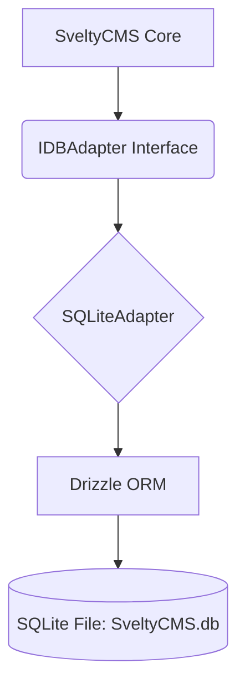

# SQLite Implementation

SQLite support is the default for local development, testing, and edge environments. It provides a zero-config database experience using **Drizzle ORM** with the `node:sqlite` or `bun:sqlite` driver.

## 🎯 Implementation Architecture

The SQLite adapter enables a seamless transition from local development to production by implementing the same `IDBAdapter` interface as MongoDB and PostgreSQL.

### Architecture Overview



### Current Status

| Feature            | Status      | Notes                                           |
| :----------------- | :---------- | :---------------------------------------------- |
| **Adapter Class**  | 🟢 Complete | Environment-aware (Bun/Node) implementation     |
| **Schema Mapping** | 🟢 Complete | SQLite-specific type mapping (INTEGER/TEXT)     |
| **Migrations**     | 🟢 Complete | Auto-creation of folders and tables             |
| **Setup Wizard**   | 🟢 Complete | selection and connection test implemented       |
| **Seeding**        | 🟢 Complete | Default data injection verified                 |
| **Performance**    | 🟢 Platinum | 0.000 ms L1 hit; 0.338 ms miss; Atomic batching |

---

## 🚀 Performance Benchmarks (Verified)

SQLite delivers exceptional response times for local and edge deployments. For detailed performance metrics, stress test results, and cross-database comparisons, please refer to the [Performance Benchmarks](/docs/project/benchmarks/index) document.

Key SQLite highlights:

- **Cache L1 hit at 0.000 ms**, miss at 0.338 ms. INSERT 0.038 ms (14.2k RPS via raw `INSERT…RETURNING`), FIND ONE 0.008 ms (100–119k RPS), UPDATE 0.080 ms (10.5k RPS).
- **WAL Mode** enabled by default for concurrent read/write performance.
- **Runtime Agnostic**: Optimized for both `bun:sqlite` and `node:sqlite`.
- **findPage / count modes**: Shared `SqlAdapterCore` path — FIND PAGE **0.073 ms** vs legacy LIST+COUNT **0.191 ms** (~2.6×); COUNT CACHED **0.024 ms** (2026-08-04). See [Performance Architecture](./performance-architecture.mdx#product-layer-list--count-equal-on-all-engines).
- **Composite list index**: `createModel` provisions `(tenantId, status, updatedAt)` — the canonical tenant list query (`WHERE tenantId=? AND status=? ORDER BY updatedAt DESC LIMIT n`) is served from one index. Measured at 100k rows: **194 → 68,346 RPS** (`EXPLAIN QUERY PLAN`: `SEARCH … USING INDEX` vs `SCAN … USE TEMP B-TREE FOR ORDER BY`).
- **Raw `findById` + findMany id ultra path**: pure `{_id}` reads go through prepared raw SELECT (~111k RPS via `findMany`), bypassing Drizzle AST building.

### Key Optimizations

- **WAL Mode**: Write-Ahead Logging enabled by default for concurrent read/write performance.

- **Performance PRAGMAs**: 9 optimized PRAGMAs applied on connect:
  - `journal_mode = WAL` — concurrent read/write
  - `synchronous = NORMAL` — 2-5x faster writes (safe with WAL)
  - `foreign_keys = ON` — enforce referential integrity
  - `page_size = 8192` — 8KB pages
  - `busy_timeout = 30000` — 30s wait vs immediate SQLITE_BUSY errors
  - `temp_store = MEMORY` — temp tables in RAM
  - `mmap_size` — RAM-tiered memory-mapped I/O (`SQLITE_MMAP_SIZE`, 64MB–512MB)
  - `cache_size` — RAM-tiered page cache (`SQLITE_CACHE_SIZE`, 16MB–256MB)
  - `wal_autocheckpoint = 4000` — checkpoint every 4000 pages
- **Prepared-Statement Cache**: Drizzle's `SQLiteBunSession.prepareQuery` re-compiles SQL on every query; the adapter wraps `client.prepare` with a per-connection SQL-text cache (2,000 statements) invalidated on DDL (`createModel` / `clearDatabase`). Measured: ~4µs/query re-prepare tax eliminated, 2× on write ops.
- **Projection (`options.fields`)**: when all requested fields are physical columns, the raw `findById` and shared `findMany` skip the JSON `data` blob entirely — no `JSON.parse` + `flattenDataColumn` on list/detail reads.
- **Atomic increments bind timestamps**: `atomicIncrement` binds `updatedAt` as a parameter instead of interpolating `now.getTime()` into SQL text — keeps the statement cache warm.
- **Partial updates merge the JSON blob**: the `data` column's `SET` expression becomes `json_patch(COALESCE("data", '{}'), ?)` for scalar/array patches (one statement, statement-cache keyed on the merge flag); nested-object or explicit-`null` patches read the single `data` column and merge in JS first, because `json_patch` is RFC 7396 (recursive, and it _deletes_ keys patched with `null`) while the contract is MongoDB's shallow, null-keeping `$set`. The merge is shared with `crud.updateMany`, `batch.bulkUpdate` and query-builder `updateMany`. See [Write Path](./write-path.mdx#3-does-a-write-verify-the-data-was-100-persisted).
- **Dynamic-field filters stay on the extraction form** (`json_extract(data, '$."field"')`): SQLite has no index that serves arbitrary JSON paths, so the engine-native answer for a filtered field is **column materialization** — declare it `indexed: true` (or `materialize: true`) and the row-store hybrid gives it a real column with a real index. `json_extract` is typed, so a numeric probe does not match a text-stored `"101"` (same as PostgreSQL containment and MongoDB; MariaDB is the looser exception). Paths are quoted **per segment** (`json_extract(data, '$."meta"."lang"')`), so a dotted field resolves the nested key instead of the single literal key `"meta.lang"` that previously matched nothing.
- **Drizzle Integration**: Type-safe querying without the overhead of a large ORM.

- **Typed Collection Proxy**: Fully-typed access via `locals.cms.collections.typed.Posts.find()`.
- **Platinum SQL Batching**: Raw multi-VALUES `insertMany` (single atomic statement, chunked under the 999-param limit) — BULK INSERT (100) 177 → 248 RPS (+40%).
- **Website Tokens**: `website_tokens` table via shared `relational-system.ts` — hash-at-rest, tenant-scoped queries, parallel list+count. See [Credential Storage](./database-methods.mdx#-credential-storage-website-tokens--api-keys).
- **Mongo-only fast-path**: `bypassSafeQuery` applies to selected MongoDB internal lookups, not SQL website-token operations.
- **Zero-Allocation Dates**: Optimized `relational-utils` with dirty-bit check.
- **Atomic Versioning**: Native `getVersion` and `incrementVersion` support.
- **Targeted partial UPDATE**: shared `prepareUpdateValues()` omits empty `data` columns and never writes `createdAt` on UPDATE — `SET` is modified fields + `updatedAt` only. Raw `UPDATE…RETURNING` stays one prepared statement.
- **`crud.aggregate()`**: MongoDB-style pipelines compile to one statement via `core/aggregation-translator.ts` — `$match`, `$group` (scalar `_id` plus `$sum`/`$avg`/`$min`/`$max`/`$count`), `$sort`, `$skip`, `$limit`, `$count` and include-only `$project`. Stages SQL cannot express (`$lookup`, `$unwind`, compound `$group._id`, reordered stages) fail closed with `error.code === "NOT_SUPPORTED"`; `$min`/`$max` stay type-correct here because `json_extract` keeps numbers as numbers.

## 📂 Storage & File Management

SQLite is a file-based database. When running SveltyCMS with SQLite, the system defaults to storing the database in `/config/database/SveltyCMS.db`.

| File           | Purpose                                                                 | Git Status  |
| :------------- | :---------------------------------------------------------------------- | :---------- |
| `SveltyCMS.db` | The main database file containing all collections, users, and settings. | **Ignored** |
| `*.db-shm`     | Shared Memory file used for WAL mode concurrency.                       | **Ignored** |
| `*.db-wal`     | Write-Ahead Log containing recent uncommitted transactions.             | **Ignored** |

### Version Control Best Practices

> [!IMPORTANT]
> **Database files are included in `.gitignore` by default.**
> Committing binary database files to version control is discouraged as it leads to repository bloat and potential exposure of sensitive data.

### Provisioning System & Self-Healing

The SQLite adapter implements a robust provisioning system that handles the complete lifecycle of the database file and schema:

1.  **Idempotent Provisioning**: The `provision()` method checks the internal `_provisioned` state and only executes schema creation (`CREATE TABLE IF NOT EXISTS`) if necessary.
2.  **Explicit Reset**: During integration tests or system resets, `clearDatabase()` drops all tables and resets the `_provisioned` flag, ensuring the next access re-creates a clean schema.
3.  **Path Auto-Creation**: The adapter automatically detects if the `DB_HOST` directory exists and creates it recursively if missing, preventing "File not found" errors on new installations.
4.  **TTL-Equivalent Cleanup**: `cleanupExpiredData()` purges expired sessions/tokens (with consumed-token GC after 7 days) via parameter-bound DELETE — replicating MongoDB's TTL indexes for SQL (same as MariaDB/PostgreSQL).
5.  **Boot Migration Lock**: Schema migrations run once under `withMigrationLock` at `provision()` — multi-instance boots cannot race DDL.
6.  **Schema Fingerprint**: `bootstrapSystemSchema` compares a sha-256 of `SYSTEM_SCHEMA` (per dialect) stored in `svelty_schema_state` and skips the whole DDL pass on a match (`skipped: true`) — measured on PostgreSQL: 118 statements / 124 ms per boot → ~2 ms. A spec change re-runs the pass, and a pass with a failed statement does not store the marker, so a half-applied schema is retried.

### ESM-First Driver Loading

To comply with SvelteKit 5's strict ESM requirements and avoid "require is not defined" errors:

- The adapter uses **Dynamic Imports** to load binary drivers.
- It detects the runtime environment (`Bun` vs `Node.js`) and imports the appropriate library (`bun:sqlite` or `node:sqlite`) at runtime.
- This allows a single codebase to run seamlessly across local development (Bun) and production (Node.js) environments.

### WAL Mode & Performance PRAGMAs

SveltyCMS enables **WAL mode** and **9 performance PRAGMAs** on every connection. This provides concurrent read/write operations, 2-5x faster writes, resilience under load (busy_timeout), and enforced referential integrity.

---

## 🛠️ Setup & Configuration

### 1. Using the Setup Wizard (Recommended)

When using the [Setup Wizard](/docs/guides/configuration/setup-wizard.mdx), select **SQLite (via Drizzle)**. The wizard will automatically set:

- **Host**: `/config/database` (The directory where the database file will be stored)
- **Database Name**: `SveltyCMS.db` (The filename)

### 2. Manual Configuration

If you are configuring the system manually, ensure your `config/private.ts` (or environment variables) contains:

```
// Example config/private.ts
export const privateEnv = {
  DB_TYPE: "sqlite",
  DB_HOST: "/config/database", // Directory path
  DB_NAME: "SveltyCMS.db", // Filename
};
```

The adapter will resolve the final path as `process.cwd() + DB_HOST + "/" + DB_NAME`.

> [!NOTE]
> **Test/benchmark mode fails closed without `DB_NAME`** — when `TEST_MODE`, `VITEST`, `BUN_TEST`, or `BENCHMARK` is set and no explicit name is derivable (config `DB_NAME` **or** `process.env.DB_NAME`), the adapter refuses to connect instead of silently falling back to the live `sveltycms.db` name. Env `DB_NAME` is honored (the E2E/integration harnesses pass it when no `private.test.ts` exists yet, e.g. the setup-wizard boot); `DB_PATH` also short-circuits the check. See the benchmark isolation note in [Benchmark Matrix Safety](../../tests/benchmark-matrix.mdx#local-benchmark-safety-july-2026).

### 3. Implementation Pattern

The SQLite adapter follows the modular pattern established in the core infrastructure, ensuring all seeding and user data updates work seamlessly across the agnostic codebase.

---

## 🔗 Related Documentation

- [Core Infrastructure](./core-infrastructure.mdx) - Unified architecture
- [PostgreSQL Implementation](./postgresql-implementation.mdx) - Similar Drizzle pattern
- [Drizzle ORM Documentation](https://orm.drizzle.team/)

---

## Related

- [Database Architecture](./index.mdx)
- [Performance Benchmarks](../../project/benchmarks/index.mdx)
- [Architecture Overview](../index.mdx)
