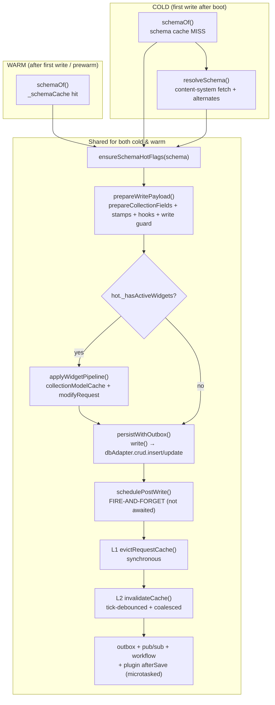

# Write Path: Cold vs. Warm

> [!NOTE]
> **Methodology**: All performance numbers and cold-vs-warm measurements are self-measured via reproducible benchmark suites (`bun test tests/benchmarks/`). This documentation describes SveltyCMS internal mechanisms in compliance with EU Directive 2006/114/EC.

This document maps the **complete content write path** (`create` / `update`) for a collection **with or without content**, explains the **boot prewarm** that removes the one-time first-write lazy-init cost, and answers how a write verifies that the data was **100% persisted**.

All code references below are from `src/services/sdk/namespaces/collections-namespace.ts`, `src/services/sdk/namespaces/collections/write-pipeline.ts`, `src/services/sdk/namespaces/collections/post-write.ts`, `src/content/prewarm.ts`, `src/databases/core/sql-adapter-core.ts`, and `src/content/content-utils.ts`.

---

## 1. The write path (create, single collection)

**Key invariant: side effects are never awaited on the response path.**
The `persist` → `schedulePostWrite` boundary is the critical line (`collections-namespace.ts` create `@1170-1201`, update `@1254-1286`). The write itself is awaited and verified; L1 eviction is **synchronous** (same-tick reads never see stale request-scoped cache); L2 invalidation, outbox emission, pub/sub, workflow init and plugin `afterSave` all run **microtasked / detached** so concurrent create RPS is not blocked by them.

---

## 2. Cold vs. warm — what actually differs

The cold penalty is **lazy per-collection initialisation** that would otherwise run on the first write:

| Step                                           | Cold (first write)                                                                                        | Warm (after prewarm or a prior write)  |
| :--------------------------------------------- | :-------------------------------------------------------------------------------------------------------- | :------------------------------------- |
| `schemaOf()`                                   | Cache miss → `resolveSchema()` fetches from content system (+ hyphen/underscore alternates)               | `_schemaCache` hit (`schema-store.ts`) |
| `getModelResilient()` (inside widget pipeline) | Not in `collectionModelCache` → **DB-backed** `collection.getModel()`; on miss `createModel()` then retry | `collectionModelCache` (WeakMap) hit   |
| `getOrCompilePrepPlan()`                       | Not in `prepPlanCache` → compiles sanitize/truncate/array field lists                                     | `prepPlanCache` (WeakMap) hit          |
| Measured cold cost                             | **~10ms** (update), ~2ms (create)                                                                         | **~0.27ms** (update)                   |

The prewarm (`src/content/prewarm.ts`) moves all three initialisations to **boot** for every collection of a tenant. It is `getModelResilient` + `getOrCompilePrepPlan` + `resolveSchema` pre-population — **purely additive**: performs no writes, no side effects, never blocks boot, never throws into the init path (`index.server.ts` hook `@140-153`, fire-and-forget with a `logger.warn` fallback).

> **Collection with no content (empty collection):** the prewarm wraps `getModelResilient` in a try/catch (`prewarm.ts:58-65`) because `createModel` may legitimately fail when a collection has no rows yet. That failure is swallowed — the **first real write re-tries lazily and succeeds**, so an empty collection is **not** a warm-up failure; it simply doesn't get pre-warmed. A collection **with content** is pre-warmed and its first write after boot pays nothing.

---

## 3. Does a write verify the data was 100% persisted?

**Yes — on the production path.** For both `insert` and `update`, SQL-family adapters use a **single-statement `INSERT … RETURNING` / `UPDATE … RETURNING`** round trip that reads the **actual persisted row back from the database**, rather than synthesising it from in-memory values.

- `sql-adapter-core.ts` `insert` `@1338-1400`: `runInsert()` calls `rawInsertReturning()` (fast path) → otherwise `getDrizzleInstance().insert(table).values(values).returning()` → `convertDatesToISO(result[0])`. The returned row is the **real stored row**, so `create`'s `result.data._id` and the `@1170` verification `if (result && result.success && result.data)` are backed by a DB read-back, not a guess.
- `sql-adapter-core.ts` `update` `@1512-1556`: `rawUpdateReturning()` → `UPDATE … RETURNING`. **Partial PATCHes intentionally keep `RETURNING`** so untouched physical columns (`status` / `createdAt` / `isDeleted`) remain intact in the response — the response reflects the DB's actual post-update state.
- `wrap()` converts **any** adapter-level DB error into `{ success: false, error: { code, message } }`, so a failed/failed-to-persist write surfaces as `success: false` and is **not** reported as persisted.

**The one exception (and its scope):** `skipReturning: true` re-constructs the row from the prepared values instead of a read-back. This path is reserved for **seed / benchmark tooling** (e.g. `tests` calling `skipReturning` explicitly) where the caller already knows the row and `RETURNING` is pure overhead. It is **not** the production write path. The benchmark env-var shortcut that previously forced this non-production path was deliberately removed so that benchmarks measure the real `INSERT … RETURNING` fast path.

**Atomicity:** single-statement `INSERT` / `UPDATE` / `DELETE` are natively atomic — no `BEGIN`/`COMMIT` wrapper is needed on that path (`post-write.ts:357-361`). There is no verified "write-then-detect-failure" compensation loop; the DB statement either fully applies (and `RETURNING` returns the row) or `wrap()` returns `success: false`.

**Net:** SveltyCMS does **not** silently accept a write. The production path returns the persisted row via `RETURNING`, and any DB-level failure is propagated as `success: false`. The only read-back reconstruction is a seed-only optimization, explicitly out of the production path.

---

## Related

- [Performance Architecture](./performance-architecture.mdx)
- [Database Documentation Hub](./index.mdx)
- [Competitive Benchmarks](../../project/benchmarks/index.mdx)

---

_Compliance Disclaimer: Based on publicly available documentation as of September 2026. [EU Directive 2006/114/EC]_
