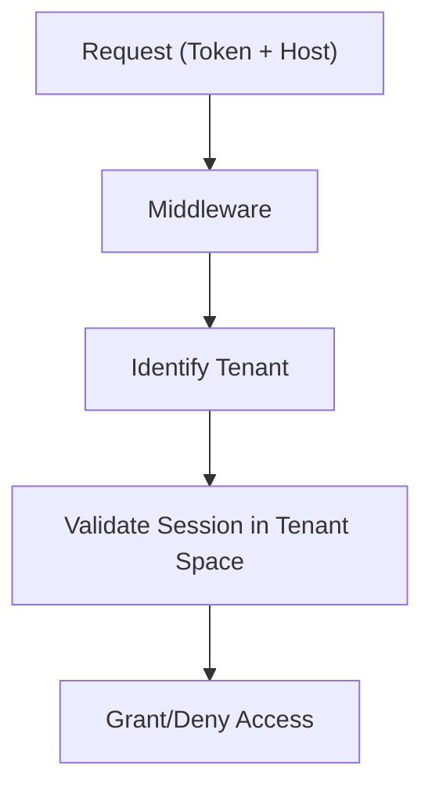

# Authentication & Authorization System

## Overview

SveltyCMS implements a defense-in-depth security model combining 3-layer session caching, automatic rotation, Role-Based Access Control (RBAC), and enterprise-grade identity features. Beyond traditional cookie-based sessions, the platform supports **API Keys** for machine-to-machine auth, **Magic Links** for passwordless login, **Guest/Anonymous Auth** for public content access, and **WebAuthn/Passkeys** for biometric authentication.

## 1. 3-Layer Session Caching

To achieve sub-millisecond authentication checks on every request, SveltyCMS uses a hierarchical caching strategy:

1.  **Memory Layer (L0)**: Uses the `SessionManager`'s local `Map` with `WeakRef` for ultra-fast, garbage-collection-aware lookups.
2.  **Redis Layer (L1)**: Distributed in-memory cache for fast session retrieval across load-balanced instances.
3.  **Database Layer (L2)**: Persistent storage (MongoDB, MariaDB, etc.) as the authoritative session record.

---

## 2. Session Architecture

### Session ID & Generation

SveltyCMS uses high-entropy, cryptographically secure random tokens for session IDs. These IDs are:

- **32 characters** (alphanumeric), generated via `generateRandomToken()` using `crypto.getRandomValues()`
- **Stored directly** in cookies and database — no additional hashing required due to CSPRNG source
- **Rotated automatically** on login. On password change, all other active sessions across all devices are immediately invalidated.

### Multi-Tenancy 2.0

Sessions are isolated by `tenantId`. A user's session is only valid for the tenant it was created for, preventing cross-tenant access even if a session ID were compromised.



---

## 3. Core Components

### AuthService (`auth/index.ts`)

The central API for user authentication (login, register, logout, password reset). Uses **Argon2id** for password hashing with a 64MB memory cost for quantum resistance.

### SessionManager (`auth/session-manager.ts`)

Orchestrates the 3-layer cache and manages the session lifecycle (create, validate, refresh, invalidate).

### RBAC & Permissions (`auth/permissions.ts`)

Implements complex permission checks against roles and explicit user permissions.

- **Admin Bypass**: Users with the `ADMIN` role bypass all permission checks.
- **Isomorphic Guards**: Same logic runs on both client and server.

---

## 4. Advanced Security Features

### Two-Factor Authentication (2FA)

- **TOTP-based**: Compatible with Google Authenticator, Authy, etc.
- **Backup Codes**: Secure recovery via high-entropy backup codes.
- **Forced Admin 2FA**: Configuration option to require 2FA for all administrative accounts.

### Enterprise SSO (SAML 2.0)

Integrated via **@node-saml/node-saml (latest)**, a lightweight SAML SP implementation with zero database dependencies, supporting:

- **JIT (Just-In-Time) Provisioning**: Automatic user creation on first login.
- **Multiple IdPs**: Okta, Azure AD, Auth0, etc.
- **Certificate Management**: Automated handling of SAML assertions.

### OAuth 2.0 / OpenID Connect

OOTB support for **Google** and **GitHub** authentication.

---

## 5. Performance Benchmarks

| Operation            | Cache Layer  | Latency | Status              |
| :------------------- | :----------- | :------ | :------------------ |
| **Validate Session** | Memory (L0)  | < 0.1ms | **Instant**         |
| **Validate Session** | Redis (L1)   | 0.8ms   | **Sub-ms**          |
| **Validate Session** | MongoDB (L2) | 15ms    | **Persistent Sync** |
| **Check Permission** | Cached       | < 0.5ms | **Optimized**       |

## 6. Security Standards & Compliance

SveltyCMS follows industry best practices:

1.  **Argon2id** password hashing with 64MB memory cost — resistant to GPU/ASIC/quantum speedup.
2.  **Rate Limiting & Firewall**: Real-time analysis for injection attacks via `handle-security.ts`.
3.  **Crypto-Chained Audit Logs**: Tamper-evident SHA-256 chaining for all auth events.
4.  **Secure Headers**: Automatic HSTS, CSP, and X-Frame-Options via `handle-security-headers.ts`.

---

## 7. Data Integrity & Lifecycle

### Cascading User Deletion

To ensure comprehensive access termination and prevent orphaned data, SveltyCMS implements cascading logic during user deletion:

- **Session Invalidation**: All active sessions (L0, L1, and L2) are immediately purged from memory, Redis, and the database.
- **Token Cleanup**: All pending cryptographic tokens (invites, resets, API keys) associated with the user are permanently deleted to prevent unauthorized reuse.

### Cascading Password Change

When a user changes their password, all active sessions (L0, L1, and L2) except the current one are immediately purged to terminate any potentially compromised sessions. This ensures that if an attacker had a valid session cookie, they are immediately logged out upon password change.

- **3-Layer Purge**: Sessions are removed from in-memory cache, Redis, and the database.
- **Turbo Auth Invalidation**: Any cached auth contexts in the Turbo GET fast-path are also cleared.
- **Current Session Preserved**: The session making the password change remains active so the legitimate user stays logged in.

### Hardened Token Validation

The token validation system enforces strict metadata checks to prevent exploitation:

- **Purpose Mapping**: Tokens are validated against their intended `type` (e.g., `invite-token` vs `reset`).
- **Consumption State**: Tokens marked as `consumed` are rejected even if they are within their expiry window.
- **Atomic Retrieval**: Retrieval via API is gated by a full validation check, preventing metadata leakage for invalid or expired tokens.

---

## 8. API Keys (Machine-to-Machine Auth)

API Keys provide bearer-token authentication for programmatic access — CI/CD pipelines, external services, and headless clients. Keys use the `sck_*` prefix for visual identification.

### Key Schema

| Field        | Description                                                    |
| :----------- | :------------------------------------------------------------- |
| `hash`       | SHA-256 hash of the plaintext key — plaintext never stored     |
| `prefix`     | First 8 chars of plaintext for UI identification (`sck_xxxx…`) |
| `name`       | Human-readable label (e.g., "Staging CI")                      |
| `scopes`     | Permission array (`["content:read", "media:write"]`)           |
| `lastUsedAt` | Timestamp of most recent authentication                        |
| `usageCount` | Incremented on each successful auth                            |

### Lifecycle

- **Create**: `generateApiKey()` → returns plaintext **once**. Caller is responsible for storing it securely.
- **Authenticate**: Middleware extracts `sck_*` from `Authorization: Bearer sck_…` header, hashes once via `hashCredentialSha256HexSync()`, looks up by hash.
- **Revoke**: `DELETE /api/api-keys/:id` enforces owner-or-admin, purges credential cache immediately via `invalidateApiKeyAuth()`.
- **List**: `GET /api/api-keys` returns all keys for the authenticated user (hash omitted).

### Security Considerations {#api-keys-security}

- **Secret Management**: API keys are bearer tokens — anyone with the key has its permissions. Never commit keys to version control, expose them client-side, or log them. Treat keys like passwords.
- **Rotation**: Rotate keys every 90 days. Create a new key, update the consuming service, then revoke the old one.
- **Least Privilege**: Assign the minimum `scopes` needed per key (e.g., `["content:read"]` for a CI build badge, not `["content:write"]`).

- **Network Restrictions**: Where possible, restrict API key usage by IP range at the infrastructure level (reverse proxy, WAF).
- **Distinct Keys per Service**: Use separate API keys for each consuming service. If one service is compromised, only its key needs revocation.
- **Instant Revocation**: The credential cache (60s TTL) is purged on revoke via `invalidateApiKeyAuth()`. Revoked keys stop authenticating within 60 seconds.

### Bearer Credential Caching

API keys use the same hash-keyed credential cache as website tokens (see [Cache System](../architecture/cache-system.mdx)):

| Key prefix               | Category  | TTL | Tags                   | Invalidation                    |
| :----------------------- | :-------- | :-- | :--------------------- | :------------------------------ |
| `apikey:{sha256-b64url}` | `SESSION` | 60s | `auth`, `api-key:{id}` | `clearByTags(['api-key:{id}'])` |

**Security**: Plaintext keys are never stored in L1 (memory) or L2 (Redis). Only SHA-256 hashes appear in the cache layer.

---

## 9. Magic Links (Passwordless Auth)

Magic Links allow users to authenticate without a password — an email is sent with a single-use, time-limited URL that creates a session on click.

### Flow

1. User enters email on the login form (Magic Link tab)
2. `auth.remote.ts` → `requestMagicLink(email)` → `sendMagicLinkForEmail()` in `src/databases/auth/magic-link.ts`
3. A `type: "magic_link"` token is created with a short TTL and emailed to the user
4. User clicks the link → `verifyMagicLink(token)` consumes the token and creates a session
5. User is redirected to the dashboard, authenticated

### Security Properties

- **Single-use**: Tokens are consumed atomically (TOCTOU guard via `consumeToken`)
- **Time-limited**: 15-minute TTL prevents lingering attack surface
- **Email-bound**: Token is only valid for the email it was issued to
- **Audit-logged**: Every magic link request and verification creates a crypto-chained audit entry

### Security Considerations {#security-considerations-2}

- **Email Channel Security**: Magic links are only as secure as the user's email account. If the email is compromised, the link can be intercepted. Consider enforcing 2FA for admin accounts even with magic link auth.
- **Token Expiry**: Tokens expire after 15 minutes — short enough to limit window of opportunity, long enough for email delivery latency.
- **Account Lockout**: The system checks lockout state before sending a magic link. Locked accounts cannot bypass controls via magic links.
- **No Account Enumeration**: The API returns a uniform response regardless of whether the email exists, preventing user enumeration attacks.

---

## 10. Guest / Anonymous Auth

Public-facing routes (marketing pages, public API endpoints, unauthenticated collection views) automatically receive an ephemeral `ANONYMOUS_USER` identity with the `guest` role.

### Behavior

- **No session created**: Guest access is stateless — no cookie, no database session
- **Read-only role**: The `guest` role grants `content:read` on published content only
- **Middleware placement**: Guest identity is assigned in `handle-authentication.ts` when no valid session or bearer token is present
- **Transparent upgrade**: If the user later authenticates, the guest context is replaced with the real user session

### Guest Role Permissions

Configured in `default-roles.ts`:

| Permission      | Granted |
| :-------------- | :------ |
| `content:read`  | ✅      |
| `content:write` | ❌      |
| `media:read`    | ✅      |
| `media:write`   | ❌      |
| `admin:access`  | ❌      |

### Security Considerations {#security-considerations-3}

- **Strict Isolation**: Guest sessions are ephemeral and stateless — no session cookie is created, no database entry is written. This prevents session fixation and cookie-based attacks.
- **No Privilege Escalation**: The `guest` role has hardcoded read-only permissions. Even if the middleware were misconfigured, guests cannot mutate content or access admin routes.
- **Scope Limitation**: Guest access is limited to public routes only. The middleware skips guest assignment for mutation endpoints (POST/PUT/DELETE) and admin paths.

---

## 11. WebAuthn / Passkeys (Biometric Auth)

SveltyCMS supports the WebAuthn standard for passwordless, biometric authentication using platform authenticators (Touch ID, Windows Hello, Android biometrics) and roaming authenticators (YubiKey, SoloKey).

### Architecture

| Module                         | Responsibility                                              |
| :----------------------------- | :---------------------------------------------------------- |
| `webauthn/webauthn-service.ts` | Challenge generation, RP ID validation, credential storage  |
| `webauthn/attestation.ts`      | COSE key → JWK conversion, assertion signature verification |
| `webauthn/cbor-decoder.ts`     | CBOR binary parsing for `navigator.credentials` responses   |
| `auth.remote.ts`               | Remote functions exposing registration and auth flows       |

### Authentication Flow (Login)

1. `getPasskeyAuthOptions()` → returns `PublicKeyCredentialRequestOptions` with server-generated challenge
2. Browser calls `navigator.credentials.get()` → user verifies via biometric/PIN
3. `verifyPasskeyAuth(response)` → validates signature, RP ID, user handle → creates session

### Registration Flow (Add Passkey)

1. `getPasskeyRegisterOptions()` → returns `PublicKeyCredentialCreationOptions` (requires existing session)
2. Browser calls `navigator.credentials.create()` → platform authenticator generates key pair
3. `verifyPasskeyRegister(response)` → validates attestation, stores credential on user record

### Database Schema

Authenticators are stored on the `User` document/row:

```typescript
interface Authenticator {
  credentialId: string; // Base64URL-encoded credential ID
  publicKey: JsonWebKey; // COSE → JWK converted public key
  counter: number; // Signature counter for clone detection
  transports?: string[]; // ["internal", "usb", "nfc", "ble"]
}
```

### Current Status (~75%)

- ✅ Challenge/response ceremony (login + registration via remote functions)
- ✅ CBOR parsing + COSE → JWK attestation verification
- ✅ Passkey button on sign-in form
- ✅ Unit tests: `webauthn-cbor` (7 pass), `webauthn-attestation` (4 pass)
- 🏗️ Settings-page UI for managing registered passkeys (pending)
- 🏗️ `db:push` for `authenticators` column on SQL deployments (pending)

### Security Considerations {#security-considerations-4}

- **Phishing Resistance**: WebAuthn credentials are bound to the origin (RP ID), making them inherently phishing-resistant. An attacker cannot replay credentials on a different domain.
- **User Verification**: Platform authenticators require biometric (fingerprint, face) or PIN verification. This prevents unauthorized use even with physical device access.
- **Clone Detection**: The signature counter (`counter` field) is incremented on each authentication. If a cloned authenticator presents a lower counter, the server detects the clone and rejects it.

- **No Shared Secrets**: Unlike passwords, private keys never leave the authenticator. The server only stores the public key — a database breach reveals nothing usable for authentication.
- **Downgrade Prevention**: The server enforces `userVerification: "required"` in authentication options, preventing downgrade to less secure methods.

---

## Related Documentation

- [Login Security](./login-security.mdx) — Session & device tracking, 2FA accessibility, OAuth hardening
- [Cache System Architecture](../architecture/cache-system.mdx) — Bearer credential cache, tag invalidation, negative Bloom filter
- [Multi-Tenant Isolation](./multi-tenancy.mdx)
- [Audit Logging & Compliance](../architecture/user-management-overview.mdx)
- [Authentication API Reference](../../reference/api/auth.mdx)
- [Login Security](./login-security.mdx)
