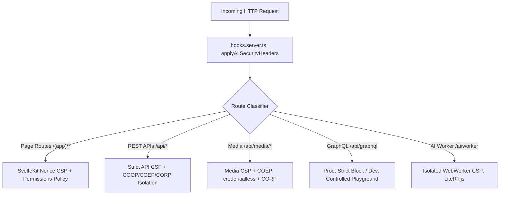

# Content Security Policy & Isolation Headers

SveltyCMS enforces a **multi-tiered, context-aware Content Security Policy (CSP)** and cross-origin isolation headers at the protocol level. Each route domain (Admin GUI, JSON REST APIs, Asset Streaming, GraphQL Playground, and AI Workers) receives an isolated, least-privilege security header profile.

---

## 🛡️ Architecture & Threat Model



### Key Security Objectives:

1. **Eliminate Stored & Reflected XSS**: Zero `'unsafe-inline'` or `'unsafe-eval'` in production API and Page contexts.
2. **Prevent Framing & Clickjacking**: `frame-ancestors 'none'` and `X-Frame-Options: DENY` everywhere.
3. **Cross-Origin Data Leak Isolation**: Spectre and cross-origin resource protection via `Cross-Origin-Opener-Policy: same-origin` and `Cross-Origin-Resource-Policy: same-origin`.
4. **Hardware Sandbox Lockdown**: Explicit `Permissions-Policy` disabling microphone, camera, geolocation, USB, and bluetooth access.

---

## 📋 Route-by-Route Header Profiles

### 1. REST API Endpoints (`/api/*`)

All REST API routes emit the immutable `API_CONTENT_SECURITY_POLICY` constant defined in `src/utils/security/constants.ts`:

```http
Content-Security-Policy: default-src 'self'; script-src 'self'; style-src 'self'; img-src 'self' data: blob:; font-src 'self' data:; connect-src 'self' ws: wss:; media-src 'self'; frame-src 'none'; object-src 'none'; frame-ancestors 'none'; base-uri 'self'; form-action 'self'
Cross-Origin-Opener-Policy: same-origin
Cross-Origin-Embedder-Policy: require-corp
Cross-Origin-Resource-Policy: same-origin
X-Content-Type-Options: nosniff
X-Frame-Options: DENY
```

- **Zero Script Execution**: Prohibits any foreign scripts or inline execution on raw API data responses.
- **WebSocket Support**: Explicitly whitelists `ws:` and `wss:` for real-time collaboration (Yjs CRDT server).
- **Cross-Origin Isolation**: Enforces `require-corp` to ensure cross-origin resources cannot be injected into process memory.

---

### 2. Media & Asset Streaming (`/api/media/*` & `/files/*`)

Asset serving requires relaxed embedder policies so third-party frontends can consume CMS media assets without breaking strict cross-origin isolation:

```http
Cross-Origin-Embedder-Policy: credentialless
Cross-Origin-Resource-Policy: same-origin
X-Content-Type-Options: nosniff
```

- **`credentialless`**: Allows cross-origin image embedding without passing user credentials/cookies, protecting user privacy while supporting remote CDNs and client websites.
- **MIME Sniffing Block**: `nosniff` prevents browser interpretation of polyglot uploaded files.

---

### 3. GraphQL Endpoint (`/api/graphql`)

The GraphQL route adapts its security profile based on the deployment environment:

#### Production Mode (`NODE_ENV=production`):

```http
Content-Security-Policy: default-src 'self'; script-src 'self'; style-src 'self' 'unsafe-inline'; img-src 'self' data: blob:; font-src 'self'; connect-src 'self'; frame-src 'none'; object-src 'none'; base-uri 'self'; form-action 'self'
```

- Introspection is strictly blocked via `NoSchemaIntrospectionCustomRule`.
- Interactive playgrounds are completely disabled.

#### Development / Diagnostic Mode (`ALLOW_GRAPHQL_PLAYGROUND=true`):

```http
Content-Security-Policy: default-src 'self'; script-src 'self' 'unsafe-inline' 'unsafe-eval' https://cdn.jsdelivr.net https://unpkg.com; style-src 'self' 'unsafe-inline' https://cdn.jsdelivr.net https://unpkg.com https://fonts.googleapis.com; font-src 'self' https://fonts.gstatic.com https://cdn.jsdelivr.net; img-src 'self' data: blob: https://cdn.jsdelivr.net; connect-src 'self' https://cdn.jsdelivr.net; frame-src 'none'
Cross-Origin-Embedder-Policy: unsafe-none
```

- Allows pinned CDN dependencies necessary to render the interactive GraphQL IDE.

---

### 4. Admin GUI Pages (`/(app)/*`)

Admin GUI pages leverage SvelteKit cryptographic nonces for dynamic scripts:

```http
Content-Security-Policy: script-src 'self' 'nonce-...'; style-src 'self' 'nonce-...'; object-src 'none'; base-uri 'self'; frame-ancestors 'none'
```

- **Cryptographic Nonces**: Each HTML response generates a unique CSPRNG nonce via `globalThis.crypto.getRandomValues()`.
- **Zero Trust Extensions**: Third-party browser extensions or injected DOM scripts cannot execute without matching the request nonce.

---

### 5. On-Device AI Worker (`/ai/worker`)

The on-device machine learning worker (LiteRT.js / TensorFlow.js WebAssembly) runs inside a dedicated Web Worker with a strict WASM and model binary sandbox:

```http
Content-Security-Policy: default-src 'none'; script-src 'self' 'wasm-unsafe-eval'; connect-src 'self' blob:; worker-src 'self' blob:
```

- **WASM Acceleration**: Allows `'wasm-unsafe-eval'` exclusively within the worker context for SIMD/WASM inference acceleration while completely forbidding JS `eval()`.

---

## 🔒 Permissions-Policy Hardening

SveltyCMS emits a restrictive `Permissions-Policy` header on all HTTP responses:

```http
Permissions-Policy: geolocation=(), microphone=(), camera=(), display-capture=(), clipboard-read=(), clipboard-write=(self), web-share=(self), payment=(), usb=(), bluetooth=(), accelerometer=(), gyroscope=(), magnetometer=()
```

| Directive              | Policy                 | Purpose                                                                           |
| :--------------------- | :--------------------- | :-------------------------------------------------------------------------------- |
| `camera`, `microphone` | `()` (Disabled)        | Blocks unauthorized recording devices.                                            |
| `geolocation`          | `()` (Disabled)        | Prevents browser location profiling.                                              |
| `clipboard-write`      | `(self)` (Same-origin) | Allows copy-to-clipboard actions (e.g. API keys, slugs) only from the CMS origin. |
| `clipboard-read`       | `()` (Disabled)        | Blocks programmatic clipboard inspection.                                         |
| `usb`, `bluetooth`     | `()` (Disabled)        | Protects host hardware ports against malicious web-serial attacks.                |

---

## 🧪 Automated Test Verification

CSP and header enforcement are continuously tested across the test suite:

- `tests/unit/hooks/defense-in-depth.test.ts` — Validates header presence on all HTTP response codes (200, 401, 403, 404, 500).
- `tests/unit/hooks/handle-turbo-get-lane.test.ts` — Asserts security header parity in Turbo Cache hits.
- `tests/unit/api/graphql-security.test.ts` — Asserts playground CSP gating in production vs development.
