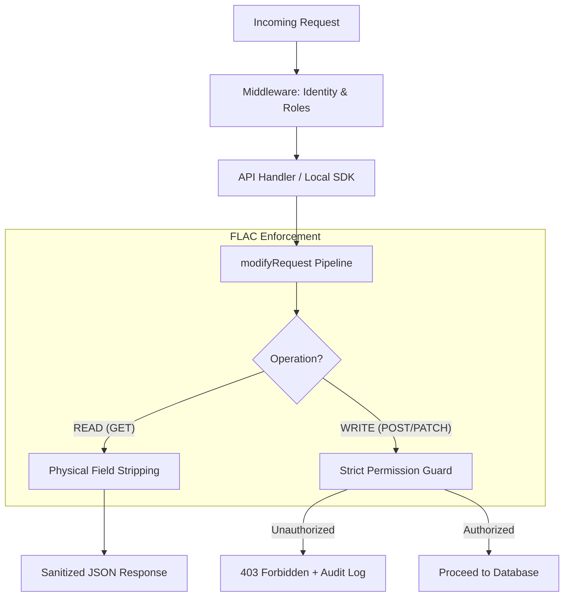

# Field-Level Access Control (FLAC)

SveltyCMS implements a **Zero-Trust Runtime Enforcement** model for field-level security. Unlike traditional CMS platforms that only hide fields in the UI, SveltyCMS physically strips unauthorized data from the API response and strictly blocks unauthorized write attempts at the request modification layer.

---

## 🏗️ Architecture: The Fail-Closed Loop

FLAC is integrated directly into the `modifyRequest` pipeline, ensuring that every piece of data — whether retrieved via REST, GraphQL, or the Local SDK — is sanitized based on the user's active role context.



---

## 🛡️ Key Security Guarantees

### 1. Physical Stripping (Read Protection)

When an entry is fetched, the `enforceFieldAccess` utility compares the collection schema against the user's roles. If a field is restricted:

- The key is **deleted** from the JSON object.
- All localized variants (e.g., `title_de`, `title_fr`) are removed simultaneously.
- The data never reaches the network, preventing metadata leakage.

### 2. Strict Write Rejection

If a user attempts to modify a field without the required `writeRoles`:

- The system **throws an AppError(403)** immediately.
- The entire transaction is aborted.
- A `UNAUTHORIZED_ACCESS` event is triggered in the Audit Log.

### 3. Fail-Closed Default

If a field is marked as `private` or has `requiredAuth` enabled, the system defaults to **Deny All** if the user context is ambiguous or the role mapping is missing.

---

## ⚙️ Configuration

FLAC is configured per-field in the **Collection Builder** under the **Permissions** tab.

```
// Technical Representation in Schema
{
    db_fieldName: "internal_notes",
    widget: widgets.Textarea,
    permissions: {
        visibility: "private",
        requiredAuth: true,
        readRoles: ["admin", "editor"],
        writeRoles: ["admin"]
    }
}
```

### Permission Matrix

| Visibility | Auth Required | Role Match | Result                       |
| :--------- | :------------ | :--------- | :--------------------------- |
| `public`   | No            | N/A        | Accessible to all.           |
| `public`   | Yes           | No         | Stripped from response.      |
| `private`  | Yes           | Yes        | Accessible to matched roles. |
| `private`  | Yes           | No         | **403 Forbidden on Write.**  |

---

## 📊 Performance Impact

The FLAC engine is optimized for high-throughput environments:

- **O(N) Complexity**: Sanitization happens in a single pass over the field schema.
- **Reference-Aware**: Uses `$state.snapshot()` patterns to ensure UI state remains pure during sanitization.
- **Micro-telemetry**: Sanitization duration is tracked and bubbled up to the performance dashboard.

---

## 📚 Related Documentation

- [Security Overview](./index.mdx)
- [Role-Based Access Control (RBAC)](../architecture/admin-user-management.mdx)
- [Audit Log System](../architecture/user-management-overview.mdx)

---

## Related

- [Security Overview](./index.mdx)
- [API Security & Token Hardening](./api-security.mdx)
- [Architecture Overview](../index.mdx)
